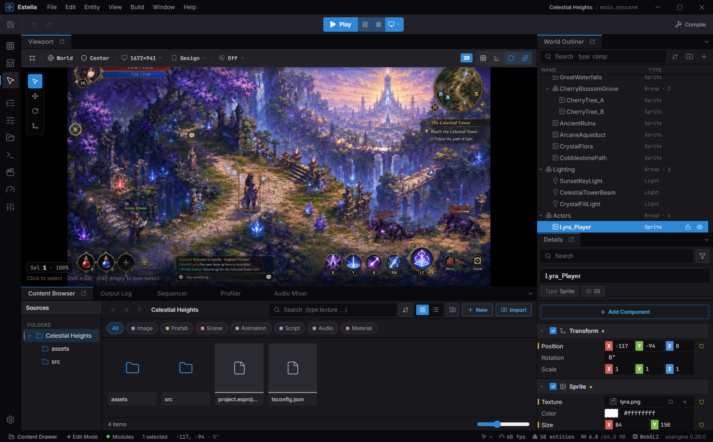

<div align="center">


# Estella

**A fast 2D game engine powered by WebAssembly and ECS**

[](https://github.com/esengine/estella/actions/workflows/build.yml)
[](LICENSE)
[](https://github.com/esengine/estella/releases)
[](https://isocpp.org/)
[]()
[](https://deepwiki.com/esengine/estella)

[Website](https://estellaengine.com) • [Getting Started](#getting-started) • [Documentation](#documentation) • [Discord](https://discord.gg/sAX6PXZ9) • [QQ群: 481923584](https://qm.qq.com/q/BONa5LXQ0U)

</div>

---

## What is Estella?

Estella is a **2D game engine** with a TypeScript SDK driven by a high-performance **C++/WebAssembly** backend. It ships with a visual editor for scene editing and project management, and outputs games that run in **web browsers**, on the **desktop**, in **WeChat MiniGames**, as single-file **playable ads**, and as native **Android / iOS** apps.

<div align="center">
  
  <br/>
  <sub><i>Celestial Heights — an action-RPG scene in the Estella editor, with the full scene graph in the outliner.</i></sub>
</div>

## Why Estella?

- **Fast** — C++ rendering pipeline compiled to WebAssembly, not interpreted JS
- **Type-safe** — First-class TypeScript SDK with `defineSystem`, `defineComponent`, and `Query`
- **Data-oriented** — Entity-Component-System architecture for scalable game logic
- **Visual editor** — Scene hierarchy, inspector, asset browser — no JSON editing
- **Cross-platform** — One codebase, deploy to web, desktop, WeChat MiniGames, playable ads, and native mobile
- **Spine & Physics** — Built-in Spine animation and physics support

## Features

| Feature | Description |
|---------|-------------|
| **Visual Editor** | Scene editor with hierarchy, inspector, and asset management |
| **ECS Architecture** | Compose entities from reusable components, drive behavior with systems |
| **WebGL / WebGPU Rendering** | Sprites, cameras, Spine animations, custom shaders — all in WebAssembly |
| **TypeScript SDK** | Type-safe API: `defineSystem`, `defineComponent`, `Query`, `Commands` |
| **Cross-Platform** | One project → web, desktop, WeChat MiniGames, playable ads, and native Android / iOS |
| **Native mobile** | A real arm64 app rendering through an embedded Dawn (Metal / Vulkan) — not a WebView |

## Getting Started

### Install

Download the editor for Windows or macOS from [estellaengine.com](https://estellaengine.com/#download)
— served from the project's mirror, always the newest release. Every build is also on the
[releases page](https://github.com/esengine/estella/releases).

### Create a Project

1. Open the editor and click **New Project**
2. Enter a project name, select a location, and click **Create**

The editor creates a project with a default scene containing a Camera entity.

### Write Game Logic

Add entities and components in the scene editor, then write systems in TypeScript:

```typescript
import {
    defineComponent, defineSystem, addSystem,
    Query, Mut, Res, Time, LocalTransform
} from 'esengine';

const Speed = defineComponent('Speed', { value: 200 });

addSystem(defineSystem(
    [Res(Time), Query(Mut(LocalTransform), Speed)],
    (time, query) => {
        for (const [entity, transform, speed] of query) {
            transform.position.x += speed.value * time.delta;
        }
    }
));
```

Press **F5** in the editor to preview.

## Documentation

Full documentation: [estellaengine.com/docs](https://estellaengine.com/docs)

- [Introduction](https://estellaengine.com/docs/getting-started/introduction/)
- [Installation](https://estellaengine.com/docs/getting-started/installation/)
- [Quick Start](https://estellaengine.com/docs/getting-started/quick-start/)
- [ECS Architecture](https://estellaengine.com/docs/core-concepts/ecs/)
- [Components](https://estellaengine.com/docs/core-concepts/components/)
- [Systems](https://estellaengine.com/docs/core-concepts/systems/)
- [Building & Exporting](https://estellaengine.com/docs/guides/build-export/)
- [Android & iOS](https://estellaengine.com/docs/guides/mobile/)

## Contributing

We welcome contributions! Please read the [Contributing Guide](CONTRIBUTING.md) before submitting a Pull Request.

## License

Estella is licensed under the [Apache License, Version 2.0](LICENSE).

You may use, modify, and distribute it **for any purpose, including commercial use**,
free of charge. There is no separate commercial license and no noncommercial
restriction. We follow [Semantic Versioning](VERSIONING.md) and keep a
[CHANGELOG](CHANGELOG.md).

Two things to keep in mind:

- **Trademarks.** Apache-2.0 grants rights to the code, not to the "Estella" /
  "ESEngine" names or logos. You may state that your project uses Estella, but
  please don't imply endorsement or ship a fork under the Estella name.
- **Spine is separate.** The bundled [Spine Runtimes](third_party) are **not** open
  source. If you ship a game that uses Estella's Spine integration, you need a valid
  Spine license from Esoteric Software — independent of Estella's Apache-2.0 license.
  See [NOTICE](NOTICE).

How the project sustains itself (sponsorship, optional hosted/pro add-ons,
marketplace, and support) is described openly in [BUSINESS_MODEL.md](BUSINESS_MODEL.md).
