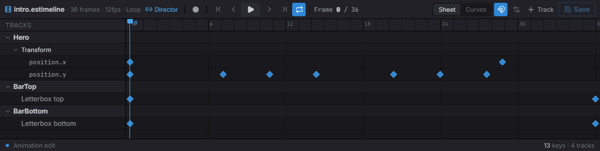
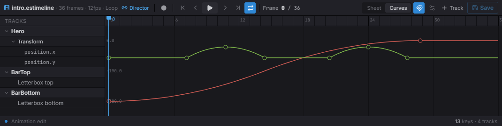

import { Aside } from '@astrojs/starlight/components';

A timeline is a **Sequencer animation** — tracks of keyframes over time that move a
Transform, swap sprites, fire audio, toggle entities, or drive Spine. You author it
in the editor's Sequencer, attach it with a `TimelinePlayer` component, and control
playback through the `Timeline` resource. Because one timeline drives many things at
once, it's the tool for cutscenes and scripted sequences.

## Attach a timeline

The `TimelinePlayer` component points an entity at a timeline asset. Usually set in
the editor; in code, insert it with `Commands`:

```typescript
import { defineSystem, Commands, TimelinePlayer } from 'esengine';

const attach = defineSystem([Commands()], (cmds) => {
  cmds.spawn().insert(TimelinePlayer, {
    timeline: 'assets/timelines/intro.estimeline',
    playing: true,
    speed: 1.0,
    wrapMode: 'once',
  });
});
```

| Property | Type | Default | Description |
|---|---|---|---|
| `timeline` | asset | `''` | The timeline asset (`.estimeline`). |
| `playing` | boolean | `false` | The play flag — raise to play, lower to pause. Raising it on a finished clip replays from the top. |
| `speed` | number | `1` | Playback rate multiplier. |
| `wrapMode` | string | `'once'` | `'once'`, `'loop'`, or `'pingPong'` (camelCase — other values silently play once). |
| `finished` | boolean | `false` | Latched true when a `'once'` clip completes; cleared on the next play. Runtime, read-only. |

The component flags **are** the playback control: the engine reconciles them into
its internal clock every frame, so anything that flips `playing` — your code, the
inspector, an [AI action](/docs/gameplay/ai/#built-in-names) — drives the
clip through the same channel.

## Control playback

Read the `Timeline` resource to drive an entity's timeline:

```typescript
import { defineSystem, Query, Res, TimelinePlayer, Timeline } from 'esengine';

const control = defineSystem([Query(TimelinePlayer), Res(Timeline)], (q, timeline) => {
  for (const [entity] of q) {
    timeline.play(entity);
    timeline.pause(entity);
    timeline.stop(entity);
    timeline.setTime(entity, 1.5);                  // seek to 1.5s
    const t = timeline.getCurrentTime(entity);
    const playing = timeline.isPlaying(entity);
  }
});
```

| Method | Description |
|---|---|
| `play(entity)` | Start or resume playback (a finished clip replays from the top). |
| `pause(entity)` | Pause, keeping the current time. |
| `stop(entity)` | Stop, reset to the start, and clear the `finished` latch. |
| `setTime(entity, seconds)` | Seek to a time (scrubs all tracks). |
| `getCurrentTime(entity)` | Current playhead time in seconds. |
| `isPlaying(entity)` | Whether it's currently playing. |

These methods write through to the `TimelinePlayer` flags — `timeline.play(e)` and
`player.playing = true` are the same operation on the same channel.

<Aside type="tip">
  For a **code-free cutscene**, pair the component with a state machine: the
  built-in `timeline.play` action and `timeline.finished` condition make an FSM
  state that plays a clip on enter and transitions out when it completes. See
  [AI — built-in names](/docs/gameplay/ai/#built-in-names).
</Aside>

## Track types

A timeline is a set of tracks evaluated together each frame:

| Track | `TrackType` | Drives |
|---|---|---|
| Property | `Property` | Keyframed component fields — position / rotation / scale and any numeric dot-path. |
| Sprite frames | `AnimFrames` | Swap sprite-sheet frames over time. |
| Sprite clip | `SpriteAnim` | Start a named `anim-clip` at a time. |
| Audio | `Audio` | Fire one-shot sounds at keyframes. |
| Activation | `Activation` | Toggle entities on/off over ranges — `enabled` on a renderer, `UINode.display` on a UI node (see [below](#activation-ranges)). |
| Spine | `Spine` | Play Spine animations as clips. |
| Marker | `Marker` | Named time markers. |
| Custom event | `CustomEvent` | Named events with a payload, for your own systems. |

### Activation ranges

An activation track says *this child is on for these spans* — which is how a chest
opens (a closed image hands over to an open one partway through, along with its glow),
how a badge appears at the end of a flourish, how any two-state widget is animated.

What it writes depends on what the target is:

- **A renderer** — `Sprite`, `SpineAnimation`, `SpriteAnimator` — gets its `enabled`
  field flipped.
- **A UI node** gets `UINode.display`. A UI node has no `enabled`; `display` is its
  show/hide, and the only one that **takes the subtree with it**, which is exactly
  what an activation range means.

Either way the write only happens when the state actually flips, so a track that is
not moving does not dirty change detection every frame.

## Author in the Sequencer

Double-click an `.estimeline` (or open the timeline of a selected entity) to author
it in the **Sequencer** — the editor for keyframe animation. The **dope sheet** lays
every track and its keys along a shared, scrubbable playhead; add tracks, drag keys,
then **Save**.



*The dope sheet: one row per track (here a Transform's `position.x` / `position.y` plus two letterbox activation tracks), keyframes as diamonds, a scrubbable playhead, and the transport up top.*

Switch to the **Curves** tab to shape the interpolation between keys — drag the value
curves and their tangent handles for eases the dope sheet can't express:



*The curve editor: each keyframed channel becomes an editable curve (here `position.x` easing in, `position.y` bobbing), with per-key tangent handles.*

### What the preview animates

Scrubbing or playing in the Sequencer animates the **live viewport**, not a separate
preview window — the sampled pose is written to the open document and restored the
moment you unbind, close, or enter Play, so it can never leak into the saved scene.

It animates one entity: the **preview root**, named on the link button in the
Sequencer's header. That root is derived, not asked for — it is the entity whose
`TimelinePlayer` plays this timeline, so double-clicking a clip in the Content Browser
binds to the thing that plays it. Selecting a node *inside* an effect still previews
the whole effect (the root is found by walking up), and when several entities play the
same timeline the header says so and previews the selected one. With no player anywhere
and nothing selected there is nothing to animate: the button reads **Unbound**, and the
link button binds it to your selection — which is how you author a new clip onto an
entity that does not play it yet.

## Timelines from code

An `.estimeline` document is plain data — the `TimelineAsset` type plus the
`TrackType` / `InterpType` / `WrapMode` constants let you build one entirely in
code. Register it with `registerTimelineAsset(path, asset)`, and any
`TimelinePlayer` whose `timeline` names that same path plays it like an authored
asset:

```typescript
import {
  defineSystem, Commands, registerTimelineAsset, TimelinePlayer,
  TrackType, InterpType, WrapMode, type TimelineAsset,
} from 'esengine';

const slideIn: TimelineAsset = {
  version: '1.1',
  type: 'timeline',
  duration: 2,
  wrapMode: WrapMode.Once,
  tracks: [{
    type: TrackType.Property,
    name: 'Slide in',
    childPath: '',                       // '' = the player entity itself
    component: 'Transform',
    channels: [{
      property: 'position.x',
      keyframes: [
        { time: 0, value: -200, inTangent: 0, outTangent: 0, interpolation: InterpType.EaseOut },
        { time: 2, value: 0, inTangent: 0, outTangent: 0 },
      ],
    }],
  }],
};

const attach = defineSystem([Commands()], (cmds) => {
  registerTimelineAsset('code/slide-in', slideIn);
  cmds.spawn().insert(TimelinePlayer, {
    timeline: 'code/slide-in',
    playing: true,
    wrapMode: 'once',
  });
});
```

A `Keyframe` is `{ time, value, inTangent, outTangent, interpolation? }`. The
segment *starting* at a keyframe uses that keyframe's `interpolation`:
`Hermite` (the default — tangent-driven curves), `Linear`, `Step`, `EaseIn`,
`EaseOut`, or `EaseInOut`. A property track resolves its target entity by
`childPath` (child names separated by `/`; empty = the player entity) and writes
the channel's dot-path field on the named component.

### Wrap modes

Playback uses the **player component's** `wrapMode` string; the numeric
`WrapMode` constant lives on the asset and in the pure evaluation API. The
mapping and behavior:

| `WrapMode` | Player string | Behavior past the end |
|---|---|---|
| `WrapMode.Once` (`0`) | `'once'` | Clamp at `duration`, stop, latch `finished`. |
| `WrapMode.Loop` (`1`) | `'loop'` | Wrap around (`time % duration`). |
| `WrapMode.PingPong` (`2`) | `'pingPong'` | Play forward then backward each cycle. |

`applyWrapMode(time, duration, mode)` is the pure mapping itself — it returns
`{ time, stopped }` for an absolute clock time.

### Sampling and serializing

The evaluator is pure TypeScript, shared by playback and the editor's scrub —
you can call it yourself:

| Function | Description |
|---|---|
| `sampleTimelineInWorld(asset, time, world, rootEntity, opts?)` | Evaluate every property track at `time` and write the results into the world (the scrub operation). |
| `sampleTimeline(asset, time, rootEntity, deps, opts?)` | Same, with injected `SampleDeps` (world / component lookup / child resolver) — for tests and tooling. |
| `evaluateChannel(channel, time)` | Value of one property channel at `time`; endpoints clamp. |
| `serializeTimelineAsset(asset)` | The asset as a JSON-ready object (the `.estimeline` document shape). |
| `serializeTimelineToJson(asset, indent?)` | Pretty-printed `.estimeline` JSON string (indent defaults `2`). |

Sampling covers property tracks; event-like tracks (audio, markers, custom
events) fire edge-detected during playback, not on a sample.

## Best practices

- **Author in the Sequencer** — the timeline asset holds the tracks; code just plays
  and seeks it.
- **`wrapMode: 'once'`** for cutscenes, `'loop'` for ambient/idle sequences.
- **Scrub with `setTime`** to preview or sync a cutscene to gameplay state.
- **Use a timeline (not tweens)** when many properties/entities animate in lockstep;
  reach for [tweens](/docs/animation/overview/) for one-off single-property juice.

<Aside type="note">
  Timeline playback is gameplay — it advances in play mode and the standalone
  runtime, and is frozen in the editor's edit mode.
</Aside>

## See also

- [Animation](/docs/animation/overview/) — tweens and the animator state machine.
- [Spine Animation](/docs/animation/spine/) — timelines can drive Spine clips.
