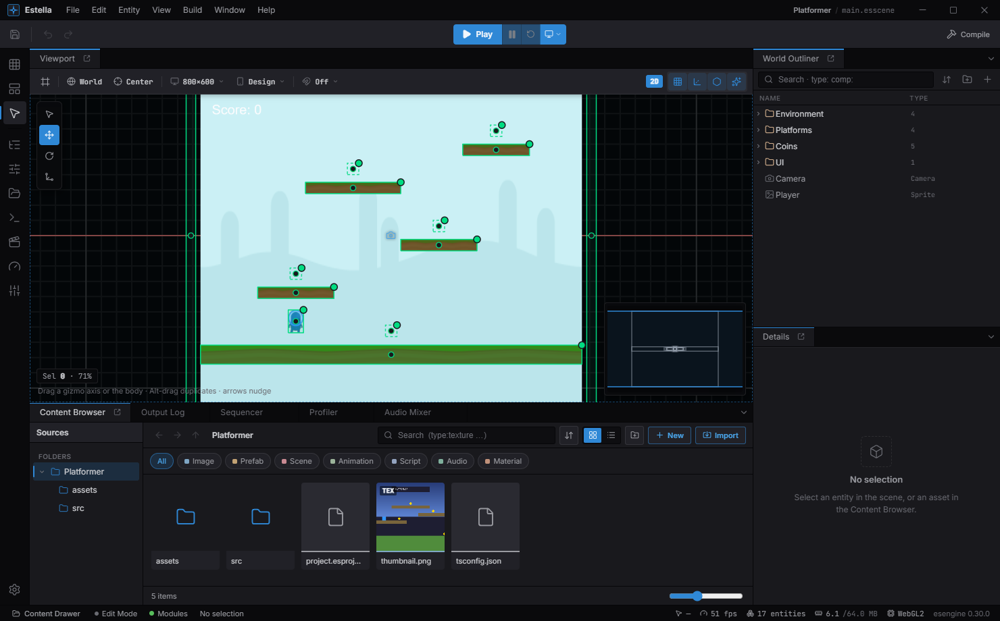
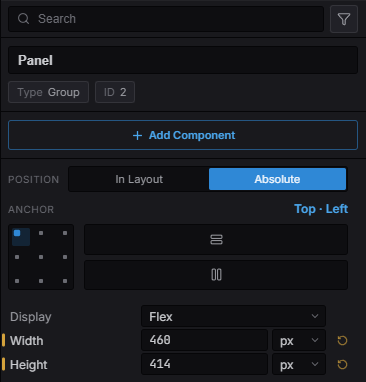
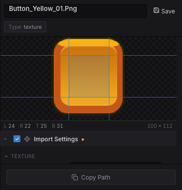

import { Aside } from '@astrojs/starlight/components';

The Estella editor is a desktop application (Electron + React) with a UE5-style
**dockable workspace**. You build scenes visually, tune components in an inspector,
paint tilemaps, wire node graphs, and **play the game right inside the editor** — in
an isolated runtime realm, so play never dirties your scene.

## Launching a project

When no project is open, the editor shows the **Launcher**:

- **Recent** — reopen a project you've worked on, with search and grid/list views.
- **New project** — pick a template, give it a name and location, and create it.
  Templates come in two groups: **Starters** (the **Blank** template — an empty
  scene with a camera) and **Examples** (the bundled sample projects, ready to
  explore and edit).

A project is a folder on disk. The pieces the editor cares about:

| Path | What it is |
|---|---|
| `project.esproject` | The project manifest — name, default scene, design resolution, enabled features (physics, rendering), packaging. Committed to version control. |
| `.esengine/workspace.json` | Editor-local state (last-opened scene, panel layout). Gitignored. |
| `assets/scenes/*.esscene` | Your scenes. |
| `assets/…` | Textures, materials, tilesets, and other assets, each with a `.meta` sidecar. |
| `src/components.ts` | The **declaration entry** — the editor evaluates this module and everything it imports to learn your components. Declare them anywhere; re-export them from here. See [Scripting](/docs/guides/scripting/#where-declarations-live). |
| `src/main.ts` | The **startup entry** — where you register systems. This is what runs the game; the editor never evaluates it. |

Assets are referenced portably by UUID (`@uuid:…`) rather than by path, so moving or
renaming a file doesn't break references.

## The workspace



*The default workspace: the viewport in the centre, the World Outliner and Details on the right, the Content Browser along the bottom, and the Play controls up top.*

The default layout, from the outside in:

- **Activity Bar** — the far-left icon rail: the **editing mode** (Scene / UI / Tilemap), side panels, and project settings.
- **Menu Bar** — File · Edit · Entity · View · Build · Window · Help.
- **Toolbar** — Save, Undo/Redo, the transform tools, snapping, Show Grid, the **Play**
  controls, Show Gizmos, and Build.
- **Viewport** (center) — the live WebGL scene view.
- **World Outliner** (right) — the scene's entity hierarchy.
- **Details** (right) — the inspector for the current selection.
- **Content Browser** + **Output Log** (bottom tabs).
- **Status Bar** — edit mode, selection, cursor, FPS, draw calls, and the engine version.

Panels are dockable — drag a tab to re-arrange, split, or float it, and the layout is
saved automatically. You can also summon the Content Browser as a slide-up overlay
from anywhere with **Ctrl / ⌘ + Space** (the *Content Drawer*).

<Aside type="note">
  Play runs in a **separate realm** from the scene you're editing, so a running game
  can't mutate your edit-mode world. Stopping returns you to exactly the scene you had.
</Aside>

## The viewport

The viewport is where you place and manipulate entities.

**Navigation**

- **Pan** — drag with the middle or right mouse button.
- **Zoom** — scroll the mouse wheel (zooms toward the cursor).
- **Frame Selected** — press **F** to center and fit the selection.

**Selecting**

- **Click** an entity to select it; **Shift-click** to toggle it in a multi-selection.
- Drag on **empty space** to **marquee** box-select everything inside.
- Press **Esc** to cancel an in-progress drag, then to clear the selection.

**Transforming** — pick a tool from the toolbar (or its shortcut) and drag a gizmo
handle:

| Tool | Shortcut | Gizmo |
|---|---|---|
| Select | `Q` | Pick / marquee only, no transform handles. |
| Move | `W` | Axis arrows (X / Y) plus a center plane for free move. |
| Rotate | `E` | A rotation ring. |
| Scale | `R` | Axis boxes plus a uniform-scale center. |

Dragging a handle transforms the whole selection as one, about a shared pivot, and
each drag is a single undo step. **Alt-drag** a selection to duplicate it and drag the
copies. Nudge the selection with the **arrow keys** (one grid step; hold **Shift** for
×10).

**Align & distribute** — select two or more entities and a strip of alignment buttons
appears in the viewport overlay: align **left / centre / right** edges and **top / middle /
bottom** edges. With three or more selected, two **distribute** buttons even out horizontal
or vertical spacing. Each is a single undo step and works across every entity kind (sprites,
UI nodes, gizmo-only entities alike).

**Snapping** — toggle snapping from the viewport's Snap dropdown and set the grid step,
rotation angle, and scale increment.

**Show Flags** — a viewport dropdown toggles the Grid, Gizmos, Physics, and the perf
overlay, plus World/Local axis orientation and Pivot-vs-Center. Entities that don't
render — Cameras, `Light2D`, colliders, joints, particle emitters — are drawn as
gizmos in edit mode (icon, view rect, light reach/cone, collider outline, joint
anchor links) so you can see and place them; many carry drag handles that write
their fields directly (light radius, collider size, emitter shape, joint anchors).

## Editing modes

The Activity Bar's top three icons switch the **editing mode** — **Scene**, **UI**, or
**Tilemap**. The mode also *follows your selection*: pick a `Canvas` or `UINode` and the
editor suggests **UI** mode, a `TilemapLayer` suggests **Tilemap** — switching that mode's
tools and viewport aids **without** disturbing your panel layout. To open a mode's
companion panels (UI Widgets, the Tilemap painter), click its Activity Bar icon or the
viewport's mode chip; that also **pins** the mode as a sticky lock that ordinary selection
clicks won't clear — re-click it to go back to following the selection.

**The design frame + device preview.** A scene is authored against a **design resolution** —
a fixed reference size (e.g. `1920 × 1080` landscape or `750 × 1334` portrait). This is a
**project-level** value (Project Settings → Display), not a UI-layer one: the viewport's
**Design** and **Device** controls work in **every** editor mode (Scene / UI / Tilemap), so
you can preview a gameplay-only scene on a real device **without** a UI Canvas. When the
scene has a Canvas, UI additionally lays out inside the frame per its scale mode.

- **Design** dropdown (viewport toolbar) — sets the design resolution and reframes to it
  (undoable). With a Canvas it edits that Canvas; otherwise it edits the project value.
- **Device** dropdown — picks the **target screen** (iPhone / iPad / 1080p …) in any mode.
  While editing it draws that screen's aspect as letterbox bars + safe-area insets over
  your scene; when you press **Play** the running game is letterboxed to the same shape,
  in the viewport and in the **Game** panel alike. It never changes your design
  resolution — it changes what you are looking at it *through*.
- **Orientation** (same dropdown) — swaps the device's width and height. It applies to a
  **device**, so it is disabled while `Design` is selected: with no screen simulated
  there is nothing to rotate.
- **Camera Fit** (Project Settings → Display) — how the **main camera** scales the design
  resolution, independent of any UI Canvas. `None` (default) keeps the camera's own
  orthoSize; any other mode letterboxes the game the same way on every device, and the
  device preview then shows the **real** framing (WYSIWYG for gameplay, not just UI).

**One screen, edit and run.** The `Design` entry is the "no simulation" choice: the game
fills whatever space the panel has, which is what authoring for desktop wants. Pick any
real device and both the edit overlay and the running game commit to its shape — so a
project authored for a phone is never only ever *run* at whatever aspect the dock
happened to be dragged to.


### Project screen presets

The built-in device list is a guess. A team that ships to specific hardware corrects it
in **Project Settings → Display → Screen presets**: add a row with an id, a name and the
portrait size, and it joins the dropdown for everyone who opens the project.

- **Id** is what a saved selection resolves through, so keep it stable. Reusing a built-in
  id (`iphone`, `ipad`, `1080p`, `720p`) **replaces** that built-in rather than sitting
  beside it — which is how a studio makes "iPhone" mean the exact handset it tests on.
- **Sizes are stored portrait** (width ≤ height), like the built-ins, so the orientation
  toggle means the same thing for every screen.
- **Safe area** (the row's ▸ expander) sets the notch / home-indicator insets in device
  pixels. Leave them at zero and nothing is written to the project file — the viewport's
  *Safe area* overlay then has nothing to draw for that screen.


Presets live in `project.esproject`, so they are shared through version control:

```json title="project.esproject"
{
  "screenPresets": [
    { "id": "steam-deck", "label": "Steam Deck", "width": 800, "height": 1280 },
    {
      "id": "iphone", "label": "iPhone 15 Pro", "width": 1179, "height": 2556,
      "safe": { "top": 59, "bottom": 34, "left": 0, "right": 0 }
    }
  ]
}
```

## Building a scene

### Creating entities

There are several ways to add an entity:

- **Entity → Add Entity** (or the toolbar) drops a blank Transform entity.
- **Create…** opens a command-palette that spawns entities: the built-ins — **Empty**,
  **Sprite**, **Camera**, **Particles**, **Light**, **Tilemap**, **Spine**, **Audio**,
  **Text**, **Shape**, **Mesh**, **Trail**, and the **UI** widgets (Canvas plus
  controls) — **your own project components**, and any **`.esprefab` prefab** in the
  project. Every create path (this menu, drag-and-drop, and the automation surface) runs
  the same pipeline, so each spawn is a single undo step.
- **Right-click in the Outliner** for the same actions in context, plus folders,
  parenting, and prefab creation.
- **Drag from the Content Browser** — drop an image to spawn a Sprite, or a `.esprefab`
  to instantiate it.

### The World Outliner

The Outliner is the scene's hierarchy. You can:

- Reparent by dragging entities onto one another, and organize with **folders**.
- **Type to jump** — with the tree focused, type the first letters of a name to
  jump to the matching entity.
- **Rename** with `F2`, **Duplicate** with Ctrl/⌘ + D, **Delete** with Delete.
- **Hide/Show** and **Lock/Unlock** entities (independent of whether the component is
  enabled at runtime). Hiding takes the entity out of the edit viewport — sprites,
  skeletons, tilemaps, particles, lights and all — without editing the scene the game
  loads. Locking leaves it visible and selectable but gives it no handles: the
  viewport won't pick it, and the transform gizmo won't appear for it.
- **Create Prefab** from a selection, then drop instances back into the scene.

### The Details panel

Details is the inspector for the selection. It lists every component on the entity and
its fields — driven by the engine's reflection metadata, so ranges, units, enums, and
tooltips come straight from the component definition. Add components, edit values, and
they're written back to the scene live. Fields enforce their constraints as you edit: a
**required** field is flagged when left empty, a numeric field is clamped to its
declared range on write, and dropping an asset onto a slot is rejected unless its type
matches.

Each component is a **collapsible section**, and the panel remembers what you fold —
across reselects *and* editor restarts — so an inspector stays as tidy as you leave it.
Rarely-touched "chrome" (a widget's `Focusable` and `ThemeStyle` tags) starts folded.

Where a visual control beats a row of raw numbers, Details shows a **purpose-built
widget** — most of them for UI nodes:

- an **anchor** control for absolutely-positioned `UINode`s: a clickable **3×3 grid** for
  the nine point anchors (Left / Centre / Right × Top / Middle / Bottom) plus a **Stretch**
  toggle per axis;
- a **flex** (auto-layout) widget for `FlexContainer`s: **Direction** (row / column and
  their reverses), a **3×3 alignment grid** that sets main- and cross-axis alignment in one
  click, main-axis **Distribute** (Packed / Between / Around / Evenly), and **Wrap** /
  **Stretch** toggles — with **padding** edited as a four-edge `sides` control;
- an inline **Controllers** strip that pulls per-node state authoring into the inspector:
  pick a state page and *gear* a field to bind it, all without leaving the panel (see
  [UI controllers](/docs/guides/ui-controllers/));
- for a **material**, a **Shader** picker to swap the bound shader — a built-in template or
  a project `.esshader` — see
  [Materials & Shaders](/docs/guides/material/#choosing--sharing-shaders-in-the-editor).



*A UI node's inspector: the **In Layout / Absolute** toggle, the clickable **3×3 anchor grid** (with per-axis Stretch), and `Display: Flex` — visual controls in place of raw numbers.*

Details also serves as the **asset inspector**: select an asset in the Content Browser to
edit its import settings or, for a material, its parameters.

**Dragging a 9-slice border.** A texture's slice border decides where a `NineSlice` panel
keeps its corners crisp, and typing four numbers means guessing at them. Select the
texture and drag the four guides directly on the preview instead — the numeric fields stay
in sync, so you can nudge one edge exactly after eyeballing the rest.

Import settings describe the **asset**, not the scene that happens to use it, and they now
reach every place the texture is drawn: the edit viewport, Play (in the viewport and in
the Game panel), and a packaged build. A frame that slices correctly while you author it
slices correctly in the shipped game.



## The Content Browser

The Content Browser is your project's asset explorer. Its **create** menu makes new
assets in place:

- New Scene, New Animation, New Input Map, New Material, New Material Graph,
  **New Shader**, New State Machine, New Behavior Tree, **New Script…**, New Folder.
- Context actions per asset type: **Create Tileset** (from a texture), **Create
  Tilemap** (from a tileset), **Create Material Instance** (from a material).

**New Script…** is the one that writes more than a file: a module nothing imports is
never bundled and its component never reaches Add Component, so the dialog also adds
the one line in your project's script entry that pulls it in — which entry depending
on whether you're making a component or a system. See
[Scripting](/docs/guides/scripting/#the-new-script-dialog).

**Import** by dragging files in from Finder / Explorer, or via Import…. Each asset gets
a `.meta` sidecar the first time it's seen. Per-asset context actions include Rename,
Duplicate, Copy Path, Copy Reference, **Find Usages**, Show in Explorer, and Delete.
Rename, move, and duplicate each post a toast with an **Undo** action — and renaming or
moving an asset rewrites its references in every open document, so nothing dangles.
**Delete** first lists every scene, prefab, and asset that references the file (so you
know exactly what breaks), then moves it to the OS trash — still recoverable with Undo.
The folder tree is fully keyboard-driven — arrows walk and collapse/expand, Enter opens
a folder.

**Find Usages** — right-click an asset, or click the reference count in the Inspector's
asset details — lists everywhere a texture, material, prefab, or scene is referenced,
across the on-disk dependency graph *and* the unsaved open scene.

## Play-in-editor

The **Play** controls in the toolbar run your game:

- **Play** starts the game; while running the same button becomes **Stop**, with
  **Restart** and **Pause/Resume** as side buttons.
- The play-mode dropdown chooses **Play In Viewport** (the game hosts over the viewport)
  or **Play In New Window** (a dedicated **Game** tab), and toggles **Maximize Viewport on
  Play** — which hands the whole workspace to the running game and restores your layout on
  Stop.
- A running game reads as a soft accent ring around the viewport (amber, with the frame
  dimmed, when paused) — not a badge over the game.
- Shortcuts: **F5** play, **Esc** stop, **F6** pause/resume, **Shift+F5** restart, and
  **F11** to maximize/restore the viewport at any time.

Because play uses an isolated realm — the same runtime that ships your game — what you
see in play is what a player gets.

## Autosave & recovery

The editor periodically snapshots your **unsaved** documents — only when there are
unsaved changes and no Play session is running — so a crash or power loss never costs
more than the last few moments of work. A snapshot is kept in your project's workspace
folder and never counts as a real save. The next time you open the project, if a
snapshot is newer than the file on disk, the editor offers to **restore** it; saving the
document supersedes its snapshot. This sits alongside the crash minidump and the
automatic reload if the GPU render process is lost.

## Specialized editors

Double-click an asset in the Content Browser to open its editor in a document tab.

- **Sequencer** — a timeline / curve editor for keyframe animation. See
  [Timeline](/docs/guides/timeline/).
- **Tilemap painter** — tools for **brush, erase, rectangle, line, bucket, select,
  eyedropper**, and **terrain (autotile)**, plus stamp **flip-H / flip-V / rotate-90°**
  (`H` / `V` / `R` while a paint tool is active) and a **random-scatter mode** (`D`). The
  palette selects with the arrow keys (`Shift` grows a multi-tile stamp), and maps can
  be **orthogonal, isometric, staggered, or hexagonal**. See
  [Tilemaps](/docs/guides/tilemap/).
- **Tileset editor** — author per-tile **collision** (box, circle, polygon, slope
  presets; one-way / sensor / material modifiers) with **direct-manipulation** shape
  editors on a magnified tile: drag a circle's **centre or radius**, **click-add / drag /
  click-delete** a polygon's **vertices**, and pick a **one-way** platform's solid side
  (top / bottom / left / right) — resizing keeps the sensor / material / density modifiers.
  Also **terrain** sets for autotiling (edge/corner peering or multi-color **corner
  Wang**), per-tile **probability** weights and properties, and **animated tiles** — drag
  frame thumbnails to **reorder**, or set the whole loop to **one uniform duration**, with
  a live preview.
- **State Machine** (`.esfsm`) and **Behavior Tree** (`.esbt`) editors — visual graphs
  for AI. See [Gameplay AI](/docs/guides/ai/).
- **Material Graph** (`.esmatgraph`) — a node editor that compiles to a shader. See
  [Materials & Shaders](/docs/guides/material/).

The State Machine and Behavior Tree editors share a common node canvas: **middle-drag**
to pan, **wheel** to zoom toward the cursor, drag an output handle onto another node to
connect them, click to select a node or edge, **Delete** to remove it, and right-click
the canvas to add a node at the cursor.

## Project settings

Open settings with **Ctrl / ⌘ + ,** or the Activity Bar's gear. Settings are grouped:

- **Editor** — Appearance (**language**, accent color, UI scale), Viewport (grid,
  snapping, gizmos), **Keyboard Shortcuts** (every shortcut below is rebindable
  here), and Console.
- **Project** (saved into `project.esproject`):
  - **Display** — the project design resolution (seeds new Canvases + drives the device
    preview in any scene), the project-wide **screen orientation** (every export target
    honors it; unset ⇒ derived from the design resolution's aspect), and the **camera fit**
    (how the main camera scales the design resolution without a UI Canvas; `None` = off).
  - **UI** — the project's widget **theme** (dark / light) and per-role **Theme
    Colors** overrides, applied identically in the editor, Play, and every export.
    See [UI widgets — theming](/docs/guides/ui-components/#theming).
  - **Physics** — enable, gravity, sixteen collision-layer names and a 16×16 collision
    matrix, plus solver tuning (fixed timestep, sub-steps, contact Hz/damping/push
    speed, sleeping, continuous collision). See [Physics](/docs/guides/physics/).
  - **Rendering** — up to thirty-two named sorting layers that populate the inspector's
    layer dropdown, and which of them y-sort. The names are suggestions, not a limit:
    a render `layer` still accepts a number outside them.
  - **Packaging** — per-target metadata: WeChat AppID, Desktop app id / product name.

### Editor language

The editor ships in **English** and **简体中文** and follows your system language on
first launch. Switch it under **Settings → Appearance → Language** — the change
applies after a reload (the editor prompts for one). The editor's UI strings run on
the same [localization engine](/docs/guides/localization/) your game uses at runtime.

## Keyboard shortcuts

`mod` is **⌘** on macOS and **Ctrl** elsewhere. All of these are rebindable under
Settings → Keyboard Shortcuts.

| Action | Shortcut |
|---|---|
| New Scene | `mod + N` |
| Open Project | `mod + O` |
| Save Scene | `mod + S` |
| Save Scene As | `mod + shift + S` |
| Undo / Redo | `mod + Z` / `mod + shift + Z` |
| Duplicate | `mod + D` |
| Copy / Cut / Paste | `mod + C` / `mod + X` / `mod + V` |
| Delete | `Delete` / `Backspace` |
| Select All | `mod + A` |
| Select / Move / Rotate / Scale tool | `Q` / `W` / `E` / `R` |
| Nudge selection (×10 with Shift) | Arrow keys |
| Frame Selected | `F` |
| Play · Stop | `F5` · `Esc` |
| Pause/Resume · Restart | `F6` · `shift + F5` |
| Maximize / restore viewport | `F11` |
| Command Palette | `mod + shift + P` |
| Content Drawer | `Ctrl + Space` |
| Project Settings | `mod + ,` |

The **Command Palette** (`mod + shift + P`) fuzzy-searches every runnable command —
the fastest way to reach any action without hunting through menus.

Beyond the command shortcuts, the editor is keyboard-navigable throughout: menus
and context menus move with the arrow keys (plus type-ahead, Home/End, and `→` /
`←` for submenus), the Outliner jumps to entities as you type, the Content
Browser's folder tree and the tile palette both walk with arrows, and keyboard
focus is always shown with a visible focus ring.

<Aside type="tip">
  For headless automation and AI agents, the editor also exposes an
  `EditorControlSurface` (load a scene, step the sim, read the scene tree/inspector,
  capture the viewport) over an MCP server — a developer/automation surface driven from
  scripts, separate from the visual editor above.
</Aside>

## See also

- [Scenes](/docs/guides/scene/) — what a `.esscene` holds and how it loads.
- [Scripting](/docs/guides/scripting/) — project components appear in the inspector automatically.
- [Prefabs](/docs/guides/prefab/) — reusable entity templates with per-instance overrides.
- [Building & Exporting](/docs/guides/build-export/) — ship the project to web, WeChat, or a playable ad.
