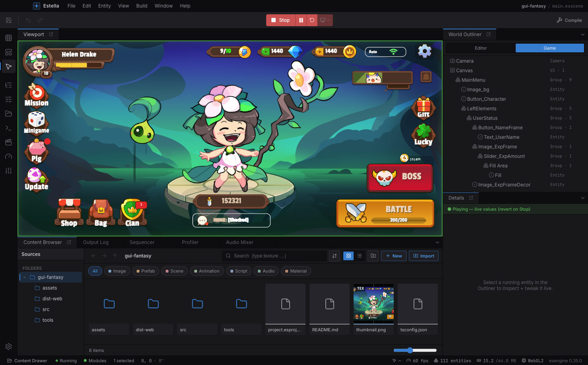
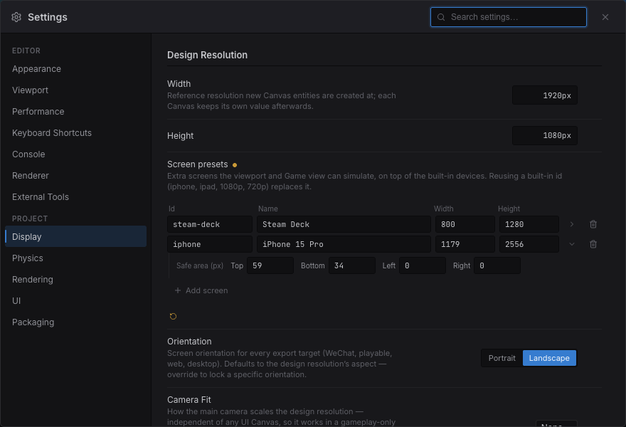

The viewport is where you place and manipulate entities.

**Navigation**

- **Pan** — drag with the middle or right mouse button.
- **Zoom** — scroll the mouse wheel (zooms toward the cursor).
- **Frame Selected** — press **F** to center and fit the selection.

**Selecting**

- **Click** an entity to select it; **Shift-click** to toggle it in a multi-selection.
- Drag on **empty space** to **marquee** box-select everything inside.
- Press **Esc** to cancel an in-progress drag, then to clear the selection.

**Transforming** — pick a tool from the toolbar (or its shortcut) and drag a gizmo
handle:

| Tool | Shortcut | Gizmo |
|---|---|---|
| Select | `Q` | Pick / marquee only, no transform handles. |
| Move | `W` | Axis arrows (X / Y) plus a center plane for free move. |
| Rotate | `E` | A rotation ring. |
| Scale | `R` | Axis boxes plus a uniform-scale center. |

Dragging a handle transforms the whole selection as one, about a shared pivot, and
each drag is a single undo step. **Alt-drag** a selection to duplicate it and drag the
copies. Nudge the selection with the **arrow keys** (one grid step; hold **Shift** for
×10).

**Align & distribute** — select two or more entities and a strip of alignment buttons
appears in the viewport overlay: align **left / centre / right** edges and **top / middle /
bottom** edges. With three or more selected, two **distribute** buttons even out horizontal
or vertical spacing. Each is a single undo step and works across every entity kind (sprites,
UI nodes, gizmo-only entities alike).

**Snapping** — toggle snapping from the viewport's Snap dropdown and set the grid step,
rotation angle, and scale increment.

**Show Flags** — a viewport dropdown toggles the Grid, Gizmos, Physics, and the perf
overlay, plus World/Local axis orientation and Pivot-vs-Center. Entities that don't
render — Cameras, `Light2D`, colliders, joints, particle emitters — are drawn as
gizmos in edit mode (icon, view rect, light reach/cone, collider outline, joint
anchor links) so you can see and place them; many carry drag handles that write
their fields directly (light radius, collider size, emitter shape, joint anchors).

## Editing modes

The Activity Bar's top three icons switch the **editing mode** — **Scene**, **UI**, or
**Tilemap**. The mode also *follows your selection*: pick a `Canvas` or `UINode` and the
editor suggests **UI** mode, a `TilemapLayer` suggests **Tilemap** — switching that mode's
tools and viewport aids **without** disturbing your panel layout. To open a mode's
companion panels (UI Widgets, the Tilemap painter), click its Activity Bar icon or the
viewport's mode chip; that also **pins** the mode as a sticky lock that ordinary selection
clicks won't clear — re-click it to go back to following the selection.

**The design frame + device preview.** A scene is authored against a **design resolution** —
a fixed reference size (e.g. `1920 × 1080` landscape or `750 × 1334` portrait). This is a
**project-level** value (Project Settings → Display), not a UI-layer one: the viewport's
**Design** and **Device** controls work in **every** editor mode (Scene / UI / Tilemap), so
you can preview a gameplay-only scene on a real device **without** a UI Canvas. When the
scene has a Canvas, UI additionally lays out inside the frame per its scale mode.

- **Design** dropdown (viewport toolbar) — sets the design resolution and reframes to it
  (undoable). With a Canvas it edits that Canvas; otherwise it edits the project value.
- **Device** dropdown — picks the **target screen** (iPhone / iPad / 1080p …) in any mode.
  While editing it draws that screen's aspect as letterbox bars + safe-area insets over
  your scene; when you press **Play** the running game is letterboxed to the same shape,
  in the viewport and in the **Game** panel alike. It never changes your design
  resolution — it changes what you are looking at it *through*.
- **Orientation** (same dropdown) — swaps the device's width and height. It applies to a
  **device**, so it is disabled while `Design` is selected: with no screen simulated
  there is nothing to rotate.
- **Camera Fit** (Project Settings → Display) — how the **main camera** scales the design
  resolution, independent of any UI Canvas. `None` (default) keeps the camera's own
  orthoSize; any other mode letterboxes the game the same way on every device, and the
  device preview then shows the **real** framing (WYSIWYG for gameplay, not just UI).

**One screen, edit and run.** The `Design` entry is the "no simulation" choice: the game
fills whatever space the panel has, which is what authoring for desktop wants. Pick any
real device and both the edit overlay and the running game commit to its shape — so a
project authored for a phone is never only ever *run* at whatever aspect the dock
happened to be dragged to.



### Project screen presets

The built-in device list is a guess. A team that ships to specific hardware corrects it
in **Project Settings → Display → Screen presets**: add a row with an id, a name and the
portrait size, and it joins the dropdown for everyone who opens the project.

- **Id** is what a saved selection resolves through, so keep it stable. Reusing a built-in
  id (`iphone`, `ipad`, `1080p`, `720p`) **replaces** that built-in rather than sitting
  beside it — which is how a studio makes "iPhone" mean the exact handset it tests on.
- **Sizes are stored portrait** (width ≤ height), like the built-ins, so the orientation
  toggle means the same thing for every screen.
- **Safe area** (the row's ▸ expander) sets the notch / home-indicator insets in device
  pixels. Leave them at zero and nothing is written to the project file — the viewport's
  *Safe area* overlay then has nothing to draw for that screen.



Presets live in `project.esproject`, so they are shared through version control:

```json title="project.esproject"
{
  "screenPresets": [
    { "id": "steam-deck", "label": "Steam Deck", "width": 800, "height": 1280 },
    {
      "id": "iphone", "label": "iPhone 15 Pro", "width": 1179, "height": 2556,
      "safe": { "top": 59, "bottom": 34, "left": 0, "right": 0 }
    }
  ]
}
```
