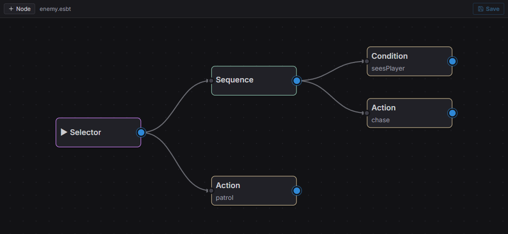

*The behavior-tree editor: a **Selector** root over a **Sequence** (Condition `seesPlayer` → Action `chase`) with a fallback `patrol` action.*

A behavior tree ticks from its **root** every frame and returns a `Status`. Composite
nodes control flow; decorators transform one child's result; leaves are your
registered actions and conditions. Attach a `BehaviorTreeAgent`:

```typescript
import { BehaviorTreeAgent } from 'esengine';

cmds.spawn()
  .insert(NavAgent, {})
  .insert(Perception, {})
  .insert(BehaviorTreeAgent, { bt: 'assets/ai/enemy.esbt' });   // an editor-authored asset
```

| `BehaviorTreeAgent` field | Description |
|---|---|
| `bt` | Key of the tree to run: a `registerBt` name **or** an `.esbt` asset path. |
| `status` | Last root status, written each tick (read-only). |

Author the tree visually in the editor, or build it in code with `registerBt`:

```typescript
import { registerBt } from 'esengine';

registerBt('guard', {
  root: {
    type: 'selector',            // try children left→right until one succeeds
    children: [
      {
        type: 'sequence',        // all must succeed, in order
        children: [
          { type: 'condition', name: 'seesPlayer' },
          { type: 'action', name: 'chase' },
        ],
      },
      { type: 'action', name: 'patrol' },
    ],
  },
});
```

Node types:

| Category | Type | Behavior |
|---|---|---|
| Composite | `sequence` | Ticks children in order; fails on the first failure, succeeds if all succeed. |
| | `selector` | Ticks children in order; succeeds on the first success, fails if all fail. |
| | `parallel` | Ticks all children; `policy: 'one'` succeeds when any does, `'all'` (default) when all do. |
| Decorator | `inverter` | Inverts its child's Success/Failure. |
| | `succeeder` | Always reports Success. |
| | `repeater` | Re-runs its child `count` times (`0` = forever). |
| | `wait` | Runs for `seconds` before reporting Success. |
| Leaf | `action` | Runs the registered action `name`; its `Status` (or `Success` on void) propagates up. |
| | `condition` | Returns `Success` when the registered condition `name` is true, else `Failure`. |
