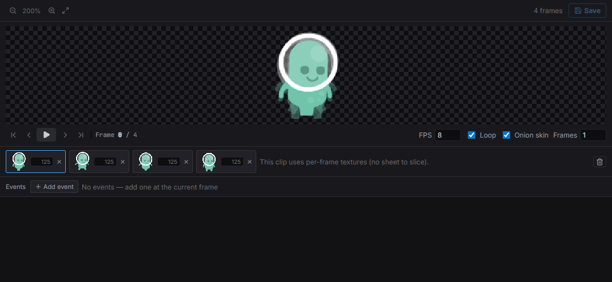
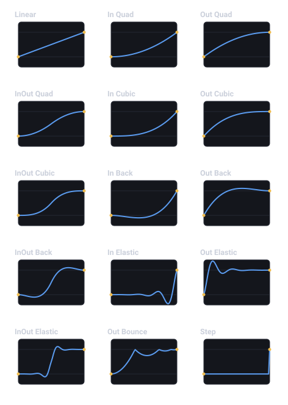
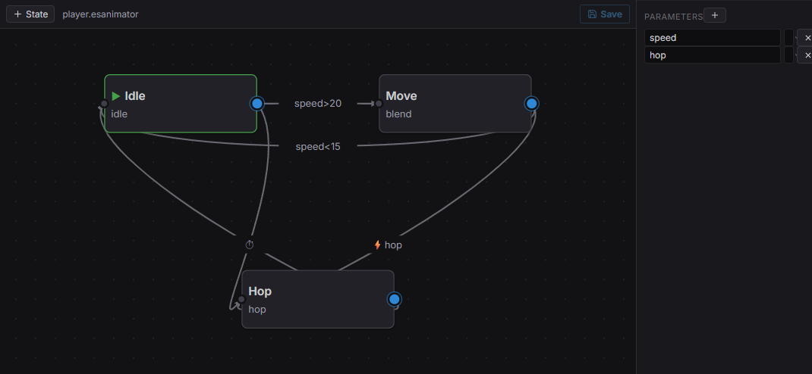
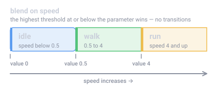

import { Aside } from '@astrojs/starlight/components';

Estella has three animation systems, each for a different job:

- **Sprite animation** — frame-by-frame sprite-sheet playback (`SpriteAnimator`).
- **Tweens** — interpolate any property over time with easing (`Tween`).
- **Animator state machine** — character animation driven by parameters (`Animator`).

They compose: a state machine can drive sprite clips, and tweens can juice a UI
element while a sprite loops.

## Sprite animation



*The flipbook editor: a 4-frame walk clip, per-frame durations, and a live preview with FPS / loop / onion-skin.*

The `SpriteAnimator` component plays named sprite-sheet clips (authored as
`anim-clip` assets). Switch clips by writing the component through a `Mut` query:

```typescript
import { defineSystem, Query, Mut, SpriteAnimator } from 'esengine';

const setClip = defineSystem([Query(Mut(SpriteAnimator))], (q) => {
  for (const [entity, animator] of q) {
    animator.clip = 'walk';
    animator.speed = 1.5;
    animator.playing = true;
  }
});
```

| Property | Type | Default | Description |
|---|---|---|---|
| `clip` | asset | `''` | Current clip (an `anim-clip` asset name). |
| `speed` | number | `1` | Playback speed multiplier. |
| `playing` | boolean | `true` | Whether playback is advancing. |
| `loop` | boolean | `true` | Loop the clip vs. hold the last frame. |
| `enabled` | boolean | `true` | Disable to freeze the animator. |
| `finished` | boolean | `false` | Read-only: latched when a one-shot clip completes. Raising `playing` on a finished animator replays from frame 0. |
| `currentFrame` | number | `0` | Read-only: the frame index being shown. |
| `frameTimer` | number | `0` | Read-only: time accumulated on the current frame. |

For finer control, the `SpriteAnimation` resource jumps to a specific frame or a
named label and registers clips at runtime:

```typescript
import { defineSystem, Query, Mut, Res, SpriteAnimator, SpriteAnimation } from 'esengine';

const jump = defineSystem([Query(Mut(SpriteAnimator)), Res(SpriteAnimation)], (q, sprites) => {
  for (const [entity, animator] of q) {
    sprites.gotoFrame(animator, 0, true);         // frame index, and play
    sprites.gotoLabel(animator, 'attack', true);  // named label, and play
  }
});
```

| Method | Description |
|---|---|
| `gotoFrame(animator, index, andPlay?)` | Jump to a frame index (optionally start playing). |
| `gotoLabel(animator, label, andPlay?)` | Jump to a named label in the clip. |
| `registerClip(clip)` | Register a `SpriteAnimClip` at runtime. |
| `getClip(name)` | Look up a registered clip. |

Clips can carry **frame events** (`SpriteAnimEvent`) that fire when playback
reaches a frame — use them for footstep sounds or hit frames.

### Authoring clips in the editor

Clips are `.esanim` assets you author visually — no JSON by hand:

1. **Right-click a texture** in the Content Browser and choose **Create Sprite
   Animation**. The Flipbook editor opens with the sheet under a slicing grid
   (the cell size is guessed from the image; adjust cell width/height, margin,
   and spacing in the toolbar).
2. **Click or drag across cells** to append frames. The frame strip below shows
   each frame's thumbnail with an editable duration (ms; empty = `1000 / FPS`),
   drag to reorder, and a live looping preview.
3. **Save**, then **right-click the `.esanim` → Create Animated Sprite** (or
   drag it into the viewport). You get a `Sprite` + `SpriteAnimator` entity
   posed at frame 0 — it plays in Play mode with zero code.

Selecting an animated sprite loops its flipbook **in the viewport while
editing** (toggle with the Preview FX show flag). If the clip is open in the
Flipbook editor at the same time, frame edits animate live as you make them.

Re-slicing the grid moves every frame consistently — frames reference grid
cells, not pixel rectangles. Frames that fall outside the current grid are
flagged red in the strip.

### Clips from code

The `.esanim` document is plain data, so a clip can also be built at runtime:
`createAnimClip` starts a sheet-sliced clip, you append `{ cell }` frames,
`parseAnimClipData` resolves it into a runtime `SpriteAnimClip`, and
`registerClip` makes the name available to every `SpriteAnimator`:

```typescript
import {
  defineSystem, Res, Assets, SpriteAnimation,
  createAnimClip, parseAnimClipData,
} from 'esengine';

const registerRun = defineSystem([Res(Assets), Res(SpriteAnimation)], async (assets, sprites) => {
  const tex = await assets.loadTexture('textures/run-sheet.png');

  // A 32×32 grid over the sheet; frames reference grid cells (row-major).
  const data = createAnimClip('textures/run-sheet.png', 32, 32, tex.width, tex.height);
  data.fps = 10;
  for (let cell = 0; cell < 6; cell++) data.frames.push({ cell });

  const handles = new Map([['textures/run-sheet.png', tex.handle]]);
  sprites.registerClip(parseAnimClipData('run', data, handles));
  // Any SpriteAnimator can now set clip = 'run'.
});
```

| Helper | Description |
|---|---|
| `createAnimClip(texture, cellWidth, cellHeight, pageWidth, pageHeight)` | A fresh sheet-sliced `AnimClipAssetData` (fps `12`, `loop: true`, margin/spacing `0`, no frames yet). |
| `parseAnimClipData(name, data, textureHandles)` | Resolve asset data into a runtime `SpriteAnimClip` — each cell frame gets its texture handle and UV window. |
| `parseAnimClipAsset(json)` / `serializeAnimClip(data)` | Parse / write the `.esanim` JSON document (the pair round-trips). |
| `animClipCellRect(sheet, cell)` / `animClipCellUv(sheet, cell)` | Pixel rect / UV window of a grid cell — what a `Sprite` shows for that frame. |

### Driving clips from a state machine — no code

The [FSM/BT built-ins](/docs/guides/ai/) drive flipbooks as data. An action's
optional **argument** carries the clip, so idle/run/attack switching is pure
`.esfsm` on the existing state-machine canvas:

| Name | Kind | Description |
|---|---|---|
| `spriteAnim.play` | action | Play. With a clip argument, switch to that clip (rewinds to frame 0). Safe on `onUpdate` — same-clip play while playing is a no-op. |
| `spriteAnim.restart` | action | Unconditional rewind + play (re-trigger a one-shot mid-flight). |
| `spriteAnim.stop` | action | Pause playback. |
| `spriteAnim.finished` | condition | True once a one-shot clip completed — `onEnter: spriteAnim.play` + a `spriteAnim.finished` transition is a self-contained attack state. |


## Tweens

The `Tween` resource interpolates a property from one value to another over a
duration. `to(entity, target, from, to, duration, options?)` returns a handle:

```typescript
import { defineSystem, Res, Tween, TweenTarget, EasingType, LoopMode } from 'esengine';

const animate = defineSystem([Res(Tween)], (tween) => {
  tween.to(entity, TweenTarget.PositionX, 0, 200, 1.0, {
    easing: EasingType.EaseInOutQuad,
    delay: 0.2,
    loop: LoopMode.PingPong,
    loopCount: 3,          // -1 = forever
  });
});
```

### Targets

`TweenTarget` selects the property to drive:

| Group | Values |
|---|---|
| Position | `PositionX`, `PositionY`, `PositionZ` |
| Scale | `ScaleX`, `ScaleY` |
| Rotation | `RotationZ` |
| Color | `ColorR`, `ColorG`, `ColorB`, `ColorA` |
| Size | `SizeX`, `SizeY` |
| Camera | `CameraOrthoSize` |

### Options

| Option | Type | Default | Description |
|---|---|---|---|
| `easing` | `EasingType` | `Linear` | Easing curve (see below). |
| `delay` | number | `0` | Seconds to wait before starting. |
| `loop` | `LoopMode` | `None` | `None` / `Restart` / `PingPong`. |
| `loopCount` | number | `0` | Number of loops; `-1` = forever. |

`EasingType` covers `Linear`, the quad/cubic/back/elastic families
(`EaseIn*` / `EaseOut*` / `EaseInOut*`), `EaseOutBounce`, `Step`, and `CubicBezier`
— use a custom bezier with the handle's `.bezier(p1x, p1y, p2x, p2y)`.



*Each easing plotted (progress `t` left→right, eased value bottom→top) — these are the engine's exact curves. `Back` and `Elastic` overshoot past the 0–1 band; `Step` holds until the end.*

### Sequencing & control

The returned `TweenHandle` chains and controls playback:

```typescript
// Chain: run one after another (a squash-and-stretch pop).
tween.to(e, TweenTarget.ScaleX, 1, 1.4, 0.15)
  .then(tween.to(e, TweenTarget.ScaleX, 1.4, 1, 0.15))
  .bezier(0.2, 0, 0, 1);

tween.parallel([...]);      // run several at once (a group)
tween.sequence([...]);      // run tween factories in order
tween.delay(0.5);           // a timed gap

tween.cancel(handle);       // stop one
tween.cancelAll(entity);    // stop everything on an entity
```

| Method | Description |
|---|---|
| `to(entity, target, from, to, duration, opts?)` | Tween a component property; returns a `TweenHandle`. |
| `value(from, to, duration, cb, opts?)` | Tween a plain number, delivered to `cb` each frame. |
| `parallel(tweens)` | Run several tweens together as a group. |
| `sequence(factories)` | Run tween factories one after another. |
| `delay(seconds)` | An empty timed gap (for use in sequences). |
| `cancel(handle)` / `cancelAll(entity)` | Stop one tween, or all on an entity. |

`TweenHandle` has `.then(next)`, `.bezier(...)`, `.pause()`, `.resume()`, and
`.cancel()`.

### Composition handles

`tween.parallel` returns a `TweenGroup` and `tween.sequence` a `TweenSequence` —
parent-level handles over their members. Both expose `state` (a `TweenState`),
`pause()` / `resume()` / `cancel()` that fan out to every member, and
`onComplete(cb)`:

```typescript
const popX = tween.to(e, TweenTarget.ScaleX, 1, 1.3, 0.2);
const popY = tween.to(e, TweenTarget.ScaleY, 1, 1.3, 0.2);
tween.parallel([popX, popY]).onComplete(() => spawnSparkles());

tween.sequence([
  () => tween.to(e, TweenTarget.PositionY, 0, 60, 0.3),
  () => tween.delay(0.2),
  () => tween.to(e, TweenTarget.PositionY, 60, 0, 0.3),
]).onComplete(() => landDust());
```

Always create groups and sequences **through the `Tween` resource** — the
resource registers them with its internal poller (`TweenCompositionManager`),
which is what fires `onComplete` and advances a sequence to its next factory. A
hand-constructed `new TweenGroup(...)` is never polled.

`tween.value(...)` and `tween.delay(...)` return a `ValueTweenHandle` — the same
control surface (`state`, `.pause()` / `.resume()` / `.cancel()`, `.bezier(...)`)
plus `.then(next)`, which chains another value tween *or* anything
pausable/resumable (a group, a sequence). `TweenHandle.then` likewise accepts a
`ValueTweenHandle`, so property tweens and value tweens mix freely in one chain.

Reach for the shorthand helpers (`tween.parallel` / `tween.sequence` /
`tween.delay` / handle `.then`) first; the classes are what those calls hand
back — you only name `TweenGroup` / `TweenSequence` / `ValueTweenHandle` when
storing a handle to pause, cancel, or observe the composition later.

## Animator state machine



*The animator: states (Idle / Move / Hop), transitions with conditions (`speed>20`, the `hop` trigger), and the **Parameters** panel that drives them.*

For character animation, an **animator controller** holds states, transitions, and
1D blend trees driven by named **parameters**. Author it in the editor (or
register one in code), attach an `Animator` component naming the controller, then
set parameters each frame through `Res(AnimatorController)` — the controller
resolves the current state, clip, and blend:

```typescript
import { defineSystem, Query, Res, Animator, AnimatorController } from 'esengine';

const drive = defineSystem([Query(Animator), Res(AnimatorController)], (q, anim) => {
  for (const [entity] of q) {
    anim.setFloat(entity, 'speed', 4.2);     // drives a 1D blend / transition
    anim.setBool(entity, 'grounded', true);
    anim.setTrigger(entity, 'jump');         // one-shot; resetTrigger to clear
    const speed = anim.getFloat(entity, 'speed');
  }
});
```

| `Animator` field | Type | Default | Description |
|---|---|---|---|
| `controller` | string | `''` | Registered controller name. |
| `currentState` | string | `''` | Active state, as a `/`-separated path for nested machines (seeded from the controller's initial state). |
| `enabled` | boolean | `true` | Disable to freeze the state machine. |

| `AnimatorController` method | Description |
|---|---|
| `setFloat(entity, name, value)` | Set a float parameter (blends / transition conditions). |
| `setBool(entity, name, value)` | Set a bool parameter. |
| `setTrigger(entity, name)` | Fire a one-shot trigger. |
| `resetTrigger(entity, name)` | Clear a trigger before it's consumed. |
| `getFloat(entity, name)` / `getBool(entity, name)` | Read a parameter back. |

The controller can drive both sprite **and** [Spine](/docs/guides/spine/)
animations, so one state machine handles a whole character.

Parameters come in three types (`AnimatorParamType`): `'float'`, `'bool'`, and
`'trigger'`. Conditions compare them with `gt` / `lt` / `eq` / `neq` (numeric,
with a `value`), `true` / `false` (bool), or `trigger` (fires once and is
consumed). There is no separate int type — drive whole numbers through a float
parameter and `eq` / `neq`.

### Blend trees



*A 1D blend: a float parameter picks the clip whose threshold is the highest one at or below it — here `idle` / `walk` / `run` as `speed` rises, with no transitions between them.*

A state can carry a 1D **blend** instead of a single clip: a float parameter
selects between `AnimatorBlendThreshold` stops. Because the sprite channel plays
one clip at a time, this is a *selection* by threshold — the stop with the
greatest `value` at or below the parameter wins (below all stops, the first one
plays) — not a weighted pose blend. Each threshold is
`{ value, clip, speed?, loop? }`; per-threshold `speed` / `loop` override the
state's own. The selection re-evaluates every frame, so a rising `speed`
parameter walks idle→walk→run with no transitions:

```typescript
import { defineSystem, Res, AnimatorController, type AnimatorControllerDef } from 'esengine';

const movement: AnimatorControllerDef = {
  parameters: [{ name: 'speed', type: 'float', default: 0 }],
  initialState: 'move',
  states: [{
    name: 'move',
    blend: {
      parameter: 'speed',
      thresholds: [
        { value: 0,   clip: 'idle' },
        { value: 0.5, clip: 'walk' },
        { value: 4,   clip: 'run', speed: 1.2 },
      ],
    },
    transitions: [],
  }],
};

const setup = defineSystem([Res(AnimatorController)], (anim) => {
  anim.registerController('movement', movement);
});
```

The pure helper `selectBlendClip(blend, value)` returns the threshold a value
selects — handy for tooling or tests.

For skeletal characters, a state can instead carry a `spine` motion
(`AnimatorSpineMotion`, `{ animation, loop? }`): on entry the controller sets
that [Spine](/docs/guides/spine/) animation (`loop` defaults `true`) and leaves
track playback and mixing to the Spine runtime — it never touches
`SpriteAnimator`. States are exclusive: exactly one of `clip`, `blend`, `spine`,
or `stateMachine`.

### Sub-state machines

A state carrying a `stateMachine` (`AnimatorSubMachine`) is a **container**: it
plays no motion of its own. On entry the machine descends into the sub-machine's
`initialState`; the container's own `transitions` are the *exit edges*,
evaluated from every leaf inside it. A sub-machine can declare its own
`anyStateTransitions`, checked from all of its sub-states. `Animator.currentState`
holds the full `/`-separated path (`STATE_PATH_SEP`), e.g. `locomotion/run`:

```typescript
import { defineSystem, Res, AnimatorController, type AnimatorControllerDef } from 'esengine';

const player: AnimatorControllerDef = {
  parameters: [
    { name: 'speed', type: 'float', default: 0 },
    { name: 'jump', type: 'trigger' },
  ],
  initialState: 'locomotion',
  states: [
    {
      name: 'locomotion',                    // container: no motion of its own
      stateMachine: {
        initialState: 'idle',
        states: [
          { name: 'idle', clip: 'idle', transitions: [
            { to: 'run', conditions: [{ param: 'speed', op: 'gt', value: 0.1 }] },
          ] },
          { name: 'run', clip: 'run', transitions: [
            { to: 'idle', conditions: [{ param: 'speed', op: 'lt', value: 0.1 }] },
          ] },
        ],
      },
      // Exit edges — leave the whole machine from idle OR run.
      transitions: [{ to: 'jump', conditions: [{ param: 'jump', op: 'trigger' }] }],
    },
    { name: 'jump', clip: 'jump', loop: false, transitions: [
      { to: 'locomotion', conditions: [], hasExitTime: true },   // back in at idle
    ] },
  ],
};

const setup = defineSystem([Res(AnimatorController)], (anim) => {
  anim.registerController('player', player);
});
```

Entering `locomotion` lands on `locomotion/idle`; the jump trigger exits from
either leaf; when the one-shot jump clip ends, `hasExitTime` re-enters the
container at its initial state. Transition priority, highest first: top-level
any-state → each enclosing machine's any-state (outermost in) → the leaf's own
transitions → container exit edges (innermost out).

The path machinery is exposed as pure functions (an `AnimatorScope` is the shape
shared by the top-level controller and every sub-machine):

```typescript
import { enterStatePath, leafStateOf, evaluateAnimatorPath } from 'esengine';

enterStatePath(player, 'locomotion');       // ['locomotion', 'idle']
leafStateOf(player, 'locomotion/run')?.clip; // 'run'
evaluateAnimatorPath(player, 'locomotion/idle', { speed: 3 }, new Set());
// → { nextPath: 'locomotion/run', consumedTriggers: [] }
```

| Helper | Description |
|---|---|
| `enterStatePath(scope, name)` | Descend from a state to its concrete leaf; returns the path segments. |
| `leafStateOf(def, path)` | The motion-bearing leaf state of a path, or `null`. |
| `evaluateAnimatorPath(def, path, params, triggers, clipFinished?)` | One pure evaluation step over a path → `{ nextPath, consumedTriggers }`. |
| `STATE_PATH_SEP` | The path separator, `'/'`. |

## Choosing the right tool

<Aside type="tip">
  Reach for **tweens** for one-off UI/juice (a button pop, a fade), **sprite
  animation** for looping art, and the **state machine** when transitions between
  many clips depend on gameplay parameters.
</Aside>

## See also

- [Spine Animation](/docs/guides/spine/) — skeletal animation, also driveable by the state machine.
- [Timeline](/docs/guides/timeline/) — keyframed cutscenes and sequenced events.
- [Camera](/docs/guides/camera/) — tween `CameraOrthoSize` for smooth zooms.
