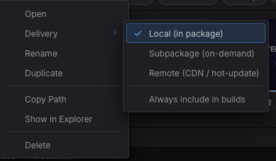

import { Aside } from '@astrojs/starlight/components';

Every asset in a project has a stable UUID. Scenes and prefabs reference assets
by UUID; at build time the engine **cooks** only what your game reaches, the
runtime resolves references through a **manifest**, typed **loaders** turn a
reference into a usable handle, and **reference counting** frees what's no longer
used. This guide covers each piece.

## Referencing assets

In code, reference an asset by its **project-relative path** — readable, and what
you'll normally write:

```typescript
const tex = await assets.loadTexture('textures/player.png');
```

The editor, by contrast, serializes references into scenes and prefabs as a
**stable UUID** (`@uuid:<uuid>`) so a reference survives the file being renamed or
moved. Both forms are accepted by every loader and resolve to the same path — you
don't hand-write `@uuid:` refs, the editor does. `resolveRef(ref)` returns the
resolved path for either.

## Loading by type

The `Assets` resource has a typed loader per asset type. Each returns a handle or
id you put on a component. For example, load a texture and show it on a `Sprite`:

```typescript
import { defineSystem, Query, Mut, Res, Sprite, Assets } from 'esengine';

const loadArt = defineSystem([Query(Mut(Sprite)), Res(Assets)], async (q, assets) => {
  const tex = await assets.loadTexture('textures/player.png');   // { handle, width, height }
  for (const [entity, sprite] of q) {
    sprite.texture = tex.handle;
  }
});
```

| Loader | Returns |
|---|---|
| `loadTexture(ref)` | `{ handle, width, height }` |
| `loadAudio(ref)` | `{ bufferId }` |
| `loadFont(ref)` | `{ handle }` |
| `loadMaterial(ref)` | `{ handle, shaderHandle }` |
| `loadSpine(skeletonRef, atlasRef?)` | `{ skeletonHandle }` |
| `loadTilemap(ref)` / `loadTileset(ref)` | `{ sourceId }` / `{ tilesetId }` |
| `loadTimeline(ref)` | `{ timelineId }` |
| `loadPrefab(ref)` | `{ data }` |

There's also a generic `load<T>(type, ref)` when you're driving the type
dynamically, and `register(loader)` to add a loader for a custom asset type.

## The manifest

The runtime resolves `@uuid` references to file paths through a manifest:

```typescript
assets.setManifest(manifest);   // usually the runtime does this for you
```

The manifest is produced by the cook (below). `getManifest()` returns the active
one. Refs that aren't in the manifest fall back to a direct path lookup.

## Addressable groups (lazy loading)

Assets under a `subpackages/<name>/…` folder form a lazy group `<name>`;
everything else is the eagerly-loaded `main` group. Load a group on demand — with
progress — and it downloads before its assets load (on WeChat this triggers
`wx.loadSubpackage`; on the web it's a no-op download):

```typescript
const bundle = await assets.loadGroup('level2', (loaded, total) => {
  console.log(`${loaded}/${total}`);
});

// ...player leaves the area the group backs:
assets.releaseGroup('level2');
```

`releaseGroup` is the symmetric other half: every asset the group acquired is
released through its type's canonical channel, so reference counting decides
what happens — an asset another scene or group still holds survives, and one
nobody holds drops to the evictable warm cache. Bouncing back into the area is
then absorbed by the warm caches instead of the network.

`loadByLabel(...)` loads assets tagged with a label instead of a folder group.
This grouping is what maps onto [WeChat subpackages](/docs/guides/wechat/) for
on-demand download.

When the set of assets you want to warm isn't a group or label — say, the next
area's textures while the player is still in this one — `preload` takes an
explicit ref list, infers each asset's type (manifest, then file extension),
and loads through the same typed channels with bounded concurrency:

```typescript
const { failed } = await assets.preload(
  ['textures/boss.png', 'audio/boss-theme.mp3', 'maps/arena.estilemap'],
  (loaded, total) => console.log(`${loaded}/${total}`),
);
```

It never rejects — refs that can't be typed or fail to load are reported in
`failed`. The eventual real loads then hit warm caches (or revive resident
textures) instead of the network.

## Cooking, compression & content addressing

At build time the **cook** walks the dependency graph from every scene in the
build (the Package dialog's **Scenes in build** list), **culls anything
unreachable**, stages the reachable files, and writes the manifest. Along the
way it can:

- **Compress textures** — encode PNGs to GPU-ready **KTX2** (Basis Universal),
  which the runtime transcodes to the best format the device supports (ASTC → ETC2
  → S3TC, falling back to RGBA8), mip chain included. Per-asset **Import Settings**
  decide this, with a tab per platform, so a texture can be compressed harder for a
  phone than for the web; the Package dialog's **Compression** switch only chooses
  whether to honor those settings or skip them all.
- **Content-address** — name each shipped file by a hash of its bytes, so URLs
  are immutable and identical files dedupe to a single copy. On by default for
  Web/Desktop.
- **Auto-atlas** — put loose PNGs in a `<name>.atlas/` folder and the cook packs
  them into atlas pages (with the frame UVs written into the manifest), so many
  small sprites ship as one texture and batch in one draw call.

### Shipping what only code names

Reachability is what keeps a build from shipping everything — and it is **blind to
anything your code names at runtime**: a texture in rich-text markup, a clip played
by url, a prefab spawned by path. Those get culled, and nothing warns you, because
the editor serves the project straight off disk and never needs the manifest. The
first symptom is a silent button or a missing image in a real build.

Declare the folder instead. In the **Content Browser**, right-click it and pick
**Delivery → Always include in builds** — the same menu that sets local /
subpackage / remote delivery, writing to the same `.esengine/asset-groups.json`:



*Right-click a folder → **Delivery**. The three modes decide where an asset ships from; **Always include in builds** decides whether it ships at all.*

```json
{
  "version": "1.0",
  "groups": {
    "markup-images": {
      "folder": "assets/textures",
      "mode": "local",
      "alwaysInclude": true
    }
  }
}
```

It is Unity's `Resources` folder and Unreal's additional cook directory, in the
model this project already had. **Off by default**, deliberately.

<Aside type="tip">
  Assets under `subpackages/` are always included even when unreachable — only
  their group assignment differs. `alwaysInclude` is what gives any other folder
  the same guarantee.
</Aside>

## Lifetime & reference counting

Loaded assets are **reference-counted**: every `load*()` counts as one
reference and needs a matching `release*()` (scene loading does both for you).
An asset shared by two scenes survives the first scene's unload and is freed
only when its last holder releases it.

A released asset isn't destroyed immediately, either. Textures and decoded
audio buffers stay resident as **evictable cache entries**, and if the same
asset is loaded again (re-entering a scene, streaming an area back in) it is
**revived in place** instead of re-fetched and re-decoded. A byte-budgeted LRU
evicts the oldest unreferenced entries once residency exceeds the budget, and
an OS memory warning drops the whole warm cache at once (held assets are
untouched). You generally don't manage this by hand — reference and despawn
entities normally.

The texture budget defaults to **64 MB** (`RuntimeConfig.textureCacheBudget`,
also settable as `textureCacheBudget` in the build config); decoded audio has
its own **32 MB** mirror (`audioCacheBudget` — see the
[audio guide](/docs/guides/audio/)).

## Texture memory & budgets

Textures are the budget that matters — they dominate GPU memory. The engine
applies `RuntimeConfig.textureCacheBudget` at startup; size it for your game
with `setTextureBudget` (the single game-facing surface over the C++ pool —
there is no parallel TS-side budget to drift from it), and watch residency with
`getResourceStats`:

```typescript
import { setTextureBudget, getResourceStats, trimTextureCache } from 'esengine';

setTextureBudget(256 * 1024 * 1024);   // 256 MB texture budget

const stats = getResourceStats();      // null before the engine initializes
// stats.textureBytes          — resident texture bytes (held + evictable)
// stats.textureBudget         — the current budget (0 = eviction off)
// stats.textureEvictableCount — warm-cache entries awaiting revive/evict
// …plus shaderCount / textureCount / vertexBufferCount / indexBufferCount
//  and cacheHits / cacheMisses

const freed = trimTextureCache();      // drop every evictable texture now
```

The "GC" here is the LRU described above: once `textureBytes` exceeds
`textureBudget`, the C++ pool evicts the least-recently-used **unreferenced**
textures until it fits — held textures are never touched. `setTextureBudget(0)`
disables the warm cache entirely (every texture frees the moment its last
reference is released), and `trimTextureCache()` frees all evictable entries at
once, returning the count — the engine calls it on OS memory warnings; call it
yourself before a known memory spike.

Two small helpers round out the surface: `getTextureDimensions(handle)` returns
a texture's `{ width, height }` (cached on the TS side after the first query),
and `evictTextureDimensions(handle)` drops that cached entry — the asset system
does this when a texture is truly freed, so you only need it if you destroy and
recreate textures around the asset system's back.

For watching these numbers frame-over-frame in the editor and at runtime, see
[Profiling](/docs/guides/profiling/). Per-texture **sampling/filtering**
parameters (pixel-art nearest vs. smooth linear) are covered in the
[Sprites guide](/docs/guides/sprites/).

## Best practices

- **Reference by path in code, let the editor write `@uuid:`** — never hand-author
  UUID refs.
- **Preload with `loadGroup` / `loadByLabel`** at level boundaries so play doesn't
  stall mid-scene.
- **Put on-demand content under `subpackages/<name>/`** so it becomes a lazy group
  (and a WeChat subpackage) instead of bloating the main bundle.
- **Let cooking cull + compress** — reachable-only staging and PNG→KTX2 keep the
  shipped bundle small; don't ship raw PNGs you can cook.
- **Mark folders your code loads by name** as **Delivery → Always include in
  builds**, or reachability culling will drop them from the build the editor never
  needed a manifest to run.
- **Set a texture budget** on memory-constrained targets and trust reference
  counting for the rest.

<Aside type="note">
  Content hashing runs on the **staged** bytes (after PNG→KTX2 encoding), so the
  manifest hash identifies the shipped artifact.
</Aside>

## See also

- [WeChat MiniGame](/docs/guides/wechat/) — how addressable groups map to subpackages.
- [Scenes](/docs/guides/scene/) — scenes reference assets and are cooked as entry points.
- [Materials & Shaders](/docs/guides/material/) — `loadMaterial` and shader handles.
