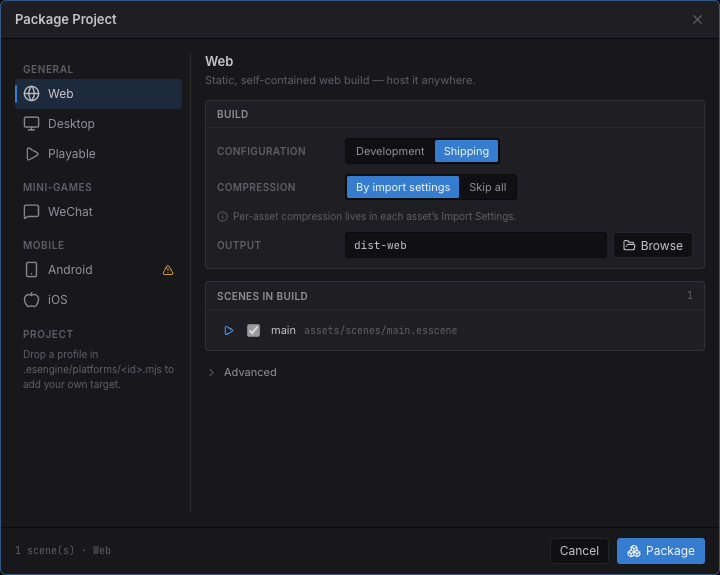

import { Aside, Steps } from '@astrojs/starlight/components';

One Estella project ships to six targets — **Web**, **Desktop**, **WeChat
MiniGame**, a single-file **Playable Ad**, and native **Android** / **iOS** apps —
all from the editor. The export uses the **same runtime you played in the editor**,
so what you shipped is what you tested (*play == ship*).

## Exporting from the editor



*The Package Project dialog: pick a **target** from the categorized list, a configuration, the output folder, and the [cook options](#asset-cook-options) — then Package.*

<Steps>

1. Open **File → Build…** to bring up the **Package Project** dialog.
2. Pick a **target** from the list — grouped as *General* (Web / Desktop /
   Playable), *Mini-games* (WeChat and any the project added), and *Mobile*
   (Android / iOS).
3. Choose a **build config** — *Development* or *Shipping* (Shipping minifies) — an
   **output folder**, source maps, and the [asset cook options](#asset-cook-options).
4. Check the **Scenes in build** list — untick scenes you don't want to ship, and
   pin a different startup scene if needed (see below).
5. Click **Package** and watch the live build log. When it finishes, the output
   folder opens (there's a checkbox to turn that off), and Web / Playable builds
   offer **Preview over http**.

</Steps>

Your choices are saved into `project.esproject`, so the dialog remembers them next
time.

## Scenes in build

Every scene in the project's scenes folder ships with the export and becomes a
`SceneManager.switchTo` target — see [Scenes](/docs/guides/scene/) for how a game
script switches between them. The dialog's **Scenes in build** list controls the
set:

- The **startup scene** is pinned first with a play badge. It always ships — move
  the pin to another scene by clicking its play button, or right-click any scene in
  the Content Browser and choose **Set as Startup Scene**.
- **Untick a scene** to leave it out of the build (saved as
  `packaging.excludeScenes` in `project.esproject`). Excluded scenes stay fully
  editable and playable in the editor; assets referenced only by excluded scenes
  are not cooked into the build.
- **Playable** ships the startup scene only — it's a size-capped single file.

## Preview an export

After a **Web** or **Playable** build, click **Preview over http** — the editor
serves the output folder on a local loopback server (`http://127.0.0.1:<port>/`)
and opens it in your browser.

<Aside type="caution">
  A web build needs an **http origin** — opening `index.html` directly from disk
  (`file://`) won't stream the WebAssembly. Use the preview button, or upload the
  folder to any static host.
</Aside>

## The targets

| Target | What it produces | Output | Next step |
|---|---|---|---|
| **Web** | A static, self-contained web build. | `dist-web/` | **Preview over http**, or upload the folder to any static host. |
| **Desktop** | An Electron app source tree. | `dist-desktop/` | `cd dist-desktop && npm install && npm start` — or `npm run dist` for a native `.dmg` / `.exe` / AppImage installer. |
| **WeChat** | A WeChat MiniGame package. | `dist-wechat/` | Open the folder in WeChat DevTools and set your AppID. See [WeChat MiniGame](/docs/guides/wechat/). |
| **Playable** | One self-contained `index.html` with everything inlined — no external requests, as ad networks require. | `dist-playable/` | **Preview over http** (its real surface is an ad-network iframe). Pick the [ad network](#playable-ad-networks) so the CTA and the size check match where it ships. |
| **Android** | Content for a **native** arm64 app (Vulkan) — a real APK, not a WebView. | `dist-android/` | `node build-tools/cli.js native --package --content dist-android` wraps it in a signed APK. See [Android & iOS](/docs/guides/mobile/). |
| **iOS** | Content for a **native** arm64 app (Metal), plus the Xcode project when the engine is built for iOS here. | `dist-ios/` | Open the generated Xcode project, pick a signing team, Run. See [Android & iOS](/docs/guides/mobile/). |

The mobile targets export app **content**, not a runnable payload: the engine, the
SDK and the game runtime live in the app binary. That is also why they need a
toolchain the other four do not — see [prerequisites](#runtime-prerequisites) below.

## Playable ad networks

Every network takes the same single HTML file but disagrees on three things: how big
it may be, what must sit in `<head>`, and which function sends the player to the
store. Pick the network in the **Package Project** dialog — it sits with the Playable
target's own settings — and the export handles all three. Shipping the same game to
several networks is a normal day, so it is a per-build choice rather than a project
property; each network also gets its own output folder (`dist-playable/<network>`), so
packaging for one never overwrites the last.

Your game code never names a network. Call the CTA once:

```ts
import { playableCta } from 'esengine';

// on your end-card button, after the win — wherever the call to action is
playableCta();
```

The export installs the bridge `playableCta()` dispatches through. With no network
selected it is a no-op, so the same scene still runs in the editor and on the web.

| Network | Limit | Click-through | Notes |
|---|---|---|---|
| **Generic** | 2MB | — | No network API. The cap is the strictest we know of, since an unnamed target could be any of them. |
| **Meta** (Facebook / Instagram) | 2MB for `index.html` | `FbPlayableAd.onCTAClick()` | Meta's 5MB figure is the total for a ZIP bundle; a single-file playable is capped by the `index.html` rule. Forbids any HTTP request. |
| **Google Ads** (App campaigns) | 5MB | `ExitApi.exit()` | Its exit API is a Google-hosted script, which the docs require as a literal `<script>` in `<head>` — the export writes it for you. Google uploads a **ZIP**, so compress the `index.html` before uploading. |
| **MRAID network** (generic) | 5MB | `mraid.open()` | For any MRAID host. `mraid` is injected by the webview, so nothing goes in `<head>`. |
| **Unity Ads** | 5MB | `mraid.open()` | Expects the playable to wait for MRAID's `viewableChange` before starting. |
| **AppLovin** | 5MB | `mraid.open()` | Requires every resource embedded — which a single-file playable already is. |

Limits move, so each one is reported against the network it came from: an oversized
export names the cap it used and where that number is published, rather than a bare
number to trust.

### A network we don't ship

Define it yourself — the built-in networks are written against this exact contract,
so nothing is out of reach. **Package Project → New platform** scaffolds one (pick
*Playable ad network*), or write `.esengine/platforms/<id>.mjs` by hand:

```js
export default {
  id: 'acme-ads',
  kind: 'playable',
  label: 'Acme Ads',

  // The size this network accepts, and where that number is published — the export
  // quotes the note in its warning.
  maxBytes: 5 * 1024 * 1024,
  limitNote: 'Acme docs, Creative specs § playable',

  // Optional: markup for <head> (an orientation meta tag, the network's SDK script).
  emitHead: (ctx) => `<meta name="ad.orientation" content="${ctx.orientation}">`,

  // Installs the bridge playableCta() dispatches through. Runs before the game.
  emitBridge: () => `window.__ESTELLA_PLAYABLE__={cta:function(){AcmeSDK.openStore();}};`,
};
```

It then appears in the dialog's Ad network dropdown beside the built-in ones, and
packages through the same pipeline.

## Runtime prerequisites

Web, Desktop and **Playable** all reuse the engine runtime that ships with the
editor, so they export with no setup — a playable inlines that same web runtime
(glue as a blob module, wasm as base64) rather than needing a build of its own.
**WeChat** is the exception among the web-based targets: its WebAssembly loader
differs, so its runtime is built once:

```bash
# only before the first WeChat export
node build-tools/cli.js build -t wechat
```

The Package Project dialog reminds you when a target's runtime is missing, and a
WeChat export **fails fast** — naming the exact build command — rather than
producing a package that breaks at runtime. WeChat also needs a matching side
module for each engine feature the game uses (`physics-wechat`, `spine-wechat`,
`basis-wechat` for compressed textures) — see
[WeChat MiniGame](/docs/guides/wechat/).

The dialog distinguishes **two kinds** of missing prerequisite, because they don't
block the same amount:

- A missing **engine runtime** (Web / Playable / WeChat) means the package cannot
  be produced at all.
- A missing **native toolchain** (Android / iOS) does not. The export still writes
  the app's content; only the final assembly into an installable app needs the
  toolchain, and that step can run on another machine — an iOS build always does
  when the editor is on Windows.

<Aside type="caution" title="Mobile needs an engine checkout">
  Android and iOS are the one pair of targets the editor download does not carry
  end to end: the native host is built once from an engine source checkout (Dawn +
  QuickJS), plus the Android SDK/NDK or macOS with Xcode. See
  [Android & iOS](/docs/guides/mobile/).
</Aside>

## Content a target cannot render

A target does not necessarily compile every subsystem the editor can author. When
one doesn't, the export **names the gap and the scenes that hit it** rather than
writing a package that is quietly missing half a scene — the warning lists the
subsystem (tilemaps, particles, post-processing, physics, Spine, video, text) and
the files that authored it.

No target currently has a gap: the native app compiles the whole engine source
list, and the three subsystems that are separate side modules on the web are
compiled into its binary instead. The check stays because that can change.

## Side modules

Optional engine features ship as separate WebAssembly **side modules** — an
emscripten `<file>.js` glue plus `<file>.wasm` per module — loaded on demand so
the base engine stays small:

| Module | Artifacts | Loaded when |
|---|---|---|
| Physics (Box2D) | `physics.js` / `physics.wasm` | The project declares physics or a scene uses physics components. |
| Spine | `spine38` / `spine41` / `spine42` `.js`/`.wasm` | A scene uses a Spine skeleton of that format version. |
| Basis transcoder | `basis.js` / `basis.wasm` | The build shipped KTX2-compressed textures. |
| Video decoder | `videodec.js` / `videodec.wasm` | The wasm video path decodes a clip. |

- **Web / Desktop** — the artifacts sit as loose files next to `esengine.wasm`;
  the runtime fetches them from `wasmBaseUrl` (the directory the engine itself
  was loaded from) via a fetch side-module host.
- **Playable** — nothing external is allowed, so the exporter inlines the
  modules as base64 into the single HTML file; the boot code
  (`initPlayableRuntime`) is handed an embedded side-module host instead of a
  URL.
- **WeChat** — side modules are packaged as WeChat-precompiled module
  factories (that's why each feature needs its `*-wechat` runtime build,
  above).

The editor's own play mode boots through the same shipping runtime
(`initPlayRealmRuntime`), fetching side modules over the editor origin — so
play == ship covers these modules too. See
[App Setup & Lifecycle](/docs/core-concepts/app-lifecycle/#side-modules) for the
runtime API.

## Build config & source maps

- **Development** — an unminified build; pair it with source maps for debuggable
  output.
- **Shipping** — minified for size and speed. This is what you release.
- **Source maps** map the running bundle back to your TypeScript. They're available for
  Web and Desktop; leave them off for a release build.

## Asset cook options

What the **cook** does to an individual asset is that asset's own business —
per-asset **Import Settings** in the Inspector, with a tab per platform, so a
texture can be compressed harder for a phone than for the web. The build only
picks whether to honor those settings at all:

- **Compression → By import settings** — each texture and audio clip compresses per
  its Import Settings (PNG → **KTX2** Basis Universal, Max Size, WAV → MP3), and
  `<name>.atlas/` folders pack into atlas pages so many small sprites ship as one
  texture and batch in one draw call.
- **Compression → Skip all** — ship everything raw, for fast iteration.

KTX2 textures are transcoded by the runtime to the best format each device
supports (ASTC → ETC2 → S3TC, falling back to RGBA8), with their mip chains —
smaller downloads and less VRAM.

**Content addressing** is on by default for Web/Desktop (each file named by a hash
of its bytes — immutable URLs, automatic dedupe). **Advanced** holds the CDN root
for [hot update](/docs/guides/hot-update/), source maps, and whether to open the
output folder when the build finishes.

<Aside type="caution" title="Assets only your code names are culled">
  The cook ships what it can **reach** from the scenes in the build. Anything named
  only in code — a texture in rich-text markup, a clip played by url, a prefab
  spawned by path — is culled, and the editor never notices because it serves the
  project straight off disk. Mark that folder **Delivery → Always include in
  builds** in the Content Browser. See
  [Assets](/docs/guides/assets/#shipping-what-only-code-names).
</Aside>

## Packaging settings

Per-target metadata lives in **Project Settings → Packaging** and is saved with the
project:

- **Application ID** — the reverse-DNS id the installed app is known by: the
  Android manifest package, the iOS bundle id, the desktop installer id. Empty
  derives one from the project name; a published app should set its own, because a
  store keeps it forever.
- **WeChat** — AppID.
- **Desktop** — application id override and product name (used to name the installer).
- **Android** — version code, the integer Google Play orders builds by.

### Screen orientation

Orientation is **one project-wide setting**, not per-target: **Project Settings →
Display → Orientation** (portrait or landscape), right beside the design resolution.
Every target honors it — the WeChat `game.json` `deviceOrientation`, the web build's
rotate-to-fit prompt (and a best-effort `screen.orientation.lock`), the desktop
window's aspect, and the native app's `app.config.json` (the engine can letterbox
but cannot rotate a phone). Left unset, it's **derived from the design resolution's aspect**
(wider-or-square ⇒ landscape, taller ⇒ portrait), so a landscape design ships
landscape everywhere with zero configuration.

A **playable is the exception, deliberately**: it never pins the page. Inside an ad
SDK the container's size is the SDK's business, so a rotate-to-fit overlay can hide
the game for good — the player turns the phone and nothing changes, because the media
query was reading the container all along. Playables stay responsive (every network
asks for that), and the orientation is only *declared* to the platform where one wants
it, e.g. Google's `ad.orientation` meta tag. Design for both aspects, or letterbox
with [a camera fit](#) so the framing survives either one.

See [The Editor](/docs/guides/editor/) for the settings UI.

## The build CLI (advanced)

The editor packages your **game**. The `build-tools/cli.js` command builds the
**engine and SDK** themselves — you only need it to produce the WeChat runtime above,
or when working on the engine. Common commands:

```bash
node build-tools/cli.js build -t web        # build the engine (web target)
node build-tools/cli.js build -t wechat     # …the WeChat runtime
node build-tools/cli.js sdk                 # build the SDK only
node build-tools/cli.js watch               # rebuild on change (engine dev)
node build-tools/cli.js native --target ios # …the native mobile host
```

<Aside type="note">
  Most game developers never run the build CLI beyond the one-time WeChat
  runtime build — day-to-day work happens in the editor and the SDK. The
  exception is [mobile](/docs/guides/mobile/), where the CLI is also what
  assembles the app around an export.
</Aside>

## See also

- [Android & iOS](/docs/guides/mobile/) — the native app: prerequisites, assembling it, and what only bites on a device.
- [WeChat MiniGame](/docs/guides/wechat/) — subpackage layout and platform-specific quirks.
- [Assets](/docs/guides/assets/) — how the cook step bundles and content-addresses assets.
- [Profiling & Diagnostics](/docs/guides/profiling/) — check frame time and draw calls before you ship.
