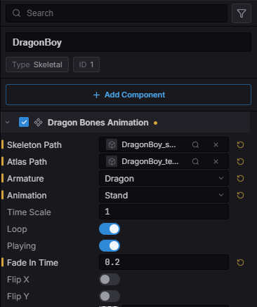
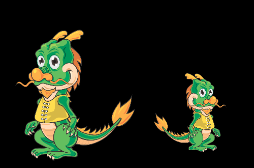

import { Aside } from '@astrojs/starlight/components';

Estella animates [DragonBones](https://docs.egret.com/dragonbones) armatures:
bones, meshes, slots and animations, posed by the same renderer that draws
everything else. It's driven by the `DragonBonesAnimation` component and
controlled at runtime through the `DragonBones` resource (from the
`esengine/dragonbones` subpath).

It runs everywhere the engine does — the editor viewport, Play, web, playable
ads, mini-games, and compiled into the iOS and Android hosts.

<Aside type="tip">
  Unlike Spine, the DragonBones runtime is **MIT licensed**. Shipping a game that
  uses it needs no separate license.
</Aside>

## Importing a project

A DragonBones export is three files, and Estella imports all three as one asset
type:

| File | What it is |
|---|---|
| `<name>_ske.json` or `<name>.dbbin` | The skeleton — bones, slots, animations. |
| `<name>_tex.json` | The atlas — where each piece sits on the image. |
| `<name>_tex.png` | The image itself. |

Drop the folder into the project. The two `_ske` / `_tex` halves are told apart
**by their name suffix**, not their extension — both are `.json`, so extension
alone cannot say which is which.

The PNG is the one file nothing in your scene points at: it is named *inside* the
atlas, in its `imagePath` field. Estella follows that reference when it packages a
build, so the image ships with the atlas instead of being culled as unreachable.
You do not need to reference it anywhere.

## The `DragonBonesAnimation` component

Add it with **Create → DragonBones**, or add the component to an existing entity.
It lives in the main `esengine` package.



| Property | Type | Default | Description |
|---|---|---|---|
| `skeletonPath` | asset | `''` | Skeleton file (`_ske.json` / `.dbbin`). |
| `atlasPath` | asset | `''` | Atlas file (`_tex.json`). |
| `armature` | string | `''` | Which armature in the file (empty = the first). |
| `animation` | string | `''` | Animation to play on spawn. |
| `loop` | boolean | `true` | Loop the initial animation. |
| `playing` | boolean | `true` | Whether playback advances. |
| `fadeInTime` | number | `0` | Crossfade seconds, used on the first play too. |
| `timeScale` | number | `1` | Per-entity playback speed. |
| `skeletonScale` | number | `1` | Uniform skeleton scale. |
| `flipX` / `flipY` | boolean | `false` | Mirror horizontally / vertically. |
| `color` | Color | `{1,1,1,1}` | Tint (RGBA, 0..1). |
| `layer` | number | `0` | Sorting layer for draw order. |
| `material` | asset | none | Optional custom material. |
| `enabled` | boolean | `true` | Disable to freeze and hide. |

**Skeleton and atlas are asset slots**: pick from the popover, drag a file in from
the Content Browser, or use the slot's locate / clear actions. The scene serializes
them as portable `@uuid:` references, so moving or renaming the files never breaks
the link.

The armature poses **in the viewport while you edit** — changing the animation, the
scale or a flip shows immediately, without pressing Play.

<Aside type="caution">
  `color` is authored but not yet applied to a DragonBones armature — the runtime's
  ABI has no tint entry point. Slot colours authored in DragonBones Pro *are*
  honoured; this is the per-entity tint on top of them.
</Aside>

## Choosing an armature

A DragonBones file is a **project**, not a skeleton: one file often holds several
armatures. Choosing one is a real step, so `armature` is its own field.

Once the entity points at a skeleton, **Armature** and **Animation** become
dropdowns filled by reading that file — you pick from what is actually in it
rather than typing a name and finding out at runtime. The animation list follows
the chosen armature, because two armatures in one file do not share an animation
list.

Leaving `armature` empty uses the first armature the file holds. Most files ship
one, and requiring a value you cannot know without opening the file would make the
common case harder than it is.

<Aside type="note">
  A `.dbbin` skeleton fills no dropdown — it is binary, and naming what is inside
  it would mean starting the runtime just to populate a list. The field stays a
  plain text box, and a name you type still works.
</Aside>

## Play & crossfade animations

This is where DragonBones differs from Spine most, and the API says so rather than
pretending otherwise. Spine keeps a **mix table** on the skeleton — "going from
idle to run takes 0.2s". DragonBones blends **at the moment an animation starts**,
so the fade is an argument to starting it:

```typescript
import { defineSystem, Query, Res, DragonBonesAnimation } from 'esengine';
import { DragonBones } from 'esengine/dragonbones';

const control = defineSystem(
  [Query(DragonBonesAnimation), Res(DragonBones)],
  (q, dragonBones) => {
    // Null until the runtime lands — it is fetched on first use.
    if (!dragonBones) return;

    for (const [entity] of q) {
      dragonBones.fadeIn(entity, 'walk', 0.25, true);  // crossfade over 0.25s
      dragonBones.setTimeScale(entity, 1.5);           // 1.5x speed
    }
  },
);
```

| Method | Description |
|---|---|
| `play(entity, name, loop?)` | Start an animation immediately, no blend. |
| `fadeIn(entity, name, seconds, loop?)` | Crossfade into an animation. |
| `stop(entity, name?)` | Stop one animation, or all of them when omitted. |
| `setTimeScale(entity, scale)` | Per-entity playback speed. |
| `setEnabled(entity, on)` | Remove from the frame entirely (freeze **and** hide). |
| `setEntityProps(entity, props)` | Set `{ skeletonScale?, flipX?, flipY?, layer?, playing?, timeScale? }` at once. |

`playing: false` freezes the pose but keeps drawing it; `setEnabled(false)` takes
the armature out of the frame. They are different things and both are useful.

## Query an armature

```typescript
const anims  = dragonBones.getAnimations(entity);  // string[]
const bounds = dragonBones.getBounds(entity);      // { x, y, width, height } | null
```

`getBounds` is derived from the armature's **posed** geometry, not from the bounds
the authoring tool recorded — so it follows the character as it moves rather than
describing where it was drawn.

## Sharing one skeleton

Entities pointing at the same skeleton + atlas pair share **one parsed skeleton and
one atlas**. Ten copies of a character parse the file once and hold one texture
between them; the last one removed unloads it.

Nothing is required to opt in — it follows from the pair the components reference.
Per-entity properties stay per entity, so a shared skeleton can still be scaled,
flipped and tinted independently:



## What ships in a build

The DragonBones runtime is **pay-for-use**. A project without an armature in it
never fetches, inlines or copies the module:

| Target | How the runtime gets there |
|---|---|
| Web / desktop | `dragonbones.wasm` beside the engine, fetched on first use. |
| Playable ad | Inlined into the single HTML file — only if a scene uses it. |
| Mini-game | Copied into the package — only if a scene uses it. |
| iOS / Android | Compiled into the app binary. |

The editor decides by scanning the scenes it is packaging, so there is no setting
to remember and no way to ship a game whose armatures have no runtime.

## Best practices

- **Give transitions a fade.** `fadeIn` with 0.15–0.3s reads far better than
  `play`, which snaps. Set `fadeInTime` on the component so the first play blends
  too.
- **Share the pair across entities** — a crowd of one character costs one parse and
  one atlas.
- **Pick the armature in the editor**, from the dropdown, rather than typing it:
  a name that does not exist in the file draws nothing.
- **Prefer `playing: false` to disabling** when you want a character to hold a pose
  on screen.

## See also

- [Spine Animation](/docs/guides/spine/) — the other skeletal runtime, and how it differs.
- [Animation](/docs/guides/animation/) — sprite flipbooks and the Animator state machine.
- [Assets](/docs/guides/assets/) — how skeleton and atlas assets are imported and referenced.
- [Build & Export](/docs/guides/build-export/) — what a package contains per target.
