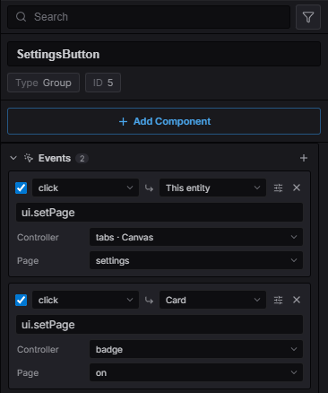
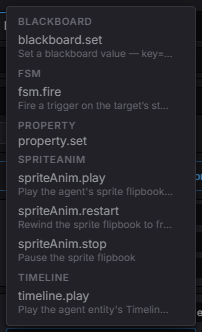
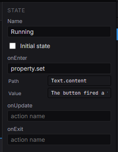

import { Aside } from '@astrojs/starlight/components';

A **wire** says: *when this entity sees this event, run this action on that entity.* It is
a row of data on the emitting entity — no callback, no script file — so laying out a button
and making it *do* something happen in the same place.

```
click ─▶ ui.setPage(tabs, settings)      on "This entity"
click ─▶ ui.setPage(badge, on)           on "Card"
```

Wires are deliberately **not** a visual programming language. A row has no branches and no
expressions; when something genuinely needs logic, the row names an action that hands off to
[a state machine](/docs/guides/ai/) — the editor Estella already has for graphs.

## A wire in the inspector



*Two wires on a button: both fire on `click`, one switches a controller on the button's own
ancestor chain, the other targets the `Card` entity by name.*

Select any entity that can emit — a UI node, an `Interactable`, a collider — and the
**Events** section lists its wires. Each row reads left to right:

| Part | Meaning |
|---|---|
| ☑ | Row enabled. An unchecked row stays in the data and never fires. |
| Event | The event type to listen for (`click`, `change`, `trigger_enter`, …). |
| ↳ Target | Which entity the action runs on. *This entity* by default, or another **by name**. |
| Action | A registered action name — the same palette the FSM and behaviour-tree editors use. |
| Parameters | Whatever that action declares. An action with none gets a single free-text argument. |
| ⚙ | Reveals **Condition** (a registered condition that must pass) and **Once**. |

## The data

A wire is the `EventBinding` component, so it serializes into scenes and travels with
[prefabs](/docs/guides/prefab/) like any other component — no new asset type:

```typescript
import { EventBinding, UIEventType } from 'esengine';

world.insert(button, EventBinding, {
  rows: [
    { event: UIEventType.Click, action: 'ui.setPage', params: { controller: 'tabs', page: 'settings' } },
    { event: 'trigger_enter', target: 'Door', action: 'ui.setVisible', params: { visible: true }, once: true },
  ],
});
```

| `EventBindingRow` | Description |
|---|---|
| `event` | Event type to listen for. Any string — the built-ins are only the well-known set. |
| `target` | Name of the entity the action runs on. Omitted = the entity carrying the row. |
| `action` | Registered action name. |
| `params` | The action's declared parameters by name. |
| `arg` | The same input in canonical string form (`"tabs:settings"`). Either form runs. |
| `guard` | Registered condition that must pass for the row to run. |
| `once` | Run at most once per play session. |
| `enabled` | `false` keeps the row inert without deleting it. |

Wires fire in play mode only — the editor never runs your actions while you author.

### Targets resolve by name, nearest first

`target` is an entity **name**, searched outward: the row's own entity, then its subtree,
then each ancestor's subtree, and finally the whole scene. Nearest wins, which is what keeps
two instances of the same prefab from wiring into each other — a `Close` button inside
dialog A finds dialog A's `Panel`, never dialog B's.

A name that matches nothing is reported in the inspector (the target reads red) and warns at
runtime instead of failing silently.

## Actions

An action is a named function in the shared registry — the same one `.esfsm` state hooks and
`.esbt` leaves resolve against. Register once, and the name shows up in all three palettes.



*The palette groups by `namespace.`, and the engine's own actions carry a one-line
description.*

These ship with the engine:

| Action | What it does |
|---|---|
| `ui.setPage` | Switch a [UI controller](/docs/guides/ui-controllers/) to a page. |
| `ui.setVisible` | Show/hide a UI subtree (`UINode.display`). |
| `property.set` | Write any component field, addressed as `Component.dot.path`. |
| `fsm.fire` | Fire a trigger on the target's state machine. |
| `blackboard.set` | Set a blackboard value. |
| `timeline.play` · `timeline.pause` | Drive a [timeline](/docs/guides/timeline/) on the target. |
| `spriteAnim.play` · `spriteAnim.restart` · `spriteAnim.stop` | Drive a sprite flipbook. |

### Your own actions

One registration makes a name authorable everywhere:

```typescript
import { registerAction } from 'esengine';

registerAction('game.award', {
  params: [
    { name: 'kind', type: 'enum', options: [{ label: 'Coin', value: 'coin' }, { label: 'Star', value: 'star' }] },
    { name: 'amount', type: 'number' },
  ],
  run: (ctx, bb, arg, params) => {
    grantReward(ctx.entity, params!.kind as string, params!.amount as number);
  },
});
```

Declaring `params` is what turns the editor's text box into a dropdown and a number field.
`ctx` is the same context an FSM action gets — `entity`, `world`, `commands`, plus the
blackboard.

<Aside type="tip" title="Where to register">
The editor never executes your gameplay code, so it learns your action names from the
project's **declaration entry** (`src/components.ts` by default — the same module it reads
components from). Register there and the names appear in every palette; register elsewhere
and they still work at runtime, you just have to type them.
</Aside>

## Which events fire

Widgets emit the standard set (`UIEventType`), and events **bubble**, so a row on a panel
hears its buttons:

`click` · `press` · `release` · `hover_enter` · `hover_exit` · `focus` · `blur` ·
`change` · `submit` · `drag_start` · `drag_move` · `drag_end` · `scroll` · `select` · `deselect` ·
`shown` · `hidden`

`shown` and `hidden` are the exception to "a widget emits them": nobody clicked anything, the
node simply arrived on screen or left it — usually because an **ancestor** was shown or hidden,
which is what navigation, tabs and dialogs do. Every node in the subtree is told, so an entrance
animation is a row on the panel that plays it rather than a system that watches for it:

| Event | Action | Target |
|---|---|---|
| `shown` | `tween.play` | *(this entity)* |

The watching costs nothing until something listens for one of the two, and nothing again on a
frame where no UI moved.

[Physics](/docs/guides/physics/) contacts reach the same channel (`PhysicsEventType`), so a
[trigger area](/docs/guides/markers/) is wired exactly like a button — both participants get
the event, each told about the other:

`collision_enter` · `collision_exit` · `collision_hit` · `trigger_enter` · `trigger_exit`

The vocabulary is open: emit your own name from anywhere and a row can listen for it.

```typescript
import { EntityEvents } from 'esengine';

app.getResource(EntityEvents).emit(chest, 'looted', { gold: 12 });
```

## When a wire needs logic

A row runs one action; it has no "if" and no sequence. That is a deliberate ceiling, and
`fsm.fire` is the way through it — the click fires a trigger, and the entity's
[state machine](/docs/guides/ai/) decides what it means:

```
click ─▶ fsm.fire(start)  on "Hint"   →   Idle ──start──▶ Running
                                                          onEnter: property.set(…)
```



*The same parameter controls, in the state-machine editor: `property.set` declares `path`
and `value`, so the hook shows two fields instead of one opaque string.*

An action declares its parameters once and every authoring surface shows them — an event
row, an FSM state hook, a behaviour-tree leaf.

## Two ways to write the same input

Every action keeps a canonical string form. `{ controller: 'tabs', page: 'settings' }` and
`"tabs:settings"` are projections of each other, and the registry converts between them, so:

- data authored before an action declared its parameters keeps running, unchanged;
- an action that only reads `arg` still receives it when a row is authored as parameters;
- the editor can show real controls for a row that stores a plain string.

You never choose: the inspector writes parameters, hand-written data may use either.

<Aside type="caution" title="Not yet: asset and entity parameters">
A parameter cannot be an asset reference or an entity handle. The cook's discovery pass and
the scene's entity remapper do not look inside a row's parameters, so such a parameter would
ship a build with a missing asset — a control that silently breaks the game is worse than no
control. Address other entities by `target` name, and reference assets through a component
the cook can see.
</Aside>

## Example

`examples/ui-events` is the whole feature in one project — two tab buttons, a cross-entity
badge, and a *Start run* button that hands off to a state machine. Its `src/main.ts` is
empty; every behaviour in it is authored data.
