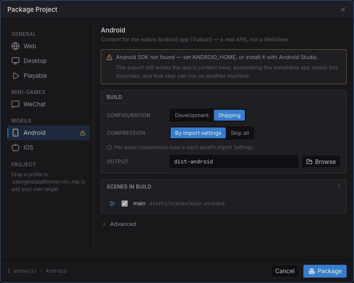

import { Aside, Steps } from '@astrojs/starlight/components';

**Android** and **iOS** package your project as a **real native app**: the engine's
C++ core compiled to arm64, rendering through an embedded
[Dawn](https://dawn.googlesource.com/dawn) (WebGPU → **Metal** on iOS, **Vulkan** on
Android), with your game scripts running on an embedded JS engine
([QuickJS-ng](https://github.com/quickjs-ng/quickjs)). It is **not** a WebView and
not a wrapper around the web build — there is no browser in the process.

The authoring model is identical to every other target. The same scenes, the same
components, the same TypeScript. Nothing in a project is mobile-specific.

<Aside type="caution" title="Pre-1.0 — needs an engine checkout">
  Unlike Web / Desktop / WeChat / Playable, the mobile targets are **not
  self-contained in the editor download**. Assembling the installable app needs
  the native host built once from an engine source checkout, plus the platform's
  own toolchain (see [Prerequisites](#prerequisites)). The editor still exports
  the app's *content* from any install — that half never needs a toolchain.
</Aside>

## Two platforms, one runtime

Android and iOS are offered as **two targets, not one "Mobile"**, because they
package through entirely different toolchains (Android SDK + NDK vs. Xcode) — one
row could not tell you what to run, whether this machine can run it, or where the
package comes out.

They do share **one runtime and one export payload**. The engine, the SDK and the
game runtime all live in the app binary, so what an export writes is app
**content** — your scenes, scripts and cooked assets — rather than a runnable
package the way `dist-web/` is.

| | Android | iOS |
|---|---|---|
| Graphics | Vulkan (via Dawn) | Metal (via Dawn) |
| Export output | `dist-android/` | `dist-ios/` |
| Assembled by | `aapt2` + `apksigner` (Android SDK/NDK) | Xcode |
| Assembly host OS | any desktop OS | **macOS only** |
| Result | a signed `.apk` | an Xcode project you open, sign and run |

## Prerequisites

The Package dialog distinguishes **two kinds** of missing prerequisite, and they
are not the same severity:

- A missing **engine runtime** means the package cannot be produced at all.
- A missing **native toolchain** does not. The export still writes the app's
  content; only the final assembly needs the toolchain, and **that step can run on
  another machine** — an iOS build always does when the editor is on Windows.



*Package Project → **MOBILE → Android**. The warning names the missing piece and says exactly how much it blocks: the content is written either way.*

<Steps>

1. **Build the native host once.** Dawn and QuickJS are multi-GB / separate
   projects, so they are fetched rather than vendored. The one-time recipe (and
   the exact `cmake` invocations) is in
   [`native/README.md`](https://github.com/esengine/estella/blob/master/native/README.md).

2. **Install the platform toolchain.**
   - *Android* — Android SDK + **NDK r28**. The editor finds it via `ANDROID_HOME`
     or Android Studio's default install location.
   - *iOS* — **macOS with Xcode**. Apple ships no toolchain for other operating
     systems, so the dialog says so rather than pretending otherwise.

3. **Check the dialog.** The target's row carries a warning triangle until the
   probe passes, and the panel names what is missing.

</Steps>

## Exporting

<Steps>

1. **File → Build…**, then pick **Android** or **iOS** under **MOBILE**.
2. Choose a build config and an output folder (`dist-android` / `dist-ios` by
   default). Source maps are not offered — there is no browser devtools to
   consume them.
3. Check **Scenes in build** as you would for any target.
4. **Package**. The export cooks assets, bundles scripts, and writes the app's
   content plus an `app.config.json` carrying the app's identity.

</Steps>

Then assemble the app around that content:

```bash
# Android — writes a signed APK (debug keystore unless --keystore says otherwise)
node build-tools/cli.js native --package --content dist-android

# iOS (on a Mac) — writes the Xcode project around the content
node build-tools/cli.js native --target ios --package --content dist-ios
```

<Aside type="tip" title="iOS: the export can write the Xcode project for you">
  When the engine has been built for iOS on the same machine, the **export itself**
  emits the Xcode project — generating one needs no compiler (the engine is a
  prebuilt `.xcframework`, and the app shell is a `main.m` plus a plist), so it
  belongs in the export rather than behind a command you have to find. Open it,
  pick your signing team, and Run. If the engine was never built for iOS here, the
  export still writes the content and says which command produces the missing piece.
</Aside>

## App identity

A native app has OS-level properties the engine never reads — the runtime cannot
rotate a phone, and a store keeps a bundle id forever — so they are declared for
whoever assembles the app, in **Project Settings → Packaging**:

| Setting | What it becomes |
|---|---|
| **Application ID** | The Android manifest package and the iOS bundle id (reverse-DNS). Left empty it is derived from the project name; a published app should set its own. |
| **Android Version Code** | The integer Google Play orders builds by — it must increase with every upload. The version users see comes from the project version. |
| **Orientation** | *Project Settings → Display → Orientation*, one project-wide setting every target honors. Left unset it follows the design resolution's aspect. |

The export writes these into `app.config.json` beside the content — deliberately
**not** in `game.config.json`, which is what the runtime reads.

## What runs on a device

**Everything.** The mobile targets compile the whole engine source list, and the
three subsystems that ship as separate WebAssembly side modules on the web
(Box2D, the Spine runtime, the MPEG-1 video decoder) are compiled **into the app
binary** instead — a device has no dynamic-linking story and no reason for one.
`app.sideModules` still answers for them, so the runtime's own feature gating
behaves exactly as it does in a browser.

| Subsystem | On device |
|---|---|
| Sprites, tilemaps, particles, post-processing | Native (Dawn) |
| Text, bitmap text, rich text | Same atlas + layout as the web; glyphs rasterized from the OS font |
| Physics (Box2D) | Compiled in; solved across worker threads |
| Spine | Compiled in — one runtime version per binary (`-DESTELLA_SPINE_VERSION`) |
| Video | Compiled in (cooked at build, decoded on device) |
| Audio | Native mixer ([miniaudio](https://miniaud.io/)) — CoreAudio / AAudio |
| Text input | The platform's **soft keyboard** is the field's editing surface |
| Networking | The OS network stack (`NSURLSession` / `HttpURLConnection`) |
| Compressed textures | KTX2 transcoded to the device's format (ASTC → ETC2 → BC), with mip chains |
| Lifecycle | `onShow` / `onHide` and OS memory warnings reach the app |

If a future build ever *does* drop a subsystem, the export names it — with the
scenes that use it — instead of quietly shipping a package missing half a scene.

## What only bites on a device

These are the differences worth knowing before your first device build. Each one
shipped broken at least once because the editor serves a project straight off
disk and never notices.

### Assets only your code names get culled

A build ships what it can **reach** from the entry scenes. That is right for
anything a scene names — and blind to anything named **only in code**: a texture
in rich-text markup, a clip played by url, a prefab spawned by path. Those get
culled, and the first you hear of it is a silent button or a missing image on the
phone.

Mark the folder in the **Content Browser**: right-click → **Delivery → Always
include in builds**. It writes `alwaysInclude` into the same
`.esengine/asset-groups.json` that already decides local / subpackage / remote
delivery:

```json
{
  "version": "1.0",
  "groups": {
    "markup-images": {
      "folder": "assets/textures",
      "mode": "local",
      "alwaysInclude": true
    }
  }
}
```

Off by default, deliberately — reachability is what keeps a build from shipping
everything. See [Assets](/docs/guides/assets/#shipping-what-only-code-names).

### Tune textures for the platform where memory is tightest

Per-asset **Import Settings** have a tab per platform, mobile targets included —
so a texture can be compressed harder for a phone than for the web without
touching the source PNG. See [Assets](/docs/guides/assets/).

### Your game script is interpreted

The engine runs native at full speed; **only your game script** runs on QuickJS,
which has no JIT (Apple's rules leave no other option, and Android is kept
identical rather than divergent). A per-entity loop written in TypeScript is the
one thing that costs meaningfully more here than in a browser — prefer the
engine's own systems and bulk APIs over hand-written per-entity iteration in the
hot path.

### The first launch after an install

Parsing the SDK bundle on a device takes ~14 s, and a compile cache does not exist
until one launch has paid for it — which would be the launch right after an
install. So the **bytecode is built with the app** and rides along in its assets:
fresh-install-to-first-frame is ~0.6 s rather than 14.4 s. It is best effort (it
needs a compiler for the build machine); a machine without one still produces a
working app that compiles on first run.

## See also

- [Building & Exporting](/docs/guides/build-export/) — every target, the cook options, and the Package dialog.
- [Assets](/docs/guides/assets/) — reachability culling, delivery groups, and import settings.
- [Screen & Design Resolution](/docs/core-concepts/screen/) — designing for a phone's aspect.
- [`native/README.md`](https://github.com/esengine/estella/blob/master/native/README.md) — the host's architecture and the full build recipe.
