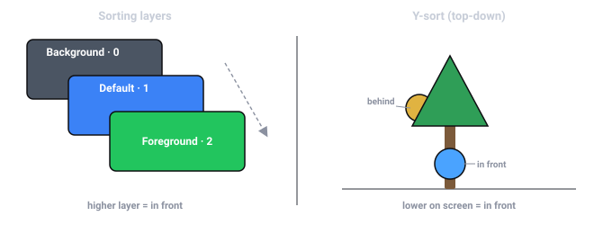
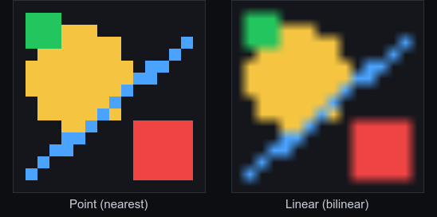
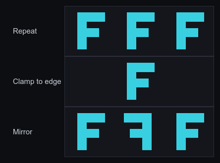

import { Aside } from '@astrojs/starlight/components';

The **`Sprite`** is the workhorse 2D renderer: an entity with a `Sprite` component
draws a textured quad in the world. For solid primitives without a texture there's
**`ShapeRenderer`**. Everything is drawn through a [Camera](/docs/guides/camera/), and
draw order is controlled by **sorting layers**.

## Your first sprite

A sprite needs a `Transform` (where it is) and a `Sprite` (what it draws). Load a
texture through the [`Assets`](/docs/guides/assets/) resource and put its handle on the
sprite:

```typescript
import { defineSystem, Commands, Res, Query, Mut, Transform, Sprite, Assets } from 'esengine';

const spawnPlayer = defineSystem([Commands(), Res(Assets)], async (cmds, assets) => {
  const tex = await assets.loadTexture('textures/player.png');   // { handle, width, height }
  cmds.spawn()
    .insert(Transform, { position: { x: 0, y: 0, z: 0 } })
    .insert(Sprite, { texture: tex.handle, size: { x: tex.width, y: tex.height } });
});
```

`sprite.texture` is a texture **handle**, not a path — you get one from a loader
(`assets.loadTexture(ref)`). In the editor you don't write this: drag an image from the
Content Browser onto an entity, or set the Sprite's texture field in Details.

## Sprite fields

| Field | Default | Description |
|---|---|---|
| `texture` | `0` | Texture handle from a loader (`0` = untextured, draws a white quad). |
| `color` | `{1,1,1,1}` | Tint multiplied into the texture (white = unchanged). |
| `size` | `{100,100}` | Rendered size in world units. |
| `pivot` | `{0.5,0.5}` | Anchor point (0–1) the sprite rotates and scales about. |
| `layer` | `0` | Sorting layer — controls draw order (see below). |
| `flipX` / `flipY` | `false` | Mirror horizontally / vertically. |
| `material` | `0` | A custom [material](/docs/guides/material/) handle (`0` = the default sprite shader). |
| `lit` | `false` | Receive 2D lights with a flat normal — the one-flag path to lit sprites (a custom `material` overrides it). |
| `uvOffset` / `uvScale` | `{0,0}` / `{1,1}` | Sub-rectangle of the texture to show (for atlases / scrolling). |
| `tileSize` / `tileSpacing` | `{0,0}` | Repeat the texture across the sprite (`0` = no tiling). |
| `parallax` | `{1,1}` | Parallax scroll factor (see below). |
| `enabled` | `true` | Hide without removing the component. |

## Tint & transparency

`color` is an RGBA multiplier over the texture. White (`{1,1,1,1}`) draws it unchanged;
tint it, or fade it by lowering alpha:

```typescript
sprite.color = { r: 1, g: 0.4, b: 0.4, a: 1 };   // reddened
sprite.color = { r: 1, g: 1, b: 1, a: 0.5 };      // 50% transparent
```

`color` (and `size`) are **animatable** — key them in the
[Sequencer](/docs/guides/timeline/) for flashes and fades.

## Size & pivot

`size` is the quad's size in **world units**, independent of the texture's pixel
dimensions — set it to `{ tex.width, tex.height }` for 1:1, or anything else to scale.
Scale on the `Transform` multiplies on top of it. `pivot` is the normalized anchor
(0–1) the sprite rotates and scales about: `{0.5, 0.5}` is centered, `{0, 0}` is the
bottom-left corner, `{0.5, 0}` pins the bottom-center (handy for characters standing on
the ground).

## Units & coordinates

World units are **design pixels**. Dropping a texture into the viewport spawns a
sprite at the texture's pixel dimensions (`size = { tex.width, tex.height }`), and
the editor's cameras are authored so one world unit is one design pixel
(`orthoSize = designHeight / 2`). So `Sprite.size` is in design pixels, and `pivot`
is a normalized fraction of that size. The world is **Y-up** — positive Y is up on
screen — which is why `pivot: {0, 0}` is the **bottom-left** corner, not the top-left.

<Aside type="note">
  `Canvas.pixelsPerUnit` (default `100`) does **not** scale sprites — it's the
  **physics meter scale**: how many design pixels make one Box2D meter (see
  [Physics](/docs/guides/physics/)). A sprite's displayed size is `size` ×
  `Transform` scale, nothing else. The full units-and-spaces picture is in
  [Transforms](/docs/core-concepts/transforms/).
</Aside>

## Draw order & sorting layers

When sprites overlap, draw order decides what's on top. Order is set by the **sorting
layer** (`sprite.layer`) — a named layer list you define in **Project Settings →
Rendering**, so the inspector shows a dropdown of *Background*, *Default*, *Foreground*,
etc. instead of a raw number. Lower layers draw first (behind).



```typescript
sprite.layer = 0;   // e.g. "Background"
sprite.layer = 2;   // e.g. "Foreground" — drawn on top
```

<Aside type="tip">
  Sorting layers group things coarsely (background vs gameplay vs UI-in-world). For
  fine ordering *within* a layer, use the entity's `Transform` z position.
</Aside>

### Y-sort (top-down occlusion)

For top-down games, check a layer under **Project Settings → Rendering → Y-sorted
layers** and every sprite, shape, and text on that layer draws in world-Y order:
entities lower on screen draw on top, so a character walking below a tree appears in
front of it — no manual `layer` or z juggling.

<Aside type="note">
  Within a y-sorted layer, paint order wins over material batching — overlapping
  draws that alternate materials can't merge into one draw call. Keep y-sort to the
  gameplay layer(s) that need it.
</Aside>

## Flipping, atlases & scrolling

- **Flip** a sprite with `flipX` / `flipY` — e.g. face a character left or right without
  a separate texture.
- **Atlases**: show one cell of a packed sheet by setting `uvOffset` and `uvScale` to
  the cell's normalized rectangle. (For frame-by-frame animation, drive these from the
  [Animator](/docs/guides/animation/) instead of by hand.)
- **Scrolling**: animate `uvOffset` over time to scroll a texture (water, conveyor
  belts), and set `tileSize` to repeat it across a large sprite.

## Texture filtering & wrapping

How a texture is sampled is set **per texture handle**, not per sprite:



*The same tiny texture magnified ~15×. **Nearest** keeps texel edges hard (pixel
art); **Linear** interpolates between texels for a smooth look (the default).*

| Enum | Values | Meaning |
|---|---|---|
| `TextureFilter` | `Nearest`, `Linear` | Nearest = hard texel edges (pixel art); Linear = smooth interpolation (default). |
| `TextureWrap` | `Repeat`, `ClampToEdge`, `MirroredRepeat` | What UVs outside 0–1 sample — tiling repeats, clamp stretches the edge pixel. |

```typescript
import { TextureFilter, TextureWrap, setTextureFilter, setTextureWrap, setTextureParams } from 'esengine';

setTextureFilter(tex.handle, TextureFilter.Nearest);   // crisp pixel art
setTextureWrap(tex.handle, TextureWrap.Repeat);        // tile outside 0–1 UVs

// The two helpers above each reset the *other* params to their defaults
// (ClampToEdge / Linear). To set filter and wrap together, use the full form:
setTextureParams(tex.handle, TextureFilter.Nearest, TextureFilter.Nearest,
                 TextureWrap.Repeat, TextureWrap.Repeat);
```

`setTextureParams(textureId, minFilter, magFilter, wrapS, wrapT)` is the complete
surface — separate minification/magnification filters and per-axis wrap. `Repeat`
is what makes `tileSize` tiling and UV-scroll effects seamless.



*What each wrap mode does with UVs outside the 0–1 range (centre tile = the
texture): **Repeat** tiles it, **Clamp to edge** stretches the border pixel, and
**Mirror** flips every other copy.*

<Aside type="tip">
  For pixel art, `TextureFilter.Nearest` is half the story: it keeps **texels**
  crisp, but a camera at a fractional position still lands sprites between screen
  pixels and shimmers as it moves. Pair it with the camera's `pixelPerfect` flag,
  which snaps the (orthographic) camera to the pixel grid — see
  [Camera](/docs/guides/camera/).
</Aside>

## Parallax backgrounds

`parallax` scales how much a sprite moves relative to the camera: `1` moves with the
world, `0` locks it to the camera (a fixed backdrop), and values in between scroll
slower for depth. Layer a few sprites at `0.2`, `0.5`, `0.8` for a classic parallax
background.

## Custom materials & lighting

Assign `sprite.material` to draw the sprite with your own shader — a tint, a
dissolve, a distortion — see [Materials & Shaders](/docs/guides/material/).

To make a sprite respond to `Light2D` lights, the simplest path is to set
`sprite.lit = true` — no custom material needed (it's lit with a flat normal). For
normal maps or a fully custom look, use a **Lit-2D material** instead. Either way,
see [2D Lighting & Shadows](/docs/guides/lighting/).

### Sprite filters (outline, glow, drop shadow)

For the most common per-sprite effects you don't need to write a shader —
`SpriteFilter` builds a ready-made material you assign to `sprite.material`:

```typescript
import { SpriteFilter } from 'esengine';

sprite.material = SpriteFilter.createOutline({ color: { r: 1, g: 1, b: 1, a: 1 }, width: 2 });
sprite.material = SpriteFilter.createGlow();                        // warm outline preset
sprite.material = SpriteFilter.createDropShadow({ offsetX: 3, offsetY: 3, blur: 2 });
```

Tweak a live filter with `setOutlineColor` / `setOutlineWidth` /
`setShadowOffset` / `setShadowBlur` (selection pulses, hit flashes). Each call
creates a material — share one handle across sprites that use the same look, and
pass `texelSize: { x: 1/texWidth, y: 1/texHeight }` for exact pixel widths on
textures that aren't 512×512.

## Shapes without a texture

For solid circles, capsules, and rounded rectangles — placeholders, bars, debug
overlays — use **`ShapeRenderer`** instead of a texture (`ShapeType.Circle`,
`Capsule`, or `RoundedRect`):

```typescript
import { ShapeRenderer, ShapeType } from 'esengine';

cmds.spawn()
  .insert(Transform, { position: { x: 0, y: 0, z: 0 } })
  .insert(ShapeRenderer, {
    shapeType: ShapeType.RoundedRect,
    size: { x: 200, y: 80 },
    cornerRadius: 12,
    color: { r: 0.2, g: 0.6, b: 1, a: 1 },
  });
```

`ShapeRenderer` shares the sorting `layer` and `color` conventions with `Sprite`.

## Motion trails

**`TrailRenderer`** draws a world-space ribbon along an entity's recent path —
sword swipes, dashes, projectile streaks. Add the component and move the entity;
the engine records the position history and renders the taper for you:

```typescript
cmds.spawn()
  .insert(Transform, { position: { x: 0, y: 0, z: 0 } })
  .insert(TrailRenderer, { time: 0.4, startWidth: 24, blendMode: 1 });  // additive glow
```

| Field | Default | Description |
|---|---|---|
| `time` | `0.5` | Seconds each trail point lives before fading out of the tail. |
| `minVertexDistance` | `5` | Min world distance moved before a new point is recorded (`0` = every frame). |
| `emitting` | `true` | `false` freezes emission — the streak detaches and fades in place. |
| `startWidth` / `endWidth` | `20` / `0` | Ribbon width at the head / tail (`0` tapers to a line). |
| `startColor` / `endColor` | white / white α 0 | Color lerped head → tail; tail alpha 0 is the fade-out. |
| `texture` | `0` | Texture along the ribbon (U runs head→tail); `0` = vertex colors only. |
| `blendMode` | `0` | `0` Normal, `1` Additive (glow), `2` Multiply. |
| `layer` / `material` | `0` / `0` | The usual sorting layer / custom material. |

The `Trail` resource (`Res(Trail)`) adds `clear(entity)` to drop an entity's
history instantly — e.g. when teleporting, so the trail doesn't streak across the
map.

## Bitmap text in the world

**`BitmapText`** renders world-space text from a prebaked bitmap font — damage
numbers, name tags, retro UI. Point `font` at a **BMFont** asset (`.fnt` text or
`.bmfont` JSON) and set `text`:

| Field | Default | Description |
|---|---|---|
| `text` | `''` | The string to draw. |
| `font` | `0` | The bitmap-font asset (`.fnt` / `.bmfont`). |
| `fontSize` | `1` | Scale over the font's authored size. |
| `align` | `Left` | `Left` / `Center` / `Right`. |
| `spacing` | `0` | Extra per-character spacing. |
| `color` | `{1,1,1,1}` | Tint — animatable (flash a damage number). |
| `layer` / `parallax` | `0` / `{1,1}` | Same sorting layer / parallax semantics as `Sprite`. |

For screen-space UI text (layout, wrapping, SDF sharpness), use the UI `Text`
widget instead — see [UI](/docs/guides/ui/).

## Hit-testing sprites

"Did the click land on this sprite?" is two steps: convert the screen point to
world space, then test it against the sprite's rectangle. The `CameraView`
resource does the first (see [Camera](/docs/guides/camera/)); for the second the
SDK exports pivot-aware point tests:

| Function | Tests |
|---|---|
| `pointInWorldRect(px, py, worldX, worldY, worldW, worldH, pivotX, pivotY)` | An axis-aligned rectangle placed by position + pivot (a sprite's exact footprint when unrotated). |
| `pointInOBB(…, rotationZ, rotationW)` | The same rectangle **rotated** — pass the transform quaternion's `z`/`w`; falls back to the rect test when unrotated. |
| `pointInHitArea(px, py, area)` | A custom `HitAreaShape` — `rect`, `circle`, or `polygon`. |

```typescript
import { defineSystem, Query, Res, CameraView, Input, Transform, Sprite, pointInOBB } from 'esengine';

const clickSprites = defineSystem(
  [Query(Transform, Sprite), Res(CameraView), Res(Input)],
  (q, view, input) => {
    if (!input.isMouseButtonPressed(0)) return;
    const p = view.screenToWorld(input.mouseX, input.mouseY);
    if (!p) return;
    for (const [entity, t, s] of q) {
      const w = s.size.x * t.worldScale.x, h = s.size.y * t.worldScale.y;
      if (pointInOBB(p.x, p.y, t.worldPosition.x, t.worldPosition.y,
                     w, h, s.pivot.x, s.pivot.y,
                     t.worldRotation.z, t.worldRotation.w)) {
        console.log('hit', entity);
      }
    }
  });
```

For sprites whose clickable region isn't their rectangle — an irregular character,
a donut-shaped button — describe the region as a `HitAreaShape` in sprite-local
coordinates and test the localized point:

```typescript
import { pointInHitArea, type HitAreaShape } from 'esengine';

const hull: HitAreaShape = { type: 'polygon', points: [0, 0, 64, 0, 64, 48, 32, 64, 0, 48] };
// For an unrotated sprite, localize by subtracting its origin:
const hit = pointInHitArea(p.x - t.worldPosition.x, p.y - t.worldPosition.y, hull);
```

`screenToWorld` is also exported standalone (it takes an inverse view-projection
matrix and a viewport rectangle) for code that manages its own camera math — the
`CameraView` resource is the same function with the active camera filled in. For
interactive **UI**, don't hand-roll any of this: `Interactable` + `UIEvents` do
picking for you (see [UI](/docs/guides/ui/)).

## Cache as bitmap

**`CacheAsBitmap`** supports rendering an entity's expensive content **once** into
an offscreen texture and drawing that single quad afterwards — the classic
cache-as-bitmap trade: GPU memory (`width × height` RGBA) for per-frame draw cost.
It pays when content is costly to draw every frame (many vector paths, lots of
text or shapes) but **rarely changes**; it does nothing for you if the content
changes every frame — you'd re-render the cache each time *and* pay the extra blit.

| Field | Default | Description |
|---|---|---|
| `enabled` | `true` | Whether caching is active for this entity. |
| `dirty` | `true` | Set `true` to request a re-render of the cache. |
| `width` / `height` | `256` | Cache texture size in pixels. |

The component is the **bookkeeping half** — the SDK does not ship a system that
walks the scene and caches subtrees automatically. You drive the refresh with the
exported helpers: a per-entity cache store (`getCacheForEntity`,
`setCacheForEntity`, `removeCacheForEntity`, `clearAllCaches`) and `CacheBitmap`,
a thin render-target wrapper (`create`, `beginDraw`/`endDraw`, `resize`,
`release`):

```typescript
import { CacheBitmap, getCacheForEntity, setCacheForEntity, Draw } from 'esengine';

// Refresh (only when dirty):
let cache = getCacheForEntity(entity);
if (!cache) {
  cache = CacheBitmap.create(512, 256);
  setCacheForEntity(entity, cache);
}
CacheBitmap.beginDraw(cache, viewProjection);   // an ortho matrix framing the content
// … draw the expensive content once, with Draw / Graphics …
CacheBitmap.endDraw();

// Every frame thereafter: one textured quad instead of the whole redraw.
Draw.texture(pos, { x: 512, y: 256 }, cache.textureId);
```

`cache.textureId` is an ordinary texture handle — it also works as a
`Sprite.texture`. Under the hood this is a [RenderTexture](/docs/guides/drawing/)
without a depth buffer.

## In the editor

- **Create → Sprite** adds a sprite entity, or **drag an image** from the Content
  Browser into the viewport to spawn one already textured.
- Every field above is editable in **Details**; sprites, cameras, and lights show as
  gizmos in the viewport. See [The Editor](/docs/guides/editor/).

## See also

- [Animation](/docs/guides/animation/) — sprite-sheet flipbooks and tweened properties.
- [Custom Drawing](/docs/guides/drawing/) — meshes and immediate-mode shapes beyond sprites.
- [2D Lighting & Shadows](/docs/guides/lighting/) — normal maps and per-sprite lighting.
