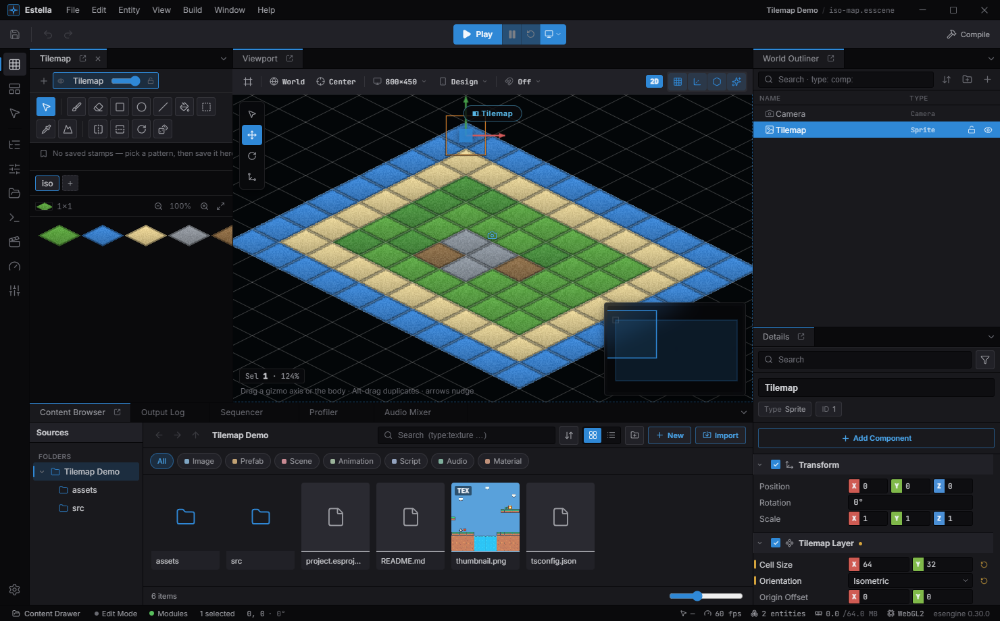
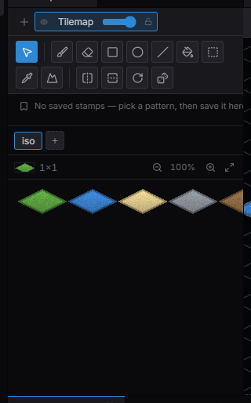
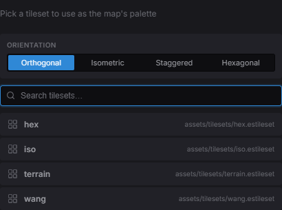
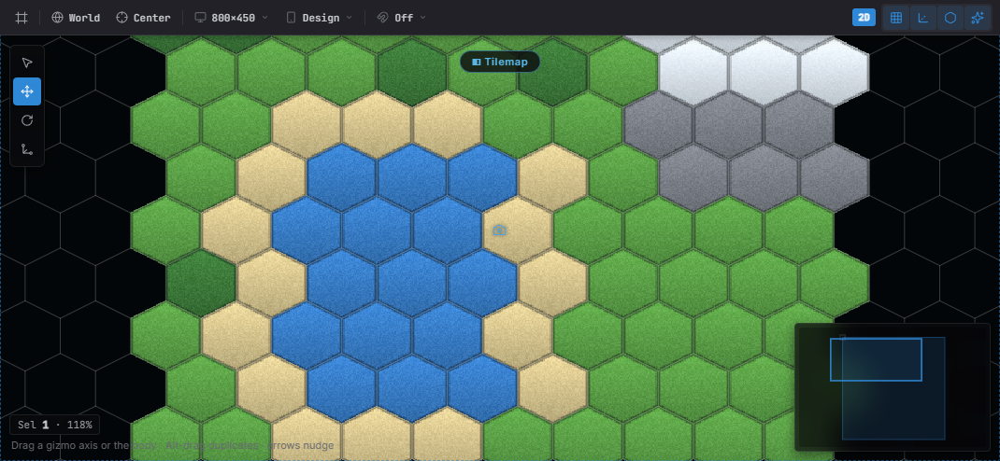
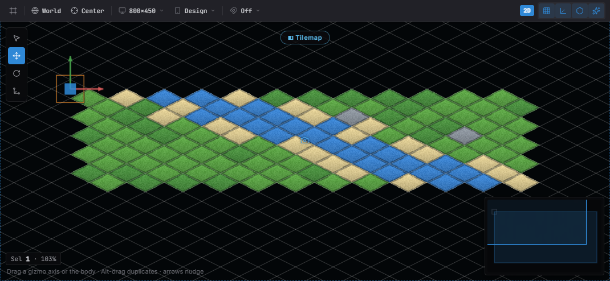
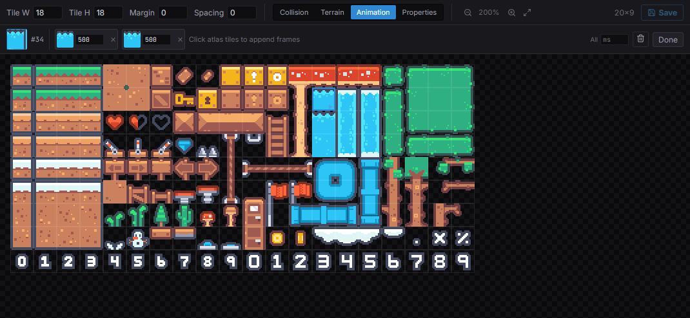
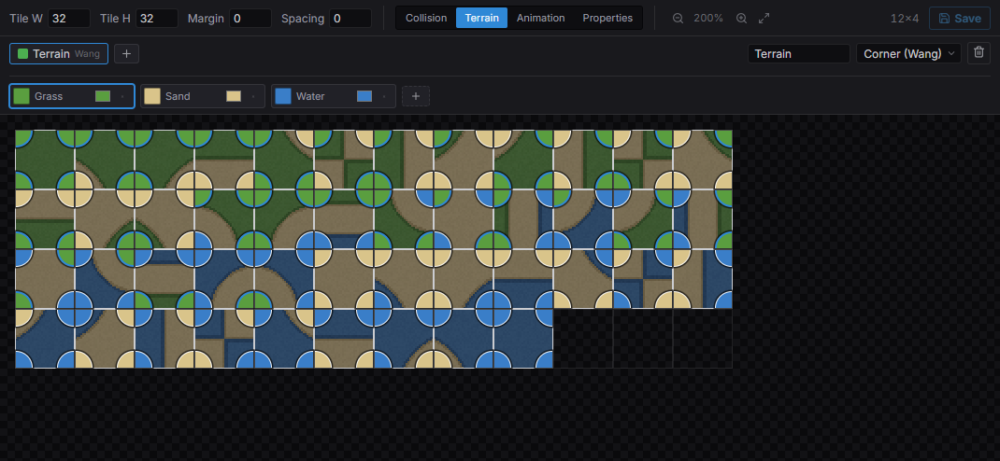
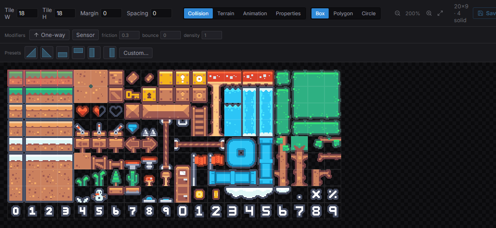

import { Aside } from '@astrojs/starlight/components';

Estella renders tile layers in the C++/WebAssembly core, batched per tileset
texture and stored in chunks. Paint levels directly in the editor, load a whole
map from a [Tiled](https://www.mapeditor.org/) file with the `Tilemap` component,
or build and edit layers yourself with the `Tilemaps` resource — including
multi-tileset layers, per-tile animation, and infinite streaming maps.

## How it works

There are three entry points. The editor's **Tilemap painter** authors layers
visually, backed by a `.estileset` tileset asset. The **`Tilemap`** component
points an entity at a Tiled JSON file and, at load, spawns one **`TilemapLayer`**
entity per layer. The **`Tilemaps`** resource is the imperative API for creating
and editing layers from code. Every way the data ends up in the same runtime
layer model. Tile ids are **1-based** (`0` = empty). **Orthogonal, isometric,
staggered, and hexagonal** maps are all first-class — author any orientation
natively in the editor, or import it from a Tiled file with no extra setup.

## Paint in the editor



*Select a `TilemapLayer` and the **Tilemap painter** opens on the left — tools on top, the tileset palette below. Paint straight into the viewport.*

Select an entity with a `TilemapLayer` component and the **Tilemap painter**
panel opens with the tileset palette. Pick a tool and paint directly in the
viewport — a stamp ghost previews every stroke:

| Tool | Key | What it does |
|---|---|---|
| Brush | `B` | Paint the current stamp; drag for strokes. `Alt`+click eyedrops. |
| Erase | `E` | Clear tiles. |
| Rectangle | `U` | Fill a dragged rectangle with the stamp pattern. `Shift` squares it, `Alt` paints the outline only. |
| Ellipse | `O` | Drag a bounding box, fill its inscribed ellipse. `Shift` makes a circle, `Alt` a ring. |
| Line | `L` | Lay the stamp along a straight line. `Shift` constrains to horizontal / vertical / 45°. |
| Bucket | `G` | Flood-fill the connected region of matching tiles. |
| Select | `M` | Marquee a region — `mod + C` / `X` copy / cut it, `Delete` clears it, `mod + V` pastes it as the brush; **drag from inside the marquee to move the block** (one undo step, `Esc` cancels). |
| Eyedropper | `I` | Pick the stamp from tiles already on the layer. |
| Terrain | `T` | Autotile brush — paints a terrain and fixes up the neighbors. |

While a paint tool is active, `H` / `V` flip the stamp and `R` rotates it 90°.
`Q`, `W`, or `Esc` leave paint mode and hand the keys back to the transform tools.



*The painter panel up close: the tool row (brush, erase, rectangle, ellipse, line, bucket, select, eyedropper, terrain), the active tileset tab, and the tile palette you stamp from.*

- **Multi-tile stamps** — drag across the palette to grab a block of tiles as one
  stamp. The palette is keyboard-friendly too: **arrow keys** move the selection,
  **Shift + arrows** grow it into a stamp.
- **Saved stamps** — the bookmark button below the tools saves the current brush
  into a per-project stamp library; click a chip to bring a pattern back, `×`
  deletes it. Identical patterns deduplicate.
- **Random mode** — toggle the dice button (or press `D` while painting) and each
  painted cell samples one tile at random from the stamp instead of repeating the
  pattern — quick scatter for grass, rubble, and other variation. Sampling honors
  each tile's **probability** weight from the tileset editor's Properties mode
  (default 1; 0 = never scattered).
- **Layer strip** — when the scene has several tilemap layers, a strip at the top
  of the panel switches the active layer and toggles per-layer visibility and
  lock; **drag a layer chip** to reorder layers.

## Map orientations

Orientation is a property of each `TilemapLayer`, not an import artifact. The
**New Tilemap** dialog picks it up front — orthogonal, **isometric** (diamond),
**staggered** (staggered-isometric), or **hexagonal** — along with the stagger
axis/index and hex side length where they apply, and the Inspector edits the
same fields afterwards. The viewport follows the layer: the grid overlay,
brush ghost, hover/selection highlights, and every paint tool work on the
diamond or hex grid exactly as they do on squares.



*The **New Tilemap** dialog picks the orientation and the tileset up front.*

The same map painted on a hexagonal and a staggered grid:



*Hexagonal — the grid, brush ghost, and every tool follow the hex layout.*



*Staggered isometric — alternate rows shift by half a cell.*

| `TilemapLayer` field | Values | Description |
|---|---|---|
| `orientation` | Orthogonal / Isometric / Staggered / Hexagonal | Grid layout of the layer. |
| `staggerAxis` | Y / X | Staggered & hex: `Y` shifts alternate rows, `X` shifts alternate columns. |
| `staggerIndex` | Odd / Even | Which rows/columns carry the half-cell shift. |
| `hexSideLength` | px | Hexagonal only: flat side length (`0` = regular pointy hex, `tileHeight / 2`). |

Tiled maps of any orientation import into the same fields — including staggered
maps' `staggeraxis` / `staggerindex`, so an imported staggered map places tiles
exactly as Tiled shows it. `examples/` ships three painted showcases: an
isometric island, a staggered patchwork, and a pointy-top hex strategy map.

## Load a Tiled map

The `Tilemap` component loads a `.tmj` map (Tiled's JSON format — in Tiled, use
*File → Export As → JSON*) via its one field:

```typescript
import { defineSystem, Commands, Tilemap } from 'esengine';

const loadLevel = defineSystem([Commands()], (cmds) => {
  cmds.spawn().insert(Tilemap, { source: 'assets/maps/level.tmj' });
});
```

| `Tilemap` field | Type | Default | Description |
|---|---|---|---|
| `source` | asset | `''` | The Tiled map file (`tilemap` asset). |

Grid tilesets (one atlas image), external `.tsj` tilesets, and **image-collection
tilesets** (Tiled's "collection of images" — one loose image per tile) all load.
Collection tiles are folded into a single grid atlas at load time, so they render
exactly like a hand-authored tileset; each image must match the map's tile size
(anything else fails loud with the fix).

## The `TilemapLayer` component

Each layer (loaded from Tiled, or spawned by you) carries its visual metadata. The
renderer reads these live, so animating `tintColor` / `opacity` is lag-free.

| Property | Type | Default | Description |
|---|---|---|---|
| `cellSize` | Vec2 | `{32, 32}` | Tile size in world units. |
| `originOffset` | Vec2 | `{0, 0}` | Layer origin offset. |
| `tileset` | asset | none | Tileset texture (single-tileset layers). |
| `tilesetColumns` | number | `1` | Columns in the tileset atlas. |
| `tilesetRows` | number | `1` | Rows in the tileset atlas. |
| `renderLayer` | number | `0` | Sorting layer for draw order. |
| `tintColor` | Color | `{1,1,1,1}` | Multiplied over every tile. Animatable. |
| `opacity` | number | `1` | Layer transparency, 0..1. Animatable. |
| `parallaxFactor` | Vec2 | `{1, 1}` | Parallax scroll factor relative to the camera. |
| `visible` | boolean | `true` | Show / hide the layer. |

Plus the [orientation fields](#map-orientations) above — `orientation`,
`staggerAxis`, `staggerIndex`, `hexSideLength`.

## Build a layer in code

Spawn an entity, initialise a layer, then fill it:

```typescript
import { defineSystem, Commands, Res, Transform, Tilemaps } from 'esengine';

const build = defineSystem([Commands(), Res(Tilemaps)], (cmds, tilemap) => {
  const layer = cmds.spawn().insert(Transform, { position: { x: 0, y: 0, z: 0 } }).id();

  tilemap.initLayer(layer, 32, 32, 16, 16);           // 32×32 tiles, 16px cells
  tilemap.setTiles(layer, new Uint16Array(32 * 32));  // bulk load
  tilemap.setTile(layer, 5, 3, 7);                    // one tile (x, y, id)
  tilemap.fillRect(layer, 0, 0, 32, 1, 2);            // a row of tile 2
});
```

## Editing & transforms

```typescript
tilemap.getTile(layer, 5, 3);                       // read a tile id
tilemap.flipTile(layer, 5, 3, true, false, false);  // flipH, flipV, flipDiagonal
tilemap.rotateTile(layer, 5, 3, 90);                // degrees
tilemap.tileToWorld(layer, 5, 3, 0, 0);             // → { x, y }
tilemap.worldToTile(layer, wx, wy, 0, 0);           // → { x, y }
```

## Multiple tilesets

One layer can draw from several tilesets. Give it a slot table — each slot maps a
`firstId` range to a texture and its column count (one draw call per texture):

```typescript
tilemap.setTilesets(layer, [
  { firstId: 1,   textureHandle: grassTex, columns: 8 },
  { firstId: 256, textureHandle: propsTex, columns: 8, margin: 4, spacing: 8 },
]);
```

Optional `margin` (border before the first tile) and `spacing` (gap between tiles),
both in pixels, describe atlases that pad their cells — each tile then samples its
own texels instead of bleeding toward its neighbour. They default to `0`, so a
gapless atlas needs neither; the Tiled/`.estileset` importer fills them in
automatically from the tileset's own margin/spacing.

## Tile animation

Author animated tiles in the **Tileset editor**: open the `.estileset`, switch the
mode control to **Animation**, click the tile to animate, then click other atlas
tiles to append frames. A strip below the toolbar shows a live looping preview,
per-frame duration inputs (in milliseconds), and remove/clear actions; animated
tiles carry a ▶ mark in the atlas. The frames are saved into the `.estileset`, and
every layer that uses the tileset plays them automatically — in the editor viewport
and at runtime, no code required.



*Animation mode: pick a tile (here #34), click atlas tiles to append frames, and set each frame's duration in ms. The strip loops as a live preview.*

For procedural layers, `setTileAnimation` does the same from code — the plugin
advances it every frame:

```typescript
tilemap.setTileAnimation(layer, 10, [
  { tileId: 10, duration: 100 },   // durations in ms
  { tileId: 11, duration: 100 },
]);
```

## Infinite (chunked) maps

For large or streaming worlds, use an infinite layer and write chunk by chunk;
`exportChunks` / `importChunks` serialize the sparse chunk data:

```typescript
tilemap.initInfiniteLayer(layer, 16, 16);
tilemap.setChunkTiles(layer, chunkX, chunkY, tiles, 32, 32);
```

## Terrain autotiling



*Terrain mode with a **corner-Wang** set: define terrain colors (Grass / Sand / Water), then paint each tile's corners — the `T` brush later resolves the right tile from the neighbours.*

Terrains make the `T` brush paint *meaning* instead of specific tiles — you say
"grass here" and the resolver picks the tile whose edges match the neighbors.
Author terrains in the **Tileset editor**'s Terrain mode; a terrain set uses one
of two models:

- **Peering (edge / corner-blob)** — the classic single-terrain model: each tile
  declares which of its edges (16-tile sets) or edges + corners (47-tile blob
  sets) belong to the terrain, and the brush paints the terrain while fixing up
  neighbor transitions.
- **Corner Wang (multi-terrain)** — the modern model from Tiled/Godot: the set
  carries a palette of **colors** (grass, sand, water, …) and each tile assigns
  a color to its four **corners**. One set blends many terrains, and the brush
  paints colors on a **half-cell corner grid** — click between four tiles and
  the resolver re-tiles all of them by exact corner match (nearest-mismatch
  fallback), producing smooth marching-squares boundaries. The tileset editor
  authors the color palette (add / rename / recolor / remove) and the per-tile
  corners: each quarter of a tile is the click target for its corner — click or
  drag a stroke to paint the active color, right button erases — and the
  painter lists the colors to paint with.

The painter's terrain brush dispatches on the set's model automatically. A
blended-island corner-Wang demo ships in `examples/`.

## Tilesets & collision

The engine's first-class tileset asset is **`.estileset`** — it references an atlas
texture and carries per-tile collision, animation, terrain/auto-tile data, and
custom key/value properties.



*The **Tileset editor**'s Collision mode: pick a shape (**Box / Polygon / Circle**), toggle **one-way / sensor** and set friction / bounce / density, drop **slope** presets — the green overlay marks each tile's collider.*

Per-tile collision goes well beyond solid squares. In the tileset editor's
**Collision** mode you author, per tile:

- **Shapes** — full-cell **box** (drag-paints), fitted **circle** (drag-paints),
  or a freeform **polygon** via the vertex editor; one-click **slope / half-tile
  presets** stamp the common ramps (drag to stamp a run of them).
- **Modifiers**, riding on whatever shape you paint: **one-way** (jump-through
  platforms with a solid-top normal), **sensor** (overlap events, no contact
  response), and physics-material overrides (**friction / bounce / density**).

Plain solid boxes are greedy-merged into large static colliders at spawn; shaped,
one-way, sensor, and material tiles spawn one collider each, with tile flip flags
reorienting the geometry to match the rendering. The scene viewport draws the
selected layer's whole collision as an overlay (Show Flags → tile collision) —
WYSIWYG with what Play spawns.

Tiled maps get the same treatment: shapes drawn in **Tiled's tile collision
editor** (rectangles, ellipses, polygons) import into the identical model — a
full-cell rectangle stays a merge-eligible solid box, everything else spawns
one collider per tile — and the tile properties `oneway` / `sensor` /
`friction` / `restitution` / `density` apply the same modifiers. The legacy
`collision=true` tile property still marks a plain solid box.

<Aside type="note">
  Tile **collision is play-mode only**: static colliders are spawned from the
  `.estileset`'s per-tile collision when the scene runs — they are never in the
  edit world or serialized.
</Aside>

## Object layers

Tiled **object layers** (spawn points, triggers, region shapes) load with the map.
Query them by the map's source path with `getTilemapSource` — each group carries its
objects with position, size, `type` (Tiled's class), `shape`, and custom `properties`:

```typescript
import { getTilemapSource } from 'esengine';

const src = getTilemapSource('assets/maps/level.tmj');
for (const group of src?.objectGroups ?? []) {
  for (const obj of group.objects) {
    if (obj.type === 'spawn') spawnPlayer(obj.x, obj.y);
  }
}
```

Objects that carry a tile reference (a **gid** — tiles stamped onto an object layer
in Tiled) render as sprite children of the map, honoring Tiled's horizontal,
vertical, **and diagonal** flip flags.

An object group whose name is `collision` (case-insensitive) or that carries a
`collision=true` property also **spawns static colliders in play mode** — rectangles,
ellipses, polygons, and polylines become the matching Box2D shape, on the same
origin / pixels-per-unit / play-mode lifecycle as tile collision.

<Aside type="note">
  Object collision, like tile collision, is **play-mode only** and never serialized
  into the edit world.
</Aside>

## `Tilemaps` API reference

| Method | Description |
|---|---|
| `initLayer(layer, cols, rows, tileW, tileH)` | Create a fixed-size layer. |
| `initInfiniteLayer(layer, tileW, tileH)` | Create a chunked, unbounded layer. |
| `setTiles(layer, Uint16Array)` | Bulk-load a fixed layer's tiles. |
| `setTile(layer, x, y, id)` / `getTile(layer, x, y)` | Write / read one tile. |
| `fillRect(layer, x, y, w, h, id)` | Fill a rectangle with a tile id. |
| `flipTile(layer, x, y, h, v, d)` | Flip a tile (horizontal / vertical / diagonal). |
| `rotateTile(layer, x, y, degrees)` | Rotate a tile (90° steps). |
| `tileToWorld(layer, tx, ty, ox, oy)` / `worldToTile(layer, wx, wy, ox, oy)` | Convert coordinates. |
| `setTilesets(layer, slots)` | Assign a multi-tileset slot table. |
| `setTileAnimation(layer, tileId, frames)` | Animate a tile id. |
| `setChunkTiles(layer, cx, cy, tiles, w, h)` | Write a chunk (infinite layers). |
| `exportChunks(layer)` / `importChunks(layer, data)` | Serialize / restore chunk data. |
| `setTint(layer, color)` / `setVisible(layer, on)` / `setRenderProps(...)` | Live visual overrides. |
| `setTileProperty(...)` / `getTileProperty(...)` | Per-tile custom key/value properties. |
| `setGridType(layer, type)` / `setHexParams(...)` | Orientation (orthogonal / isometric / hex). |
| `destroyLayer(layer)` | Tear a layer down. |

Tile **collision queries** run against the resolved collision data (no physics
raycast needed): `tileCollisionAt(layer, x, y)` returns the tile's resolved
shape + modifiers (or null), `isTileSolid(layer, x, y)` is true for any
non-sensor collision (one-way platforms count — check `.oneWay` to treat them
specially), and `tileCollisionAtWorld(...)` addresses in world pixels.

## Best practices

- **Paint hand-authored levels in the editor** (or import from Tiled with
  `Tilemap` + `.tmj`); use the `Tilemaps` API for procedural or runtime-generated
  maps.
- **Batch by tileset**: fewer tileset textures per layer = fewer draw calls; atlas
  your tiles.
- **Use `setTiles` / `setChunkTiles`** for bulk writes instead of per-tile `setTile`
  in a loop.
- **Infinite layers** for streaming worlds; write only the chunks near the player.
- Author **collision and tile animation in the `.estileset`** so they stay data-driven
  and survive re-imports.

## See also

- [Physics](/docs/guides/physics/) — tile colliders participate in the physics world.
- [Assets](/docs/guides/assets/) — loading `.tmj` maps and `.estileset` tilesets.
- [Scenes](/docs/guides/scene/) — tilemap layers serialize with the scene.
