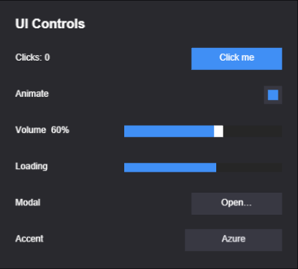

import { Aside } from '@astrojs/starlight/components';

The widget factories build common controls out of the [UI](/docs/guides/ui/) component
model (`UINode` + `Interactable` + a `$interaction`
[controller with gears](/docs/guides/ui-controllers/)), so you don't wire
each one by hand. Each factory takes an options object and returns a **handle** —
always with `entity` and `dispose()`, plus imperative methods to read and drive it.

Interactive widgets need the world and the UI event queue — `world` from `GetWorld()`
and `events` from `Res(UIEvents)`, exactly as in the [UI guide](/docs/guides/ui/). They
all accept `parent?`, a `node?` ([`UINode`](/docs/guides/ui-layout/) layout — **default:
fill the parent**), and visual overrides; visual defaults come from the active
[theme](/docs/guides/ui-theme/)'s roles and re-resolve on a live theme swap.
Interactive widgets are **keyboard-reachable by default**: they carry a `Focusable`,
so Tab reaches them, Enter/Space clicks them, and arrow keys drive sliders — opt out
with `focusable: false`.

<Aside type="tip">
  These are a convenient starting point, not a closed set — a widget is just an entity
  tree with the UI components on it, so you can compose your own the same way.
</Aside>

<Aside type="note">
  For **shared** state across many elements — tabs, radio groups, show/hide panels, or
  custom button states driven from data — reach for
  [UI Controllers](/docs/guides/ui-controllers/): a named "page" state plus declarative
  per-page field bindings, authorable in the editor.
</Aside>



*The built-in widgets (from the `ui-controls` example): a **Button**, a **Toggle**, a
**Slider**, a **Progress** bar, and buttons that open a **Dialog** and cycle an accent
color — each a plain entity tree with the UI components on it.*

## Button

`createButton(opts)` spawns a clickable entity (with an optional child label) that
transitions between visual states. Returns a `ButtonHandle`. A click is a
press-then-release *over* the button — or Enter/Space while it has keyboard focus.

```typescript
import { createButton } from 'esengine';

const btn = createButton({
  world, events, parent,
  text: 'Play',
  node: { width: px(160), height: px(44) },
  states: {
    normal:  { color: { r: 0.20, g: 0.55, b: 1.0, a: 1 } },
    hover:   { color: { r: 0.30, g: 0.65, b: 1.0, a: 1 } },
    pressed: { color: { r: 0.12, g: 0.45, b: 0.9, a: 1 } },
    disabled:{ color: { r: 0.3, g: 0.3, b: 0.3, a: 1 } },
  },
  onClick: (entity) => { /* … */ },
});
```

| Option | Default | Description |
|---|---|---|
| `node` | fill the parent | The button's `UINode` layout. |
| `text` | none | Label — a string or a `TextInit`. Omit for no label. The label color/size default to the theme's `text` role and label type size. |
| `states` | theme control roles | Map of state name (`normal` / `hover` / `pressed` / `disabled` / `focused`) → color / sprite / scale override. Custom names (e.g. `'loading'`) are allowed. |
| `background` | solid white | Background visual (a `UIVisualInit`). |
| `fadeDuration` | `0` (snap) | Tween time for color/scale state changes; sprite swaps always snap. |
| `disabled` | `false` | Start disabled. |
| `focusable` / `tabIndex` | `true` / `0` | Keyboard reachability and Tab order. |
| `onClick(entity)` | — | Click callback (gated on the enabled state). |

**Handle:** `entity`, `setDisabled(disabled)`, `dispose()`.

The theme-default states are also exported as `themeButtonStates()` — spread and
override them instead of restating all five. Flip a custom state later with
`setButtonState(world, handle.entity, 'loading')`; the pointer driver leaves any
non-canonical page alone until you switch back.

## Toggle

`createToggle(opts)` composes a button with an on/off check indicator. Returns a
`ToggleHandle`.

```typescript
import { createToggle } from 'esengine';

const toggle = createToggle({
  world, events, parent,
  interactionStates: { normal: { color: /* … */ }, hover: { /* … */ }, pressed: { /* … */ } },
  check: { color: { r: 0.2, g: 0.8, b: 0.4, a: 1 } },   // the "on" indicator
  isOn: true,
  onChange: (isOn, entity) => { /* … */ },
});

toggle.setValue(false);     // programmatic change (fires onChange)
```

| Option | Default | Description |
|---|---|---|
| `node` / `background` | fill the parent / solid white | Frame layout + background, as in `createButton`. |
| `interactionStates` | theme control roles | Frame visual states (like the button's `states`). |
| `check` | theme `primary` fill | The on-state indicator: `{ node?, color?, sprite? }`, a child shown when on. Fills the frame by default — inset it via `check.node`. |
| `isOn` | `false` | Initial state. |
| `disabled` | `false` | Start disabled. |
| `focusable` / `tabIndex` | `true` / `0` | Keyboard reachability. |
| `onChange(isOn, entity)` | — | Fires on toggle. |

**Handle:** `getValue()`, `setValue(value)`, `setDisabled(disabled)`, `entity`, `dispose()`.

<Aside type="note">
  State lives in a **`UIToggle` component**; the behavior system flips it on click
  and is the single writer of the check visual — `setValue`, a binding, or the
  editor inspector on a placed prefab all flip the indicator and fire `change`
  identically.
</Aside>

## Slider

`createSlider(opts)` builds a track + fill + handle. Returns a `SliderHandle`.
Input is built in: **drag** anywhere on the track (press captures until release),
or focus it and use **arrow keys** (`step`, or 1% of the range when continuous),
**Home**/**End**.

```typescript
import { createSlider } from 'esengine';

const slider = createSlider({
  world, events, parent,
  min: 0, max: 100, value: 50, step: 5,
  onChange: (value) => { /* … */ },
});

slider.setValue(75);
```

| Option | Default | Description |
|---|---|---|
| `node` | fill the parent | The track's `UINode` layout. |
| `min` / `max` | `0` / `1` | The range. |
| `value` | `min` | Initial value (clamped and step-quantized). |
| `step` | `0` (continuous) | Quantization step. Also the keyboard nudge. |
| `handleWidth` | `12` | Thumb width in pixels. |
| `disabled` / `focusable` / `tabIndex` | `false` / `true` / `0` | Interactivity + keyboard reachability. |
| `trackVisual` / `fillVisual` / `handleVisual` | theme `track` / `primary` / `onPrimary` | Per-part visuals. |
| `onChange(value, entity)` | — | Fires on value change — from input, `setValue`, or any other writer. |

**Handle:** `getValue()`, `setValue(v)`, `dispose()`, plus `entity` /
`trackEntity` (the same entity) / `fillEntity` / `handleEntity`.

<Aside type="note">
  The state lives in a **`UISlider` component** on the track entity; the behavior
  system is the single writer of the visuals. Anything that writes `UISlider.value` —
  the pointer, the keyboard, `setValue`, the editor inspector on a placed prefab —
  moves the fill and thumb and fires `change` identically.
</Aside>

## Progress

`createProgress(opts)` is a non-interactive fill bar. Returns a `ProgressHandle`.
It takes no `events` — nothing to interact with.

```typescript
import { createProgress } from 'esengine';

const bar = createProgress({
  world, parent,
  direction: 'right',
  fill: { color: { r: 0.2, g: 0.8, b: 0.4, a: 1 } },
  value: 0,
});

bar.setValue(0.6);   // 0..1

// Radial gauge (cooldown / ring meter) — a clockwise wedge from 12 o'clock:
const ring = createProgress({ world, parent, radial: true, value: 0.75 });
```

| Option | Default | Description |
|---|---|---|
| `node` | fill the parent | The track's `UINode` layout. |
| `value` | `0` | Initial progress, `0..1` (clamped). |
| `direction` | `'right'` | Linear fill growth: `'right'`, `'left'`, `'up'`, `'down'`. |
| `radial` | `false` | Radial gauge instead of a bar — a clockwise wedge sweeping the full circle. Ignores `direction`. |
| `background` | theme `track` | Track visual (a `UIVisualInit`). |
| `fill` | theme `primary` | The filled bar: `{ color?, sprite? }`. |

**Handle:** `getValue()`, `setValue(v)`, `dispose()`, plus `entity` / `fillEntity`.

<Aside type="note">
  **One fill primitive.** A progress bar is a single [`UIVisual`](/docs/guides/ui/) in
  **`Filled`** mode — the same primitive the slider's fill is built on, mirroring Unity's
  "health bar = Filled Image". `setValue()` writes `fillAmount`, so the fill is a
  render-time crop with **no per-frame layout pass**, and a sprite fill *reveals* along
  the axis instead of stretching. `direction` resolves to the `Filled` crop axis and
  anchor edge through the shared `FILL_AXIS` table, so progress, slider, and any other
  Filled-based widget fill identically.
</Aside>

## Dropdown

`createDropdown(opts)` shows the current selection and opens a popup of option rows.
It's generic over the option type. Returns a `DropdownHandle<T>`.

```typescript
import { createDropdown } from 'esengine';

const dd = createDropdown({
  world, events, parent,
  options: ['Low', 'Medium', 'High'],
  selectedIndex: 1,
  onSelect: (index, option) => { /* … */ },
});

// Objects need a label mapper:
createDropdown({
  world, events, parent,
  options: resolutions,                       // e.g. { w, h }[]
  optionToLabel: (r) => `${r.w}×${r.h}`,
  onSelect: (i, r) => applyResolution(r),
});
```

| Option | Default | Description |
|---|---|---|
| `node` | fill the parent | The main button's `UINode` layout. |
| `options` | — | The list of selectable values. Required. |
| `selectedIndex` | `0` | Initial selection. |
| `optionToLabel(option, i)` | `String(option)` | Map a non-string option to its display text. |
| `buttonStates` | theme control roles | `{ normal?, hover?, pressed? }` colors for the main button (option rows use theme roles). |
| `optionHeight` | `32` | Row height in pixels. |
| `disabled` / `focusable` / `tabIndex` | `false` / `true` / `0` | Interactivity + keyboard reachability. |
| `onSelect(index, option, entity)` | — | Fires on selection. |

**Handle:** `getSelected()`, `getSelectedIndex()`, `setSelectedIndex(i)`,
`open()`, `close()`, `isOpen()`, `dispose()`, plus `entity` / `labelEntity`
(the child `Text` showing the current selection).

<Aside type="note">
  Labels + selection live in a **`UIDropdown` component**; the behavior system owns
  the popup (click toggles it, **a click anywhere else closes it**), row selection,
  and the keyboard: arrows step the selection open or closed (the open popup
  highlights the selected row), **Enter** confirms and **Escape** dismisses — so a
  prefab-placed dropdown is fully functional without code. The popup is rebuilt on
  each open with fresh theme roles.
</Aside>

## Dialog

`createDialog(opts)` is a modal: a click-blocking backdrop with a centered panel,
hidden until opened. Returns a `DialogHandle`. **Add your content as children of
`panelEntity`** — closing sets `display: none` on the backdrop root, so the whole
subtree (your content included) leaves layout, rendering, and input in one write.

```typescript
import { createDialog, spawnUIEntity } from 'esengine';

const dialog = createDialog({
  world, events, parent,
  panelNode: { width: px(420), height: px(260) },
});

spawnUIEntity({ world, parent: dialog.panelEntity, text: { content: 'Are you sure?' } });

dialog.open();
// …later
dialog.close();
```

| Option | Default | Description |
|---|---|---|
| `backdropNode` / `backdropVisual` | fill the parent / theme `backdrop` scrim | The full-viewport scrim behind the panel. It blocks pointer hits but is not focusable. |
| `panelNode` / `panelVisual` | 400×300 centered / theme `surface` | The modal panel. The panel swallows clicks so only true scrim clicks dismiss. |
| `startHidden` | `true` | Start closed. |
| `closeOnEscape` / `closeOnBackdrop` | `true` / `true` | The standard dismissals — Escape, and a click on the scrim (not the panel). |
| `onOpenChange(open)` | — | Fires on every open/close, whoever initiated it. |

While a dialog is open it also **traps the Tab ring**: only focusables inside the
open dialog's subtree participate (the scrim already blocks pointer focus outside).

**Handle:** `open()`, `close()`, `isOpen()`, `dispose()`, plus `entity` (the
backdrop root) / `panelEntity`.

<Aside type="note">
  Dismissal is data-driven by a **`UIDialog` component** on the backdrop root, and the
  open state IS the root's `UINode.display` — so a dialog instantiated from the editor
  prefab closes on Escape / scrim clicks without any code hookup.
</Aside>

## Text input

`createTextInput(opts)` builds an editable field — background, caret, placeholder,
and IME plumbing included — with theme-role colors that re-resolve on a theme swap.
Returns a `TextInputHandle`: `getValue()` / `setValue(v)` / `entity` / `dispose()`.

```typescript
import { createTextInput } from 'esengine';

const name = createTextInput({
  world, events, parent,
  placeholder: 'Your name', maxLength: 20,
  onChange: (value) => { /* value edited */ },
  onSubmit: (value) => save(value),   // Enter
});
```

| Option | Default | Description |
|---|---|---|
| `node` | 220×32 | The field's `UINode` layout (the one factory that doesn't default to fill-parent). |
| `value` / `placeholder` | `''` | Content / hint shown while empty. |
| `maxLength` | `0` | Character cap (`0` = unlimited). |
| `multiline` | `false` | Enter inserts a newline instead of submitting. |
| `password` | `false` | Mask the characters. |
| `readOnly` | `false` | Focusable but not editable. |
| `fontSize` / `fontFamily` | theme label size / `'Arial'` | Text style. |
| `color` / `backgroundColor` / `placeholderColor` | theme `text` / `control` / faded `text` | Color overrides — theme roles when omitted. |
| `padding` | `6` | Inner horizontal padding in px. |
| `renderMode` | `Auto` | Glyph pipeline for the field text — `Auto` (crisp bitmap when unscaled, SDF once scaled), always `Bitmap`, or always `Sdf`. |
| `disabled` / `tabIndex` | `false` / `0` | Interactivity + Tab order. Text fields are always focusable — that is what they are for. |
| `onChange(value, entity)` | — | Fires on every edit. |
| `onSubmit(value, entity)` | — | Fires on Enter (single-line). |

The factory is sugar over the `TextInput` **component** — insert that directly on any
UI entity for full manual control (same fields as above, plus the live `focused` /
`cursorPos` state):

```typescript
import { spawnUIEntity, TextInput, px } from 'esengine';

const field = spawnUIEntity({ world, parent, node: { width: px(240), height: px(32) } });
world.insert(field, TextInput, { placeholder: 'Your name', maxLength: 20 });

events.on(field, 'change', () => { /* value edited */ });
events.on(field, 'submit', () => save(world.get(field, TextInput).value));  // Enter
```

Click (or Tab to) the field to focus it; **Escape** blurs, **Enter** fires
`submit` on single-line fields. A value longer than the box **clips to it and scrolls
horizontally** so the caret stays in view as you type.

Editing is backed by a hidden native `<textarea>`, so caret movement and
**selection come for free**: arrows / Home / End move the caret, **Shift +
arrows** (or **Ctrl/⌘ + A**) select a range — drawn as a highlight behind the
text — and the platform clipboard (cut / copy / paste) works. The field mirrors
that native selection each frame, so it always matches what a native input would
do.

**IME / CJK input** works: the field drives a hidden native `<textarea>`, so a
Chinese/Japanese/Korean composition renders **live in the field** (the preedit
string shows at the caret as you type) and only fires `change` once the
composition commits — the same behavior as a native input.

<Aside type="note">
  Text input runs in **play mode only** and needs a browser DOM (the hidden
  native textarea) — it's inert in the editor's edit view.
</Aside>

## Lists & scrolling

Virtualized data-driven lists and grids (`createListView`), free-form scrollable
panels (`createScrollView`), data sources, layout providers, auto-height rows, and
the kinetic-scroll / scrollbar machinery have their own chapter:
**[Lists & Scrolling](/docs/guides/ui-lists/)**.

## Data binding

Widget values are plain component fields (`UISlider.value`, `UIToggle.isOn`, …), so
the signal layer binds to them directly — and `bindWidgetValue` makes it two-way.
See **[UI Binding](/docs/guides/ui-binding/)**.

## Drag & drop

Add `Draggable` to any interactable UI entity and pointer drags move it, with
`drag_start` / `drag_move` / `drag_end` events and a live `DragState` component.
Axis locks and range clamps included. See
**[UI Interaction](/docs/guides/ui-interaction/)**.

## Keyboard focus

Entities with a `Focusable` participate in keyboard focus: Tab / Shift+Tab cycle
by `tabIndex`, Enter/Space activate, sliders take the arrow keys, and a focused
control shows its `focused` interaction page. Widget factories add `Focusable`
automatically (`focusable: false` opts out); the `FocusManager` resource gives
programmatic control. Details in **[UI Interaction](/docs/guides/ui-interaction/)**.

## Safe area (mobile notches)

Add `SafeArea` to a full-screen, absolutely-positioned `UINode` container and its
insets track the platform safe area — notches, rounded corners, the WeChat capsule —
with per-edge opt-outs. See **[Screen & Resolution](/docs/core-concepts/screen/)**.

## Theming

Widget colors come from a shared token set with roles like `surface`, `control`,
`primary`, and `track`; `switchTheme(world, tokens)` live-restyles everything on
screen, and a project declares its palette once in **Project Settings → UI**.
See **[UI Theme](/docs/guides/ui-theme/)**.

## Editor prefabs

The same widgets ship as editor prefabs, so **Create… → UI** drops a ready-made
Button, Toggle, Slider, Dialog, TextInput, and so on into the scene, which you then
edit in Details. Behavior that lives in components — a slider's drag/keys, a
dialog's Escape/scrim dismissal — works on placed prefabs without code.

Dropping from the palette **nests**: the drop parents into the layout container
under the pointer (a dashed outline previews the would-be parent while you
drag), and an empty-canvas drop lands at the root as before. The anchor picker
edits **per axis** and keeps the widget exactly where it was — changing the
horizontal anchor never disturbs the vertical layout, and vice versa. See
[The Editor](/docs/guides/editor/).

## Best practices

- **Prefer the state components over handle juggling.** `UIToggle.isOn`,
  `UISlider.value`, `UIDropdown.selectedIndex` are the single source of truth —
  write them (or bind them) and the visuals follow; the handle methods are just
  typed sugar over the same writes.
- **Let the theme own colors.** Omit `states` / visuals to get theme roles that
  re-resolve on a live swap; hard-code colors only for deliberately off-theme art.
- **Put dialog content under `panelEntity`**, never beside it — that's what makes
  open/close a single `display` write for the whole subtree.
- **Dispose handles you created at runtime** — `dispose()` despawns the widget's
  entities and detaches its event subscriptions.
- **Keep keyboard reachability on.** Only pass `focusable: false` for decorative
  or duplicate controls; the Tab ring is your accessibility story.

## See also

- [UI](/docs/guides/ui/) — the component model: `UINode`, `Text`, `UIVisual`, interaction.
- [Lists & Scrolling](/docs/guides/ui-lists/) — `createListView`, `createScrollView`, virtualization.
- [UI Controllers](/docs/guides/ui-controllers/) — shared "page" state + declarative per-page field bindings.
- [UI Binding](/docs/guides/ui-binding/) — signals and two-way widget binding.
- [UI Interaction](/docs/guides/ui-interaction/) — focus, drag & drop, pointer events.
- [UI Theme](/docs/guides/ui-theme/) — tokens, roles, live theme swaps, the project theme.
