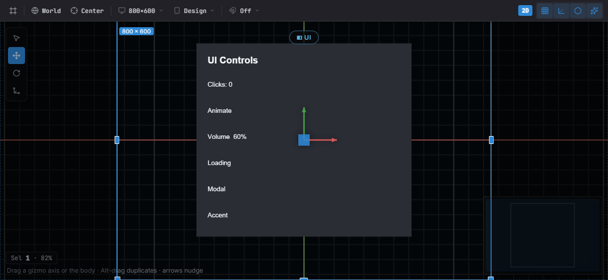

import { Aside } from '@astrojs/starlight/components';

Estella's UI is a CSS-like flexbox system solved in the C++ core. You compose an
interface from UI components — visually in the editor or in code — and handle
interaction from your systems. There is **no `RectTransform`**: `UINode` is real
flexbox, sized with `px` / `percent` / `auto` plus `Absolute` insets.

This page is the overview: the component model, a quickstart, and a map of the
detailed UI guides. Deep reference for each area lives in its own chapter.

## The components

| Component | Role | Guide |
|---|---|---|
| `UINode` | The layout box; holds the per-item flex fields (size, grow/shrink, margin, inset). | [UI Layout](/docs/guides/ui-layout/) |
| `FlexContainer` | Lays a node's children out with flexbox (direction, justify, align, gap, padding). | [UI Layout](/docs/guides/ui-layout/) |
| `Text` | Text via a dynamic glyph atlas (content, font, color, align, stroke, shadow, rich text). | [UI Text](/docs/guides/ui-text/) |
| `UIVisual` | The fill — solid color, texture, 9-slice, tiled, or filled. | below |
| `UIMask` | Clips its children. | below |
| `Interactable` | Marks a node hit-testable so it can be hovered/clicked. | [UI Interaction](/docs/guides/ui-interaction/) |
| `UIInteraction` | Engine-written per-frame pointer state (read-only for your logic). | [UI Interaction](/docs/guides/ui-interaction/) |

## Quickstart: a pause menu

A complete pause menu — a centered column panel with a title and a button — built
once from a **startup system**:

```typescript
import {
  defineSystem, addStartupSystem, GetWorld, Res, UIEvents,
  spawnUIEntity, createButton,
  FlexContainer, FlexDirection, JustifyContent, AlignItems, px,
} from 'esengine';

const buildPauseMenu = defineSystem([GetWorld(), Res(UIEvents)], (world, events) => {
  // A panel: 320×220 with a dark translucent background.
  const panel = spawnUIEntity({
    world,
    node: { width: px(320), height: px(220) },
    visual: { color: { r: 0.08, g: 0.10, b: 0.16, a: 0.95 } },
  });

  // Lay its children out as a centered vertical column.
  world.insert(panel, FlexContainer, {
    direction: FlexDirection.Column,
    justifyContent: JustifyContent.Center,
    alignItems: AlignItems.Center,
    gap: { x: 0, y: 16 },
  });

  // A title, parented to the panel.
  spawnUIEntity({ world, parent: panel, text: { content: 'Paused', fontSize: 28 } });

  // A button that resumes the game on click.
  createButton({
    world, events, parent: panel, text: 'Resume',
    node: { width: px(160), height: px(44) },
    states: {
      normal:  { color: { r: 0.20, g: 0.55, b: 1.0, a: 1 } },
      hover:   { color: { r: 0.30, g: 0.65, b: 1.0, a: 1 } },
      pressed: { color: { r: 0.12, g: 0.45, b: 0.9, a: 1 } },
    },
    onClick: () => { /* unpause, switch scene, hide the menu… */ },
  });
});

addStartupSystem(buildPauseMenu);
```

`spawnUIEntity({ world, parent?, node?, visual?, text? })` returns the entity; pass
`parent` to nest. Sizes use the dimension helpers `px`, `percent`, `auto` — all
in **design pixels** (see [UI Layout](/docs/guides/ui-layout/#units-design-pixels)).
The other widget factories work the same way: `createToggle`, `createSlider`,
`createProgress`, `createDialog`, `createDropdown` — see
[UI Components](/docs/guides/ui-components/).

## How the pieces fit

Each layer builds on the one before it:

1. **Layout** — `UINode` boxes, solved by the flexbox engine; `FlexContainer`
   arranges children, `Absolute` insets place overlays.
   → [UI Layout](/docs/guides/ui-layout/)
2. **Visuals & text** — `UIVisual` fills the box, `UIMask` clips, `Text` draws
   crisp glyphs. → [UI Text](/docs/guides/ui-text/)
3. **Interaction** — `Interactable` makes a box hit-testable; the engine writes
   pointer state into `UIInteraction` and emits bubbling `UIEvents`; drag & drop
   and keyboard focus sit on top. → [UI Interaction](/docs/guides/ui-interaction/)
4. **Widgets** — factories (`createButton`, `createSlider`, …) compose the three
   layers into ready-made controls; `createListView` adds virtualized lists.
   → [UI Components](/docs/guides/ui-components/), [UI Lists](/docs/guides/ui-lists/)
5. **Controllers** — a named "page" state per UI root with per-page field
   bindings (tabs, button states, show/hide) — no code.
   → [UI Controllers](/docs/guides/ui-controllers/)
6. **Theme & binding** — design tokens skin every widget (live-switchable), and
   reactive signals keep UI in sync with game state.
   → [UI Theme](/docs/guides/ui-theme/), [UI Binding](/docs/guides/ui-binding/)

### `UIVisual` and `UIMask`

`UIVisual` draws the node's background; `visualType` selects the mode:

| `UIVisualType` | Uses | Description |
|---|---|---|
| `None` | — | Invisible (layout/hit-test only). |
| `SolidColor` | `color` | Tinted quad. |
| `Image` | `texture`, `uvOffset`, `uvScale` | Textured quad / sprite region. |
| `NineSlice` | `sliceBorder` | Scalable panel with fixed corners. |
| `Tiled` | `tileSize` | Texture repeated across the box. |
| `Filled` | `fillAmount`, `fillMethod`, `fillOrigin` | Cropped fill (health/progress bars, cooldown rings). |

`UIVisual.enabled` hides this entity's visual only; `UINode.display = None`
removes the node **and its whole subtree** from layout, rendering, and
hit-testing. Add `UIMask` to a node to clip its children to the box.

## Editor or code



*A UI Canvas in the editor — laid out against the design frame, with the selected node's gizmo. The same widgets author from code or the editor.*

Both author the **same components** — there is no separate editor format:

- **Editor** — *Create… → UI* drops widget prefabs (Button, Toggle, Slider,
  Dialog, …); nest by dragging, edit every field in Details, place with the
  per-axis anchor picker, and preview against the project's design resolution
  and device presets. See [The Editor](/docs/guides/editor/).
- **Code** — `spawnUIEntity` + the widget factories, from a startup system as
  above. Anything the editor writes, code can write too.

## Where to go next

| You want to… | Open |
|---|---|
| Size and place boxes — `px`/`percent`/`auto`, flexbox, absolute insets, anchors | [UI Layout](/docs/guides/ui-layout/) |
| Draw text — fonts, SDF/bitmap crispness, wrapping, rich text | [UI Text](/docs/guides/ui-text/) |
| React to pointer & keyboard — clicks, `UIEvents`, drag & drop, focus | [UI Interaction](/docs/guides/ui-interaction/) |
| Use ready-made controls — button, toggle, slider, dialog, dropdown, input | [UI Components](/docs/guides/ui-components/) |
| Show scrolling data — virtualized lists and grids | [UI Lists](/docs/guides/ui-lists/) |
| Skin everything — design tokens, project theme, live switching | [UI Theme](/docs/guides/ui-theme/) |
| Keep UI in sync with game state — signals, `bind`, two-way widget binding | [UI Binding](/docs/guides/ui-binding/) |
| Share state across elements — tabs, radio groups, page-driven visuals | [UI Controllers](/docs/guides/ui-controllers/) |

## Best practices

- **Flex, not absolute** — lay out with `FlexContainer` + `flexGrow`; reserve
  `Absolute` insets for overlays and badges.
- **Size with `percent` / `auto`** for resolution independence; hard `px` only
  where a fixed size is intended.
- **Drive logic from `UIInteraction` or `UIEvents`**, never by mutating them.
- **Reuse the widget factories** for consistent state visuals instead of wiring
  hover/press by hand.
- **9-slice panels** (`NineSlice`) keep borders crisp at any size.

## See also

- [Input](/docs/guides/input/) — raw keyboard/mouse/touch below the UI layer.
- [Localization](/docs/guides/localization/) — bind `Text.content` to translated keys.
- [Animation](/docs/guides/animation/) — tween UI color/position for juice.
- [The Editor](/docs/guides/editor/) — visual authoring, prefabs, anchor picker.
