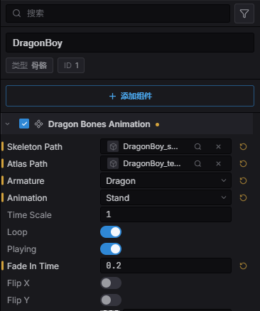

import { Aside } from '@astrojs/starlight/components';

Estella 支持 [DragonBones](https://docs.egret.com/dragonbones) 骨架动画:骨骼、网格、
插槽与动画,由绘制其它一切的同一个渲染器摆姿势。它由 `DragonBonesAnimation` 组件驱动,
并在运行时通过 `DragonBones` 资源(来自 `esengine/dragonbones` 子路径)控制。

引擎跑到哪里它就跑到哪里——编辑器视口、Play、Web、Playable 广告、小游戏,以及编译进
iOS 与 Android 宿主。

<Aside type="tip">
  与 Spine 不同,DragonBones 运行时是 **MIT 许可**的。用它发布游戏不需要额外授权。
</Aside>

## 导入一个项目

DragonBones 导出的是三个文件,Estella 把它们作为同一种资源类型导入:

| 文件 | 是什么 |
|---|---|
| `<name>_ske.json` 或 `<name>.dbbin` | 骨骼——骨头、插槽、动画。 |
| `<name>_tex.json` | 图集——每块图在图片上的位置。 |
| `<name>_tex.png` | 图片本身。 |

把文件夹拖进项目即可。`_ske` 与 `_tex` 两半是**按名字后缀**区分的,不是扩展名——两个都是
`.json`,光看扩展名分不出谁是谁。

那张 PNG 是场景里**没有任何东西指向**的文件:它的名字写在图集内部的 `imagePath` 字段里。
打包时 Estella 会跟着这个引用走,所以图片会跟图集一起进包,而不会因为"没人引用"被剔掉。
你不需要在任何地方引用它。

## `DragonBonesAnimation` 组件

用 **创建 → DragonBones** 添加,或者给已有实体加这个组件。组件本身在主 `esengine` 包里。



| 属性 | 类型 | 默认 | 说明 |
|---|---|---|---|
| `skeletonPath` | asset | `''` | 骨骼文件(`_ske.json` / `.dbbin`)。 |
| `atlasPath` | asset | `''` | 图集文件(`_tex.json`)。 |
| `armature` | string | `''` | 用文件里的哪个骨架(空 = 第一个)。 |
| `animation` | string | `''` | 生成时播放的动画。 |
| `loop` | boolean | `true` | 循环初始动画。 |
| `playing` | boolean | `true` | 是否推进播放。 |
| `fadeInTime` | number | `0` | 交叉淡入秒数,首次播放也会用。 |
| `timeScale` | number | `1` | 每实体的播放速度。 |
| `skeletonScale` | number | `1` | 骨架整体缩放。 |
| `flipX` / `flipY` | boolean | `false` | 水平 / 垂直镜像。 |
| `color` | Color | `{1,1,1,1}` | 着色(RGBA,0..1)。 |
| `layer` | number | `0` | 决定绘制顺序的排序层。 |
| `material` | asset | 无 | 可选的自定义材质。 |
| `enabled` | boolean | `true` | 关掉则冻结并隐藏。 |

**骨骼与图集是资源槽**:从弹出框里选、从内容浏览器拖进来,或者用槽自带的定位 / 清除操作。
场景把它们序列化成可移植的 `@uuid:` 引用,所以移动或重命名文件都不会断链。

编辑时骨架**就在视口里摆着**——改动画、改缩放、改翻转都会立刻看到,不用按 Play。

<Aside type="note">
  `color` 是**乘**在每个插槽自己的颜色上,而不是替换它——所以美术在 DragonBones Pro 里设的
  颜色不会因为被着色而丢失。不透明白(默认值)就是"什么都不改变"的那个着色,所以清空这个字段
  会还原成原样,而不是把最后一次的颜色留在那儿。
</Aside>

## 选择骨架

DragonBones 文件是一个**项目**,不是一个骨架:一个文件里常常放着好几个骨架。选哪一个是实打实
的一步,所以 `armature` 是独立的一个字段。

实体指向骨骼文件之后,**骨架**和**动画**会变成下拉框,内容是读那个文件读出来的——你从文件里
真实存在的东西中挑,而不是手输一个名字然后在运行时才发现不对。动画列表跟着所选骨架走,因为
一个文件里的两个骨架并不共用动画列表。

`armature` 留空就用文件里的第一个骨架。大多数文件只有一个,而"必须填一个不打开文件就没法知道
的值"会让最常见的情况反而更麻烦。

<Aside type="note">
  `.dbbin` 骨骼不会填充下拉框——它是二进制的,要报出里面有什么就得为了填一个列表而启动运行时。
  这个字段会保持成普通文本框,手输的名字照样有效。
</Aside>

## 播放与交叉淡入

这是 DragonBones 与 Spine 差别最大的地方,API 也照实说,而不是假装一样。Spine 在骨架上维护一张
**混合表**——"从 idle 到 run 用 0.2 秒"。DragonBones 是**在动画开始的那一刻**混合的,所以淡入
时长是"开始播放"这个动作的参数:

```typescript
import { defineSystem, Query, Res, DragonBonesAnimation } from 'esengine';
import { DragonBones } from 'esengine/dragonbones';

const control = defineSystem(
  [Query(DragonBonesAnimation), Res(DragonBones)],
  (q, dragonBones) => {
    // 运行时落地前是 null——它在第一次被用到时才去取。
    if (!dragonBones) return;

    for (const [entity] of q) {
      dragonBones.fadeIn(entity, 'walk', 0.25, true);  // 0.25 秒交叉淡入
      dragonBones.setTimeScale(entity, 1.5);           // 1.5 倍速
    }
  },
);
```

| 方法 | 说明 |
|---|---|
| `play(entity, name, loop?)` | 立即开始一个动画,不混合。 |
| `fadeIn(entity, name, seconds, loop?)` | 交叉淡入到一个动画。 |
| `stop(entity, name?)` | 停一个动画;省略名字则全停。 |
| `setTimeScale(entity, scale)` | 每实体的播放速度。 |
| `setColor(entity, r, g, b, a)` | 给整个骨架着色(0..1),乘在插槽自身颜色上。 |
| `setEnabled(entity, on)` | 整个从这一帧里拿掉(既冻结**又**隐藏)。 |
| `setEntityProps(entity, props)` | 一次设 `{ skeletonScale?, flipX?, flipY?, layer?, playing?, timeScale?, color? }`。 |

`playing: false` 是冻住姿势但继续画;`setEnabled(false)` 是把骨架从这一帧里拿掉。这是两件事,
而且两个都有用。

`setEnabled` 和组件自身的 `enabled` 字段驱动的是同一个开关:写字段(在检视器里,或
`world.set`)在写下的那一刻生效,两次写之间由 `setEnabled` 说话。编辑器世界大纲里的眼睛
走的也是这条通道——所以隐藏一个骨架实体会在视口里真的隐藏,而不会动你写好的 `enabled`。

## 查询骨架

```typescript
const anims  = dragonBones.getAnimations(entity);  // string[]
const bounds = dragonBones.getBounds(entity);      // { x, y, width, height } | null
```

`getBounds` 是从骨架**当前摆出的**几何算的,不是取制作工具里记录的那个包围盒——所以它跟着角色
移动,而不是描述它当初被画在哪。

## 共用一份骨架

指向同一对骨骼 + 图集的实体共用**一份解析后的骨架和一张图集**。同一个角色来十个,文件只解析一次、
纹理只有一份;最后一个被移除时才卸载。

这不需要你做任何开关——它由组件引用的那一对文件自然决定。每实体的属性仍然是每实体的,所以共用
骨架照样可以各自缩放、翻转、着色:


## 打包时会带上什么

DragonBones 运行时是**按需付费**的。项目里没有骨架,就不会去取、内联或复制这个模块:

| 目标 | 运行时怎么进去的 |
|---|---|
| Web / 桌面 | `dragonbones.wasm` 放在引擎旁边,首次使用时取。 |
| Playable 广告 | 内联进那一个 HTML 文件——仅当场景用到。 |
| 小游戏 | 复制进包里——仅当场景用到。 |
| iOS / Android | 编译进 app 二进制。 |

编辑器是扫描正在打包的场景来决定的,所以没有需要记住的开关,也没办法打出一个"有骨架却没有运行时"
的包。

## 最佳实践

- **给切换加淡入。** `fadeIn` 用 0.15–0.3 秒,比 `play` 那种硬切好看得多。在组件上设
  `fadeInTime`,首次播放也会淡入。
- **在实体之间共用同一对文件**——同一个角色的一群人,只花一次解析和一张图集。
- **在编辑器里用下拉框选骨架**,别手输:文件里不存在的名字什么都画不出来。
- 想让角色**停在某个姿势并留在画面上**时,用 `playing: false`,别用禁用。

## 参见

- [Spine 动画](/docs/zh-cn/guides/spine/) —— 另一个骨骼运行时,以及两者的差别。
- [动画](/docs/zh-cn/guides/animation/) —— 精灵帧动画与 Animator 状态机。
- [资源](/docs/zh-cn/guides/assets/) —— 骨骼与图集资源怎么导入和引用。
- [构建与导出](/docs/zh-cn/guides/build-export/) —— 每个目标的包里有什么。
