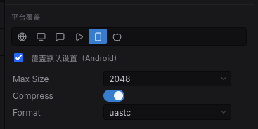
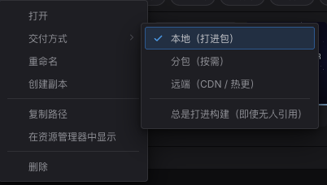

import { Aside } from '@astrojs/starlight/components';

项目里每个资源都有稳定的 UUID。场景与预制体按 UUID 引用资源;构建时引擎只**烘焙**
(cook)游戏能触达的部分,运行时通过**清单(manifest)**解析引用,按类型的**加载器**
把引用变成可用句柄,**引用计数**再释放不再用的资源。本篇逐一讲清。

## 引用资源

在代码里,按资源的**项目相对路径**引用它——可读,也是你平常会写的。这个路径相对的是
**项目根目录**,不是 assets 文件夹,所以它以 `assets/` 开头——和内容浏览器里显示的那个
写法一致,也是烘焙产出的清单所用的键:

```typescript
const tex = await assets.loadTexture('assets/textures/player.png');
```

少写这层根的引用(`'textures/player.png'`)照样按项目根解析,在那里什么也找不到,
加载就以 404 失败。

而编辑器会把引用序列化进场景/预制体时写成**稳定 UUID**(`@uuid:<uuid>`),这样文件被
改名或移动后引用仍然有效,并自动解析——**`@uuid:` 不是给你手写的,是编辑器写的**。两种
形式所有加载器都认、解析到同一路径。`resolveRef(ref)` 会返回两者解析后的路径。

## 按类型加载

`Assets` 资源为每种资源类型提供一个按类型的加载器。每个返回一个句柄或 id,你把它设到
组件上。例如加载一张贴图并显示在 `Sprite` 上:

```typescript
import { defineSystem, Query, Mut, Res, Sprite, Assets } from 'esengine';

const loadArt = defineSystem([Query(Mut(Sprite)), Res(Assets)], async (q, assets) => {
  const tex = await assets.loadTexture('assets/textures/player.png');   // { handle, width, height }
  for (const [entity, sprite] of q) {
    sprite.texture = tex.handle;
  }
});
```

| 加载器 | 返回 |
|---|---|
| `loadTexture(ref)` | `{ handle, width, height }` |
| `loadAudio(ref)` | `{ bufferId }` |
| `loadFont(ref)` | `{ handle }` |
| `loadMaterial(ref)` | `{ handle, shaderHandle }` |
| `loadSpine(skeletonRef, atlasRef?)` | `{ skeletonHandle }` |
| `loadTilemap(ref)` / `loadTileset(ref)` | `{ sourceId }` / `{ tilesetId }` |
| `loadTimeline(ref)` | `{ timelineId }` |
| `loadPrefab(ref)` | `{ data }` |
| `loadJson<T>(ref)` | `{ data: T }` |

还有一个通用的 `load<T>(type, ref)`,当类型是动态决定时用;以及 `register(loader)`
为自定义资源类型添加加载器。

## 你自己的数据

一个 `.json`,只要不是 Spine 骨架、也不是 DragonBones 的那一对,它就是**数据资源**——
游戏自己的数值表、配置、对白。和别的资源一样加载:

```typescript
const { data } = await assets.loadJson<LevelTable>('assets/data/levels.json');
```

`T` 是你声称这个文件长什么样;没有任何东西校验它,所以这是 `JSON.parse` 的保证,不是 schema 的。

把它当资源加载、而不是自己去 fetch 那个路径,不是走形式。数据资源有 uuid,所以移动文件不会
让指向它的东西失效;它只解析一次并被引用计数;它可以放进惰性[分组](#寻址组懒加载)或者从 CDN 来;
[热更新](/docs/zh-cn/publishing/hot-update/)能在已发行的游戏里替换它。手写的 `fetch` 一样都拿不到——
而且它**在编辑器里是通的**(编辑器伺服整个项目),而构建只装资源。

数据资源无论有没有人引用都会进包——见[只有代码点名的资产](#只有代码点名的资产),
它是那里两个内建例外之一。

项目自己的配置不算数据:`package.json`、`tsconfig.json` 这一类永远不会变成资源。

## 清单(manifest)

运行时通过清单把 `@uuid` 引用解析为文件路径:

```typescript
assets.setManifest(manifest);   // 通常运行时会替你设好
```

清单由烘焙(见下)产出。`getManifest()` 返回当前清单。不在清单里的引用会回退到直接
路径查找。

## 寻址组(懒加载)

位于 `subpackages/<name>/…` 文件夹下的资源组成惰性分组 `<name>`;其余属于会被急切加载的
`main` 分组。按需加载某个分组——带进度——它会先下载再加载其中的资源(在微信上会触发
`wx.loadSubpackage`;在 Web 上下载是空操作):

```typescript
const bundle = await assets.loadGroup('level2', (loaded, total) => {
  console.log(`${loaded}/${total}`);
});

// ...玩家离开这个组对应的区域时:
assets.releaseGroup('level2');
```

`releaseGroup` 是对称的另一半:组里获取过的每个资源都经其类型的规范通道释放,由引用计数
决定实际发生什么——别的场景或组还持有的资源会存活,没人持有的降级为可逐出热缓存。之后玩家
折返该区域时由热缓存吸收,而不是重走网络。

`loadByLabel(...)` 按 label 标签加载资源,而不是按文件夹分组。正是这种分组映射到
[微信分包](/docs/zh-cn/publishing/wechat/),实现按需下载。

当你想预热的资源集合不是一个组或标签时——比如玩家还在当前区域,就先加载下一区域的
纹理——`preload` 接受显式的引用列表,自动推断每个资源的类型(清单优先,其次文件扩展名),
经同一套按类型通道以受限并发加载:

```typescript
const { failed } = await assets.preload(
  ['assets/textures/boss.png', 'assets/audio/boss-theme.mp3', 'assets/maps/arena.estilemap'],
  (loaded, total) => console.log(`${loaded}/${total}`),
);
```

它永远不会 reject——无法确定类型或加载失败的引用会记录在 `failed` 里。之后真正的
加载会命中已预热的缓存(或复活驻留纹理),而不是走网络。

## 烘焙、压缩与内容寻址

构建时,**烘焙**从构建里的每个场景(打包对话框的**构建场景**列表)出发遍历依赖图,
**剔除一切触达不到的资源**,暂存可达文件,并写出清单。过程中它还能:

- **压缩纹理** —— 把 PNG 编码为 GPU 就绪的 **KTX2**(Basis Universal),运行时再转码为
  设备支持的最佳格式(ASTC → ETC2 → S3TC,最后回退 RGBA8),连同 mip 链。这由逐资产的
  **导入设置**决定,每个平台一个页签(见下图),所以一张纹理可以为手机压得比网页端更狠;
  打包对话框的**资源压缩**开关只选择遵循还是全部跳过这些设置。
- **内容寻址** —— 每个发布文件按字节哈希命名,于是 URL 不可变,相同文件去重成一份。
  Web/桌面默认开启。
- **自动图集** —— 把零散的 PNG 放进 `<name>.atlas/` 文件夹,烘焙时会把它们打包成图集页
  (帧 UV 写进清单),于是许多小精灵作为一张纹理发布、在一次绘制里合批。



*一张纹理的**平台覆盖**:每个目标各有页签;没有覆盖任何东西的平台,沿用上方的默认设置。*

### 只有代码点名的资产

可达性分析正是拦住"什么都往包里塞"的东西——而它对**你的代码在运行时才点名的一切是瞎的**:
富文本标记里的纹理、按 url 播放的音频、按路径 spawn 的预制体。这些会被剔除,而且没有任何警告,
因为编辑器直接从磁盘伺服项目,压根不需要清单。第一个症状是真实构建里一个没声的按钮或一张缺失的图。

那就把这个文件夹声明出来。在**内容浏览器**里右键它,选 **交付方式 → 总是打进构建**——
就是那个设置本地 / 分包 / 远端交付的同一个菜单,写进同一份
`.esengine/asset-groups.json`:



*右键文件夹 → **交付方式**。三种模式决定资产从哪里发布;**总是打进构建**决定它到底发不发。*

```json
{
  "version": "1.0",
  "groups": {
    "markup-images": {
      "folder": "assets/textures",
      "mode": "local",
      "alwaysInclude": true
    }
  }
}
```

它就是 Unity 的 `Resources` 文件夹、Unreal 的 additional cook directory,
只不过落在这个项目原本就有的模型里。**默认关闭**,这是刻意的。

<Aside type="tip">
  `subpackages/` 下的资源即使触达不到也总会被包含——只是分组归属不同。
  `alwaysInclude` 让任何其他文件夹也能拿到同样的保证。

  有两类永远不需要它,因为它们本来就不可能被引用:**多语言字表**(`Text` 带的是 key 不是路径)
  和**数据资源**(`.json`,由加载它的代码点名)。这两类总是进包。
</Aside>

## 生命周期与引用计数

加载的资源是**引用计数**的:每次 `load*()` 计一个引用,需要一次匹配的 `release*()`
(场景加载会替你完成这两步)。被两个场景共享的资源在第一个场景卸载后仍然存活,只有最后一个
持有者释放时才真正释放。

释放的资源也不会立即销毁:纹理和解码后的音频缓冲区以**可逐出缓存条目**的形式留驻,同一资源
再次被加载(重进场景、流式加载重新进入某区域)时会被**原地复活**,而不是重新下载和解码。
一个按字节预算的 LRU 在驻留量超过预算时逐出最旧的未引用条目;收到系统内存警告时整个热缓存
一次性清空(持有中的资源不受影响)。你一般不用手动管理——正常引用和销毁实体即可。

纹理预算默认 **64 MB**(`RuntimeConfig.textureCacheBudget`,也可在构建配置里用
`textureCacheBudget` 设置);解码音频有自己的 **32 MB** 镜像(`audioCacheBudget`,
见[音频指南](/docs/zh-cn/assets/audio/))。

## 纹理内存与预算

纹理是真正要紧的预算——它们主宰 GPU 内存。引擎启动时应用
`RuntimeConfig.textureCacheBudget`;用 `setTextureBudget` 按你的游戏调它的大小(它是
C++ 池之上唯一面向游戏的表面——没有一个会与之漂移的平行 TS 侧预算),用
`getResourceStats` 观测驻留:

```typescript
import { setTextureBudget, getResourceStats, trimTextureCache } from 'esengine';

setTextureBudget(256 * 1024 * 1024);   // 256 MB texture budget

const stats = getResourceStats();      // 引擎初始化前为 null
// stats.textureBytes          — 常驻纹理字节数(持有 + 可逐出)
// stats.textureBudget         — 当前预算(0 = 逐出关闭)
// stats.textureEvictableCount — 等待复活或逐出的热缓存条目数
// …还有 shaderCount / textureCount / vertexBufferCount / indexBufferCount
//  与 cacheHits / cacheMisses

const freed = trimTextureCache();      // 立即丢弃所有可逐出纹理
```

这里的"GC"就是上文的 LRU:一旦 `textureBytes` 超出 `textureBudget`,C++ 池逐出最久未用的
**无引用**纹理直到装下——持有中的纹理绝不会被动。`setTextureBudget(0)` 完全关闭热缓存
(每个纹理在最后一个引用释放的瞬间销毁),`trimTextureCache()` 一次性释放所有可逐出条目并
返回数量——引擎在系统内存警告时会调用它;在已知的内存尖峰之前也可以自己调。

还有两个小帮手补全这个表面:`getTextureDimensions(handle)` 返回纹理的
`{ width, height }`(首次查询后缓存在 TS 侧),`evictTextureDimensions(handle)` 丢弃那条
缓存——资源系统在纹理真正释放时会这么做,所以只有绕过资源系统自己销毁重建纹理时才需要它。

想逐帧观察这些数字(编辑器内和运行时),见[性能分析](/docs/zh-cn/performance/profiling/)。
逐纹理的**采样/过滤**参数(像素风 nearest 还是平滑 linear)见
[精灵指南](/docs/zh-cn/graphics/sprites/)。

## 最佳实践

- **代码里按路径引用,让编辑器写 `@uuid:`**——绝不手写 UUID 引用。
- **在关卡边界用 `loadGroup` / `loadByLabel` 预加载**,别让游戏在场景中途卡顿。
- **把按需内容放到 `subpackages/<name>/` 下**,它就成为一个 lazy 组(以及微信子包),而不是
  撑大主包。
- **让 cook 去剔除 + 压缩**——只暂存可达资源、PNG→KTX2 让发布包更小;别发能被 cook 的裸 PNG。
- **把代码按名字加载的文件夹标记为 交付方式 → 总是打进构建**,否则可达性剔除会把它们从构建里丢掉——
  而编辑器从来不需要清单就能跑起来。
- **在内存受限的目标上设纹理预算**,其余交给引用计数。

<Aside type="note">
  内容哈希基于**暂存后**的字节(PNG→KTX2 编码之后)计算,因此清单里的哈希标识的是最终
  发布的产物。
</Aside>

## 参见

- [微信小游戏](/docs/zh-cn/publishing/wechat/) —— 可寻址分组如何映射到子包。
- [场景](/docs/zh-cn/world/scenes/) —— 场景引用资源,并作为入口点被 cook。
- [材质与着色器](/docs/zh-cn/graphics/materials/) —— `loadMaterial` 与着色器句柄。
