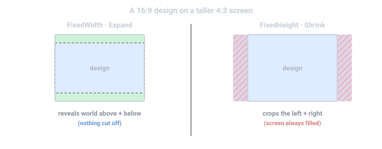

import { Aside } from '@astrojs/starlight/components';

你按**一个设计分辨率**(默认 1920×1080)制作游戏,引擎负责把这个盒子适配到游戏实际运行的
任何屏幕上。本页是这条管线的完整参考:单位模型、`Canvas` 组件、每个缩放模式及实际数字、
项目级 `ScreenScaling` 适配、UI 像素为何稳定、响应尺寸与方向变化、设备安全区,以及相机的
`pixelPerfect` 开关。

## 世界单位就是设计像素

Estella 的 2D 单位模型刻意保持简单:

- **1 世界单位 = 1 设计像素。**一张 100×200 纹理生成一个 100×200 的精灵;`px(300)` 的
  `UINode` 宽 300 设计像素。
- 默认场景相机的 `orthoSize` 是 `designResolution.y / 2` = **540**——设计高度的一半——
  所以在设计宽高比下,相机恰好显示一个设计盒(1920×1080 世界单位)。
- 世界是 **Y 向上**;屏幕坐标是 **Y 向下**(由
  [`CameraView`](/docs/zh-cn/guides/camera/) 为你转换)。
- `Canvas.pixelsPerUnit`(默认 `100`)是**物理缩放**——每 Box2D 米的世界像素数——
  **不是**显示缩放。渲染从不除以它。

当实际屏幕的宽高比与设计分辨率不同,由**缩放模式**决定如何适配设计盒——它缩放的是
*可见盒*,而不是你的内容:精灵保持像素尺寸,位置一动不动。

## `Canvas` 组件

每个场景有一个实体携带 `Canvas`——设计分辨率及其适配方式的声明。编辑器建场景时会自动种下它;
引擎使用找到的第一个 `Canvas`。

| 属性 | 类型 | 默认 | 说明 |
|---|---|---|---|
| `designResolution` | Vec2 | `{x: 1920, y: 1080}` | 设计(参考)分辨率,像素——你制作时对照的盒子。 |
| `pixelsPerUnit` | number | `100` | 每物理米的世界像素数(Box2D + 瓦片碰撞体缩放)。最小 `1`。不是显示缩放。 |
| `scaleMode` | `ScaleMode` | `FixedHeight` | 设计分辨率如何适配实际屏幕宽高比(见下)。 |
| `matchWidthOrHeight` | number | `0.5` | `Match` 模式的混合值,0–1:`0` = 适配宽度,`1` = 适配高度。其余模式忽略。 |
| `backgroundColor` | Color | `{r:0, g:0, b:0, a:1}` | 为设计盒之外的 letterbox/pillarbox 区域声明的背景色。 |

```typescript
import { defineSystem, GetWorld, Canvas } from 'esengine';

const readCanvas = defineSystem([GetWorld()], (world) => {
  const [canvasEntity] = world.getEntitiesWithComponents([Canvas]);
  if (canvasEntity === undefined) return;

  const canvas = world.get(canvasEntity, Canvas);
  const designW = canvas.designResolution.x;   // 1920
  const designH = canvas.designResolution.y;   // 1080
});
```

<Aside type="note">
  `pixelsPerUnit` 只喂给物理和瓦片碰撞体:默认 `100` 时,一个 100 像素的箱子就是一个
  Box2D 米,让物理保持在求解器调优的数值范围内。改它会重新缩放碰撞体尺寸和重力手感——
  而不是任何东西的外观。
</Aside>

## 缩放模式



适配数学是一个纯函数,导出为 `computeEffectiveOrthoSize`。给定设计盒与实际屏幕宽高比,
它产出**有效正交半高**——相机将显示的世界盒高度的一半,单位是世界单位(设计像素)。
存在两个候选答案:

- `orthoForWidth = (designResolution.y / 2) × designAspect / actualAspect`——让设计
  **宽度**恰好铺满屏幕的半高。
- `orthoForHeight = designResolution.y / 2`——让设计**高度**恰好铺满屏幕的半高。

每个 `ScaleMode` 在二者之间选择:

| `ScaleMode` | 值 | 有效半高 | 行为 |
|---|---|---|---|
| `FixedWidth` | `0` | `orthoForWidth` | 设计宽度总是恰好铺满屏幕。更高的屏幕在上下露出额外世界;更宽的屏幕裁掉上下。 |
| `FixedHeight` | `1`(默认) | `orthoForHeight` | 设计高度总是恰好铺满屏幕。更宽的屏幕在两侧露出额外世界;更窄的屏幕裁掉两侧。 |
| `Expand` | `2` | `max(orthoForWidth, orthoForHeight)` | **整个设计盒始终可见**;适配更松的轴在盒外露出额外世界。安全:设计内的东西永不被裁。 |
| `Shrink` | `3` | `min(orthoForWidth, orthoForHeight)` | **屏幕始终被设计盒填满**;溢出的轴被裁剪。永不露出设计盒之外的内容。 |
| `Match` | `4` | `orthoForWidth^(1−t) × orthoForHeight^t` | 按 `matchWidthOrHeight`(`t`)几何混合:`0` 表现同 `FixedWidth`,`1` 同 `FixedHeight`,`0.5` 取中。 |

`ScaleMode` 对象上还有两个 Cocos 风格的别名(是*相同的值*,不是额外模式):
`ScaleMode.ShowAll === ScaleMode.Expand`、`ScaleMode.NoBorder === ScaleMode.Shrink`。

```typescript
import { computeEffectiveOrthoSize, ScaleMode } from 'esengine';

const halfH = computeEffectiveOrthoSize(
  540,          // baseOrthoSize = designResolution.y / 2
  1920 / 1080,  // design aspect (≈ 1.778)
  1024 / 768,   // actual screen aspect (4:3 ≈ 1.333)
  ScaleMode.Expand,
  0.5,          // matchWidthOrHeight (Match mode only)
);
// halfH === 720 → the camera shows 1920 × 1440 design pixels
```

### 实际例子——1920×1080 设计放到 4:3 屏幕

在 1024×768(4:3)屏幕上,`orthoForWidth = 540 × (16/9)/(4/3) = 720`,
`orthoForHeight = 540`:

| 模式 | 半高 | 可见世界盒(设计像素) | 后果 |
|---|---|---|---|
| `FixedWidth` | `720` | 1920 × 1440 | 完整设计宽度;上*和*下各露出 180 额外世界像素。 |
| `FixedHeight` | `540` | 1440 × 1080 | 完整设计高度;**左右各裁掉** 240 设计像素。 |
| `Expand` / `ShowAll` | `720` | 1920 × 1440 | 整个设计盒可见;上下露出额外世界(此屏幕上等同 `FixedWidth`——在*更宽*的屏幕上则等同 `FixedHeight`)。 |
| `Shrink` / `NoBorder` | `540` | 1440 × 1080 | 屏幕填满,不露出设计盒之外的内容;两侧被裁。 |
| `Match`(t = 0.5) | `≈ 623.5` | ≈ 1663 × 1247 | 折中:两侧轻微裁剪,*同时*上下轻微露出。 |

<Aside type="tip">
  相机视口总是填满其屏幕矩形——没有模式会渲染真正的黑边。这里的"letterbox"意味着
  **设计盒之外的额外世界变得可见**。用 `Expand` 时,把背景画到设计框之外去;你放在那里的
  东西,就是其他宽高比玩家看到的东西。`Canvas.backgroundColor` 为盒外区域声明颜色。
</Aside>

## 相机如何参与

适配并不作用于相机自己写的 `orthoSize`——它作用于 `designResolution.y / 2`。相机插件
每帧按此顺序解析**适配源**:

1. **`ScreenScaling`**(项目级适配,见下),当其 `scaleMode` 是真实模式(`≥ 0`)时——
   权威,完全不需要 UI;
2. 否则,场景的 **`Canvas`** 组件(若存在);
3. 否则**无适配**——相机按原始 `orthoSize` 渲染。

<Aside type="caution">
  适配源生效期间,主相机自己写的 `orthoSize` **不会被使用**——可见半高完全来自设计分辨率
  与缩放模式。通过编辑/tween `orthoSize` 缩放,只在没有适配源时生效(场景无 `Canvas`
  且项目适配关闭)。
</Aside>

默认场景相机写的正是 `orthoSize: 540 = designResolution.y / 2`,所以有无适配的视图在设计
宽高比下一致:无论适配开关,1920×1080 的窗口都恰好显示一个设计盒。

## 项目级适配:`ScreenScaling` 资源

`ScreenScaling` 把设计分辨率适配变成*项目*概念而非 UI 概念——没有 `Canvas`(没有 UI)的
场景照样正确 letterbox。它是**项目设置 → 显示 → 相机适配**的运行时映像。

| 字段 | 类型 | 默认 | 说明 |
|---|---|---|---|
| `designWidth` | number | `1920` | 设计(参考)分辨率宽度,像素。 |
| `designHeight` | number | `1080` | 设计(参考)分辨率高度,像素。 |
| `scaleMode` | number | `SCREEN_FIT_OFF`(`-1`) | 真实的 `ScaleMode`(`0`–`4`)**开启**项目适配;`SCREEN_FIT_OFF` 保持旧行为(有 Canvas 用 Canvas 适配,否则原始 `orthoSize`)。 |
| `matchWidthOrHeight` | number | `0.5` | `Match` 模式混合值 0–1(`0` = 适配宽度,`1` = 适配高度);其余模式忽略。 |

`DEFAULT_SCREEN_SCALING` 就是这个默认关闭的值,`SCREEN_FIT_OFF`(`-1`)是哨兵值。项目
适配开启时,它**对相机是权威的**,而 UI 布局仍读 `Canvas`——所以玩法与 UI 可以按不同方式
适配。

各发布运行时从项目配置安装它(`createWebApp` 的 `screenFit` 选项)。游戏代码可以实时读取
或覆盖——相机插件每帧重读:

```typescript
import { defineSystem, Res, ScreenScaling, ScaleMode } from 'esengine';

const enableProjectFit = defineSystem([Res(ScreenScaling)], (fit) => {
  fit.designWidth = 1280;
  fit.designHeight = 720;
  fit.scaleMode = ScaleMode.Expand;   // any real mode (≥ 0) switches the fit on
});
```

## UI 布局:`UINode` 像素就是设计像素

UI 在一个世界空间矩形(`uiLayoutRect`)内布局,对场景相机而言,这个矩形**就是**适配后的
相机范围。因为世界单位是设计像素,`UINode` 上的 `px(300)` 在任何设备上都是 300 设计像素——
缩放模式改变的是 UI 周围可见多少*世界*,而绝不改变 UI 自身的比例。

**编辑器视口**是特例:它的导航相机以自由缩放渲染世界(原始 `orthoSize`,无适配——平移/缩放
才可预测)。如果 UI 按那个被缩放的范围布局,每滚一格滚轮,所有元素都会重新缩放和重排。
编辑器改为从 `Canvas` 恢复*固定的*设计分辨率盒,并在那里布局 UI——布局在任何缩放级别都完全
一致,而 UI 仍随场景视觉缩放,因为它通过同一个缩放后的视图渲染。设备模拟器把预览宽高比传进
同一套数学,这就是 letterbox 预览与实机发布完全一致的原因。

两个纯函数——`uiLayoutRect` 与 `computeEffectiveOrthoSize`——都已导出,供工具与测试使用。

## 屏幕尺寸与方向:`ScreenInfo`

`ScreenInfo` 是一个小工具类(运行时不会自动安装):你构造它、喂给它尺寸,它推导方向并触发
回调。

| 成员 | 类型 | 默认 | 说明 |
|---|---|---|---|
| `width` | number | `0` | 最后上报的屏幕宽度,像素。 |
| `height` | number | `0` | 最后上报的屏幕高度,像素。 |
| `dpr` | number | `1` | 设备像素比。 |
| `orientation` | `ScreenOrientation` | `Portrait` | `width > height` 时为 `Landscape`,否则 `Portrait`。 |
| `on(event, fn)` | method | — | 订阅 `'resize'`(每次 `update()`)或 `'orientationchange'`(推导出的方向翻转时;首次 `update()` 从不触发)。返回退订函数。 |
| `update(width, height, dpr = 1)` | 方法 | — | 喂入当前尺寸;重算方向并触发监听器。 |

```typescript
import { ScreenInfo, ScreenOrientation } from 'esengine';

const screen = new ScreenInfo();
screen.on('resize', (w, h) => { /* re-position off-canvas HUD, etc. */ });
screen.on('orientationchange', (o) => {
  if (o === ScreenOrientation.Portrait) { /* show the "rotate device" hint */ }
});

const feed = () =>
  screen.update(window.innerWidth, window.innerHeight, window.devicePixelRatio);
window.addEventListener('resize', feed);
feed();
```

*发布*的方向是项目设置而非运行时状态:**项目设置 → 显示 → 方向**写一个值,所有导出目标
共同消费(微信 `game.json`、web/playable 的旋转提示、桌面窗口宽高比)。未设置时,由设计
分辨率的宽高比推导。

## 安全区(刘海与圆角)

给一个 **absolute** 的 `UINode` 加上 `SafeArea` 组件,引擎会在插入区或屏幕变化时写入该
节点的四个 inset,把它保持在设备安全区内。该系统随标准 UI 插件一同发布
(`safeAreaPlugin`,由 `uiPlugin` 构建)——普通应用无需安装。

| 属性 | 类型 | 默认 | 说明 |
|---|---|---|---|
| `applyTop` | boolean | `true` | 按顶部安全区 inset 下推节点的顶部 inset。 |
| `applyBottom` | boolean | `true` | 底部 inset 同理。 |
| `applyLeft` | boolean | `true` | 左侧 inset 同理。 |
| `applyRight` | boolean | `true` | 右侧 inset 同理。 |

平台 inset 在写入前会从设备像素换算到 UI 设计像素,布局保持分辨率无关:

- **微信:**自动从 `wx.getSystemInfoSync().safeArea` 读取。
- **Web:**从根元素上的 `--sat` / `--sab` / `--sal` / `--sar` CSS 自定义属性读取——
  在宿主页面里用 `env(safe-area-inset-*)` 定义它们即可启用(否则读到 `0`)。

```typescript
import {
  defineSystem, GetWorld, spawnUIEntity, SafeArea, UIPositionType,
} from 'esengine';

const buildHudRoot = defineSystem([GetWorld()], (world) => {
  // Absolute node; leave width/height auto — the SafeArea system writes the four
  // insets, so the node stretches to exactly the safe region.
  const hudRoot = spawnUIEntity({
    world,
    node: { position: UIPositionType.Absolute },
  });
  world.insert(hudRoot, SafeArea, {
    applyTop: true, applyBottom: true, applyLeft: true, applyRight: true,
  });
  // Parent all HUD widgets under hudRoot — they stay clear of the notch.
});
```

## 像素完美渲染

`Camera.pixelPerfect`(默认 `false`)在构建视图矩阵前把相机位置吸附到**世界空间像素网格**
上,让静态像素画每帧落在相同的纹素上,而不会随相机的亚像素漂移而闪烁。实现层面的事实:

- 仅限正交相机(透视下像素网格无定义)。
- 一个格子 = 一个*渲染*像素:`worldPerPixel = 2 × halfHeight /
  viewportHeightInDevicePixels`——随当前适配和窗口尺寸自适应。
- 吸附后的位置同时驱动屏幕↔世界转换,拾取与所见保持一致。
- 编辑器的自由导航视图从不吸附;该开关在 play/运行时生效。

## 项目显示设置 → 运行时

**项目设置 → 显示**的每个字段存在哪里、落到哪里:

| 编辑器设置 | 项目 manifest | 运行时效果 |
|---|---|---|
| 设计宽度 / 高度 | `designResolution.width` / `.height` | 为新场景的 `Canvas` 组件与编辑器相机播种;填充 `ScreenScaling.designWidth/Height`(经 `createWebApp` 的 `screenFit`)。 |
| 方向 | `packaging.orientation`(`'portrait'` \| `'landscape'`;缺省 = 由设计宽高比推导) | 微信 `game.json`、web/playable 旋转提示、桌面窗口宽高比、编辑器设备预览。 |
| 相机适配 | `features.rendering.cameraScaleMode`(`'none'`、`'fixed-width'`、`'fixed-height'`、`'expand'`、`'shrink'`、`'match'`;缺省 = `'none'`) | 映射到 `ScreenScaling.scaleMode`(`'none'` → `SCREEN_FIT_OFF`)。 |
| 相机适配 match | `features.rendering.cameraMatch`(0–1,默认 `0.5`) | `ScreenScaling.matchWidthOrHeight`。 |

另外,两个 `RuntimeConfig` 旋钮设置**新建 `Canvas` 组件的默认 `scaleMode`**(不影响场景中
已保存的 canvas):`RuntimeConfig.canvasScaleMode`(默认 `1` = `FixedHeight`)与
`RuntimeConfig.canvasMatchWidthOrHeight`(默认 `0.5`)。构建配置通过
`applyBuildRuntimeConfig` 按名字设置——规范的 `CanvasScaleMode` 名字加上 `ShowAll` /
`NoBorder` 别名;未知名字回退到 `FixedHeight`:

```typescript
import { applyBuildRuntimeConfig } from 'esengine';

applyBuildRuntimeConfig(app, {
  canvasScaleMode: 'Expand',        // name-based: 'FixedWidth' … 'Match', 'ShowAll', 'NoBorder'
  canvasMatchWidthOrHeight: 0.5,
});
```

## 最佳实践

- **一切按设计分辨率制作**,把世界单位当设计像素——绝不为了"适配屏幕"而缩放内容;
  改选缩放模式。
- **绝不能被裁的内容用 `Expand`(ShowAll)**(重 UI、解谜);把背景画出设计框外。
  **全屏出血的美术用 `Shrink`(NoBorder)**,可接受边缘裁剪时。
- **优先用项目适配**(项目设置 → 显示的 `ScreenScaling`)而非依赖 UI `Canvas`——它在无
  UI 的场景也工作,并让相机与 UI 关注点分离。
- **别把 `pixelsPerUnit` 挪用**为缩放或显示比例;它只缩放物理米。缩放是 `orthoSize`
  (无适配时)或设计分辨率的选择。
- 移动端**用 `SafeArea` 锚定 HUD 根节点**——一个带 `SafeArea` 的 absolute 根节点保护
  整个 HUD 远离刘海。
- **只为像素画游戏开启 `pixelPerfect`**;它量化相机运动,平滑滚动的高清游戏不需要。

## 参见

- [相机](/docs/zh-cn/guides/camera/) —— orthoSize、跟随、混合、分屏。
- [UI](/docs/zh-cn/guides/ui/) —— 消费设计像素盒的 flexbox 布局。
- [物理](/docs/zh-cn/guides/physics/) —— `pixelsPerUnit` 真正起作用的地方。
- [编辑器](/docs/zh-cn/guides/editor/) —— 显示设置页与设备预览。
