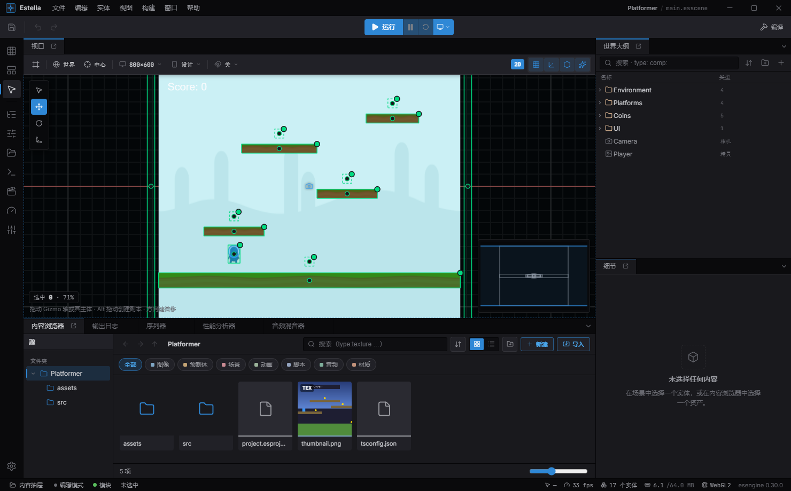
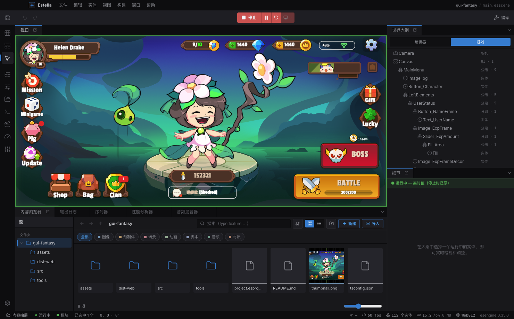
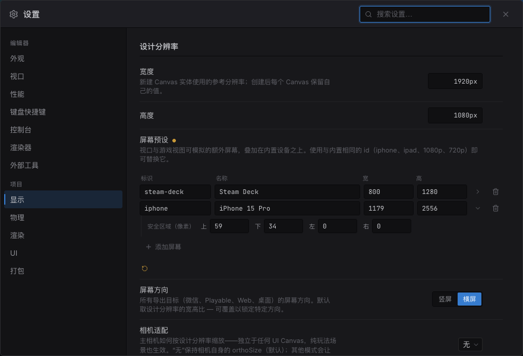
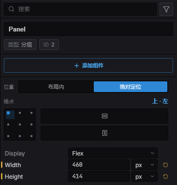
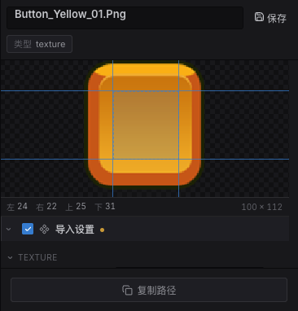

import { Aside } from '@astrojs/starlight/components';

Estella 编辑器是一个桌面应用(Electron + React),带 UE5 风格的**可停靠工作区**。你可视化地搭
场景、在检视器里调组件、绘制瓦片地图、连节点图,并**直接在编辑器里运行游戏**——在一个隔离的
运行时 realm 里,所以运行永远不会弄脏你的场景。

## 启动项目

没有项目打开时,编辑器显示 **启动器(Launcher)**:

- **最近** — 重新打开你做过的项目,带搜索和网格/列表视图。
- **新建项目** — 选一个模板,起名字、选位置,创建。模板分两组:**Starters**
  (**Blank** 模板——只有一个相机的空场景)和 **Examples**(随附的示例项目,
  可直接探索和修改)。

一个项目就是磁盘上的一个文件夹。编辑器关心的几块:

| 路径 | 是什么 |
|---|---|
| `project.esproject` | 项目清单——名字、默认场景、设计分辨率、启用的特性(物理、渲染)、打包。纳入版本控制。 |
| `.esengine/workspace.json` | 编辑器本地状态(上次打开的场景、面板布局)。被 gitignore。 |
| `assets/scenes/*.esscene` | 你的场景。 |
| `assets/…` | 纹理、材质、瓦片集等资产,每个带一个 `.meta` 边车文件。 |
| `src/components.ts` | **声明入口**——编辑器会求值这个模块以及它 import 到的一切,以此认识你的组件。组件定义在哪都行,从这里 re-export 出来即可。见[脚本](/zh-cn/docs/scripting/overview/#声明放在哪里)。 |
| `src/main.ts` | **启动入口**——注册系统的地方。跑游戏的是它;编辑器从不求值它。 |

资产按 UUID(`@uuid:…`)可移植地引用,而不是按路径,所以移动或重命名文件不会断掉引用。

## 工作区



*默认工作区:视口居中,世界大纲与细节在右侧,内容浏览器在底部,运行控制在顶部。*

从外到内的默认布局:

- **活动栏(Activity Bar)** — 最左侧的图标竖条:**编辑模式**(场景 / UI / 瓦片地图)、侧面板、项目设置。
- **菜单栏** — 文件 · 编辑 · 实体 · 视图 · 构建 · 窗口 · 帮助。
- **工具栏** — 保存、撤销/重做、各变换工具、吸附、显示网格、**运行**控制、显示 gizmo、构建。
- **视口**(中央) — 实时 WebGL 场景视图。
- **World Outliner**(右) — 场景的实体层级。
- **Details**(右) — 当前选中项的检视器。
- **内容浏览器** + **输出日志**(底部标签)。
- **状态栏** — 编辑模式、选中项、光标、FPS、draw calls、引擎版本。

面板可停靠——拖动标签即可重排、拆分或浮动,布局会自动保存。你也能用 **Ctrl / ⌘ + Space** 从任
何地方把内容浏览器唤成上滑浮层(*内容抽屉*)。

<Aside type="note">
  运行发生在与你正在编辑的场景**分离的 realm** 里,所以运行中的游戏无法改动你的编辑态世界。
  停止后回到你原本那个场景,分毫不差。
</Aside>

## 视口

视口是你摆放和操作实体的地方。

**导航**

- **平移** — 按住鼠标中键或右键拖动。
- **缩放** — 滚动滚轮(朝光标缩放)。
- **聚焦选中** — 按 **F** 把选中项居中并适配。

**选择**

- **点击**实体选中;**Shift 点击**在多选里切换它。
- 在**空白处**拖动,**框选(marquee)**框内所有实体。
- 按 **Esc** 取消正在进行的拖动,再按清空选择。

**变换** — 从工具栏(或用快捷键)选一个工具,拖动 gizmo 手柄:

| 工具 | 快捷键 | Gizmo |
|---|---|---|
| 选择 | `Q` | 只做拾取/框选,无变换手柄。 |
| 移动 | `W` | 轴向箭头(X / Y)加一个自由移动的中心面。 |
| 旋转 | `E` | 一个旋转环。 |
| 缩放 | `R` | 轴向方块加一个等比缩放中心。 |

拖动手柄会把整个选择当作一体、绕共享轴心变换,每次拖动是一步撤销。**Alt 拖动**选择可复制它并
拖动副本。用**方向键**微移选择(一格;按 **Shift** 为 ×10)。

**对齐与分布**——选中两个或更多实体,视口浮层里会出现一排对齐按钮:对齐**左 / 中 / 右**边和
**上 / 中 / 下**边。选中三个或更多时,另有两个**分布**按钮可把水平或垂直间距均分。每个都是一步
撤销,且对每种实体都有效(精灵、UI 节点、纯 gizmo 实体一视同仁)。

**吸附** — 从视口的吸附下拉里开关吸附,并设置网格步长、旋转角度和缩放增量。

**显示标志(Show Flags)** — 视口下拉可开关网格、gizmo、物理和性能浮层,以及世界/本地轴朝向
和轴心/中心。不渲染的实体——相机、`Light2D`、碰撞体、关节、粒子发射器——在编辑模式下画成
gizmo(图标、视野矩形、光照范围/锥、碰撞体轮廓、关节锚点连线),让你能看见并摆放它们;
多数还带可拖拽的 handle,直接写回字段(灯光半径、碰撞体尺寸、发射器形状、关节锚点)。

## 编辑模式

活动栏顶部三个图标切换**编辑模式**——**场景(Scene)**、**UI**、**瓦片地图(Tilemap)**。模式也会
*跟随你的选择*:选中 `Canvas` 或 `UINode`,编辑器建议 **UI** 模式,选中 `TilemapLayer` 建议**瓦片
地图**模式——只切换该模式的工具和视口辅助,**不会**打乱你的面板布局。要打开某个模式的配套面板
(UI 控件面板、瓦片地图绘制器),点它的活动栏图标或视口里的模式芯片;这也会把该模式**固定**成一个
粘性锁,普通的选中点击不再清掉它——再点一次即可回到跟随选择。

**设计框与设备预览。** 场景是对着**设计分辨率**创作的——一个固定的参考尺寸(比如横屏
`1920 × 1080` 或竖屏 `750 × 1334`)。它是**项目级**的值(项目设置 → 显示),不属于 UI 层:视口的
**Design** 和 **Device** 控件在**每种**编辑模式(场景 / UI / 瓦片地图)都可用,所以纯玩法场景**无需**
UI Canvas 也能在真机上预览。场景里有 Canvas 时,UI 会额外按其缩放模式在框内布局。

- **Design** 下拉(视口工具栏)——设置设计分辨率并成帧到它(可撤销)。有 Canvas 时改的是该 Canvas,
  否则改的是项目值。
- **Device** 下拉——在任意模式选择**目标屏幕**(iPhone / iPad / 1080p …)。编辑时它在场景上画出该
  屏幕宽高比的 letterbox 黑边和安全区;按下**运行**后,运行中的游戏也会被 letterbox 成同一形状——
  视口内运行和 **游戏** 面板都是如此。它不会改动你的设计分辨率,改的是你**透过什么**去看它。
- **方向**(同一下拉)——交换设备的宽和高。它作用于**设备**,所以选中 `设计` 时是禁用的:没有模拟
  任何屏幕,也就没有东西可转。
- **相机适配**(项目设置 → 显示)——**主相机**如何按设计分辨率缩放,独立于任何 UI Canvas。`无`(默认)
  保持相机自身的 orthoSize;其他模式让游戏在每台设备上一致 letterbox,设备预览也随之显示**真实**取景
  (玩法也所见即所得,不止 UI)。

**一个屏幕,编辑与运行一致。** `设计` 这一项是"不模拟"的选择:游戏填满面板给它的空间,这正是面向
桌面创作时想要的。选中任何真实设备,编辑时的叠加层和运行中的游戏都会遵守它的形状——于是一个为手机
创作的项目,不会只能在"面板恰好被拖成的比例"下运行。



### 项目屏幕预设

内置设备清单只是一种猜测。发行到特定硬件的团队可以在**项目设置 → 显示 → 屏幕预设**里修正它:
添加一行,填写标识、名称和竖屏尺寸,它就会出现在下拉中,对每个打开该项目的人生效。

- **标识**是已保存的选择据以解析的键,请保持稳定。使用与内置相同的标识(`iphone`、`ipad`、
  `1080p`、`720p`)会**替换**该内置项而不是并列——工作室正是这样让"iPhone"指向自己实测的那台机器。
- **尺寸按竖屏存储**(宽 ≤ 高),与内置项一致,这样方向开关对每块屏幕的含义都相同。
- **安全区域**(行尾的 ▸ 展开)以设备像素设置刘海 / Home 条的内缩。全部留空则不会写入项目文件——
  视口的 *安全区域* 叠加层对该屏幕也就没有东西可画。



预设保存在 `project.esproject` 中,因此可以随版本控制共享:

```json title="project.esproject"
{
  "screenPresets": [
    { "id": "steam-deck", "label": "Steam Deck", "width": 800, "height": 1280 },
    {
      "id": "iphone", "label": "iPhone 15 Pro", "width": 1179, "height": 2556,
      "safe": { "top": 59, "bottom": 34, "left": 0, "right": 0 }
    }
  ]
}
```

## 搭建场景

### 创建实体

有好几种加实体的方式:

- **实体 → 添加实体**(或工具栏)放下一个空白 Transform 实体。
- **创建…** 打开一个生成实体的命令面板:内置类型——**空**、**精灵**、**相机**、**粒子**、
  **光**、**瓦片地图**、**Spine**、**音频**、**文本**、**形状**、**网格**、**拖尾**,以及
  **UI** 控件(画布加控件)——**你自己项目里定义的组件**,还有项目中任意 **`.esprefab` 预制体**。
  所有创建入口(此菜单、拖拽、自动化接口)都走同一条管线,因此每次生成都是一步撤销。
- **在 Outliner 里右键**在上下文里做同样的事,外加文件夹、父子关系和预制体创建。
- **从内容浏览器拖拽** — 拖一张图生成精灵,或拖一个 `.esprefab` 实例化它。

### World Outliner

Outliner 是场景的层级。你可以:

- 把实体拖到彼此上重设父子,并用**文件夹**归类。
- **按名跳转** — 树聚焦时,输入名字的前几个字母即可跳到匹配的实体。
- 用 `F2` **重命名**、`mod + D` **复制**、`Delete` **删除**。
- **隐藏/显示**和**锁定/解锁**实体(与组件在运行时是否 enabled 解耦)。隐藏是把实体从编辑视口里
  拿掉——精灵、骨架、瓦片图、粒子、灯光一概如此——而不改动游戏真正加载的场景。锁定则仍然可见、可选中,
  只是不再有把手:视口不会拾取它,变换 Gizmo 也不会为它出现。
- 从选择**创建预制体**,再把实例拖回场景。

### Details 面板

Details 是选中项的检视器。它列出实体上的每个组件及其字段——由引擎的反射元数据驱动,所以范围、
单位、枚举和 tooltip 都直接来自组件定义。加组件、改值,都会实时写回场景。编辑时字段会强制其
约束:**必填**字段为空时会被标红,数值字段写入时按声明范围 clamp,拖资产到槽位时类型不匹配会被
拒绝。

每个组件都是一个**可折叠区**,而且面板会记住你折了哪些——跨重新选择*以及*编辑器重启——所以检视器
会保持你离开时的整洁。很少动的"周边"(某个控件的 `Focusable` 与 `ThemeStyle` 标签)默认折叠。

当可视化控件比一排裸数字更清楚时,Details 会显示一个**专用控件**——大多用于 UI 节点:

- 用于绝对定位 `UINode` 的**锚点**控件:一个可点击的 **3×3 网格**,对应九个点锚
  (左 / 中 / 右 × 上 / 中 / 下),每个轴另带一个 **Stretch(拉伸)**开关;
- 用于 `FlexContainer` 的 **flex**(自动布局)控件:**方向**(横向 / 纵向及其反转)、一个
  一点即设主轴与交叉轴对齐的 **3×3 对齐网格**、主轴**分布**(紧凑 / 两端 / 环绕 / 均匀),以及
  **换行 / 填满**开关——**内边距**用一个四边 `sides` 控件编辑;
- 一个内联 **Controllers(控制器)条**,把逐节点的状态创作拉进检视器:选一个状态页、给字段
  *挂齿轮*绑定,全程不用离开面板(见 [UI 控制器](/docs/zh-cn/ui/controllers/));
- 对**材质**,一个 **Shader** 选择器,用于切换绑定的着色器——内置模板或项目里的 `.esshader`——见
  [材质与着色器](/docs/zh-cn/graphics/materials/#在编辑器里选取与共享着色器)。



*一个 UI 节点的检视器:**布局内 / 绝对**切换、可点击的 **3×3 锚点网格**(每轴带 Stretch),以及 `Display: Flex`——用可视化控件取代裸数字。*

Details 同时是**资产检视器**:在内容浏览器里选中一个资产,即可编辑其导入设置,或(对材质)
编辑其参数。

**拖拽九宫格边框。** 纹理的切片边框决定了 `NineSlice` 面板在哪里保持四角锐利,而填四个数字
等于在猜。改为选中纹理后直接在预览图上拖动四条参考线——数值字段会同步,于是你可以先目测调好
其余边,再精确微调某一条。

导入设置描述的是**资产**本身,而不是恰好用到它的场景;它们现在会抵达纹理被绘制的每一处:
编辑视口、运行时(视口内运行与游戏面板)、以及打包后的构建。创作时切片正确的框,在发布的
游戏里同样正确。



## 内容浏览器

内容浏览器是你项目的资产浏览器。它的**创建**菜单就地新建资产:

- 新建场景、新建动画、新建输入映射、新建材质、新建材质图、**新建着色器**、新建状态机、新建行为树、**新建脚本…**、新建文件夹。
- 按资产类型的上下文动作:**创建瓦片集**(从纹理)、**创建瓦片地图**(从瓦片集)、
  **创建材质实例**(从材质)。

**新建脚本…** 是唯一一个不止写一个文件的:没人 import 的模块永远不会被打包,它的组件
也永远进不了 Add Component,所以对话框还会在项目的脚本入口里加上够到它的那一行——加到
哪个入口,取决于你建的是组件还是系统。见
[脚本编写](/docs/zh-cn/scripting/overview/#新建脚本对话框)。

**导入**可从访达/资源管理器把文件拖进来,或用"导入…"。每个资产首次出现时会得到一个 `.meta`
边车。按资产的上下文动作包括重命名、复制、复制路径、复制引用、**查找引用**、在文件管理器中
显示、删除。重命名、移动和复制各会弹出一个带**撤销**按钮的 toast——而且重命名或移动资产会
改写每个已打开文档里对它的引用,所以不会留下悬空引用。**删除**会先列出引用该文件的每个场景、
预制件和资产(让你清楚会破坏什么),再把文件移进系统回收站——仍可用撤销复原。文件夹树完全
可用键盘操作——方向键行走与折叠/展开,Enter 进入文件夹。

**查找引用**——右键一个资产,或点击检视器资产详情里的引用计数——会列出一张纹理、材质、
预制件或场景被引用的所有位置,横跨磁盘上的依赖图**以及**尚未保存的打开场景。

## 编辑器内运行

工具栏里的**运行**控制驱动你的游戏:

- **运行**启动游戏;运行时同一个按钮变成**停止**,旁边是**重启**和**暂停/继续**侧键。
- 运行模式下拉选择**在视口中运行**(游戏托管在视口上)或**在新窗口运行**(专门的 **Game** 标签),
  并可切换**运行时最大化视口**——把整个工作区让给运行中的游戏,停止时还原你的布局。
- 运行中的游戏在视口四周显示一圈柔和的强调色边框(暂停时转琥珀色并压暗画面),而不是盖在游戏上的角标。
- 快捷键:**F5** 运行,**Esc** 停止,**F6** 暂停/继续,**Shift+F5** 重启,**F11** 随时最大化/还原视口。

因为运行用的是隔离 realm——正是发布你游戏的那套运行时——你在运行里看到的,就是玩家会得到的。

## 自动保存与恢复

编辑器会定期快照你**未保存**的文档——仅在存在未保存改动且没有 Play 会话运行时——所以崩溃或
断电最多只损失最近片刻的工作。快照保存在项目的工作区文件夹里,永远不算作真正的保存。下次
打开项目时,如果某个快照比磁盘上的文件更新,编辑器会提议**恢复**它;保存文档就会让它的快照
失效。这与崩溃 minidump、以及 GPU 渲染进程丢失时的自动重载并存。

## 专用编辑器

在内容浏览器里双击一个资产,即可在文档标签里打开它的编辑器。

- **Sequencer** — 关键帧动画的时间轴/曲线编辑器。见 [时间轴](/docs/zh-cn/animation/timeline/)。
- **瓦片地图画笔** — **画笔、擦除、矩形、直线、油漆桶、选区、吸管**和**地形(autotile)**等工具,
  外加图章 **水平翻转 / 垂直翻转 / 旋转 90°**(画笔工具激活时按 `H` / `V` / `R`)和一个
  **随机散布模式**(`D`)。调色板用方向键选择(`Shift` 扩成多瓦片图章),地图可以是
  **正交、等距、交错或六边形**。见 [瓦片地图](/docs/zh-cn/world/tilemaps/)。
- **瓦片集编辑器** — 创作每瓦片的**碰撞**(盒 / 圆 / 多边形、斜坡预设;单向 / 传感器 / 材质
  修饰),并可在放大的瓦片上**直接操纵**编辑形状:拖圆的**圆心或半径**、给多边形**点击加点 /
  拖动 / 点击删点**编辑**顶点**、给**单向**平台挑选实心的一侧(上 / 下 / 左 / 右)——调整大小会
  保留传感器 / 材质 / 密度等修饰。此外还有 autotile 用的**地形**集(edge/corner 邻接或多色
  **角 Wang**)、逐瓦片**概率**权重与属性,以及**动画瓦片**——拖动帧缩略图**重排**,或把整段
  循环设成**一个统一时长**,带实时预览。
- **状态机**(`.esfsm`)和**行为树**(`.esbt`)编辑器 — AI 的可视化图。见
  [游戏 AI](/docs/zh-cn/gameplay/ai/)。
- **材质图**(`.esmatgraph`) — 编译成着色器的节点编辑器。见
  [材质与着色器](/docs/zh-cn/graphics/materials/)。

状态机和行为树编辑器共享一块公共节点画布:**中键拖动**平移,**滚轮**朝光标缩放,把一个输出手柄
拖到另一个节点上连线,点击选中节点或边,**Delete** 删除,右键画布在光标处添加节点。

## 项目设置

用 **Ctrl / ⌘ + ,** 或活动栏的齿轮打开设置。设置分组:

- **编辑器** — 外观(**语言**、强调色、UI 缩放)、视口(网格、吸附、gizmo)、**键盘快捷键**(下面每个快捷键
  都能在这里重绑)、控制台。
- **项目**(存进 `project.esproject`):
  - **显示** — 项目设计分辨率(播种新 Canvas + 驱动任意场景的设备预览)、项目级的**屏幕方向**
    (所有导出目标都遵循它;留空则从设计分辨率的宽高比推导),以及**相机适配**(主相机如何在无 UI
    Canvas 的情况下按设计分辨率缩放;`无`=关闭)。
  - **UI** — 项目的控件**主题**(深色 / 浅色)与逐角色的**主题颜色**覆盖,在编辑器、Play
    和所有导出里一致生效。见 [UI 控件——主题](/docs/zh-cn/ui/widgets/#主题)。
  - **物理** — 启用、重力、十六个碰撞层名字和一个 16×16 碰撞矩阵,以及解算器调参(固定时间步、
    子步、接触 Hz/阻尼/推出速度、允许睡眠、连续碰撞)。见 [物理](/docs/zh-cn/gameplay/physics/)。
  - **渲染** — 最多三十二个命名排序层,填充检视器里的层下拉,以及其中哪些参与 Y 轴排序。
    名字只是建议,不是上限:渲染组件的 `layer` 照样接受名单以外的数字。
  - **打包** — 每目标元数据:微信 AppID、桌面应用 id / 产品名。

### 编辑器语言

编辑器内置 **English** 和 **简体中文**,首次启动跟随系统语言。在 **设置 → 外观 → 语言** 切换——
更改在重新加载后生效(编辑器会弹出提示)。编辑器界面文案跑在与游戏运行时相同的
[本地化引擎](/docs/zh-cn/assets/localization/)上。

## 键盘快捷键

`mod` 在 macOS 上是 **⌘**,其他平台是 **Ctrl**。以下全部可在设置 → 键盘快捷键里重绑。

| 动作 | 快捷键 |
|---|---|
| 新建场景 | `mod + N` |
| 打开项目 | `mod + O` |
| 保存场景 | `mod + S` |
| 场景另存为 | `mod + shift + S` |
| 撤销 / 重做 | `mod + Z` / `mod + shift + Z` |
| 复制(duplicate) | `mod + D` |
| 拷贝 / 剪切 / 粘贴 | `mod + C` / `mod + X` / `mod + V` |
| 删除 | `Delete` / `Backspace` |
| 全选 | `mod + A` |
| 选择 / 移动 / 旋转 / 缩放 工具 | `Q` / `W` / `E` / `R` |
| 微移选择(按 Shift ×10) | 方向键 |
| 聚焦选中 | `F` |
| 运行 · 停止 | `F5` · `Esc` |
| 暂停/继续 · 重启 | `F6` · `shift + F5` |
| 最大化 / 还原视口 | `F11` |
| 命令面板 | `mod + shift + P` |
| 内容抽屉 | `Ctrl + Space` |
| 项目设置 | `mod + ,` |

**命令面板**(`mod + shift + P`)对每一条可运行命令做模糊搜索——不用翻菜单,直达任何操作的最快方式。

在命令快捷键之外,编辑器整体都可用键盘导航:菜单与右键菜单用方向键移动(还有输入即跳、
Home/End、`→` / `←` 进出子菜单),Outliner 输入名字即跳转,内容浏览器的文件夹树和瓦片
调色板都用方向键行走,键盘焦点始终有可见的焦点环。

<Aside type="tip">
  用于无头自动化和 AI 代理,编辑器还暴露了一个 `EditorControlSurface`(加载场景、步进模拟、读取
  场景树/检视器、抓取视口),通过一个 MCP server 提供——这是一个由脚本驱动的开发/自动化面,与上面
  的可视化编辑器分开。
</Aside>

## 参见

- [场景](/docs/zh-cn/world/scenes/) —— 一个 `.esscene` 里有什么、如何加载。
- [脚本](/docs/zh-cn/scripting/overview/) —— 项目组件会自动出现在检视器里。
- [预制体](/docs/zh-cn/world/prefabs/) —— 带逐实例覆盖的可复用实体模板。
- [构建与导出](/docs/zh-cn/publishing/overview/) —— 把项目发布到 Web、微信或可玩广告。
