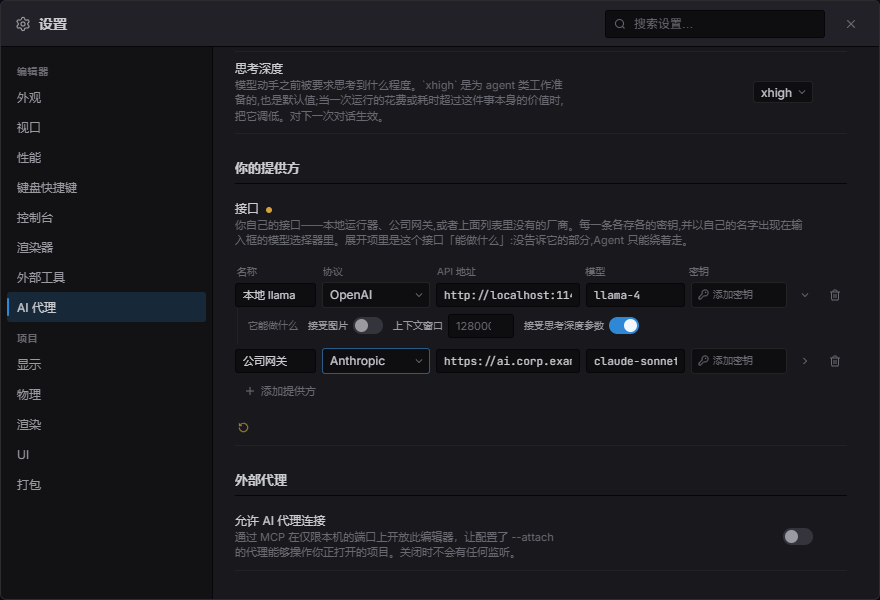
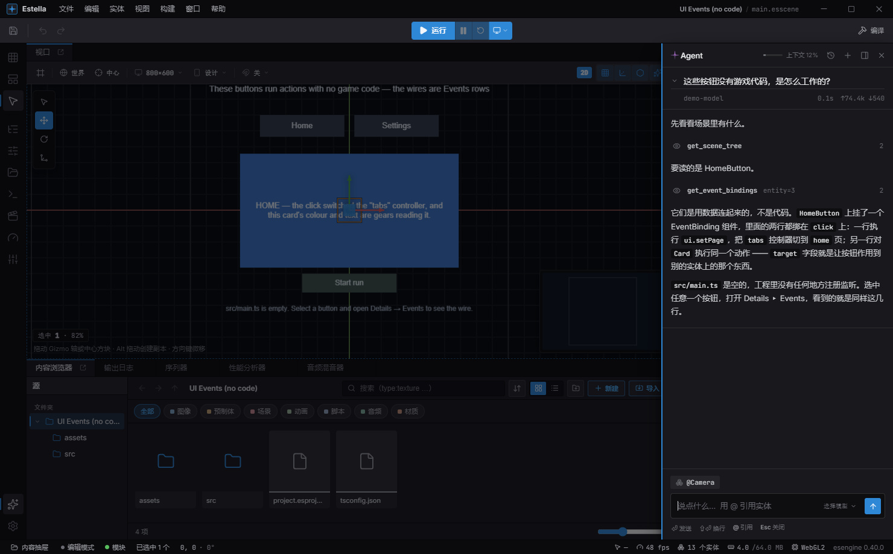
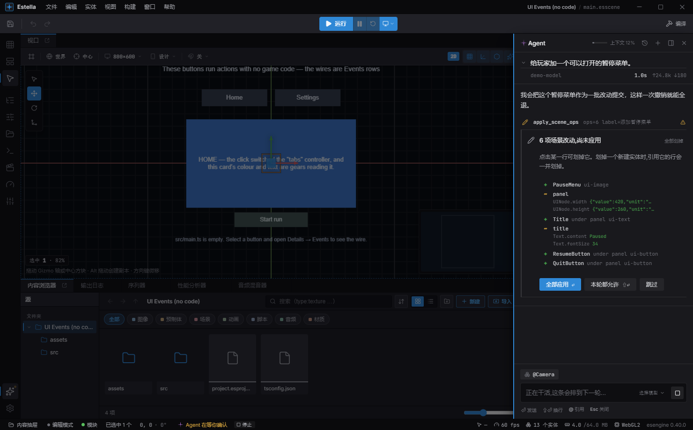

import { Aside, Steps } from '@astrojs/starlight/components';

编辑器自带一个 Agent。你打一句话，它读场景、调用编辑器 UI 调用的同一批工具，
并把每一次调用都摊在你眼前。它不是编辑器的另一份复制品：它驱动的工具目录，
和[外部 MCP 客户端](/docs/zh-cn/guides/mcp/)驱动的是同一份——它能做什么，
和编辑器能做什么，是一张清单。

<Aside type="tip">
它就在你原本工作的那个窗口里。它的改动落在你的场景上，你的撤销能收回它们，
你随时可以把鼠标拿回来。
</Aside>

## 先给它一个模型

编辑器不附带任何密钥，也不会自己发起任何调用。打开**设置 ▸ AI 代理**，
配好一个提供方，配置就算做完了。

<Steps>

1. 填入 Anthropic 或 DeepSeek 的 **API 密钥**。每个提供方各存各的，
   所以切回上周用过的那个不用重新输入。

2. 或者填**自定义提供方**：任何兼容 Anthropic 的接口地址，加上它提供的模型名。
   这些名字会出现在输入框旁边的模型选择器里。

3. 关掉设置。模型选择器就在你打字的那个框旁边——它是**逐条消息**的选择，
   而不是埋在对话框里的偏好设置。

</Steps>

<Aside type="tip" title="密钥存在哪">
存在系统钥匙串里。它不写进项目、不写进设置文件，也不会交回给编辑器窗口——
只交给那个必须发送它的客户端。
</Aside>

## 问它点什么

打开命令面板（`Ctrl/Cmd+Shift+P`）执行 **Agent：打开**。或者干脆跳过这一步：
直接把问题打进命令面板。凡是读起来像一句话而不像命令的输入，面板都会给出
**交给 Agent**，按 `Enter` 就发出去了。

一轮对话从上往下读：

- **问题**，旁边是回答它的模型、耗时，以及花掉的 token。
- **每次工具调用一行**——`get_scene_tree`、`get_event_bindings`——带上参数和
  返回的条数。这部分才是值得读的：它决定了你拿到的是**关于你这个场景**的回答，
  还是一段泛泛而谈。
- **回答**。

在输入框里，用 `@` 可以按名字引用实体，省得你去描述指的是哪一个。你也可以
拖入或粘贴**图片**——一张设计稿、一张 bug 截图——在接口支持图片时它会随问题
一起发出去。它干活期间，状态栏上会有一条实时的段落，带**停止**按钮，
所以抽屉关着也看得见进度、也随时能叫停。

## 哪些事它不用问就能做

分级是按**撤销在哪里失效**划的，这也是它值得你知道的原因：

| 层级 | 例子 | 会发生什么 |
| --- | --- | --- |
| 只读 | `get_scene_tree`、`get_inspector`、`capture_viewport` | 直接跑，从不询问。 |
| 可撤销 | 新建、删除、`set_field`、改父子、刷瓦片 | 直接跑。整一轮外面套着一个检查点，一次**撤销**就能全退。 |
| 不可逆 | 写文件、导出构建、保存、`run_editor_command` | **一定先问**。事后撤销救不了你。 |

所以你给出的许可并不是逐条改动的许可——它就是撤销按钮，而且作用于**整一轮**。
一轮跑完且确实改了东西时，记录下面会留一条**撤销 / 保留**的横条；
如果你自己之后又编辑过，它会提示你——因为那时撤销会把你自己的活也一并退回。

## 大批改动落地之前

有一个可撤销的工具仍然会停下来问，而且不是出于安全：`apply_scene_ops`
一次调用就能搭出一整棵子树，上百个节点的改动值得在落地**之前**看一眼，
而不是事后再读回来。

每一行就是一项改动。点一行可以**划掉**它——划掉一个新建实体时，
引用它的行会一并划掉——然后应用剩下的。**本轮都允许**会让它在这一轮里
不再询问，这正是让一次长时间搭建不至于变成一百次弹窗的东西；下一轮会重新问。

拒绝也不是死路：Agent 会被告知这一步被跳过了，然后绕开它继续。

## 对话跟着项目一起保存

跑完的对话会和项目存在一起——记录，以及模型对它的记忆。**历史对话**里列着它们，
挑一段就能从当时停下的地方接着聊。在一段打开的对话里继续提问，
前面建立起来的东西都还在。

一段长对话里有两件事值得知道：

- 抽屉顶部的**上下文刻度**表示模型的窗口用掉了多少。超过阈值后，
  最早的几轮会被*折叠出它的记忆*：你问过的话原样保留，工具调用和结果不保留。
  记录里仍然显示着它们——只是模型读不到了。发生这件事时，抽屉会在发生的那一行说出来。
- **一段对话属于回答它的那个模型。** 切换模型会结束当前这段并重新开始。
  它对场景做过的改动仍然保留。

你还可以**换个说法重新提问**某一轮：它会丢弃那一轮以及之后的所有内容，然后重问。
当三条消息之前就跑偏了、而你不想再靠聊天把它拉回来时，这个很好用。

<Aside type="caution">
和任何模型一样，它可能非常自信地说错——最常见的是关于它好几轮之前读到的状态。
当一个回答是在**描述**你的场景而不是在推理时，让它重新读一遍，别信那段转述。
这也正是工具调用行摆在明面上的原因：它们显示的是它真正看过的东西。
</Aside>

## 参见

- [AI 代理 (MCP)](/docs/zh-cn/guides/mcp/) —— 同一份工具目录，
  只不过是从 Claude Code、Cursor 或你自己的代理去驱动，而不是从编辑器内部。
- [事件绑定](/docs/zh-cn/guides/events/) —— 你要求"不写代码的行为"时，Agent 会去用的东西。
- [预制体](/docs/zh-cn/guides/prefab/) —— 在预制体模式下，Agent 编辑的是预制体而不是场景。
  要它做大改动之前，先确认它正在编辑的是哪个文档。
