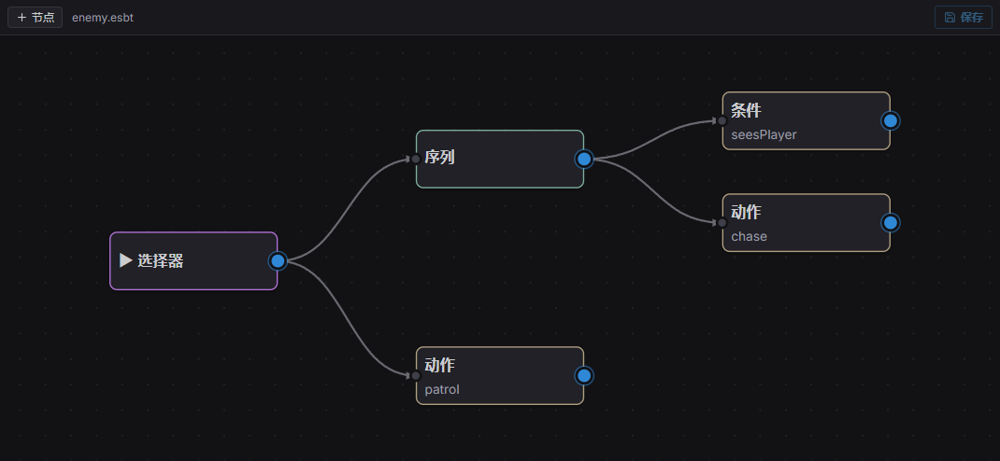

*行为树编辑器:**Selector** 根之下是一个 **Sequence**(Condition `seesPlayer` → Action `chase`),外加兜底的 `patrol` 动作。*

行为树每帧从**根**开始 tick 并返回一个 `Status`。组合节点控制流程;装饰器变换其唯一子节点的
结果;叶子是你注册的动作和条件。加一个 `BehaviorTreeAgent`:

```typescript
import { BehaviorTreeAgent } from 'esengine';

cmds.spawn()
  .insert(NavAgent, {})
  .insert(Perception, {})
  .insert(BehaviorTreeAgent, { bt: 'assets/ai/enemy.esbt' });   // 一个编辑器编排的资产
```

| `BehaviorTreeAgent` 字段 | 说明 |
|---|---|
| `bt` | 要运行的树的 key:一个 `registerBt` 名字**或**一个 `.esbt` 资产路径。 |
| `status` | 上一次根状态,每 tick 写入(只读)。 |

在编辑器里可视化编排这棵树,或用 `registerBt` 用代码构建:

```typescript
import { registerBt } from 'esengine';

registerBt('guard', {
  root: {
    type: 'selector',            // 从左到右尝试子节点,直到一个成功
    children: [
      {
        type: 'sequence',        // 全部按序成功
        children: [
          { type: 'condition', name: 'seesPlayer' },
          { type: 'action', name: 'chase' },
        ],
      },
      { type: 'action', name: 'patrol' },
    ],
  },
});
```

节点类型:

| 类别 | 类型 | 行为 |
|---|---|---|
| 组合 | `sequence` | 按序 tick 子节点;第一个失败即失败,全部成功才成功。 |
| | `selector` | 按序 tick 子节点;第一个成功即成功,全部失败才失败。 |
| | `parallel` | tick 全部子节点;`policy: 'one'` 任一成功即成功,`'all'`(默认)全部成功才成功。 |
| 装饰器 | `inverter` | 反转子节点的成功/失败。 |
| | `succeeder` | 总是报告 Success。 |
| | `repeater` | 把子节点重跑 `count` 次(`0` = 永远)。 |
| | `wait` | 运行 `seconds` 秒后报告 Success。 |
| 叶子 | `action` | 运行已注册动作 `name`;它的 `Status`(void 则为 `Success`)向上传播。 |
| | `condition` | 已注册条件 `name` 为真时返回 `Success`,否则 `Failure`。 |
