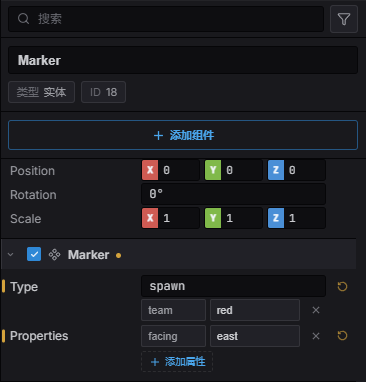

import { Aside } from '@astrojs/starlight/components';

**Marker(标记)** 是一个命名的玩法关注点——出生点、路点、门、拾取位置——在编辑器里作为
一个真实的 ECS 实体放置。**Trigger Area(触发区)** 则是 Marker 加一个传感器碰撞体:一块
区域,当有刚体进入时触发重叠事件。二者合起来就是 Estella 现代的“对象层”:玩法对象不再是一个
要经加载器读取的并行数据结构,而是你能选中、在 Inspector 里编辑、随场景序列化、用
`Query(Marker)` 读取的普通实体。

## 工作原理

Marker 就是 `Marker` 组件(一个 `type` 字符串加一个自由形式的 `properties` 映射),挂在一个
同时带 `Transform` 的实体上。单独存在时它是一个点——游戏通过查询某个 `type` 的标记来问“该在
哪里生成玩家?”。给同一个实体加上一个静态 [`RigidBody`](/docs/zh-cn/gameplay/physics/) 和一个
传感器碰撞体,它就变成一块触发区;**Trigger Area** 预设会替你把这些一次接好。

因为 Marker 是纯 ECS,没有任何特殊的东西要加载或解析:

- 它和任何组件一样**随场景序列化**。
- 它出现在 **Inspector** 里,包括一个键→值属性编辑器。
- 它**可 `Query`**——同一条代码路径既读你手工放置的标记,*也*读从
  [Tiled](/docs/zh-cn/world/tilemaps/) `.tmj` 对象层导入的标记。

`type` 的词汇完全由你定义:`spawn`、`waypoint`、`door`、`chest`、`checkpoint`——字符串的含义由
游戏说了算。

## 安装

`Marker` 在主 `esengine` barrel 里——放置或查询它无需任何插件。**Trigger Area** 带一个传感器
碰撞体,因此需要[物理](/docs/zh-cn/gameplay/physics/):在编辑器和 Web 运行时,当场景用到物理
组件时物理模块会自动加载;在自定义 app 里,请自己加上插件:

```typescript
import { PhysicsPlugin } from 'esengine/physics';

app.addPlugin(new PhysicsPlugin('physics.js'));
```

## 在编辑器里放置

**Create → Common → Marker** 在场景原点放一个命名点;**Create → Physics → Trigger Area**
放一块传感区域(Transform + 静态 RigidBody + 传感器 BoxCollider + Marker)。Marker 在视口里显示
一个**图钉 gizmo**;Trigger Area 还会画出它的碰撞体轮廓,你用与任何其他刚体相同的
[碰撞体 gizmo](/docs/zh-cn/gameplay/physics/) 来塑形。

在 Inspector 里设置标记的 **Type**,并添加任意多个自定义 **properties**(一个键→值映射——
`targetScene: "level2"`、`team: "red"` 等等)。二者都能存/读并进入构建。



*Inspector 里的一个 `spawn` 标记:**Type** 驱动 `Query(Marker)`,每一行 **Properties** 就是
自由形式 string→string 映射里的一条。*

## 快速上手

在编辑器里放几个 `spawn` 类型的 Marker,然后在启动时读取它们来放置玩家:

```typescript
import { defineSystem, Commands, Query, Marker, Transform } from 'esengine';

// 只跑一次:找到每个 spawn 标记,把玩家放到第一个上。
const placePlayer = defineSystem([Commands(), Query(Marker, Transform)], (cmds, markers) => {
  for (const [entity, marker, transform] of markers) {
    if (marker.type !== 'spawn') continue;
    cmds.spawn().insert(Transform, { position: { ...transform.position } });
    // ……然后链式 .insert(Player, {…})、.insert(Sprite, {…}) 等等。
    break;
  }
});
```

`marker.properties` 携带逐标记的数据——像读普通字符串一样读 `marker.properties.targetScene`、
`marker.properties.team` 等等。

## `Marker` 组件参考

| 属性 | 类型 | 默认值 | 说明 |
|---|---|---|---|
| `type` | string | `''` | 玩法身份——标记的种类(`spawn`、`waypoint`、`door` 等)。`Query(Marker)` 据此筛选。自由形式,词汇由游戏定义。 |
| `properties` | `Record<string, string>` | `{}` | 任意的逐标记数据(`team`、`targetScene`、`event` 等),在 Inspector 里作为键→值映射编辑。导入的 `.tmj` 对象属性也落到这里。 |

<Aside type="note">
  `properties` 的值都是**字符串**。在读取处自行解析(`Number(marker.properties.hp)`、
  `marker.properties.locked === 'true'`)——编辑器存的是你键入的原文。
</Aside>

## 触发区(Trigger Areas)

**Trigger Area** 是传感区域的 Create 预设:一个 `Transform`、一个静态 `RigidBody`
(`bodyType: 0`)、一个 `isSensor: true` 的 `BoxCollider`,加一个 `Marker`。因为碰撞体是传感器,
它检测重叠但**不产生**物理响应——没有东西会从触发区弹开;它只报告谁进来了。

从 `PhysicsEvents` 资源读取进入与离开。每个传感事件都给出 `sensorEntity`(触发区)和
`visitorEntity`(穿过它的刚体),于是你可以查出触发区的 `Marker` 来决定它做什么:

```typescript
import { defineSystem, Res, Query, Marker } from 'esengine';
import { PhysicsEvents } from 'esengine/physics';

const onTrigger = defineSystem([Res(PhysicsEvents), Query(Marker)], (events, markers) => {
  const markerOf = (e) => {
    for (const [entity, marker] of markers) if (entity === e) return marker;
    return null;
  };
  for (const s of events.sensorEnters) {
    const m = markerOf(s.sensorEntity);
    if (m?.type === 'door') loadScene(m.properties.targetScene);
    if (m?.type === 'hazard') damage(s.visitorEntity, Number(m.properties.dps));
  }
  for (const s of events.sensorExits) { /* 离开区域——清除某个效果等 */ }
});
```

在繁忙的世界里让传感器保持廉价:把触发区和应当感知它们的刚体放到专门的
[碰撞层](/docs/zh-cn/gameplay/physics/#碰撞过滤)上,让每个传感器的掩码收窄它要考虑的范围。完整
事件面见 [碰撞与传感事件](/docs/zh-cn/gameplay/physics/#碰撞与传感事件)。

## 从 Tiled 导入

当 [`Tilemap`](/docs/zh-cn/world/tilemaps/) 加载一张 `.tmj` 地图时,它的**对象层**汇聚到你
手工创建的同一批实体上——没有单独的结构要遍历:

| Tiled 对象 | 变成 |
|---|---|
| **点(Point)** | 一个 `Marker`(它的 `type` = Tiled 的 class,它的自定义属性 → `Marker.properties`)。 |
| **矩形 / 椭圆 / 多边形 / 折线** | 一块触发 **Region**——一个 `Marker` 加一个匹配的传感器碰撞体(当对象组名为 `collision` 时则是实心几何体)。 |
| **瓦片对象**(带 gid) | 地图的一个精灵子实体。 |

于是一条 `Query(Marker)` 就能读到出生点,无论你是在 Estella 编辑器里放的还是在 Tiled 里画的。
(导入的对象在每次加载时从 `.tmj` 重新派生,因此只在播放模式存在;手工创建的 Marker 是普通的
序列化实体。)如果你需要某个形状的精确顶点,原始的对象组数据仍可经 `getTilemapSource` 取得。

## 最佳实践

- **用 type 表角色,用 properties 表细节。** 让游戏 switch 的 `type` 值保持小而稳定,把易变的
  数据放进 `properties`——不要给每个实例都起一个新 `type`。
- **能查一次就查一次。** 出生点、路点图、巡逻路线通常在场景开始时读一次;缓存结果,别每帧重查。
- **复用同一套标记词汇**,横跨手工创建的场景与导入的 Tiled 地图——查询代码不关心标记从哪来。
- **Trigger Area 是传感器**——要*挡住*的东西(墙、台沿),请画一块
  [碰撞层](/docs/zh-cn/world/tilemaps/#碰撞障碍层)或用非传感器碰撞体。

## 参见

- [瓦片地图](/docs/zh-cn/world/tilemaps/) —— 碰撞(障碍)层与喂给同一批 Marker 的 Tiled 对象层。
- [物理](/docs/zh-cn/gameplay/physics/) —— 传感器、碰撞过滤,以及 Trigger Area 背后的 `PhysicsEvents` 资源。
- [场景](/docs/zh-cn/world/scenes/) —— Marker 与 Trigger Area 随场景序列化。
- [事件绑定](/docs/zh-cn/scripting/events/) —— 有东西进入 Trigger Area 时执行一个动作，直接挂在触发区上，不写代码。
