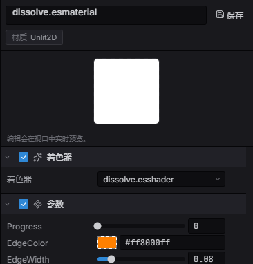

import { Aside } from '@astrojs/starlight/components';

材质是**着色器加参数**。支持材质的渲染器——`Sprite`、`SpineAnimation`、`ParticleEmitter`、
`Mesh2D` 和 `UIVisual`——都暴露一个 `material` 句柄字段;设置它就用你自己的着色器绘制,而非默认。

## 工作原理

你编写一个 `.esshader`,用 `#pragma param` 声明它可调的参数。引擎把它们**反射**进一个
std140 uniform 块,于是 CPU 能按名字设置、并安全地送到 GPU。一个 `Material` 把编译好的
着色器绑定到一组参数值;把它的句柄赋给渲染器的 `material` 字段,就用它来绘制该渲染器。

## 内置着色器模板

你很少需要从空白文件开始。内容浏览器的 **New Material** 子菜单从内置模板创建材质——
同一份清单在代码里是 `BUILTIN_SHADER_TEMPLATES`:

| 模板 | `builtin:` id | 作用 |
|---|---|---|
| **Unlit** | `sprite-unlit` | 纹理 × 顶点色 × `u_tint`,普通默认。 |
| **Lit** | `sprite-lit` | 被场景 2D 灯光照亮;`u_tint` + 可选 `u_normalMap`。 |
| **Hit Flash** | `sprite-hit-flash` | 按 `u_flash` 混向 `u_flashColor`——代码里驱动它做受击闪白。 |
| **Outline** | `sprite-outline` | 彩色剪影描边(`u_outlineColor`、`u_outlineWidth`,单位纹素)。 |
| **Dissolve** | `sprite-dissolve` | 噪声烧蚀 + 发光边缘(`u_progress` 0→1)。 |
| **Pixelate** | `sprite-pixelate` | UV 量化到 `u_pixels` 网格。 |
| **UV Scroll** | `sprite-uv-scroll` | 按 `u_scrollSpeed` × 时间滚动纹理。 |

新建材质是**按 id 引用**其模板的——它存的是 `shader: "builtin:sprite-unlit"`,并**不会**在磁盘上
写出 shader 文件。引擎从内置源码编译该模板(运行时加载器、cook 步骤、编辑器三处以同样方式解析
`builtin:<id>`),所以新材质立即就能绘制,无需额外管理。只有当你把材质**转为独立着色器**(见下文)
或自己**新建着色器**时,才会有真正的 `.esshader` 落到磁盘上。

## 在编辑器里选取与共享着色器

在内容浏览器里选中一个材质,Details 面板会打开它的检视器,顶部(参数上方)是一个 **Shader** 区。
**Shader** 下拉框列出每个内置模板(显示为 *Built-in · Unlit*、*Built-in · Lit* ……)以及项目里
每个 `.esshader`——选一个即可给材质重新绑定着色器。



*材质检视器:**Shader** 区及其选择器(这里是 `dissolve.esshader`),下方是从该着色器 `#pragma param` 反射出的**参数**。*

切换会重跑着色器反射:下方的参数列表按新着色器的 `#pragma param` 重建,所以检视器始终与当前绑定的
着色器一致。由于旧着色器的参数不再适用,**切换会清空材质的参数值**——请为新效果重新调参。

- **在多个材质间共享一个着色器。** `.esshader` 是一等资源(徽标 **SHD**)。让多个材质指向*同一个*
  `.esshader` 文件,它们就共享同一份编译后的着色器——改一次源码,所有引用它的材质一起更新。这正是
  选择器把项目着色器和内置模板并列的意义。
- **Convert to Unique Shader(转为独立着色器)。** 当材质还引用着 `builtin:` 模板时,该区会显示一个
  **Convert to Unique Shader** 按钮。它把内置源码复制成材质旁边一个可编辑的 `<material>.esshader`,
  并把材质重新指向它——参数值会保留。想手改内置效果时就用它。
- **New Shader(新建着色器)。** 想从零写着色器,用内容浏览器的 **New Shader** 入口(一个子菜单——
  选一个内置模板作为起点)。它会写出一个独立的 `.esshader`,之后可在任意材质的 Shader 下拉框里选中。

<Aside type="note">
  材质把着色器存为**相对于材质自身**的路径(或一个 `builtin:` id),而不是 `@uuid`。若被引用的
  `.esshader` 被改名或移走,Shader 区会把该引用标记为缺失,你在那里重新选一次即可。
</Aside>

## `.esshader` 格式

一个文件容纳所有 stage 与元数据,用 pragma 分段:

| Pragma | 含义 |
|---|---|
| `#pragma shader "Name"` | 显示名。 |
| `#pragma version 300 es` | 每个 stage 的 GLSL 版本行。 |
| `#pragma domain <D>` | `Unlit2D`(默认)、`Lit2D`、`PostProcess`、`UI`。`Lit2D` 注入光照 uniform + helper。 |
| `#pragma param …` | 反射的材质参数(见下表)。 |
| `#pragma switch NAME [default(on)]` | 材质可控的静态排列开关(一个 `#define`)。 |
| `#pragma feature NAME` | 引擎选择的编译期变体关键字。 |
| `#pragma vertex` / `#pragma fragment` … `#pragma end` | Stage 代码体。**2D 域的顶点段可省略**——引擎注入规范顶点段。 |
| `#include "path"` | 文本 include(由宿主解析)。 |

### 只写片元

2D 精灵的世界变换烘焙进批处理顶点,所以所有 2D 着色器共享同一个顶点段。省略
`#pragma vertex`,只写片元;以下 varying 开箱即用:

| Varying | 类型 | 值 |
|---|---|---|
| `v_color` | `vec4` | 每实例色调(精灵的 `color`)。 |
| `v_texCoord` | `vec2` | 纹理 UV。 |
| `v_worldPos` | `highp vec2` | 世界坐标(**仅 Lit2D 域**)。 |

精灵纹理是 `u_textures[0]`(声明 `uniform sampler2D u_textures[8];`——单元 0–7 归批处理;
纹理*参数*自动绑定在其上方)。

### 用 `#pragma param` 声明参数

```glsl
#pragma param u_tint      color   default(1, 1, 1, 1)
#pragma param u_intensity float   default(1.0) range(0, 4) ui(slider)
#pragma param u_mask      texture default(white)

// … your GLSL fragment code, reading u_tint / u_intensity / u_mask …
```

| 参数类型 | GLSL | 值的形状 | 备注 |
|---|---|---|---|
| `float` / `int` | `float` / `int` | `number` | 标量旋钮;`range(min,max)` + `ui(slider)` 控制检视器。 |
| `vec2` / `vec3` / `vec4` | 同名 | `[x, y, …]` | 向量旋钮。 |
| `color` | `vec4` | `[r, g, b, a]` | RGBA,0..1;检视器里是取色器。 |
| `texture` | `sampler2D` | 纹理句柄 | `default(white \| black \| flatnormal)` 未设置时的回退。 |

参数存在引擎生成的 std140 块里,并从 `default(…)` 初始化——材质从未设置某参数也能正确绘制。

### 注入的 uniform 与 helper

引擎向每个编译的 `.esshader` 注入以下内容——永远不要自己声明它们:

| 注入项 | 可用范围 | 说明 |
|---|---|---|
| `u_time` | 总是 | `vec4` 帧时钟:`.x` 累计秒,`.y` 帧间隔秒。 |
| `u_viewport` | 总是 | `vec4` 画布:`.xy` 像素尺寸,`.zw` = 1/尺寸(屏幕 UV = `gl_FragCoord.xy * u_viewport.zw`)。 |
| MaterialConstants 块 | 着色器有参数时 | 你的 `#pragma param` 值。 |
| `applyLighting2D(albedo, N, worldPos)` | Lit2D | 应用场景所有灯光(含阴影),返回受光颜色。 |
| `sampleNormal(map, uv)` | Lit2D | 解包切线空间法线贴图(RGB → [-1,1],归一化)。 |
| `shadowFactor2D(worldPos, target, softness)` | Lit2D | 朝向目标点的遮挡系数(`applyLighting2D` 内部使用)。 |

`#pragma switch` 选择编译期烘焙进材质的静态着色器排列(通过 `compileShader` 的 `features` 参数)。

## 用代码创建与应用

**只编译一次**着色器(不要每帧),做一个材质,然后把渲染器指向它:

```typescript
import { Material } from 'esengine';

const shader = Material.compileShader(tintShaderSource);
const tintMat = Material.create({
  shader,
  uniforms: { u_tint: [1, 0.6, 0.2, 1], u_intensity: 1.5 },
});
```

```typescript
import { defineSystem, Query, Mut, Sprite } from 'esengine';

const applyMaterial = defineSystem([Query(Mut(Sprite))], (q) => {
  for (const [entity, sprite] of q) {
    sprite.material = tintMat;   // the material handle
  }
});
```

## 运行时更新参数

```typescript
Material.setUniform(tintMat, 'u_intensity', 2.5);
const v = Material.getUniform(tintMat, 'u_intensity');
```

## `Material` API 参考

| 方法 | 说明 |
|---|---|
| `compileShader(esshaderSource, features?)` | 编译一个 `.esshader`(反射 `#pragma param`);返回着色器句柄。 |
| `createShader(vertexSrc, fragmentSrc)` | 编译一对原始 GLSL 顶点/片元(无反射参数)。 |
| `create({ shader, uniforms })` | 构建一个把着色器绑定到参数值的材质。 |
| `setUniform(material, name, value)` | 运行时设置一个反射参数。 |
| `getUniform(material, name)` | 读取一个参数的当前值。 |

### `MaterialOptions`

`Material.create(options)` 接受完整的渲染状态,不只是着色器 + uniform:

| 字段 | 默认 | 说明 |
|---|---|---|
| `shader` | — | `compileShader` / `createShader` 返回的着色器句柄(必填)。 |
| `uniforms` | — | 按名字给出的初始参数值;纹理用 `Material.tex(textureId)`。 |
| `blendMode` | `BlendMode.Normal` | 材质的合成方式(`Normal`、`Additive`、`Multiply` 等)。 |
| `depthTest` | `false` | 对深度缓冲做测试。 |
| `depthWrite` | `true` | 写入深度缓冲。 |
| `cull` | `CullMode.None` | 三角形剔除模式。 |
| `switches` | `{}` | 启用的 `#pragma switch` 名——该材质编译时选定的静态排列。 |

每个状态字段都有运行时 setter——`setBlendMode`、`setDepthTest`、`setDepthWrite`、
`setCull`——而 `Material.createInstance(source)` 构建一个廉价变体:从父材质继承
一切,只存储你之后在它上面设置的差异。

### `CullMode`

| 值 | 含义 |
|---|---|
| `CullMode.None` | 双面都画(2D 默认)。 |
| `CullMode.Back` | 剔除背面。 |
| `CullMode.Front` | 剔除正面。 |

### `ShaderSources`

走原始 `createShader` 路径时,`ShaderSources` 提供现成的 ES 3.0 GLSL,使用批处理
顶点布局(`vec3` position + `vec4` color + `vec2` texCoord,带 `u_projection` /
`u_model` uniform)——顶点与片元配对使用:

| 源 | Stage | 作用 |
|---|---|---|
| `ShaderSources.SPRITE_VERTEX` | 顶点 | 透传位置、颜色和 UV。 |
| `ShaderSources.SPRITE_FRAGMENT` | 片元 | `texture(u_texture, uv) × v_color`。 |
| `ShaderSources.COLOR_VERTEX` | 顶点 | 仅位置 + 颜色(无 UV)。 |
| `ShaderSources.COLOR_FRAGMENT` | 片元 | 平铺顶点色。 |

它们**不是** `.esshader` 模板——没有 `#pragma param` 反射;把它们当
`Material.createShader(vertex, fragment)` 网格的起点。

## 用代码构建材质图

编辑器的材质图不是另一条管线——它是**生成 `.esshader` 的可视化前端**。
`compileMaterialGraph(graph)` 从输出节点遍历节点 DAG,发出与手写等价的着色器源
(GLSL 片元和它的 WGSL 孪生同时生成),所以图材质在两个后端都能跑,而它的
常量/纹理节点会变成普通的反射 `#pragma param`。这意味着图可以完全用代码编写——
图就是普通数据:

```typescript
import { compileMaterialGraph, Material, type MaterialGraph } from 'esengine';

const graph: MaterialGraph = {
  name: 'TintedSprite',
  output: 'out',                     // 输出节点的 id
  nodes: [
    { id: 'tex',  type: 'textureSample', params: { name: 'u_albedo', default: 'white' } },
    { id: 'tint', type: 'constColor',    params: { name: 'u_tint', value: [1, 0.6, 0.2, 1] } },
    { id: 'mul',  type: 'multiply',      inputs: { a: 'tex', b: 'tint' } },
    { id: 'out',  type: 'output',        inputs: { color: 'mul' } },
  ],
};

const shader = Material.compileShader(compileMaterialGraph(graph));
const mat = Material.create({ shader });
Material.setUniform(mat, 'u_tint', [1, 0, 0, 1]);   // 图参数就是普通参数
```

`compileMaterialGraph` 在出现环、缺节点/缺输入、或 `output` 根不是 output 节点时
抛错。

### 节点类型

`GraphNodeType` 覆盖输入、参数和数学(`NODE_SPECS` 保存每种类型的端口和可编辑
字面量——编辑器调色板读的就是这份 schema):

| 节点 | 输出 | 说明 |
|---|---|---|
| `uv` / `screenUV` | `vec2` | 纹理 UV / 画布归一化屏幕 UV(0–1,y 朝上)。 |
| `vertexColor` | `vec4` | 精灵的逐实例色调。 |
| `time` | `float` | 引擎帧时钟,单位秒。 |
| `constFloat` / `constColor` | `float` / `vec4` | 一个反射材质参数(`params: { name, value }`)。 |
| `textureSample` | `vec4` | 在某 UV 采样一个纹理参数(`params: { name, default }`)。 |
| `multiply` / `add` / `lerp` | 拓宽类型 / `vec4` | 算术;标量对向量广播。 |
| `oneMinus` / `saturate` / `sin` | 同输入类型 | `1 − x` / 钳制 0–1 / 正弦。 |
| `smoothstep` | 同输入类型 | `smoothstep(edge0, edge1, x)`——边界是节点字面量。 |
| `noise` | `float` | 基于 UV 的程序化值噪声(`scale` 字面量)。 |
| `panner` | `vec2` | `uv + time × speed`——滚动 UV(`speedX` / `speedY` 字面量)。 |

### 编辑操作

面向工具(或程序化生成图),SDK 导出一组纯函数操作——每个都返回**新**图,
不改动输入:

| 函数 | 作用 |
|---|---|
| `newMaterialGraph()` | 起始图:一个白色 `textureSample` 接到 `output`。 |
| `addNode(g, type, x, y)` | 添加带合理默认参数的节点;返回 `{ graph, id }`。 |
| `connect(g, fromId, toId, toSlot)` | 连一条边;若会成环或槽位未知,**原样返回** `g`。 |
| `disconnect(g, toId, toSlot)` | 清除一个输入连接。 |
| `moveNode(g, id, x, y)` | 仅画布布局——编译器忽略位置。 |
| `removeNode(g, id)` | 移除节点及所有相连的边(`output` 节点不可移除)。 |

## 自定义几何

材质不局限于组件渲染器:**`Geometry`** API(`Geometry.create` 加
`GeometryOptions` 顶点布局,还有 `createQuad` / `createCircle` / `createPolygon`
辅助函数)构建句柄式网格,用 `Draw.drawMeshWithMaterial(geometry, material)`
即时绘制——完整参考见[自定义绘制](/docs/zh-cn/graphics/drawing/)。

## 最佳实践

- 启动时**只编译一次**着色器并复用句柄——绝不在每帧系统里编译。
- 让使用相同着色器 + 参数的渲染器**共享一个材质**,以合批成更少的 draw call。
- **优先用编辑器的材质图(material graph)** 编写;它会生成 `#pragma param` 着色器并让你
  可视化地赋材质。这里的代码 API 用于程序化材质。
- **动画效果用 `setUniform`** 驱动共享材质,而不是重建材质。

<Aside type="note">
  没有反射参数的原始着色器用 `Material.createShader(vertexSrc, fragmentSrc)` 而非
  `compileShader`。`ShapeRenderer` 和 `TilemapLayer` 没有 `material` 字段——只有 `Sprite`、
  `SpineAnimation`、`ParticleEmitter`、`Mesh2D` 和 `UIVisual` 有。
</Aside>

## 参见

- [后处理](/docs/zh-cn/graphics/post-processing/) —— 全屏效果(独立的管线)。
- [资源](/docs/zh-cn/assets/overview/) —— `loadMaterial` 与着色器句柄。
- [粒子](/docs/zh-cn/world/particles/) —— 给发射器指定自定义 `material`。
