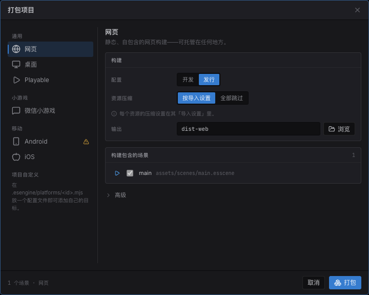

import { Aside, Steps } from '@astrojs/starlight/components';

一个 Estella 项目可发布到四个目标——**Web**、**桌面**、**微信小游戏**和单文件 **Playable 广告**
——全部从编辑器完成。导出用的是**你在编辑器里运行的同一套运行时**,所以你发布的就是你测过的
(*play == ship*)。

## 从编辑器导出



*打包对话框:选一个**平台**(Web / 桌面 / 微信 / Playable)、一个配置、输出目录,以及 cook 选项——然后构建。*

<Steps>

1. 打开 **文件 → Build…** 调出 **打包项目(Package Project)** 对话框。
2. 选一个**平台**(Web / 桌面 / 微信 / Playable)。
3. 选一个**构建配置**——*Development* 或 *Shipping*(Shipping 会压缩)——一个**输出目录**、
   source map,以及[资产烘焙选项](#资产烘焙选项)。
4. 检查**构建场景(Scenes in build)**列表——取消勾选不想发布的场景,需要的话换一个
   启动场景(见下文)。
5. 点 **Package**,看实时构建日志。完成后输出目录会自动打开(有复选框可关掉),
   Web / Playable 构建还会提供 **Preview over http**。

</Steps>

你的选择会存进 `project.esproject`,所以对话框下次会记住它们。

## 构建场景

项目场景目录下的每个场景都随导出发布,并成为 `SceneManager.switchTo` 的目标——游戏脚本
如何切换见[场景](/docs/zh-cn/guides/scene/)。对话框的**构建场景**列表控制这个集合:

- **启动场景**置顶并带播放徽标。它总是发布——点其他场景的播放按钮可把启动权移过去,
  或在内容浏览器里右键任意场景选**设为启动场景(Set as Startup Scene)**。
- **取消勾选一个场景**把它排除出构建(存为 `project.esproject` 里的
  `packaging.excludeScenes`)。被排除的场景在编辑器里仍可正常编辑和运行;只被排除场景
  引用的资产不会烘焙进构建。
- **Playable** 只带启动场景——它是一个有体积上限的单文件。

## 预览导出

**Web** 或 **Playable** 构建完成后,点 **Preview over http** ——编辑器把输出目录架在
本机回环服务器上(`http://127.0.0.1:<端口>/`)并用浏览器打开。

<Aside type="caution">
  Web 构建需要 **http 源**——直接从磁盘打开 `index.html`(`file://`)无法流式加载
  WebAssembly。用预览按钮,或把文件夹上传到任意静态托管。
</Aside>

## 各个目标

| 目标 | 产出什么 | 输出 | 下一步 |
|---|---|---|---|
| **Web** | 一个静态、自包含的 Web 构建。 | `dist-web/` | **Preview over http**,或把文件夹上传到任意静态托管。 |
| **桌面** | 一棵 Electron 应用源码树。 | `dist-desktop/` | `cd dist-desktop && npm install && npm start`——或 `npm run dist` 出原生 `.dmg` / `.exe` / AppImage 安装包。 |
| **微信** | 一个微信小游戏包。 | `dist-wechat/` | 在微信开发者工具里打开该文件夹并设置你的 AppID。见 [微信小游戏](/docs/zh-cn/guides/wechat/)。 |
| **Playable** | 一个自包含的 `index.html`,一切内联——无外部请求(广告平台的要求)。 | `dist-playable/` | **Preview over http**(它的真实宿主是广告平台的 iframe)。先选好[广告平台](#试玩广告平台),CTA 与体积检查才对得上投放目标。 |

## 试玩广告平台

各家平台收的都是同一个单文件 HTML,但在三件事上不一致:体积上限、`<head>` 里必须放什么、
以及用哪个函数把玩家送去商店。在 **项目设置 → 打包 → 试玩广告 → 广告平台** 选好平台,
导出会把这三件事都处理掉。

游戏代码里不出现任何平台名字,只调一次 CTA:

```ts
import { playableCta } from 'esengine';

// 结束卡的按钮、通关之后——凡是"号召点击"的地方
playableCta();
```

导出会注入 `playableCta()` 要分发到的桥接层。未选平台时它是空操作,所以同一个场景在编辑器里
和网页上照样能跑。

| 平台 | 上限 | 点击跳转 | 说明 |
|---|---|---|---|
| **通用** | 2MB | — | 不接任何平台接口。上限取我们已知里最严的一档——毕竟未指名的目标可能是其中任何一家。 |
| **Meta**(Facebook / Instagram) | `index.html` 2MB | `FbPlayableAd.onCTAClick()` | Meta 的 5MB 是 ZIP 包的总量;单文件试玩受 `index.html` 那条约束。禁止任何 HTTP 请求。 |
| **Google Ads**(应用广告系列) | 5MB | `ExitApi.exit()` | 它的退出接口是 Google 托管的脚本,官方要求以字面 `<script>` 写在 `<head>` 里——导出会帮你写好。Google 上传 **ZIP**,所以要先把 `index.html` 压缩。 |
| **MRAID 平台**(通用) | 5MB | `mraid.open()` | 适用于任何 MRAID 宿主。`mraid` 由宿主 webview 注入,`<head>` 无需任何内容。 |
| **Unity Ads** | 5MB | `mraid.open()` | 要求试玩包等到 MRAID 的 `viewableChange` 之后再开始。 |
| **AppLovin** | 5MB | `mraid.open()` | 要求所有资源内嵌——单文件试玩本来就是。 |

上限会变,所以每条警告都指名它用的是哪一家的上限、以及这个数字出自哪里,而不是丢一个
让你盲信的数字。

### 我们没内置的平台

自己定义就行——内置的那几家写的就是这份契约,没有做不到的事。**构建 → 新建平台** 可以
生成脚手架(类型选*试玩广告平台*),也可以手写 `.esengine/platforms/<id>.mjs`:

```js
export default {
  id: 'acme-ads',
  kind: 'playable',
  label: 'Acme Ads',

  // 这家接受的体积,以及这个数字出自哪里——导出的警告会引用这条说明。
  maxBytes: 5 * 1024 * 1024,
  limitNote: 'Acme 文档,创意规格 § playable',

  // 可选:注入 <head>(方向 meta、平台自己的 SDK 脚本)。
  emitHead: (ctx) => `<meta name="ad.orientation" content="${ctx.orientation}">`,

  // 注入 playableCta() 要分发到的桥接层,在游戏代码之前执行。
  emitBridge: () => `window.__ESTELLA_PLAYABLE__={cta:function(){AcmeSDK.openStore();}};`,
};
```

它随后就会和内置平台并列出现在"广告平台"列表里,并走同一条导出管线。

## 运行时前置条件

Web、桌面与 **Playable** 都复用随编辑器附带的引擎运行时,所以导出无需准备——试玩包内联的
就是同一份 web 运行时(glue 作为 blob 模块、wasm 以 base64 传入),不需要单独构建。**微信**是
例外:它的 WebAssembly 加载器不同,运行时需先构建一次:

```bash
# 仅在首次微信导出前
node build-tools/cli.js build -t wechat
```

当某个目标的运行时缺失时,打包项目对话框会提醒你,而微信导出会**直接失败**并给出确切的
构建命令——而不是产出一个运行时才崩的包。微信还需要为游戏用到的每个引擎特性构建对应的
侧模块(`physics-wechat`、`spine-wechat`,压缩纹理用 `basis-wechat`)——见
[微信小游戏](/docs/zh-cn/guides/wechat/)。

## 侧模块

可选的引擎特性以独立的 WebAssembly **侧模块**发布——每个模块是一对 emscripten
产物:`<file>.js` 胶水加 `<file>.wasm`——按需加载,让基础引擎保持小体积:

| 模块 | 产物 | 何时加载 |
|---|---|---|
| 物理(Box2D) | `physics.js` / `physics.wasm` | 项目声明了物理,或场景使用了物理组件。 |
| Spine | `spine38` / `spine41` / `spine42` 的 `.js`/`.wasm` | 场景使用了对应格式版本的 Spine 骨骼。 |
| Basis 转码器 | `basis.js` / `basis.wasm` | 构建里发布了 KTX2 压缩纹理。 |
| 视频解码器 | `videodec.js` / `videodec.wasm` | wasm 视频路径解码片段时。 |

- **Web / 桌面** —— 产物作为零散文件放在 `esengine.wasm` 旁;运行时经 fetch
  侧模块 host 从 `wasmBaseUrl`(引擎自身加载自的目录)拉取。
- **Playable** —— 不允许任何外部请求,导出器把模块以 base64 内联进单个 HTML
  文件;启动代码(`initPlayableRuntime`)拿到的是内嵌侧模块 host 而非 URL。
- **微信** —— 侧模块打包为微信预编译的模块工厂(这也是每个特性都需要上文
  `*-wechat` 运行时构建的原因)。

编辑器自己的播放模式也经由同一个发行运行时启动(`initPlayRealmRuntime`),从
编辑器 origin 拉取侧模块——所以"玩到的即发布的"同样覆盖这些模块。运行时 API 见
[应用设置与生命周期](/docs/zh-cn/core-concepts/app-lifecycle/#侧模块)。

## 构建配置与 source map

- **Development** —— 不压缩的构建;配上 source map 得到可调试的输出。
- **Shipping** —— 为体积和速度压缩。这是你发布用的。
- **source map** 把运行的 bundle 映射回你的 TypeScript。Web 和桌面可用;发布构建请关掉。

## 资产烘焙选项

打包对话框还控制**烘焙**如何处理你的资产:

- **压缩音频** —— 打包时把 WAV 源重编码为 MP3(可在资产的导入设置中单独关闭或选码率;
  其他音频格式原样通过)。
- **压缩纹理** —— 把 PNG 编码为 GPU 就绪的 **KTX2**(Basis Universal),运行时再转码为
  设备支持的最佳格式(ASTC → ETC2 → S3TC,最后回退 RGBA8)。下载更小、显存更省;关掉则
  发布原始 PNG。
- **打包 `.atlas` 文件夹** —— 烘焙时把每个 `<name>.atlas/` 文件夹里零散的 PNG 打包成图集页,
  于是许多小精灵作为一张纹理发布、在一次绘制里合批。
- **内容寻址** 对 Web/桌面默认开启(每个文件按字节哈希命名——URL 不可变、自动去重)。

## 打包设置

每个目标的元数据在 **项目设置 → 打包(Packaging)** 里,并随项目保存:

- **微信** —— AppID。
- **桌面** —— 应用 id 和产品名(用于命名安装包)。

### 屏幕方向

方向是**一个项目级设置**,而非逐平台:**项目设置 → 显示(Display) → 屏幕方向**(竖屏或横屏),就在设计分辨率旁边。所有目标都遵循它——微信 `game.json` 的 `deviceOrientation`、Web 构建的"请旋转设备"提示(以及尽力而为的 `screen.orientation.lock`)、桌面窗口的宽高比。留空则**从设计分辨率的宽高比推导**(更宽或方形 ⇒ 横屏,更高 ⇒ 竖屏),因此横屏设计零配置即在各处横屏发布。

**试玩包是有意的例外**:它从不锁定页面方向。在广告 SDK 里,容器尺寸由 SDK 决定,因此"请旋转设备"这类遮罩可能把游戏永久挡住——玩家转了手机却毫无变化,因为那条 media query 一直在读容器而不是设备。试玩包保持自适应(各平台都要求如此),方向只在平台需要时**声明**出去,例如 Google 的 `ad.orientation` meta 标签。请为两种比例都设计,或用[相机适配](#)做 letterbox,让构图在任一比例下都成立。

设置界面见 [编辑器](/docs/zh-cn/guides/editor/)。

## 构建 CLI(进阶)

编辑器打包你的**游戏**。而 `build-tools/cli.js` 命令构建的是**引擎和 SDK 本身**——你只在要产出上面
的微信运行时、或开发引擎时才需要它。常用命令:

```bash
node build-tools/cli.js build -t web        # 构建引擎(web 目标)
node build-tools/cli.js build -t wechat     # …微信运行时
node build-tools/cli.js sdk                 # 只构建 SDK
node build-tools/cli.js watch               # 改动即重建(引擎开发)
```

<Aside type="note">
  大多数游戏开发者除了那一次性的微信 / Playable 运行时构建外,从不需要动构建 CLI——日常工作都在
  编辑器和 SDK 里。
</Aside>

## 参见

- [微信小游戏](/docs/zh-cn/guides/wechat/) —— 分包布局与平台差异。
- [资源](/docs/zh-cn/guides/assets/) —— cook 步骤如何打包与内容寻址资产。
- [性能剖析与诊断](/docs/zh-cn/guides/profiling/) —— 发布前检查帧时间与 draw call。
