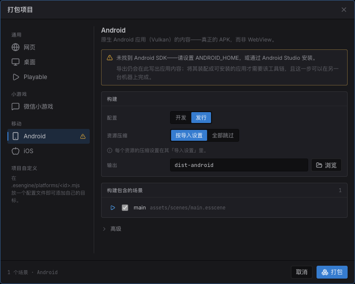

import { Aside, Steps } from '@astrojs/starlight/components';

**Android** 和 **iOS** 把你的项目打包成**真正的原生应用**:引擎的 C++ 核心编译到 arm64,
经内嵌的 [Dawn](https://dawn.googlesource.com/dawn) 渲染(WebGPU → iOS 上是 **Metal**、
Android 上是 **Vulkan**),游戏脚本跑在内嵌的 JS 引擎
([QuickJS-ng](https://github.com/quickjs-ng/quickjs))上。它**不是** WebView,
也不是网页构建的壳——这个进程里没有浏览器。

创作模型和其他任何目标完全一致。同样的场景、同样的组件、同样的 TypeScript。
项目里没有任何东西是"移动端专用"的。

<Aside type="caution" title="Pre-1.0——需要引擎源码检出">
  和 Web / 桌面 / 微信 / Playable 不同,移动目标**并不是编辑器下载包里自带齐全的**。
  组装可安装的应用需要先从引擎源码检出把原生宿主构建一次,再加上该平台自己的工具链
  (见[前置条件](#前置条件))。编辑器在任何安装下都仍然能导出应用的*内容*——那一半从来不需要工具链。
</Aside>

## 两个平台,一套运行时

Android 和 iOS 是**两个目标而不是一个"Mobile"**,因为它们经由完全不同的工具链打包
(Android SDK + NDK 对 Xcode)——一行说不清该运行什么、这台机器能不能运行、
以及包会出在哪里。

它们确实共享**同一套运行时和同一份导出载荷**。引擎、SDK 和游戏运行时都住在应用二进制里,
所以导出写出的是应用**内容**——你的场景、脚本和烘焙后的资产——而不是像 `dist-web/`
那样可直接运行的包。

| | Android | iOS |
|---|---|---|
| 图形 | Vulkan(经 Dawn) | Metal(经 Dawn) |
| 导出产物 | `dist-android/` | `dist-ios/` |
| 组装工具 | `aapt2` + `apksigner`(Android SDK/NDK) | Xcode |
| 组装所需系统 | 任意桌面系统 | **仅 macOS** |
| 结果 | 一个已签名的 `.apk` | 一个可打开、签名并运行的 Xcode 工程 |

## 前置条件

打包对话框区分**两类**缺失的前置条件,二者严重程度并不相同:

- 缺**引擎运行时**——对移动目标来说就是缺它的**运行时模板**——意味着根本产不出包。
- 缺**原生工具链**则不然。导出照样把应用内容写出来;只有最后的组装步骤需要工具链,
  而**那一步可以在另一台机器上跑**——编辑器在 Windows 上时,iOS 构建本来就得如此。



*打包项目 → **移动 → Android**。警告会点名缺的是哪一块,并说清它到底挡住了多少:内容无论如何都会写出来。*

<Steps>

1. **拿到该目标的运行时。**
   - *iOS* —— 安装**运行时模板**:随每个版本发布的、已为 arm64 预编译好的引擎。
     iOS 那一行提供*从文件安装…*,指向本版本发布页里的归档即可。它与编辑器版本
     **精确匹配**(SDK 是编译进应用二进制的),所以每次升级编辑器装一次——引擎自己
     那一堆构建依赖一样都不用装。
   - *Android* —— 宿主目前仍需从引擎源码构建。Dawn 和 QuickJS 体量数 GB、又是独立项目,
     所以是按需拉取而不是 vendored 进来;一次性的构建配方见
     [`native/README.md`](https://github.com/esengine/estella/blob/master/native/README.md)。

2. **装好平台工具链。**
   - *Android* —— Android SDK + **NDK r28**。编辑器通过 `ANDROID_HOME` 或
     Android Studio 的默认安装位置找到它。
   - *iOS* —— **装有 Xcode 的 macOS**,仅此而已:不需要 CMake、Ninja、xcodegen,
     也不需要 Dawn 源码。Apple 不为其他操作系统提供工具链,所以对话框直说,而不是
     假装可以——但导出照样会写出一份完整的工程,你可以拷到 Mac 上打开。

3. **看对话框。** 探测通过之前,该目标那一行会一直带着警告三角,面板里会点名缺什么。

</Steps>

## 导出

<Steps>

1. **文件 → Build…**,在**移动**分组下选 **Android** 或 **iOS**。
2. 选构建配置和输出目录(默认 `dist-android` / `dist-ios`)。这里不提供 source map——
   没有浏览器 devtools 来消费它。
3. 和其他目标一样检查**构建场景**列表。
4. **Package**。导出会烘焙资产、打包脚本,写出应用内容,外加一份携带应用身份的
   `app.config.json`。

</Steps>

**iOS 到这一步就完事了**:装好运行时模板后,输出目录本身*就是*一个 Xcode 工程——
`.xcframework`、应用外壳和生成好的 `.pbxproj` 都已围绕你的内容写出。打开它,在
*Signing & Capabilities* 下选好签名 Team,Run。

Android 还需要再跑一条命令来组装:

```bash
# 写出已签名的 APK(未用 --keystore 指定时用 debug keystore)
node build-tools/cli.js native --package --content dist-android
```

<Aside type="tip" title="导出为什么能不带编译器就做到这些">
  应用被编译的那一半不含任何项目数据——每个游戏装的都是同一份引擎二进制,而导出只有内容。
  所以它每个版本构建一次、以模板形式分发,组装一个应用不过是拷文件加写工程文件。这正是它
  属于导出流程、而不该藏在一条命令后面的原因;也正因如此,没装模板的编辑器会直说这件事,
  而不是写出一个链接不起来的工程。
</Aside>

## 应用身份

原生应用有一些引擎永远不读的系统级属性——运行时转不动手机,而应用商店会永久沿用 bundle id
——所以它们是写给"组装应用的人"看的,位置在 **项目设置 → 打包**:

| 设置 | 它会变成什么 |
|---|---|
| **应用 ID** | Android 的 manifest package 和 iOS 的 bundle id(反向域名)。留空则按项目名推导;正式发布的应用应当自己指定。 |
| **Android 版本号** | Google Play 用来排序构建的整数,每次上传都必须递增。用户看到的版本号来自项目版本。 |
| **朝向** | *项目设置 → 显示 → 朝向*,一个项目级设置,所有目标都遵守。不设则跟随设计分辨率的宽高比。 |

导出把这些写进内容旁边的 `app.config.json`——刻意**不**放进 `game.config.json`,
后者才是运行时读的那份。

## 真机上跑得起来的东西

**全部。** 移动目标编译整份引擎源码清单;在网页端以独立 WebAssembly side module 发布的
三个子系统(Box2D、Spine 运行时、MPEG-1 视频解码器)在这里是**编进应用二进制**的——
设备没有动态链接这套故事,也没有理由要有。`app.sideModules` 仍然如实作答,
所以运行时自己的特性门控和浏览器里表现一致。

| 子系统 | 真机上 |
|---|---|
| 精灵、瓦片地图、粒子、后处理 | 原生(Dawn) |
| 文本、位图字体、富文本 | 与网页端相同的图集与排版;字形从系统字体栅格化 |
| 物理(Box2D) | 编译进包;跨工作线程求解 |
| Spine | 编译进包——每个二进制一个运行时版本(`-DESTELLA_SPINE_VERSION`) |
| 视频 | 编译进包(构建时 cook,真机解码) |
| 音频 | 原生混音器([miniaudio](https://miniaud.io/))—— CoreAudio / AAudio |
| 文本输入 | 平台**软键盘**就是输入框的编辑面 |
| 网络 | 系统网络栈(`NSURLSession` / `HttpURLConnection`) |
| 压缩纹理 | KTX2 转码到设备支持的格式(ASTC → ETC2 → BC),含 mip 链 |
| 生命周期 | `onShow` / `onHide` 与系统内存警告都能到达应用 |

万一将来某个构建*真的*砍掉了某个子系统,导出会点名它——连同用到它的场景——
而不是悄悄发出一个缺了半个场景的包。

## 只在真机上才咬人的那些事

这些是你第一次做真机构建前值得知道的差异。每一条都至少发过一次坏包,
因为编辑器直接从磁盘伺服项目,根本不会察觉。

### 只有代码点名的资产会被剔除

构建发布的是它能从入口场景**可达**的东西。对场景点名的一切来说这是对的——
但对**只在代码里**点名的东西它是瞎的:富文本标记里的纹理、按 url 播放的音频、
按路径 spawn 的预制体。这些会被剔除,而你第一次听说这件事,
是手机上一个没声的按钮或一张缺失的图。

在**内容浏览器**里标记这个文件夹:右键 → **交付方式 → 总是打进构建**。
它会把 `alwaysInclude` 写进那份已经在决定本地 / 分包 / 远端交付的
`.esengine/asset-groups.json`:

```json
{
  "version": "1.0",
  "groups": {
    "markup-images": {
      "folder": "assets/textures",
      "mode": "local",
      "alwaysInclude": true
    }
  }
}
```

默认关闭,这是刻意的——正是可达性分析拦住了"什么都往包里塞"。
见[资源](/docs/zh-cn/guides/assets/#只有代码点名的资产)。

### 为内存最紧张的平台单独调纹理

逐资产的**导入设置**每个平台一个页签,移动目标也在其中——所以一张纹理可以为手机压得比
网页端更狠,而不用动源 PNG。见[资源](/docs/zh-cn/guides/assets/)。

### 你的游戏脚本是解释执行的

引擎以原生全速运行;**只有你的游戏脚本**跑在 QuickJS 上,它没有 JIT
(Apple 的规则不留别的选项,Android 这边保持一致而不是分叉)。
用 TypeScript 写的逐实体循环,是这里比浏览器里明显更贵的那一样东西——
热路径上优先用引擎自己的系统和批量 API,而不是手写逐实体迭代。

### 安装后的第一次启动

在设备上解析 SDK bundle 要约 14 秒,而编译缓存要等一次启动付过账才存在——
那次启动恰好就是刚装完的那一次。所以**字节码是随应用一起构建**的,跟着资产一起走:
全新安装到第一帧从 14.4 秒变成约 0.6 秒。这是尽力而为(它需要构建机上的编译器);
没有编译器的机器照样产出可用的应用,只是首次运行时再编译,和以前一样。

## 另见

- [构建与导出](/docs/zh-cn/guides/build-export/) —— 所有目标、cook 选项与打包对话框。
- [资源](/docs/zh-cn/guides/assets/) —— 可达性剔除、交付分组与导入设置。
- [屏幕与设计分辨率](/docs/zh-cn/core-concepts/screen/) —— 为手机的宽高比做设计。
- [`native/README.md`](https://github.com/esengine/estella/blob/master/native/README.md) —— 宿主架构与完整构建配方。
