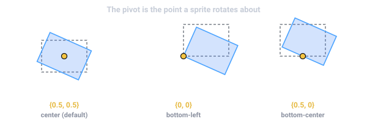

import { Aside } from '@astrojs/starlight/components';

**`Sprite`** 是 2D 渲染的主力:一个带 `Sprite` 组件的实体在世界里绘制一个带纹理的四边形。要绘制
不带纹理的实心图元,有 **`ShapeRenderer`**。一切都经由 [相机](/docs/zh-cn/guides/camera/) 绘制,
而绘制顺序由**排序层**控制。

## 你的第一个精灵

一个精灵需要 `Transform`(在哪)和 `Sprite`(画什么)。通过 [`Assets`](/docs/zh-cn/guides/assets/)
资源加载一张纹理,把它的句柄放到精灵上:

```typescript
import { defineSystem, Commands, Res, Query, Mut, Transform, Sprite, Assets } from 'esengine';

const spawnPlayer = defineSystem([Commands(), Res(Assets)], async (cmds, assets) => {
  const tex = await assets.loadTexture('textures/player.png');   // { handle, width, height }
  cmds.spawn()
    .insert(Transform, { position: { x: 0, y: 0, z: 0 } })
    .insert(Sprite, { texture: tex.handle, size: { x: tex.width, y: tex.height } });
});
```

`sprite.texture` 是一个纹理**句柄**,而不是路径——你从加载器(`assets.loadTexture(ref)`)拿到它。
在编辑器里你不用写这个:从内容浏览器把一张图拖到实体上,或在 Details 里设精灵的 texture 字段。

## Sprite 字段

| 字段 | 默认 | 说明 |
|---|---|---|
| `texture` | `0` | 加载器给的纹理句柄(`0` = 无纹理,画白色四边形)。 |
| `color` | `{1,1,1,1}` | 乘进纹理的着色(白 = 不变)。 |
| `size` | `{100,100}` | 渲染尺寸,世界单位。 |
| `pivot` | `{0.5,0.5}` | 精灵旋转/缩放所绕的轴心点(0–1)。 |
| `layer` | `0` | 排序层——控制绘制顺序(见下)。 |
| `flipX` / `flipY` | `false` | 水平 / 垂直镜像。 |
| `material` | `0` | 自定义[材质](/docs/zh-cn/guides/material/)句柄(`0` = 默认精灵着色器)。 |
| `lit` | `false` | 用平面法线接收 2D 光照——让精灵变"受光"的一键路径(自定义 `material` 会覆盖它)。 |
| `uvOffset` / `uvScale` | `{0,0}` / `{1,1}` | 要显示的纹理子矩形(用于图集 / 滚动)。 |
| `tileSize` / `tileSpacing` | `{0,0}` | 把纹理在精灵上平铺重复(`0` = 不平铺)。 |
| `parallax` | `{1,1}` | 视差滚动系数(见下)。 |
| `enabled` | `true` | 不移除也能隐藏组件。 |

## 着色与透明

`color` 是叠加在纹理上的 RGBA 乘子。白(`{1,1,1,1}`)原样绘制;给它染色,或降低 alpha 让它淡出:

```typescript
sprite.color = { r: 1, g: 0.4, b: 0.4, a: 1 };   // 泛红
sprite.color = { r: 1, g: 1, b: 1, a: 0.5 };      // 50% 透明
```

`color`(和 `size`)都**可动画**——在 [Sequencer](/docs/zh-cn/guides/timeline/) 里给它们打关键帧
做闪烁和淡入淡出。

## 尺寸与轴心

`size` 是四边形的**世界单位**尺寸,与纹理的像素尺寸无关——设成 `{ tex.width, tex.height }` 得到
1:1,或设成别的值来缩放。`Transform` 上的缩放会再乘上去。`pivot` 是精灵旋转/缩放所绕的归一化
轴心(0–1):`{0.5, 0.5}` 居中,`{0, 0}` 是左下角,`{0.5, 0}` 钉住底部中心(适合站在地面上的角色)。



## 单位与坐标

世界单位就是**设计像素**。把纹理拖进视口会生成一个尺寸等于纹理像素尺寸的精灵
(`size = { tex.width, tex.height }`),而编辑器的相机按"一个世界单位 = 一个设计像素"
创作(`orthoSize = designHeight / 2`)。因此 `Sprite.size` 的单位是设计像素,`pivot`
是相对该尺寸的归一化比例。世界坐标 **Y 轴朝上**——屏幕向上是正 Y——所以
`pivot: {0, 0}` 是**左下角**,不是左上角。

<Aside type="note">
  `Canvas.pixelsPerUnit`(默认 `100`)**不会**缩放精灵——它是**物理米尺度**:
  多少设计像素等于一个 Box2D 米(见[物理](/docs/zh-cn/guides/physics/))。精灵的
  显示尺寸只由 `size` × `Transform` 缩放决定,别无其他。完整的单位与坐标空间图景见
  [变换](/docs/zh-cn/core-concepts/transforms/)。
</Aside>

## 绘制顺序与排序层

当精灵重叠时,绘制顺序决定谁在上面。顺序由**排序层**(`sprite.layer`)决定——一个你在
**项目设置 → 渲染**里定义的命名层列表,于是检视器显示 *Background*、*Default*、*Foreground* 等
下拉,而不是裸数字。较低的层先画(在后面)。


```typescript
sprite.layer = 0;   // 例如 "Background"
sprite.layer = 2;   // 例如 "Foreground" —— 画在上面
```

<Aside type="tip">
  排序层做粗粒度分组(背景 vs 玩法 vs 世界内 UI)。层**内**的精细排序,用实体 `Transform` 的 z 位置。
</Aside>

### 场景顺序决定平局

同一层、同一 z 怎么办?那就由**场景顺序**决定:引擎按场景列出实体的顺序绘制,所以在大纲
里越**靠下**的越画在上面。因此在大纲里拖动一行就会改变谁盖住谁——而且松手当下视口就更新,
和运行时的画面完全一致。拖动父实体会带上它的子实体,所以子实体相对父实体的位置始终不变。

运行时也能用同一套顺序,不必动排序层——比如「把这张牌提到最前」:

```typescript
// 让 card 在这三者中最后绘制(在最上面),其余实体不受影响。
world.applyEntityOrder([other, another, card]);
```

### Y 排序(俯视遮挡)

俯视视角游戏在 **Project Settings → Rendering → Y-sorted layers** 勾选某个层后,该层上的
精灵、图形与文本都按世界 Y 坐标排序绘制:屏幕上越靠下的实体画在越上层,角色走到树下方时
自然显示在树前——无需手动调 `layer` 或 z。

<Aside type="note">
  在 Y 排序层内,绘制顺序优先于材质合批——交替材质的重叠绘制无法合并为一个 draw call。
  只对需要它的玩法层开启 Y 排序。
</Aside>

## 翻转、图集与滚动

- 用 `flipX` / `flipY` **翻转**精灵——例如让角色朝左或朝右,而不用另一张纹理。
- **图集**:把 `uvOffset` 和 `uvScale` 设为某个单元格的归一化矩形,显示打包图集里的一格。(逐帧动画
  请用 [Animator](/docs/zh-cn/guides/animation/) 驱动这些,而非手动。)
- **滚动**:随时间改 `uvOffset` 来滚动纹理(水面、传送带),并设 `tileSize` 把它在大精灵上重复平铺。

## 纹理过滤与环绕

纹理的采样方式按**纹理句柄**设置,而非按精灵:


*同一张小纹理放大约 15×。**Nearest(最近邻)** 保留硬的纹素边缘(像素画);**Linear(线性)**
在纹素间插值,得到平滑外观(默认)。*

| 枚举 | 取值 | 含义 |
|---|---|---|
| `TextureFilter` | `Nearest`、`Linear` | Nearest = 纹素边缘生硬(像素画);Linear = 平滑插值(默认)。 |
| `TextureWrap` | `Repeat`、`ClampToEdge`、`MirroredRepeat` | 0–1 之外的 UV 采到什么——平铺重复,还是拉伸边缘像素。 |

```typescript
import { TextureFilter, TextureWrap, setTextureFilter, setTextureWrap, setTextureParams } from 'esengine';

setTextureFilter(tex.handle, TextureFilter.Nearest);   // 像素画保持锐利
setTextureWrap(tex.handle, TextureWrap.Repeat);        // 0–1 之外平铺

// 上面两个便捷函数各自会把*另一组*参数重置为默认值
// (ClampToEdge / Linear)。要同时设置过滤和环绕,用完整形式:
setTextureParams(tex.handle, TextureFilter.Nearest, TextureFilter.Nearest,
                 TextureWrap.Repeat, TextureWrap.Repeat);
```

`setTextureParams(textureId, minFilter, magFilter, wrapS, wrapT)` 是完整接口——
缩小/放大过滤分开,环绕逐轴设置。`tileSize` 平铺和 UV 滚动效果要无缝,靠的就是
`Repeat`。


*各环绕模式如何处理 0–1 之外的 UV(中间那块 = 纹理本身):**Repeat** 平铺,**Clamp to edge**
拉伸边缘像素,**Mirror** 每隔一块镜像翻转。*

<Aside type="tip">
  对像素画来说 `TextureFilter.Nearest` 只解决一半问题:它让**纹素**锐利,但相机
  停在小数位置时精灵仍会落在屏幕像素之间,移动时闪烁。把它和相机的
  `pixelPerfect` 标志配合使用——它把(正交)相机吸附到像素网格——见
  [相机](/docs/zh-cn/guides/camera/)。
</Aside>

## 视差背景

`parallax` 缩放一个精灵相对相机的移动量:`1` 随世界移动,`0` 锁定到相机(固定背景板),中间的值
滚动更慢以产生纵深。把几张精灵分别设为 `0.2`、`0.5`、`0.8`,就得到经典的视差背景。

## 自定义材质与光照

给 `sprite.material` 赋值,用你自己的着色器绘制精灵——染色、溶解、扭曲——见
[材质与着色器](/docs/zh-cn/guides/material/)。

要让精灵响应 `Light2D` 光源,最简单的路径是设 `sprite.lit = true`——无需自定义材质
(用平面法线受光)。需要法线贴图或完全自定义的观感时,改用 **Lit-2D 材质**。两种方式都见
[2D 光照与阴影](/docs/zh-cn/guides/lighting/)。

### 精灵滤镜(描边、发光、投影)

最常见的逐精灵效果不用写着色器——`SpriteFilter` 直接构建一个现成材质,赋给
`sprite.material`:

```typescript
import { SpriteFilter } from 'esengine';

sprite.material = SpriteFilter.createOutline({ color: { r: 1, g: 1, b: 1, a: 1 }, width: 2 });
sprite.material = SpriteFilter.createGlow();                        // 暖色描边预设
sprite.material = SpriteFilter.createDropShadow({ offsetX: 3, offsetY: 3, blur: 2 });
```

用 `setOutlineColor` / `setOutlineWidth` / `setShadowOffset` / `setShadowBlur`
实时调一个已生效的滤镜(选中脉冲、受击闪白)。每次调用都创建一个材质——观感相同
的精灵共享同一个句柄;纹理不是 512×512 时传
`texelSize: { x: 1/texWidth, y: 1/texHeight }` 以获得精确的像素宽度。

## 不带纹理的图元

要画实心圆、胶囊和圆角矩形——占位、进度条、调试覆盖——用 **`ShapeRenderer`** 而不是纹理
(`ShapeType.Circle`、`Capsule` 或 `RoundedRect`):

```typescript
import { ShapeRenderer, ShapeType } from 'esengine';

cmds.spawn()
  .insert(Transform, { position: { x: 0, y: 0, z: 0 } })
  .insert(ShapeRenderer, {
    shapeType: ShapeType.RoundedRect,
    size: { x: 200, y: 80 },
    cornerRadius: 12,
    color: { r: 0.2, g: 0.6, b: 1, a: 1 },
  });
```

`ShapeRenderer` 与 `Sprite` 共享排序 `layer` 和 `color` 约定。

## 拖尾

**`TrailRenderer`** 沿实体最近的路径画一条世界空间条带——刀光、冲刺、弹道
残影。加上组件、移动实体即可;位置历史由引擎记录,锥形收窄也替你渲染:

```typescript
cmds.spawn()
  .insert(Transform, { position: { x: 0, y: 0, z: 0 } })
  .insert(TrailRenderer, { time: 0.4, startWidth: 24, blendMode: 1 });  // 加法发光
```

| 字段 | 默认 | 说明 |
|---|---|---|
| `time` | `0.5` | 每个拖尾点存活的秒数,之后从尾部淡出。 |
| `minVertexDistance` | `5` | 记录新点所需的最小移动距离(`0` = 每帧记录)。 |
| `emitting` | `true` | `false` 冻结发射——条带脱离实体、原地淡出。 |
| `startWidth` / `endWidth` | `20` / `0` | 头 / 尾的条带宽度(`0` 收窄成线)。 |
| `startColor` / `endColor` | 白 / 白 α 0 | 头到尾插值;尾部 alpha 0 即淡出。 |
| `texture` | `0` | 沿条带采样的纹理(U 从头到尾);`0` = 仅顶点色。 |
| `blendMode` | `0` | `0` 正常、`1` 加法(发光)、`2` 乘法。 |
| `layer` / `material` | `0` / `0` | 常规排序层 / 自定义材质。 |

`Trail` 资源(`Res(Trail)`)提供 `clear(entity)`,立刻丢弃某实体的历史——比如
传送时,免得拖尾划过整张地图。

## 世界空间位图文字

**`BitmapText`** 用预烘焙的位图字体渲染世界空间文字——伤害数字、名牌、复古
UI。把 `font` 指向一个 **BMFont** 资产(`.fnt` 文本或 `.bmfont` JSON),设置
`text` 即可:

| 字段 | 默认 | 说明 |
|---|---|---|
| `text` | `''` | 要绘制的字符串。 |
| `font` | `0` | 位图字体资产(`.fnt` / `.bmfont`)。 |
| `fontSize` | `1` | 相对字体原生尺寸的缩放。 |
| `align` | `Left` | `Left` / `Center` / `Right`。 |
| `spacing` | `0` | 逐字符的额外间距。 |
| `color` | `{1,1,1,1}` | 着色——可动画(闪一下伤害数字)。 |
| `layer` / `parallax` | `0` / `{1,1}` | 与 `Sprite` 相同的排序层 / 视差语义。 |

屏幕空间的 UI 文字(布局、换行、SDF 锐度)请用 UI 的 `Text` 控件——见
[UI](/docs/zh-cn/guides/ui/)。

## 精灵点击检测

"这次点击落在这个精灵上了吗?"分两步:把屏幕点转到世界空间,再对精灵的矩形做测试。
第一步由 `CameraView` 资源完成(见[相机](/docs/zh-cn/guides/camera/));第二步 SDK
导出了感知轴心的点测试:

| 函数 | 测试 |
|---|---|
| `pointInWorldRect(px, py, worldX, worldY, worldW, worldH, pivotX, pivotY)` | 由位置 + 轴心放置的轴对齐矩形(未旋转精灵的精确占位)。 |
| `pointInOBB(…, rotationZ, rotationW)` | 同一矩形加**旋转**——传变换四元数的 `z`/`w`;未旋转时退化为矩形测试。 |
| `pointInHitArea(px, py, area)` | 自定义 `HitAreaShape`——`rect`、`circle` 或 `polygon`。 |

```typescript
import { defineSystem, Query, Res, CameraView, Input, Transform, Sprite, pointInOBB } from 'esengine';

const clickSprites = defineSystem(
  [Query(Transform, Sprite), Res(CameraView), Res(Input)],
  (q, view, input) => {
    if (!input.isMouseButtonPressed(0)) return;
    const p = view.screenToWorld(input.mouseX, input.mouseY);
    if (!p) return;
    for (const [entity, t, s] of q) {
      const w = s.size.x * t.worldScale.x, h = s.size.y * t.worldScale.y;
      if (pointInOBB(p.x, p.y, t.worldPosition.x, t.worldPosition.y,
                     w, h, s.pivot.x, s.pivot.y,
                     t.worldRotation.z, t.worldRotation.w)) {
        console.log('hit', entity);
      }
    }
  });
```

对可点击区域不是矩形的精灵——不规则角色、环形按钮——用精灵本地坐标描述一个
`HitAreaShape`,再测试本地化后的点:

```typescript
import { pointInHitArea, type HitAreaShape } from 'esengine';

const hull: HitAreaShape = { type: 'polygon', points: [0, 0, 64, 0, 64, 48, 32, 64, 0, 48] };
// 未旋转的精灵,减去它的原点即可本地化:
const hit = pointInHitArea(p.x - t.worldPosition.x, p.y - t.worldPosition.y, hull);
```

`screenToWorld` 也有独立导出(接收逆 view-projection 矩阵和视口矩形),供自己管理
相机数学的代码使用——`CameraView` 资源就是同一个函数、替你填好了当前相机。至于
交互式 **UI**,别手写这些:`Interactable` + `UIEvents` 会替你做拾取(见
[UI](/docs/zh-cn/guides/ui/))。

## 位图缓存(Cache as bitmap)

**`CacheAsBitmap`** 支持把实体上昂贵的内容**渲染一次**进离屏纹理,之后只画这一个
四边形——经典的 cache-as-bitmap 交换:用 GPU 内存(`width × height` RGBA)换每帧
绘制开销。当内容每帧都画很贵(大量矢量路径、很多形状或文字)但**很少变化**时划算;
内容每帧都变则毫无收益——你每次都得重渲缓存,*还*多付一次贴图开销。

| 字段 | 默认 | 说明 |
|---|---|---|
| `enabled` | `true` | 该实体的缓存是否生效。 |
| `dirty` | `true` | 设为 `true` 请求重新渲染缓存。 |
| `width` / `height` | `256` | 缓存纹理的像素尺寸。 |

这个组件是**记账的一半**——SDK 不内置自动遍历场景缓存子树的系统。刷新由你用导出的
辅助函数驱动:逐实体缓存仓库(`getCacheForEntity`、`setCacheForEntity`、
`removeCacheForEntity`、`clearAllCaches`)加 `CacheBitmap`——一个轻薄的渲染目标
包装(`create`、`beginDraw`/`endDraw`、`resize`、`release`):

```typescript
import { CacheBitmap, getCacheForEntity, setCacheForEntity, Draw } from 'esengine';

// 刷新(仅在 dirty 时):
let cache = getCacheForEntity(entity);
if (!cache) {
  cache = CacheBitmap.create(512, 256);
  setCacheForEntity(entity, cache);
}
CacheBitmap.beginDraw(cache, viewProjection);   // 一个框住内容的正交矩阵
// … 用 Draw / Graphics 把昂贵内容画一次 …
CacheBitmap.endDraw();

// 此后每帧:画一个贴图四边形,而不是整套重绘。
Draw.texture(pos, { x: 512, y: 256 }, cache.textureId);
```

`cache.textureId` 是普通的纹理句柄——也可以直接当 `Sprite.texture` 用。底层就是一个
不带深度缓冲的 [RenderTexture](/docs/zh-cn/guides/drawing/)。

## 在编辑器里

- **创建 → 精灵** 添加一个精灵实体,或从内容浏览器**把图拖**进视口,生成一个已带纹理的精灵。
- 上面每个字段都能在 **Details** 里编辑;精灵、相机、光源在视口里显示为 gizmo。见
  [编辑器](/docs/zh-cn/guides/editor/)。

## 参见

- [动画](/docs/zh-cn/guides/animation/) —— 精灵表帧动画与属性补间。
- [自定义绘制](/docs/zh-cn/guides/drawing/) —— 精灵之外的网格与即时模式图形。
- [2D 光照与阴影](/docs/zh-cn/guides/lighting/) —— 法线贴图与逐精灵光照。
