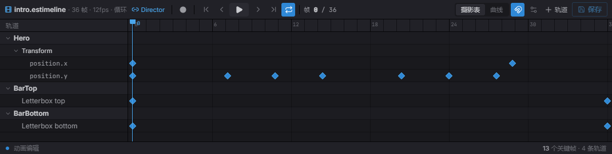
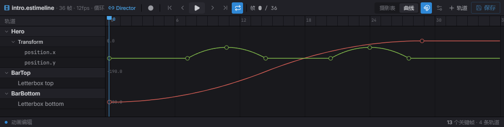

import { Aside } from '@astrojs/starlight/components';

时间轴是一段 **Sequencer 动画**——随时间排布的关键帧轨道,可以移动 Transform、切换精灵、
触发音频、开关实体或驱动 Spine。你在编辑器的 Sequencer 里编辑它,用 `TimelinePlayer` 组件
附加,并通过 `Timeline` 资源控制播放。因为一条时间轴能同时驱动很多东西,它是过场与脚本化
序列的工具。

## 附加时间轴

`TimelinePlayer` 组件把实体指向一个时间轴资源。通常在编辑器里设;用代码则以 `Commands` 插入:

```typescript
import { defineSystem, Commands, TimelinePlayer } from 'esengine';

const attach = defineSystem([Commands()], (cmds) => {
  cmds.spawn().insert(TimelinePlayer, {
    timeline: 'timelines/intro.estimeline',
    playing: true,
    speed: 1.0,
    wrapMode: 'once',
  });
});
```

| 属性 | 类型 | 默认 | 说明 |
|---|---|---|---|
| `timeline` | asset | `''` | 时间轴资源(`.estimeline`)。 |
| `playing` | boolean | `false` | 播放旗标——拉起播放,放下暂停。对已播完的片段拉起 = 从头重播。 |
| `speed` | number | `1` | 播放速率倍率。 |
| `wrapMode` | string | `'once'` | `'once'`、`'loop'` 或 `'pingPong'`(驼峰写法——其它值会静默地只播一次)。 |
| `finished` | boolean | `false` | `'once'` 片段播完时闩为 true;下次播放时清除。运行时只读。 |

组件旗标**就是**播放控制本身:引擎每帧把它们调和进内部时钟,所以任何翻动
`playing` 的一方——你的代码、检视器、[AI 动作](/docs/zh-cn/guides/ai/#内建名字)——
都经同一条通道驱动片段。

## 控制播放

读 `Timeline` 资源来驱动某个实体的时间轴:

```typescript
import { defineSystem, Query, Res, TimelinePlayer, Timeline } from 'esengine';

const control = defineSystem([Query(TimelinePlayer), Res(Timeline)], (q, timeline) => {
  for (const [entity] of q) {
    timeline.play(entity);
    timeline.pause(entity);
    timeline.stop(entity);
    timeline.setTime(entity, 1.5);                  // seek to 1.5s
    const t = timeline.getCurrentTime(entity);
    const playing = timeline.isPlaying(entity);
  }
});
```

| 方法 | 说明 |
|---|---|
| `play(entity)` | 开始或恢复播放(已播完的片段从头重播)。 |
| `pause(entity)` | 暂停,保留当前时间。 |
| `stop(entity)` | 停止、重置到开头并清除 `finished` 闩。 |
| `setTime(entity, seconds)` | 定位到某时间(scrub 所有轨道)。 |
| `getCurrentTime(entity)` | 当前播放头时间(秒)。 |
| `isPlaying(entity)` | 是否正在播放。 |

这些方法写穿到 `TimelinePlayer` 的旗标——`timeline.play(e)` 和 `player.playing = true`
是同一条通道上的同一个操作。

<Aside type="tip">
  想做**零代码过场**,把组件和状态机配对:内建的 `timeline.play` 动作 +
  `timeline.finished` 条件就是一个"进入即播放、播完即转出"的 FSM 状态。见
  [AI——内建名字](/docs/zh-cn/guides/ai/#内建名字)。
</Aside>

## 轨道类型

时间轴是一组每帧一起求值的轨道:

| 轨道 | `TrackType` | 驱动 |
|---|---|---|
| 属性 | `Property` | 组件字段关键帧——位置 / 旋转 / 缩放及任意数值点路径。 |
| 精灵帧 | `AnimFrames` | 随时间切换精灵表帧。 |
| 精灵剪辑 | `SpriteAnim` | 在某时刻启动一个命名 `anim-clip`。 |
| 音频 | `Audio` | 在关键帧触发一次性声音。 |
| 激活 | `Activation` | 按区间开关实体。 |
| Spine | `Spine` | 把 Spine 动画作为片段播放。 |
| 标记 | `Marker` | 命名时间标记。 |
| 自定义事件 | `CustomEvent` | 带 payload 的命名事件,供你自己的系统消费。 |

## 在 Sequencer 里创作

双击一个 `.estimeline`(或打开选中实体的时间轴),就在 **Sequencer**(关键帧动画编辑器)里
创作它。**摊开表(dope sheet)**把每条轨道及其关键帧沿一条共享、可拖动的播放头排开;加轨道、
拖关键帧,然后 **Save**。



*摊开表:一轨一行(这里是某 Transform 的 `position.x` / `position.y`,加两条黑边激活轨道),关键帧是菱形,播放头可拖动,顶部是走带控制。*

切到 **Curves** 标签可塑形关键帧之间的插值——拖动值曲线及其切线手柄,做出摊开表表达不了的缓动:



*曲线编辑器:每个关键帧通道变成一条可编辑曲线(这里 `position.x` 缓入、`position.y` 起伏),每个关键帧带切线手柄。*

### 预览动的是什么

在 Sequencer 里拖播放头或按播放,动的是**活的视口**,不是另开一个预览窗——采样出的姿态写进当前
打开的文档,一旦解绑、关闭或进入 Play 就立刻还原,所以它永远不会漏进存下来的场景。

它只动一个实体:**预览根**,名字就写在 Sequencer 头部那个链接按钮上。这个根是**推导出来的、不用你
指定**——谁的 `TimelinePlayer` 在播这条时间轴,它就是根,所以从内容浏览器双击一个 clip 就会绑到真正
播它的那个东西上。选中特效**内部**的某个节点也照样预览整个特效(会往上找根);同一条时间轴被多个实体
播时,头部会写明有几个、预览的是所选那个。要是哪儿都没有播它的实体、又没选中任何东西,那就没什么可动
的:按钮显示 **未绑定**,点它会绑到你当前的选择——这正是给一个还没播它的实体新建 clip 的做法。

## 用代码构建时间轴

`.estimeline` 文档就是普通数据——用 `TimelineAsset` 类型加上 `TrackType` /
`InterpType` / `WrapMode` 常量,可以完全在代码里构建。用
`registerTimelineAsset(path, asset)` 注册后,任何 `timeline` 指向同一路径的
`TimelinePlayer` 都会像播放编辑器资产一样播放它:

```typescript
import {
  defineSystem, Commands, registerTimelineAsset, TimelinePlayer,
  TrackType, InterpType, WrapMode, type TimelineAsset,
} from 'esengine';

const slideIn: TimelineAsset = {
  version: '1.1',
  type: 'timeline',
  duration: 2,
  wrapMode: WrapMode.Once,
  tracks: [{
    type: TrackType.Property,
    name: 'Slide in',
    childPath: '',                       // '' = the player entity itself
    component: 'Transform',
    channels: [{
      property: 'position.x',
      keyframes: [
        { time: 0, value: -200, inTangent: 0, outTangent: 0, interpolation: InterpType.EaseOut },
        { time: 2, value: 0, inTangent: 0, outTangent: 0 },
      ],
    }],
  }],
};

const attach = defineSystem([Commands()], (cmds) => {
  registerTimelineAsset('code/slide-in', slideIn);
  cmds.spawn().insert(TimelinePlayer, {
    timeline: 'code/slide-in',
    playing: true,
    wrapMode: 'once',
  });
});
```

`Keyframe` 是 `{ time, value, inTangent, outTangent, interpolation? }`。以某
关键帧*起始*的分段用该关键帧的 `interpolation`:`Hermite`(默认——切线驱动曲线)、
`Linear`、`Step`、`EaseIn`、`EaseOut` 或 `EaseInOut`。属性轨道按 `childPath`
解析目标实体(子实体名以 `/` 分隔;空 = 播放器实体本身),把通道的点路径字段写到
命名组件上。

### 循环模式

播放采用**播放器组件**的 `wrapMode` 字符串;数值型 `WrapMode` 常量用在资产和纯求值
API 里。映射与行为:

| `WrapMode` | 播放器字符串 | 越过终点后的行为 |
|---|---|---|
| `WrapMode.Once`(`0`) | `'once'` | 停在 `duration`,停止,闩上 `finished`。 |
| `WrapMode.Loop`(`1`) | `'loop'` | 回绕(`time % duration`)。 |
| `WrapMode.PingPong`(`2`) | `'pingPong'` | 每周期先正放再倒放。 |

`applyWrapMode(time, duration, mode)` 就是这个纯映射——对绝对时钟时间返回
`{ time, stopped }`。

### 采样与序列化

求值器是纯 TypeScript,播放与编辑器 scrub 共用——你也可以自己调用:

| 函数 | 说明 |
|---|---|
| `sampleTimelineInWorld(asset, time, world, rootEntity, opts?)` | 在 `time` 求值所有属性轨道并把结果写进 world(即 scrub 操作)。 |
| `sampleTimeline(asset, time, rootEntity, deps, opts?)` | 同上,但注入 `SampleDeps`(world / 组件查找 / 子实体解析)——用于测试和工具。 |
| `evaluateChannel(channel, time)` | 单个属性通道在 `time` 的值;端点截断。 |
| `serializeTimelineAsset(asset)` | 资产转为可 JSON 化对象(`.estimeline` 文档形状)。 |
| `serializeTimelineToJson(asset, indent?)` | 美化打印的 `.estimeline` JSON 字符串(indent 默认 `2`)。 |

采样只覆盖属性轨道;事件型轨道(音频、标记、自定义事件)在播放中按边沿检测触发,
采样不会触发它们。

## 最佳实践

- **在 Sequencer 里编辑**——时间轴资源持有轨道,代码只负责播放与定位。
- 过场用 **`wrapMode: 'once'`**,环境/待机序列用 `'loop'`。
- **用 `setTime` scrub** 来预览,或把过场与玩法状态同步。
- 当很多属性/实体需要同步动画时**用时间轴(而非补间)**;一次性的单属性手感用
  [补间](/docs/zh-cn/guides/animation/)。

<Aside type="note">
  时间轴播放属于玩法——它在播放模式和独立运行时里推进,在编辑器编辑模式下冻结。
</Aside>

## 参见

- [动画](/docs/zh-cn/guides/animation/) —— 补间与动画状态机。
- [Spine 动画](/docs/zh-cn/guides/spine/) —— 时间轴可以驱动 Spine 片段。
