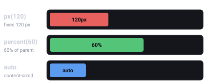
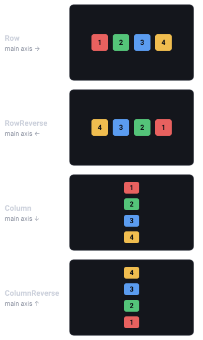
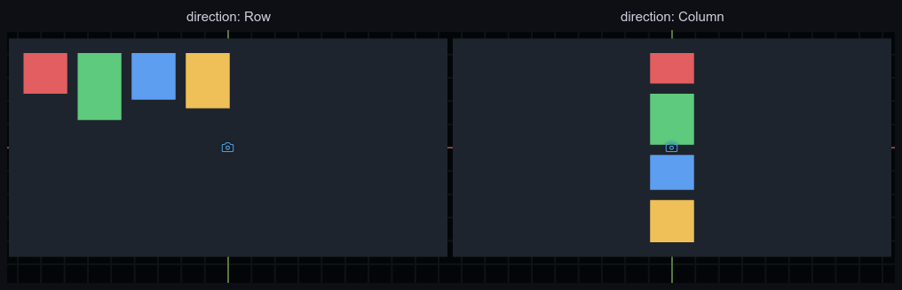
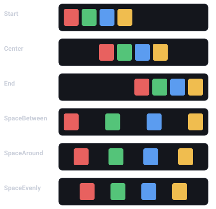
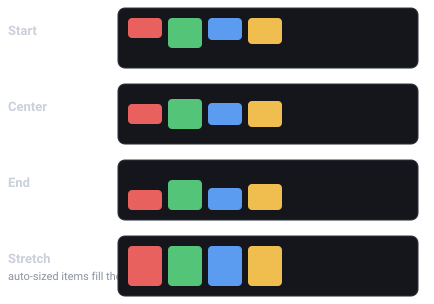
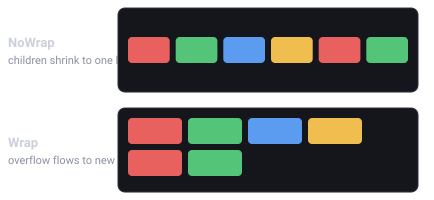
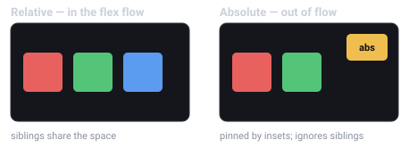
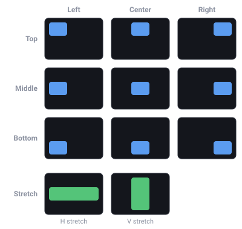

import { Aside } from '@astrojs/starlight/components';

UI 几何是一套 CSS 盒模型,由 C++ 内核中的单趟 flexbox 引擎(Yoga)每帧针对相机的 UI
框求解。本页是深入参考:单位、`Dimension` 类型、`UINode` 与 `FlexContainer` 的全部字段、
绝对定位、锚点预设和配方。组件模型总览请从 [UI](/docs/zh-cn/guides/ui/) 开始。

## 单位:设计像素

UI 布局里的每个 `px` 都是**设计像素**——项目设计分辨率(Project Settings → Display)
的单位,而非设备像素。场景相机把设计分辨率的适配烘焙进自己的视野范围,因此在 UI 布局框内
**1 世界单位 = 1 设计像素**,一个 `px(320)` 的面板在任何设备上都是 320 设计像素宽;画布
缩放模式决定这个设计框如何适配真实屏幕(letterbox、expand、match)。编辑器的自由缩放视图
针对同一个固定设计框排布 UI,所以缩放视口永远不会让界面重排。见
[屏幕与分辨率](/docs/zh-cn/core-concepts/screen/)和[相机](/docs/zh-cn/guides/camera/)。

## 维度:`px`、`percent`、`auto`



*三种长度单位:`px` 是固定的设计像素尺寸,`percent` 是父项对应轴的比例,`auto` 收缩到内容大小(或被容器拉伸)。*

每个长度字段都是一个 `Dimension`——`{ value, unit }`——用三个助手构造:

```typescript
import { px, percent, auto, isAuto, DimensionUnit } from 'esengine';

px(320)      // 320 design pixels
percent(50)  // 50% of the parent's corresponding axis (0..100, not 0..1)
auto()       // content-/layout-driven; value is ignored
isAuto(d)    // true when d is the auto length
```

- **`px(n)`**——绝对设计像素(`DimensionUnit.Px`)。
- **`percent(n)`**——**父项对应轴**的百分比:`width: percent(50)` 是父项宽度的一半,
  `height: percent(50)` 是父项高度的一半。取值 0–100,与 CSS `%` 一致。
- **`auto()`**——"让布局决定"。具体含义取决于字段:

| 字段 | `auto()` 的含义 |
|---|---|
| `width` / `height` | 内容驱动(文本测量、子项)或被容器拉伸;**根**节点在 `auto` 轴上填满相机框。 |
| `minWidth/Height`、`maxWidth/Height` | 无约束。 |
| `flexBasis` | 使用 `width`/`height`,否则用内容尺寸。 |
| `insetLeft/Top/Right/Bottom` | 该边不受约束(见[绝对定位](#绝对定位))。 |
| `marginLeft/Top/Right/Bottom` | 外边距吸收剩余空间(CSS `margin: auto`);`Absolute` 节点上全 `auto` 的外边距 + 内偏移会使该轴居中。 |

## `UINode`——盒子

`UINode` 持有逐项布局字段(容器级字段在 `FlexContainer` 上)。以下默认值来自 SDK 源码的
组件默认值。

| 属性 | 类型 | 默认值 | 说明 |
|---|---|---|---|
| `position` | `UIPositionType` | `Relative` | `Relative` = 在 flex 流中;`Absolute` = 脱离流,由内偏移放置。 |
| `display` | `UIDisplay` | `Flex` | `None` 把该节点**连同整棵子树**从布局、渲染和命中测试中移除——层级式显示/隐藏。对比 `UIVisual.enabled`:后者只隐藏本实体的视觉。 |
| `width` / `height` | `Dimension` | `auto()` | 盒尺寸;`auto` = 内容/flex 驱动。 |
| `minWidth` / `minHeight` | `Dimension` | `auto()` | 尺寸下限;`auto` = 无约束。 |
| `maxWidth` / `maxHeight` | `Dimension` | `auto()` | 尺寸上限;`auto` = 无约束。 |
| `flexGrow` | number | `0` | 吸收容器主轴剩余空间的份额(`0` = 不放大)。 |
| `flexShrink` | number | `1` | 空间不足时的收缩因子(`0` = 永不收缩)。 |
| `flexBasis` | `Dimension` | `auto()` | grow/shrink 之前的主轴基准尺寸;`auto` = 用 `width`/`height` 或内容。 |
| `alignSelf` | `AlignSelf` | `Auto` | 逐项交叉轴覆盖(`Auto` / `Start` / `Center` / `End` / `Stretch`);`Auto` 继承容器的 `alignItems`。 |
| `marginLeft/Top/Right/Bottom` | `Dimension` | `px(0)` | 外间距;`auto()` 吸收剩余空间(CSS auto margin)。 |
| `insetLeft/Top/Right/Bottom` | `Dimension` | `auto()` | `position` 为 `Absolute` 时距父项各边的偏移(CSS `left/top/right/bottom`);`auto` = 该边不受约束。 |

<Aside type="caution">
  布局趟每帧都会**写入**每个 UI 实体的 `Transform.position`(中心基准、pivot 0.5、
  y 向上)。不要通过 `Transform` 手工摆放 UI 实体——用内偏移/外边距移动它们。
  (补间通过逐轴覆盖标志与布局协调,所以用补间 API 动画化 UI 位置没问题。)
</Aside>

## `FlexContainer`——排布子项

给节点加 `FlexContainer` 来排布其子项。心智模型就是 CSS flexbox——每个字段与一个
CSS 属性一一对应:

| 属性 | 类型 | 默认值 | CSS | 说明 |
|---|---|---|---|---|
| `direction` | `FlexDirection` | `Row` | `flex-direction` | `Row` / `Column` / `RowReverse` / `ColumnReverse`——主轴。 |
| `wrap` | `FlexWrap` | `NoWrap` | `flex-wrap` | `NoWrap` / `Wrap`。 |
| `justifyContent` | `JustifyContent` | `Start` | `justify-content` | 主轴分布:`Start` / `Center` / `End` / `SpaceBetween` / `SpaceAround` / `SpaceEvenly`。 |
| `alignItems` | `AlignItems` | `Stretch` | `align-items` | 交叉轴对齐:`Start` / `Center` / `End` / `Stretch`。 |
| `alignContent` | `AlignContent` | `Start` | `align-content` | 换行后各行的分布:`Start` / `Center` / `End` / `Stretch` / `SpaceBetween` / `SpaceAround`。 |
| `gap` | `Vec2` | `{x: 0, y: 0}` | `column-gap` / `row-gap` | 子项间距,普通设计像素数(`x` = 列间距,`y` = 行间距)。 |
| `padding` | `Padding` | `{0,0,0,0}` | `padding` | 内间距(`left/top/right/bottom`),普通设计像素数。 |

<Aside type="note">
  `gap` 和 `padding` 是普通数字(设计像素),不是 `Dimension`。
</Aside>

### flex 如何排布子项

flex 容器沿一条**主轴**(由 `direction` 决定)排布子项,**交叉轴**与之垂直。`justifyContent`
沿主轴分配子项,`alignItems` 沿交叉轴对齐它们,`wrap` 让放不下的一行溢出到下一行。下面每个
枚举值都与它的 CSS flexbox 同名值完全一致——引擎底层跑的就是 Yoga,你会 flexbox 就会这个。

**`direction`** —— 主轴,以及子项流动的顺序:





*同样四个盒子在编辑器里的真实渲染——一个 `Row` 容器、一个 `Column` 容器。上面的示意图不是近似:引擎画出来就是这样。*

**`justifyContent`** —— 子项沿**主轴**如何排布,以及多出来的空间如何分配:



**`alignItems`** —— 子项沿**交叉轴**如何对齐。`Stretch`(默认)只拉伸交叉轴尺寸为 `auto` 的子项;
有固定尺寸的子项保持不变:



**`wrap`** —— 当子项在主轴上放不下时,`NoWrap` 通过 `flexShrink` 把它们压缩进一行;`Wrap` 保持
其尺寸、把溢出流到新行(这些行再由 `alignContent` 分配):



```typescript
import { FlexContainer, FlexDirection, JustifyContent, AlignItems } from 'esengine';

world.insert(panel, FlexContainer, {
  direction: FlexDirection.Column,
  justifyContent: JustifyContent.Center,
  alignItems: AlignItems.Center,
  gap: { x: 0, y: 12 },
  padding: { left: 16, top: 16, right: 16, bottom: 16 },
});
```

## 绝对定位



*`Relative` 节点参与排布、与兄弟共享空间;`Absolute` 节点被抬出排布流、由内偏移(inset)钉住,浮在其余内容之上。*

`position: Absolute` 使节点脱离 flex 流;四个内偏移相对父项的盒子放置它,与 CSS
`left/top/right/bottom` 完全一致:

- **钉住一条边**——`insetTop: px(16), insetRight: px(16)` 把盒子放在距右上角 16px
  处;`auto` 的边不受约束,作者设置的 `width`/`height` 生效。
- **两边都钉住 + `auto` 尺寸**——由内偏移决定尺寸:`insetLeft: px(0), insetRight:
  px(0)` 配合 `width: auto()` 把盒子横向拉满父项。四个内偏移都为 `px(0)` = 填满
  父项(`spawnUIEntity` 的 `node: { fill: true }` 写的就是这个)。
- **百分比内偏移**与其他 `Dimension` 一样,按父项对应轴解析。

### 用 `auto` 居中

`Absolute` 节点在某轴上**当该轴的两个内偏移*和*两个外边距全为 `auto` 时居中**——
引擎把这种组合读作"把这个脱离流的节点在父盒中居中"。这是引擎在 Yoga 之上追加的
逐节点规则(Yoga 的绝对定位居中依赖父项的 `justifyContent`,无法逐兄弟不同),也是
无 pivot 的 CSS 盒唯一无法自行表达的锚点。每个轴独立解析,所以你可以水平居中的同时
钉住顶边。

<Aside type="caution">
  `UINode` 的外边距**默认是 `px(0)`**而非 `auto`——所以一个全 `auto` 内偏移的新建
  `Absolute` 节点*不会*居中,除非你把外边距也设为 `auto()`。`Center` 锚点预设替你
  写的正是这套组合(见下一节)。
</Aside>

```typescript
import { spawnUIEntity, UIPositionType, px, auto } from 'esengine';

// Dead-center 320×220 panel: insets AND margins all auto on both axes.
const panel = spawnUIEntity({
  world,
  node: {
    position: UIPositionType.Absolute,
    width: px(320), height: px(220),
    marginLeft: auto(), marginRight: auto(),
    marginTop: auto(), marginBottom: auto(),
  },
  visual: { color: { r: 0.08, g: 0.10, b: 0.16, a: 0.95 } },
});
```

## 代码里的锚点预设



*锚点选择器的九个点锚——各自把盒子钉到父项的某个角、边中点或正中心——外加每轴一个 **Stretch**,让盒子沿该轴铺满。*

编辑器的锚点选择器——以及代码里的同一套 API——是一组**写入上述盒字段的快捷方式**。
锚点*不是*存储的状态:`position`/内偏移/外边距字段始终是唯一权威源,因此预设与实际
布局永远不会失同步。每个轴是四种模式之一:

| `AnchorAxis` | 写入(逐轴) |
|---|---|
| `Start` | 近端内偏移 `px(0)`,远端内偏移 `auto`,外边距 `px(0)`——钉住左/上边。 |
| `Center` | 两个内偏移**和**两个外边距全 `auto`——引擎居中(见上文)。 |
| `End` | 远端内偏移 `px(0)`,近端内偏移 `auto`,外边距 `px(0)`——钉住右/下边。 |
| `Stretch` | 两个内偏移 `px(0)`,外边距 `px(0)`,**尺寸 `auto`**——由内偏移决定尺寸。 |

`anchorPresetFields({ h, v })` 把预设解析为要写入的字段。它总是设置
`position: Absolute` 加四个内偏移和四个外边距;`width`/`height` **仅**在 `Stretch`
轴上出现,因此非拉伸轴会保留你设置的尺寸。`ANCHOR_AXES` 按网格顺序列出四种模式
(用于构建预设选择器 UI)。

```typescript
import {
  UINode, AnchorAxis, anchorPresetFields, detectAnchor, detectAnchorAxes,
} from 'esengine';

// Anchor a badge to the top-right corner.
const node = world.get(badge, UINode);
Object.assign(node, anchorPresetFields({ h: AnchorAxis.End, v: AnchorAxis.Start }));
node.insetRight = { ...node.insetRight, value: 16 };  // 16px in from the right
node.insetTop = { ...node.insetTop, value: 16 };
world.insert(badge, UINode, node);

detectAnchor(node);      // → { h: AnchorAxis.End, v: AnchorAxis.Start }
detectAnchorAxes(node);  // → per-axis; an axis is null when hand-tuned
```

`detectAnchor(node)` 把 `UINode` 归类回它匹配的预设——与 `anchorPresetFields`
往返一致——对 `Relative` 节点或不构成干净预设的盒子返回 `null`。
`detectAnchorAxes(node)` 逐轴独立归类(`h`/`v`,各为 `AnchorAxis | null`),因此一个
轴被手工调过的盒子,另一个轴仍可读取——并可保留。

## 布局时机与 `UILayoutGeneration`

布局在 `PreUpdate` 运行(先于你的 `Update` 系统),并在 `PostUpdate` 中于滚动/列表
变更之后重新求解,因此游戏逻辑系统看到的几何总是最新的。每次求解都会递增
**`UILayoutGeneration`** 资源——一个单调计数器,你可以用它使任何基于计算后 UI 几何
的缓存失效(内置指针命中测试正是这么用的):

```typescript
import { defineSystem, Res, UILayoutGeneration } from 'esengine';

let seen = -1;
const trackLayout = defineSystem([Res(UILayoutGeneration)], (gen) => {
  if (gen.generation === seen) return;  // layout unchanged since last frame
  seen = gen.generation;
  // Layout re-solved: re-read computed UI geometry, rebuild cached rects…
});
```

## 配方

### 全屏遮罩

```typescript
import { spawnUIEntity } from 'esengine';

const scrim = spawnUIEntity({
  world,
  node: { fill: true },  // Absolute + all four insets px(0)
  visual: { color: { r: 0, g: 0, b: 0, a: 0.6 } },
});
```

### 居中一个面板

两种等价工具:给**父项**一个居中的 `FlexContainer`(`justifyContent: Center,
alignItems: Center`——[UI](/docs/zh-cn/guides/ui/) 快速上手的模式),或把面板本身设为
`Absolute` 且内偏移**和**外边距全 `auto`([Center 锚点](#用-auto-居中)——不需要父容器)。

### HUD 角标

```typescript
import { spawnUIEntity, UIPositionType, px } from 'esengine';

const badge = spawnUIEntity({
  world, parent: hudRoot,
  node: {
    position: UIPositionType.Absolute,
    insetTop: px(16), insetRight: px(16),   // other edges stay auto
    width: px(48), height: px(48),
  },
  visual: { color: { r: 0.9, g: 0.2, b: 0.2, a: 1 } },
});
```

### 响应式栏

百分比宽度加像素上限——手机上流式,宽屏上封顶。`min`/`max` 不在 `spawnUIEntity`
的 init 里,直接在组件上设置:

```typescript
import { spawnUIEntity, UINode, px, percent } from 'esengine';

const column = spawnUIEntity({ world, parent: root, node: { width: percent(90) } });
const n = world.get(column, UINode);
n.maxWidth = px(480);
world.insert(column, UINode, n);
```

### 拉伸子项 / 弹性占位

`alignItems` 默认为 `Stretch`,所以 `Row` 的子项已经填满其高度。沿主轴用
`flexGrow`——一个只放大的占位符把兄弟项推开:

```typescript
import { spawnUIEntity, FlexContainer, FlexDirection, px, percent } from 'esengine';

const toolbar = spawnUIEntity({ world, node: { height: px(48), width: percent(100) } });
world.insert(toolbar, FlexContainer, {
  direction: FlexDirection.Row,
  gap: { x: 8, y: 0 }, padding: { left: 8, top: 4, right: 8, bottom: 4 },
});

spawnUIEntity({ world, parent: toolbar, text: { content: 'Title' } });
spawnUIEntity({ world, parent: toolbar, node: { flexGrow: 1 } });  // spacer
spawnUIEntity({ world, parent: toolbar, text: { content: '99:59' } });
```

## 底层构建器

`spawnUIEntity` 组合了三个纯构建器,你自己插入组件时也可以直接用——每个都把稀疏的
init 补全为完整的组件字面量:

- **`buildUINode(init)`**——完整的 `UINodeData`。`fill: true` 是控件的常见情形:
  `Absolute` + 全部内偏移 `px(0)`。不带 `fill` 时默认是 `Relative` + `auto` 尺寸——
  注意 `spawnUIEntity` **不传** `node` init 时得到的就是这个相对 auto 盒,而不是
  填满父项的盒。
- **`buildUIVisual(init)`**——完整的 `UIVisualData`(默认:纯白)。
- **`buildText(init)`**——完整的 `TextData`,采用*控件风格*的默认值(14px、居中、
  不换行)——刻意区别于 `Text` 组件自身面向独立标签的默认值(24px、左/上、换行)。
- **`setUIVisible(world, entity, visible)`**——切换 `UIVisual.enabled`(没有
  `UIVisual` 时为 no-op)。要隐藏整棵子树,请改设 `UINode.display` 为
  `UIDisplay.None`。

```typescript
import { UINode, UIVisual, buildUINode, buildUIVisual, px } from 'esengine';

const e = world.spawn();
world.insert(e, UINode, buildUINode({ width: px(200), height: px(40) }));
world.insert(e, UIVisual, buildUIVisual({ color: { r: 0.2, g: 0.2, b: 0.25, a: 1 } }));
```

## 最佳实践

- **Flex 优先**——用容器、`flexGrow` 和 `percent` 表达布局;`Absolute` 只留给
  悬浮层、角标和浮动面板。
- **用预设做锚点**——`anchorPresetFields` 替你写出正确的内偏移/外边距组合
  (尤其是 `Center` 的全 `auto` 规则),不用死记。
- **绝不通过 `Transform` 摆放 UI**——布局趟每帧都会覆盖它;用内偏移和外边距移动盒子。
- **给流式尺寸封顶**——`percent` 宽度配 `maxWidth: px(...)`,宽屏下才不失控。
- **隐藏子树用 `display: None`**,隐藏单个视觉用 `UIVisual.enabled`。

## 另请参阅

- [UI](/docs/zh-cn/guides/ui/)——组件模型总览与快速上手。
- [UI 文本](/docs/zh-cn/guides/ui-text/)——`Text` 如何在盒内测量与对齐。
- [UI 交互](/docs/zh-cn/guides/ui-interaction/)——对排布好的盒子做命中测试。
- [UI 组件](/docs/zh-cn/guides/ui-components/)——建立在这些原语上的控件(含移动端安全区)。
- [相机](/docs/zh-cn/guides/camera/)——相机、画布缩放模式与 UI 框。
