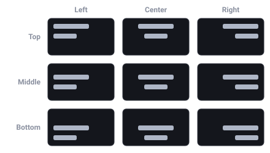

import { Aside } from '@astrojs/starlight/components';

`Text` 组件从动态字形图集绘制字符串。给实体加一个 `UINode`,文本就在弹性盒
(flexbox)盒内排版(换行、对齐、与同级 UI 一起排序);没有盒时则作为锚定在实体
原点的自由世界空间标签渲染。代码里用 `spawnUIEntity({ text: … })` 生成,或在
检查器里添加 `Text`。

```typescript
import { defineSystem, addStartupSystem, GetWorld, spawnUIEntity, TextAlign, px } from 'esengine';

const buildHud = defineSystem([GetWorld()], (world) => {
  spawnUIEntity({
    world,
    node: { width: px(240), height: px(40) },
    text: { content: 'Score: 0', fontSize: 24, align: TextAlign.Left },
  });
});
addStartupSystem(buildHud);
```

## 双字形管线

每个字形只栅格化一次进共享图集,再以带纹理的四边形绘制。`renderMode` 按 Text
逐个选择**如何**栅格化:

- **`Bitmap`** —— 字形用 Canvas2D 在**实际屏幕像素尺寸**下栅格化:设备像素 ×
  画布设计分辨率适配都折算进栅格化,四边形 1:1 贴屏,享有原生抗锯齿和字体
  hinting。任何窗口尺寸下都如 DOM 一样锐利——**静态** UI 的最锐选择。
- **`Sdf`** —— 每个字形栅格化一次为带符号距离场(signed-distance field),着色器
  在边缘铺一条 **约 1px 的屏幕空间覆盖渐变**(msdfgen/TextMeshPro 技法)。在
  **动态**缩放下——动画缩放、scale 补间、世界空间标签——边缘保持锐利,而位图
  会糊或闪。
- **`Auto`**(默认)—— 实体自身世界缩放为 1 时(±2% 以内;画布适配已在位图路径
  中补偿)用位图,一旦实体缩放立即切 SDF。静态 UI 如 DOM 般锐利,动画文本缩放
  稳定,零配置。

所以一个脉动的 "LEVEL UP!" 横幅什么都不用设——`Auto` 会在它缩放时切到 SDF:

```typescript
import {
  defineSystem, Query, Mut, Res, Time, Transform, Text,
} from 'esengine';

// Tween the banner's scale; Auto routes the text to the SDF pipeline
// while scale ≠ 1, so the glyph edges stay crisp mid-zoom.
const pulseBanner = defineSystem([Query(Mut(Transform), Text), Res(Time)], (q, time) => {
  for (const [, tr] of q) {
    const s = 1 + 0.25 * Math.sin(time.elapsed * 4);
    tr.scale.x = s;
    tr.scale.y = s;
  }
});
```

文本*生来*就带缩放、或活在任意相机变焦的世界空间时,强制 `Sdf`;确定文本永不
缩放、且想在微小的逐帧缩放噪声下也保住 hinting 时,强制 `Bitmap`。

## `Text` 属性

下表默认值为组件默认值(检查器所示)。

| 属性 | 类型 | 默认 | 说明 |
|---|---|---|---|
| `content` | string | `''` | 要显示的字符串。`\n` 硬换行。 |
| `i18nKey` | string | `''` | 本地化键。非空 ⇒ `content` 成为**派生值**:每帧从本地化目录解析([见下文](#本地化))。 |
| `fontFamily` | string | `'Arial'` | 字体族,由平台 Canvas2D 解析(见[自定义字体](#自定义字体))。 |
| `fontSize` | number | `24` | 尺寸,单位**设计像素**——与 `UINode` 的 `px()` 同一单位。设计分辨率适配与设备像素比在栅格化时补偿。 |
| `color` | Color | `{1,1,1,1}` | 填充色(每通道 `0..1`)。 |
| `align` | `TextAlign` | `Left` | 水平对齐:`Left` / `Center` / `Right`。 |
| `verticalAlign` | `TextVerticalAlign` | `Top` | 垂直对齐:`Top` / `Middle` / `Bottom`。 |
| `wordWrap` | boolean | `true` | 按盒宽换行(需要 `UINode` 盒)。 |
| `overflow` | `TextOverflow` | `Visible` | `Visible` / `Clip` / `Ellipsis`。当前渲染器始终按 `Visible` 绘制;要裁剪溢出,给盒加 [`UIMask`](/docs/zh-cn/guides/ui/)。 |
| `lineHeight` | number | `1.2` | 行距,为 **`fontSize` 的比率**(基线间距 = `lineHeight × fontSize`)。 |
| `bold` / `italic` | boolean | `false` | 基础字体样式(富文本 `<b>`/`<i>` 在其上叠加)。 |
| `strokeColor` | Color | `{0,0,0,1}` | 描边颜色。 |
| `strokeWidth` | number | `0` | 描边宽度(px);`0` 关闭。以 8 方向扇形展开的换色字形副本绘制。 |
| `shadowColor` | Color | `{0,0,0,1}` | 投影颜色。 |
| `shadowOffsetX` / `shadowOffsetY` | number | `0` | 投影偏移(px)。仅当颜色有 alpha 且至少一个偏移非零时绘制。 |
| `shadowBlur` | number | `0` | 保留字段——当前渲染器把投影画成硬边偏移副本,不应用模糊。 |
| `richText` | boolean | `false` | 解析内联[富文本标记](#富文本)。 |
| `renderMode` | `TextRenderMode` | `Auto` | 字形管线:`Auto` / `Bitmap` / `Sdf`(见上文)。 |
| `enabled` | boolean | `true` | 渲染开关(编辑器的眼睛图标也用它)。 |

<Aside type="note">
  代码组合路径有一套更适合控件的默认值,与组件不同:`spawnUIEntity({ text: … })` /
  `buildText()` 默认 `fontSize: 14`、`align: Center`、`verticalAlign: Middle`、
  `wordWrap: false`。要紧处请显式传字段。
</Aside>

## 对齐——有盒与无盒



*`align`(Left / Center / Right)和 `verticalAlign`(Top / Middle / Bottom)把文本块定位在它的盒内——九种组合。*

一条规则覆盖两种情况:**`align` / `verticalAlign` 把文本块定位在它的盒内,而
"没有盒" 塌缩为实体原点处的零尺寸盒**——同样的字段用来*锚定*自由标签,而不是
静默失效。

- **有 `UINode` 盒**(实体带布局尺寸非零的 `UINode`):每行在盒宽内水平对齐——
  与 `wordWrap` 无关,后者只决定是否在该宽度*断行*——`verticalAlign` 分配块的
  垂直空余(`Middle` 平分,`Bottom` 推到底)。
- **无盒**(没有 `UINode`,或 0×0):文本块锚定到实体原点。`align: Left` 让左缘
  落在原点,`Center` 以原点居中,`Right` 结束于原点;`verticalAlign` 同理锚定
  顶/中/底缘。世界空间标签——伤害数字、名牌——"以实体为中心"就是一个字段,
  不用算。

## 富文本

设 `richText: true`,在 `content` 里写内联标签。样式按栈嵌套;闭合标签弹出最内层
样式。解析不出的内容按字面渲染(散落的 `<` 不会吃掉文本)。

| 标记 | 效果 |
|---|---|
| `<b>…</b>` | 加粗片段。 |
| `<i>…</i>` | 斜体片段。 |
| `<color=#RRGGBB>…</color>` | 着色片段;`#RRGGBBAA` 带 alpha。 |
| `<font size=32>…</font>` | 另一字号的片段(`size="32"` 也能解析);共享基线。 |
| `` | 内联图片片段——目前能解析,**尚未渲染**(见下)。 |

```typescript
import { defineSystem, addStartupSystem, GetWorld, spawnUIEntity, px } from 'esengine';

const buildToast = defineSystem([GetWorld()], (world) => {
  spawnUIEntity({
    world,
    node: { width: px(360), height: px(48) },
    text: {
      content: 'Found <color=#ffd75a><b>Iron Sword</b></color> <font size=12>(rare)</font>',
      fontSize: 18,
      richText: true,
    },
  });
});
addStartupSystem(buildToast);
```

解析器以 `parseRichText(input)` 导出,返回 `RichTextRun[]`——每段是
`TextSegment`(`text`、`bold`、`italic`、`color`、`fontSize`)或
`ImageSegment`——想用同一套标记驱动自定义管线时可用。

<Aside type="caution">
  `` 会解析成 `ImageSegment`(标签必须自闭合且
  必须有 `src`),但内置文本渲染器目前**跳过图片片段**——文本内联精灵还画不
  出来。请改用 flexbox 把图片排在文本旁。
</Aside>

## 测量文本

`measureText(text, opts)` 不生成实体就回答"这串字渲染出来多大?"——用于必须
预先按内容定尺寸的布局,比如 ListView 为换行聊天气泡计算 `itemHeight(index)`。
它通过与渲染器相同的 Canvas2D 来源和同一套换行算法测量,测得的换行与渲染一致。
无 DOM 的主机(headless)退化为平均字宽估算。

```typescript
import { measureText, px, spawnUIEntity, defineSystem, addStartupSystem, GetWorld } from 'esengine';

const buildBubble = defineSystem([GetWorld()], (world) => {
  const message = 'You have been invited to join the guild "Night Watch".';
  const m = measureText(message, { fontSize: 16, maxWidth: 260 });
  spawnUIEntity({
    world,
    node: { width: px(280), height: px(m.height + 20) }, // pad the measured height
    visual: { color: { r: 0.13, g: 0.15, b: 0.2, a: 1 } },
    text: { content: message, fontSize: 16, wordWrap: true },
  });
});
addStartupSystem(buildBubble);
```

| `MeasureTextOptions` | 默认 | 说明 |
|---|---|---|
| `fontSize` | ——(必填) | 尺寸(显示像素)。 |
| `fontFamily` | `'Arial'` | 字体族。 |
| `bold` / `italic` | `false` | 样式(影响字距)。 |
| `letterSpacing` | `0` | 字形间额外像素。 |
| `maxWidth` | —— | 换行宽度;`0`/省略 = 单行。 |
| `lineHeight` | `fontSize × 1.2` | 行高(显示**像素**——注意不是组件里的比率)。 |

| `TextMetrics` | 说明 |
|---|---|
| `width` | 最宽行的宽度(显示像素)。 |
| `lineCount` | 换行加显式 `\n` 后的行数。 |
| `height` | `lineCount × lineHeight`——给盒定高就用它。 |

## 自定义字体

指定*用哪套字体*有两条途径,它们最终都落到同一处——平台文本栈据以栅格化的字体族名。

**把字体随游戏一起发布(`Text.font`)。** 把 `.ttf` / `.otf` / `.woff2` 导入项目,
在检查器里赋给 `font` 槽位。它是真正的资产引用,因此享有其他资产槽位一样的机制:
依赖追踪、cook 收录、`@uuid:` 引用、热更新、引用计数。加载器会用它铸造的族名把文件
注册进平台文本栈,`Text` 再用这个名字——所以自带字体不是第二条文本路径,只是抵达
族名的另一种方式。在**原生**平台这是唯一答案,那里没有页面可供加载 Web 字体。

**指定宿主已有的字体(`fontFamily`)。** 字形栅格化时由平台的 **Canvas2D**(原生上
则是系统字体匹配器)解析——系统字体,或页面自己加载的 Web 字体(CSS `@font-face` 或
`FontFace` API)。SDK 不会替你抓取这些文件;请确保 Web 字体在文本首次渲染前已加载,
否则其字形会用回退字体栅格化。

两者都设置时 `font` 优先。凡是品牌依赖的字体都建议用它:只写 `fontFamily` 时,缺少
该字体族的机器会静默回退成另一套字体,而这种失败只会在别人的设备上暴露。

另有**位图字体资产**(`.fnt` / `.bmfont`)走资产管线——`Assets.loadFont(ref)`
解析 `.fnt`、加载其页纹理,返回 `FontResult`(`{ handle }`)。它们驱动
**`BitmapText`** 组件:世界空间文本渲染器,其 `font` 字段引用加载的资产(在
检查器里指定字体资产),另有 `text`、`color`、`fontSize`、`align`、`spacing`、
`parallax`、`layer` 字段。预烘焙的分数/伤害字形美术用 `BitmapText`;UI 用
`Text`。

## 本地化

不要手写 `content`,改设 `i18nKey`:存在 Localization 资源时(安装
`localizationPlugin`),每帧有系统把键经目录解析并写入 `content`——因此
`setLocale` 下一帧就重排所有绑定的标签。缺失的键解析为键本身(可见、可 grep);
没有 Localization 资源时按原作 `content` 显示。见[本地化](/docs/zh-cn/guides/localization/)。

## 最佳实践

- **`renderMode` 留在 `Auto`**——只为生来带缩放的文本手选 `Sdf`,只为确定永不
  缩放、想钉住 hinting 的文本手选 `Bitmap`。
- **给 UI 文本配 `UINode` 盒**,换行和对齐才有宽度可依;只有锚定到实体的世界
  空间标签才走无盒。
- **`fontSize` 是设计像素**——与 `px()` 布局同一单位定字号,DPR 和设计分辨率
  适配交给引擎。
- **先测量再定尺寸**——`measureText` 用的是渲染器自己的换行,按内容定尺寸的盒
  (聊天行、tooltip)分毫不差。
- **用 `i18nKey` 绑定标签**,不要把翻译串写进 `content`——切换语言即自动重排。
- **强调用标记而非拆实体**:一个富文本 Text 胜过三个用 flexbox 粘起来的普通
  Text。

## 另请参阅

- [UI](/docs/zh-cn/guides/ui/) —— 组件模型总览。
- [UI 布局](/docs/zh-cn/guides/ui-layout/) —— 文本对齐与换行所依的 `UINode` 盒。
- [UI 组件](/docs/zh-cn/guides/ui-components/) —— 可编辑文本的 `createTextInput`。
- [UI 主题](/docs/zh-cn/guides/ui-theme/) —— 主题化的文本颜色角色与字号阶梯。
- [UI 数据绑定](/docs/zh-cn/guides/ui-binding/) —— 用响应式 signal 驱动 `content`。
- [本地化](/docs/zh-cn/guides/localization/) —— 目录、语言与 `i18nKey` 解析。
