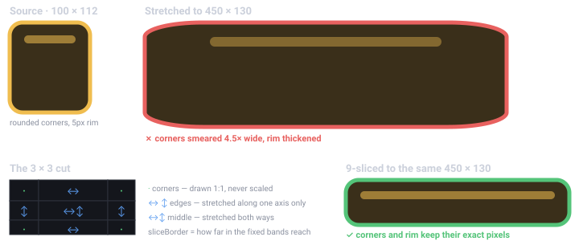
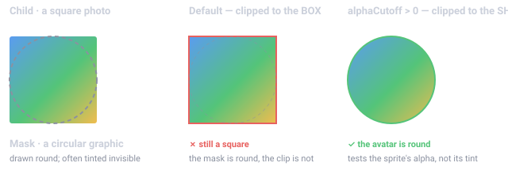
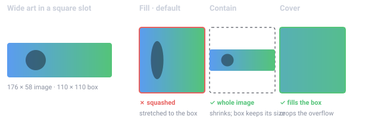
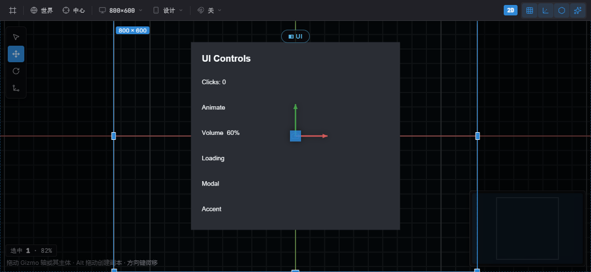

import { Aside } from '@astrojs/starlight/components';

Estella 的 UI 是在 C++ 内核里求解的 CSS 式弹性盒(flexbox)系统。你用 UI 组件组合界面——
在编辑器里或用代码——并在系统里处理交互。**没有 `RectTransform`**:`UINode` 就是真正的
flexbox,用 `px` / `percent` / `auto` 加 `Absolute` 内偏移(inset)来定尺寸。

本页是总览:组件模型、快速上手,以及各 UI 详细指南的地图。每个领域的深入参考在各自的章节里。

## 组件

| 组件 | 职责 | 指南 |
|---|---|---|
| `UINode` | 布局盒;持有逐项的 flex 字段(尺寸、grow/shrink、margin、inset)。 | [UI 布局](/docs/zh-cn/guides/ui-layout/) |
| `FlexContainer` | 用 flexbox 排布一个节点的子项(方向、justify、align、gap、padding)。 | [UI 布局](/docs/zh-cn/guides/ui-layout/) |
| `Text` | 经动态字形图集渲染文本(内容、字体、颜色、对齐、描边、阴影、富文本)。 | [UI 文本](/docs/zh-cn/guides/ui-text/) |
| `UIVisual` | 填充——纯色、纹理、九宫格、平铺或填充。 | 见下文 |
| `UIMask` | 裁剪它的子项。 | 见下文 |
| `UIScroll` | 让被裁剪的节点成为滚动视口:滚轮与拖拽移动它的内容。 | 见下文 |
| `Interactable` | 标记节点可命中,从而能被悬停/点击。 | [UI 交互](/docs/zh-cn/guides/ui-interaction/) |
| `UIInteraction` | 引擎每帧写入的指针状态(对你的逻辑只读)。 | [UI 交互](/docs/zh-cn/guides/ui-interaction/) |

## 快速上手:暂停菜单

一个完整的暂停菜单——居中的列面板,带标题和一个按钮——用**启动系统**构建一次:

```typescript
import {
  defineSystem, addStartupSystem, GetWorld, Res, UIEvents,
  spawnUIEntity, createButton,
  FlexContainer, FlexDirection, JustifyContent, AlignItems, px,
} from 'esengine';

const buildPauseMenu = defineSystem([GetWorld(), Res(UIEvents)], (world, events) => {
  // A panel: 320×220 with a dark translucent background.
  const panel = spawnUIEntity({
    world,
    node: { width: px(320), height: px(220) },
    visual: { color: { r: 0.08, g: 0.10, b: 0.16, a: 0.95 } },
  });

  // Lay its children out as a centered vertical column.
  world.insert(panel, FlexContainer, {
    direction: FlexDirection.Column,
    justifyContent: JustifyContent.Center,
    alignItems: AlignItems.Center,
    gap: { x: 0, y: 16 },
  });

  // A title, parented to the panel.
  spawnUIEntity({ world, parent: panel, text: { content: 'Paused', fontSize: 28 } });

  // A button that resumes the game on click.
  createButton({
    world, events, parent: panel, text: 'Resume',
    node: { width: px(160), height: px(44) },
    states: {
      normal:  { color: { r: 0.20, g: 0.55, b: 1.0, a: 1 } },
      hover:   { color: { r: 0.30, g: 0.65, b: 1.0, a: 1 } },
      pressed: { color: { r: 0.12, g: 0.45, b: 0.9, a: 1 } },
    },
    onClick: () => { /* unpause, switch scene, hide the menu… */ },
  });
});

addStartupSystem(buildPauseMenu);
```

`spawnUIEntity({ world, parent?, node?, visual?, text? })` 返回实体;传 `parent` 来
嵌套。尺寸用维度助手 `px`、`percent`、`auto`——单位都是**设计像素**(见
[UI 布局](/docs/zh-cn/guides/ui-layout/#单位设计像素))。其余控件工厂用法相同:
`createToggle`、`createSlider`、`createProgress`、`createDialog`、`createDropdown`——见
[UI 组件](/docs/zh-cn/guides/ui-components/)。

## 各部分如何协作

每一层都建立在前一层之上:

1. **布局**——`UINode` 盒子由 flexbox 引擎求解;`FlexContainer` 排布子项,
   `Absolute` 内偏移放置悬浮层。→ [UI 布局](/docs/zh-cn/guides/ui-layout/)
2. **视觉与文本**——`UIVisual` 填充盒子,`UIMask` 裁剪,`Text` 绘制锐利字形。
   → [UI 文本](/docs/zh-cn/guides/ui-text/)
3. **交互**——`Interactable` 让盒子可命中;引擎把指针状态写入 `UIInteraction`
   并发出冒泡的 `UIEvents`;拖放和键盘焦点建立在其上。
   → [UI 交互](/docs/zh-cn/guides/ui-interaction/)
4. **控件**——工厂(`createButton`、`createSlider`……)把前三层组合成现成的控件;
   `createListView` 提供虚拟化列表。
   → [UI 组件](/docs/zh-cn/guides/ui-components/)、[UI 列表](/docs/zh-cn/guides/ui-lists/)
5. **控制器**——每个 UI 根一份命名"页面"状态加逐页字段绑定(标签页、按钮状态、
   显示/隐藏)——零代码。→ [UI 控制器](/docs/zh-cn/guides/ui-controllers/)
6. **主题与绑定**——设计 token 给所有控件换肤(可实时切换),响应式 signal 让 UI
   与游戏状态保持同步。
   → [UI 主题](/docs/zh-cn/guides/ui-theme/)、[UI 绑定](/docs/zh-cn/guides/ui-binding/)

### `UIVisual` 与 `UIMask`

`UIVisual` 绘制节点的背景;`visualType` 选择模式:

| `UIVisualType` | 使用字段 | 说明 |
|---|---|---|
| `None` | — | 不可见(仅参与布局/命中测试)。 |
| `SolidColor` | `color` | 着色四边形。 |
| `Image` | `texture`、`uvOffset`、`uvScale` | 贴图四边形 / 精灵区域。 |
| `NineSlice` | `sliceBorder` | 角部固定、可缩放的面板。 |
| `Tiled` | `tileSize` | 纹理在盒内平铺重复。 |
| `Filled` | `fillAmount`、`fillMethod`、`fillOrigin` | 裁剪式填充(血条/进度条、冷却环)。 |

#### 九宫格是用来做什么的

一张按 100×112 绘制的按钮图,用在 450×130 的位置上时会被横向拉伸 4.5 倍——边框、圆角和高光
一并被拉长,整个框看起来像是化开了。而你不可能为游戏里每一种按钮尺寸都画一张图。

九宫格把图切成 3×3 的网格,每一块按不同方式缩放:



`sliceBorder` 就是那四个数字:从每条边往内多远是"不该拉伸"的区带。四角在任何尺寸下都保留自己
的精确像素,于是同一张 100×112 的纹理既能做小提示框,也能做通栏横幅。这个边框属于**图像**本身,
而不属于用到它的实体,所以它是纹理的导入设置——设一次,引用该纹理的每个 `NineSlice` 都按同样
方式切片。参见资产检视器中的[拖拽边框](/zh-cn/docs/guides/editor/#内容浏览器)。

#### 遮罩是用来做什么的

遮罩回答的是"显示这块内容,但只在那个区域内可见"。典型场景有两个:方形的头像照片需要呈现为
圆形;滚动列表的条目必须在视口边缘消失,而不是溢出到屏幕其余部分。

给节点加上 `UIMask`,它的子项就会被裁剪到该节点。默认裁剪的是节点的**外框**——一个矩形。
这对列表视口足够了,但也正是圆形头像框以前仍然裁出方形的原因:遮罩图形是圆的,裁剪范围不是。
`alphaCutoff` 大于 0 时,裁剪范围切换为遮罩实际绘制出的形状。



`UIVisual.enabled` 只隐藏本实体的视觉;`UINode.display = None` 把该节点**连同整棵
子树**从布局、渲染和命中测试中移除。给节点加 `UIMask` 可把子项裁剪到盒内。

**`UIVisual.fit` —— CSS `object-fit`。** 默认情况下图片会被*拉伸*到它的盒子,于是比例与
槽位不同的美术资源会明显被压扁。`Contain` 缩小四边形直到整张图放得下(盒子保持它的布局尺寸);
`Cover` 保持盒子、改为裁剪 UV。两者都不会让美术变形。`NineSlice` 和 `Tiled` 会忽略它——
适配盒子本来就是它们的职责。



**`UIMask.alphaCutoff` —— 按形状裁剪,而不是按外框。** 模板遮罩裁剪的是遮罩的*矩形*,所以
圆形头像框裁出来仍是方的。大于 `0` 时它按遮罩实际绘制的形状裁剪,判定用的是**精灵**的 alpha
(而非着色后的结果——遮罩图形常被调到接近全透明,好让它遮挡而不被看见)。默认仍是 `0`,因此
按外框裁剪创作的场景不受影响。

### 子树透明度与指针门

`UINode` 上有两个**沿层级解析**的字段,与已有的 `display` 在同一趟里完成:

| 字段 | 默认 | 效果 |
|---|---|---|
| `opacity` | `1` | 像 CSS `opacity` 一样沿树相乘。一个值淡出整块面板。 |
| `pointerEvents` | `Auto` | `None` 让该节点**及其子树**对指针透明——照常绘制,点击直接穿过。 |

这就是 "CanvasGroup" 那组旋钮:以前淡出一块面板意味着挨个改每个视觉的 `color.a`,而装饰性
覆盖层没有办法不吃掉点击(`Interactable.blockRaycast` 是逐实体的,不继承)。`opacity` 遵循
CSS 语义——逐视觉相乘而不是把子树离屏合成,这是每个 UI 工具包都会做的取舍。

```ts
// 淡出整个对话框,并在它退场动画期间让点击穿过。
world.set(dialog, UINode, { ...node, opacity: 0.3, pointerEvents: UIPointerEvents.None });
```

### 滚动

`UIScroll` 把一个被裁剪的节点变成**滚动视口**:滚轮和拖拽移动它的内容,而节点上的 `UIMask`
负责把露到外面的部分藏起来。内容装得下时不会动,所以在没有可滚内容之前这个组件是惰性的。

| 字段 | 默认 | 含义 |
|---|---|---|
| `content` | 第一个子节点 | 被移动的那个子节点。 |
| `horizontal` / `vertical` | `false` / `true` | 哪些轴可滚。 |
| `movement` | `Clamped` | `Elastic` 会在两端过冲再弹回。 |
| `wheelSpeed` | `1` | 滚轮增量的倍率。 |
| `dragScroll` | `true` | 拖拽/触摸抓取,带惯性甩动。 |
| `decelerationRate` | `0.135` | 甩动速度每秒保留的比例;`0` 表示松手即停。 |

```ts
// 一个在固定盒子里纵向滚动的列表。
const viewport = spawnUIEntity({ world, parent: panel, node: { width: px(400), height: px(300) } });
world.insert(viewport, UIMask, { enabled: true, mode: MaskMode.Scissor, alphaCutoff: 0 });
world.insert(viewport, Interactable, { enabled: true, raycastTarget: true });

const content = spawnUIEntity({ world, parent: viewport, node: { width: px(400), height: px(1200) } });
world.insert(viewport, UIScroll, { vertical: true });   // content 缺省取第一个子节点
```

这个组件补的是**场景能说出口的话**。以前滚动只能靠在代码里构造 `ScrollView` widget,所以在
编辑器里摆出来的滚动区能描述自己的每个零件——被裁剪的盒子、超长的子节点——唯独说不出「它会滚」
这件事。`UIScroll` 就是这件事,现在 widget 和场景驱动的是同一个容器。

<Aside type="note">
  视口需要 `UIMask` 来裁剪、`Interactable` 来接收指针。编辑器的 **Create → ScrollView**
  已经把这三样装配好了。
</Aside>

## 编辑器还是代码



*编辑器里的一个 UI Canvas——依据设计框排布,带选中节点的 gizmo。同一套控件既能从代码写,也能在编辑器里排。*

两者书写的是**同一套组件**——没有单独的编辑器格式:

- **编辑器**——*Create… → UI* 放入控件预制件(Button、Toggle、Slider、Dialog……);
  拖拽嵌套,在 Details 里编辑每个字段,用逐轴锚点选择器摆放,并按项目的设计分辨率
  和设备预设预览。见[编辑器](/docs/zh-cn/guides/editor/)。
- **代码**——`spawnUIEntity` + 控件工厂,如上例在启动系统里构建。编辑器能写的,
  代码都能写。

## 下一步去哪

| 你想…… | 打开 |
|---|---|
| 定尺寸摆盒子——`px`/`percent`/`auto`、flexbox、绝对内偏移、锚点 | [UI 布局](/docs/zh-cn/guides/ui-layout/) |
| 绘制文本——字体、SDF/位图锐利度、换行、富文本 | [UI 文本](/docs/zh-cn/guides/ui-text/) |
| 响应指针与键盘——点击、`UIEvents`、拖放、焦点 | [UI 交互](/docs/zh-cn/guides/ui-interaction/) |
| 使用现成控件——按钮、开关、滑条、对话框、下拉、输入框 | [UI 组件](/docs/zh-cn/guides/ui-components/) |
| 展示滚动数据——虚拟化列表与网格 | [UI 列表](/docs/zh-cn/guides/ui-lists/) |
| 全局换肤——设计 token、项目主题、实时切换 | [UI 主题](/docs/zh-cn/guides/ui-theme/) |
| 让 UI 与游戏状态同步——signal、`bind`、控件双向绑定 | [UI 绑定](/docs/zh-cn/guides/ui-binding/) |
| 跨元素共享状态——标签页、单选组、页面驱动的视觉 | [UI 控制器](/docs/zh-cn/guides/ui-controllers/) |

## 最佳实践

- **优先 flex 而非绝对定位**——用 `FlexContainer` + `flexGrow` 布局;`Absolute`
  内偏移只留给悬浮层和角标。
- **用 `percent` / `auto` 定尺寸**以获得分辨率无关性;只有确实需要固定尺寸时才用
  硬编码 `px`。
- **逻辑读 `UIInteraction` 或 `UIEvents` 驱动**,绝不去改写它们。
- **复用控件工厂**以获得一致的状态视觉,而不是手工接线悬停/按下。
- **九宫格面板**(`NineSlice`)在任意尺寸下保持边框锐利。

## 另请参阅

- [输入](/docs/zh-cn/guides/input/)——UI 层之下的原始键盘/鼠标/触摸。
- [本地化](/docs/zh-cn/guides/localization/)——把 `Text.content` 绑定到翻译键。
- [动画](/docs/zh-cn/guides/animation/)——补间 UI 颜色/位置增加动感。
- [编辑器](/docs/zh-cn/guides/editor/)——可视化编排、预制件、锚点选择器。
