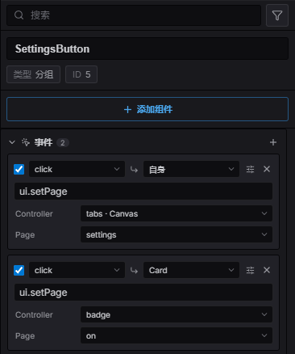
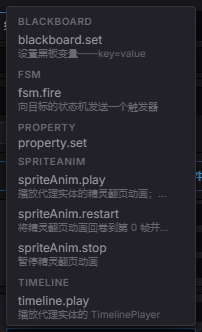
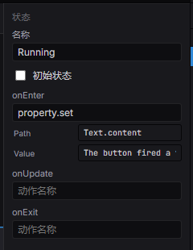

import { Aside } from '@astrojs/starlight/components';

一根**连线（wire）**说的是：*当这个实体收到这个事件时，在那个实体上执行这个动作。* 它就是
挂在发出事件那个实体上的一行数据——没有回调，没有脚本文件——所以摆好按钮和让它*做事*
在同一个地方完成。

```
click ─▶ ui.setPage(tabs, settings)      目标「自身」
click ─▶ ui.setPage(badge, on)           目标「Card」
```

连线**刻意不是**可视化编程语言。一行里没有分支、没有表达式；真的需要逻辑时，这行会指向一个
把控制权交给[状态机](/docs/zh-cn/gameplay/ai/)的动作——Estella 已经有图编辑器了。

## 检视器里的一根线



*按钮上的两根线：都在 `click` 时触发，一根切换按钮自身祖先链上的控制器，另一根按名字指向
`Card` 实体。*

选中任意能发出事件的实体——UI 节点、`Interactable`、碰撞体——**事件**区域就列出它的连线。
每一行从左到右是：

| 部分 | 含义 |
|---|---|
| ☑ | 该行是否启用。不勾选则保留在数据里但永不触发。 |
| 事件 | 要监听的事件类型（`click`、`change`、`trigger_enter`……）。 |
| ↳ 目标 | 动作在哪个实体上执行。默认「自身」，也可**按名字**指向别的实体。 |
| 动作 | 已注册的动作名——与 FSM、行为树编辑器**同一个**候选列表。 |
| 参数 | 该动作声明了什么就显示什么。没声明参数的动作显示一个自由文本参数框。 |
| ⚙ | 展开**条件**（必须通过的具名条件）与**仅一次**。 |

## 数据本身

一根线就是 `EventBinding` 组件，因此它会序列化进场景、随[预制体](/docs/zh-cn/world/prefabs/)
一起走，和任何组件一样——不新增资产类型：

```typescript
import { EventBinding, UIEventType } from 'esengine';

world.insert(button, EventBinding, {
  rows: [
    { event: UIEventType.Click, action: 'ui.setPage', params: { controller: 'tabs', page: 'settings' } },
    { event: 'trigger_enter', target: 'Door', action: 'ui.setVisible', params: { visible: true }, once: true },
  ],
});
```

| `EventBindingRow` | 说明 |
|---|---|
| `event` | 要监听的事件类型。任意字符串——内建的只是众所周知的那一批。 |
| `target` | 动作运行所在实体的名字。省略即挂着这行的实体自己。 |
| `action` | 已注册的动作名。 |
| `params` | 该动作声明的参数，按名字给。 |
| `arg` | 同一份输入的规范字符串形式（`"tabs:settings"`）。两种写法都能跑。 |
| `guard` | 必须通过才执行该行的具名条件。 |
| `once` | 每次运行最多执行一次。 |
| `enabled` | `false` 让该行失效但不删除。 |

连线只在运行态触发——编辑时编辑器绝不会执行你的动作。

### 目标按名字就近解析

`target` 是实体**名字**，由内向外查找：本行所在实体、它的子树、各级祖先的子树，最后才是整个
场景。就近者胜——这正是让同一预制体的两个实例不会互相串线的原因：对话框 A 里的 `Close`
按钮找到的永远是 A 的 `Panel`，不会是 B 的。

匹配不到的名字会在检视器里标红，运行时也会告警，而不是悄悄失效。

## 动作

动作是共享注册表里的一个具名函数——`.esfsm` 状态钩子和 `.esbt` 叶子解析的是**同一个**
注册表。注册一次，三个候选列表里都能看到。



*候选按 `namespace.` 分组，引擎自带的动作还带一行说明。*

引擎自带这些：

| 动作 | 作用 |
|---|---|
| `ui.setPage` | 把 [UI 控制器](/docs/zh-cn/ui/controllers/)切到某一页。 |
| `ui.setVisible` | 显示/隐藏一棵 UI 子树（`UINode.display`）。 |
| `property.set` | 写任意组件字段，按 `Component.dot.path` 寻址。 |
| `fsm.fire` | 向目标的状态机发一个触发器。 |
| `blackboard.set` | 设置一个黑板变量。 |
| `timeline.play` · `timeline.pause` | 驱动目标上的[时间轴](/docs/zh-cn/animation/timeline/)。 |
| `spriteAnim.play` · `spriteAnim.restart` · `spriteAnim.stop` | 驱动精灵序列帧。 |

### 你自己的动作

注册一次，这个名字在所有地方都能授权使用：

```typescript
import { registerAction } from 'esengine';

registerAction('game.award', {
  params: [
    { name: 'kind', type: 'enum', options: [{ label: '金币', value: 'coin' }, { label: '星星', value: 'star' }] },
    { name: 'amount', type: 'number' },
  ],
  run: (ctx, bb, arg, params) => {
    grantReward(ctx.entity, params!.kind as string, params!.amount as number);
  },
});
```

声明 `params` 正是把编辑器里那个文本框变成下拉框和数字框的原因。`ctx` 与 FSM 动作拿到的
是同一种上下文——`entity`、`world`、`commands`，外加黑板。

<Aside type="tip" title="注册写在哪">
编辑器从不执行你的游戏代码，所以它是从项目的**声明入口**（默认 `src/components.ts`——
也就是它读取组件的那个模块）得知你的动作名的。写在那里，名字就会出现在所有候选列表里；
写在别处运行时照样有效，只是需要你手输名字。
</Aside>

## 有哪些事件

控件发出标准的那一批（`UIEventType`），并且事件会**冒泡**，所以挂在面板上的一行能听到它子级
按钮的事件：

`click` · `press` · `release` · `hover_enter` · `hover_exit` · `focus` · `blur` ·
`change` · `submit` · `drag_start` · `drag_move` · `drag_end` · `scroll` · `select` · `deselect` ·
`shown` · `hidden`

`shown` 和 `hidden` 是「控件发出的」里的例外：没人点任何东西，是这个节点出现在了屏幕上、或者离开了
屏幕——通常因为**某个祖先**被显示或隐藏，也就是导航、页签、弹窗在做的事。子树里的每个节点都会被告知，
所以「这块界面出现的时候」是挂在那块界面上的一行，而不是一个每帧去盯着的系统：

```
shown ─▶ fsm.fire(enter)  挂在 "MissionPanel"   →   Hidden ──enter──▶ Entering
```

在没有人监听这两个事件之前，这份「盯着」不花任何代价；有人监听、但这一帧 UI 没动过时，同样不花。

[物理](/docs/zh-cn/gameplay/physics/)接触也走同一条通道（`PhysicsEventType`），所以
[触发区](/docs/zh-cn/gameplay/markers/)的接线方式和按钮一模一样——双方都会收到事件，各自拿到对方：

`collision_enter` · `collision_exit` · `collision_hit` · `trigger_enter` · `trigger_exit`

这套词汇是开放的：你在任何地方发出自己的事件名，某一行都能监听它。

```typescript
import { EntityEvents } from 'esengine';

app.getResource(EntityEvents).emit(chest, 'looted', { gold: 12 });
```

## 当一根线需要逻辑时

一行只跑一个动作，没有"如果"，也没有先后序列。这是**刻意**设的天花板，而 `fsm.fire` 就是
突破口——点击发出一个触发器，实体的[状态机](/docs/zh-cn/gameplay/ai/)来决定它意味着什么：

```
click ─▶ fsm.fire(start)  目标「Hint」   →   Idle ──start──▶ Running
                                                             onEnter: property.set(…)
```



*同一套参数控件，出现在状态机编辑器里：`property.set` 声明了 `path` 和 `value`，于是钩子
显示两个字段，而不是一个含义不明的字符串。*

一个动作只声明一次参数，所有授权界面都会长出来——事件行、FSM 状态钩子、行为树叶子。

## 同一份输入的两种写法

每个动作都保留一份规范字符串形式。`{ controller: 'tabs', page: 'settings' }` 和
`"tabs:settings"` 是彼此的投影，注册表负责两个方向的转换，因此：

- 在动作声明参数**之前**写下的数据照样能跑，不用迁移；
- 只读 `arg` 的动作，在行以参数形式书写时依然能收到字符串；
- 存的是普通字符串的行，编辑器照样能给出真控件。

你不需要做选择：检视器写参数形式，手写数据两种都行。

<Aside type="caution" title="暂不支持：资产与实体参数">
参数不能是资产引用或实体句柄。打包的资产发现流程和场景的实体重映射都不会深入到行的参数里，
这样的参数会让构建产物缺资产——一个会悄悄玩坏游戏的控件，比没有这个控件更糟。跨实体请用
`target` 名字，引用资产请通过打包能看见的组件。
</Aside>

## 示例

`examples/ui-events` 把整套能力放进一个项目——两个页签按钮、一个跨实体的角标，以及一个把
控制权交给状态机的 *Start run* 按钮。它的 `src/main.ts` 是空的；里面的每一个行为都是授权数据。
