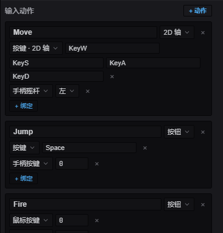

import { Aside } from '@astrojs/starlight/components';

在系统里通过 `Input` 资源读取输入。它跟踪**按住**状态以及本帧的**边沿**(按下 / 释放),
所以每帧查询它——边沿只在变化发生的那一帧为真。

## 键盘

```typescript
import { defineSystem, Res, Input } from 'esengine';

const keys = defineSystem([Res(Input)], (input) => {
  if (input.isKeyDown('KeyW'))       { /* held down */ }
  if (input.isKeyPressed('Space'))   { /* pressed this frame */ }
  if (input.isKeyReleased('Escape')) { /* released this frame */ }
});
```

按键用 DOM code 字符串:`KeyW`、`KeyA`、`ArrowUp`、`Space`、`Escape`、`Digit1`……

## 鼠标

```typescript
const mouse = defineSystem([Res(Input)], (input) => {
  if (input.isMouseButtonPressed(0)) { /* left click this frame */ }
  const screenX = input.mouseX, screenY = input.mouseY;   // screen pixels
  const wheel = input.scrollDeltaY;
});
```

按键:`0` = 左,`1` = 中,`2` = 右。

### 世界空间里的鼠标

`input.mouseX` / `mouseY` 是屏幕像素。要世界坐标——用于放置或命中实体——读 `UICameraInfo`,
它暴露已投影到世界里的光标:

```typescript
import { defineSystem, Commands, Res, Input, UICameraInfo, Transform } from 'esengine';

const spawnAtCursor = defineSystem(
  [Res(Input), Res(UICameraInfo), Commands()],
  (input, camera, cmds) => {
    if (!camera.valid) return;
    if (input.isMouseButtonPressed(0)) {
      cmds.spawn().insert(Transform, {
        position: { x: camera.worldMouseX, y: camera.worldMouseY, z: 0 },
      });
    }
  }
);
```

## 固定步长(物理)

`FixedUpdate` 系列的系统以固定节奏运行——比步长短的帧运行零次,追赶时运行多次。
`*Pressed` / `*Released` 边沿已考虑这点:一个边沿只会被**恰好一个**固定步(第一个
在它到达之后的步)消费,所以在物理角色控制器里读的跳跃,不会在快帧里丢失、也不会
在慢帧里触发两次——你无需自己缓冲。

```typescript
// Schedule.FixedPreUpdate —— 边沿被可靠地投递。
const jump = defineSystem([Query(Mut(CharacterController)), Res(Input)], (players, input) => {
  for (const [, cc] of players) {
    if (cc.isOnFloor && input.isKeyPressed('Space')) cc.velocity.y = JUMP_FORCE;
  }
});
```

<Aside type="note">按住状态(`isKeyDown`)是电平触发,本就能在任意 schedule 正确读取。
按步精确的边沿投递覆盖键盘与鼠标按键;手柄边沿是按帧粒度的。</Aside>

## 输入动作(`InputMap`)



*输入映射编辑器:命名动作(Move / Jump / Fire),每个都能挂任意多个键盘、鼠标、手柄绑定。*

写死的按键检查会把设备细节散落进玩法代码。**输入映射**给每个动作起一次名——
键盘 / 鼠标 / 手柄绑定随便挂多少个——玩法按名字查询动作:

```typescript
import {
  defineInputMap, Button, Axis2D,
  Key, Keys2D, Stick, GpButton, GamepadButton,
} from 'esengine';

export const Controls = defineInputMap({
  Move: Axis2D(Keys2D('KeyW', 'KeyS', 'KeyA', 'KeyD'), Stick('left')),
  Jump: Button(Key('Space'), GpButton(GamepadButton.South)),
});
```

`defineInputMap` 自己注册每帧求值(在输入轮询之后、`Update` 之前),映射立即可用
——在任何系统里导入并查询:

```typescript
const dir = Controls.axis2d('Move');          // { x, y },长度 ≤ 1
if (Controls.pressed('Jump')) { /* 本帧边沿 */ }
```

| 查询 | 返回 |
|---|---|
| `down(name)` | 按住——动作幅度 ≥ 0.5。 |
| `pressed(name)` / `released(name)` | 本帧边沿。 |
| `value(name)` | button `0..1` · axis `-1..1` · axis2d 的幅度 `0..1`。 |
| `axis2d(name)` | `{ x, y }` 方向(超过 1 时归一化)。 |

动作是 `Button(…)`、`Axis1D(…)` 或 `Axis2D(…)`;各接任意数量的绑定,多个绑定
求和(再钳制),键盘与手柄自然共存:

| 绑定 | 供给 | 含义 |
|---|---|---|
| `Key(code)` | button / axis | 一个键盘键。 |
| `MouseButton(b)` | button / axis | 一个鼠标键。 |
| `GpButton(btn, pad?)` | button / axis | 一个手柄键(扳机给模拟值)。 |
| `GpAxis(axis, pad?, scale?)` | axis | 一根原始手柄轴。 |
| `Keys1D(neg, pos)` | axis | 两个键 → 带符号的 1D 轴。 |
| `Keys2D(up, down, left, right)` | axis2d | 四个键 → 2D 方向。 |
| `Stick('left' \| 'right', pad?)` | axis2d | 一根手柄摇杆(上 = +y,与 `Keys2D` 一致)。 |

### 数据模型

这些构造函数只是普通可序列化数据之上的糖——`Binding` 是一个带标签的联合类型,
一个动作则是 `type` 加它的绑定列表:

```typescript
import { type Binding, type ActionDef } from 'esengine';

const jump: ActionDef = {
  type: 'button',                          // 'button' | 'axis' | 'axis2d'
  bindings: [
    { kind: 'key', code: 'Space' },        // Key('Space')
    { kind: 'gpButton', button: 0 },       // GpButton(GamepadButton.South)
  ],
};
```

| `Binding` kind | 字段 | 构造函数 |
|---|---|---|
| `key` | `code` | `Key` |
| `mouse` | `button` | `MouseButton` |
| `gpButton` | `button`、`pad?` | `GpButton` |
| `gpAxis` | `axis`、`pad?`、`scale?` | `GpAxis` |
| `keys1d` | `neg`、`pos` | `Keys1D` |
| `keys2d` | `up`、`down`、`left`、`right` | `Keys2D` |
| `stick` | `stick: 'left' \| 'right'`、`pad?` | `Stick` |

因为绑定就是数据,这一份模型同时也是**改键与持久化格式**:`toJSON()` / `loadJSON()`
只往返绑定本身(每动作一个 `Binding[]`),而 `toAsset()` 序列化整张映射——连动作类型
一起——成一个 `InputMapAsset`(`{ version, actions }`),即 `.inputmap` 文件的内容。
`loadJSON` 会忽略映射里不存在的动作,所以已删除动作的陈旧存档数据永远不会复活它。

### 改键与持久化

绑定是普通的可序列化数据,所以按键设置界面写起来很小:

```typescript
// "按任意键…"——捕获下一个按键 / 手柄键(鼠标需显式开启)
await Controls.rebind('Jump');            // 替换;{ append: true } 则追加
Controls.save('controls');                // 持久化到平台 Storage
// 启动时:
Controls.load('controls');                // 重新应用已存的绑定(如有)
```

`rebind` / `listenForBinding` 接受一个 `ListenOptions`,选择捕获监听哪些设备族:
`keyboard` 和 `gamepad` 默认**开**,`mouse` 默认**关**——这样按下"改键"按钮的那次点击
不会被捕获成绑定。轴类输入永远不会被捕获;改键只面向离散输入。

`getBindings` / `setBindings` 以编程方式查看和编辑绑定;`cancelListen()` 中止
挂起的捕获(以 `null` 解析)。

### 数据驱动的映射(`.inputmap`)

整张映射也能序列化为资产:在编辑器内容浏览器里**新建 Input Map**,然后用
`loadInputMapAsset(json)` 代替 `defineInputMap` 构建。`toAsset()` 从代码产出
同样的格式。

## 触摸手势

`GestureDetector` 把原始触摸变成点按 / 长按 / 滑动 / 捏合回调。基于 `Input`
资源构建一次,在系统里驱动:

```typescript
import { defineSystem, Res, Input, Time, GestureDetector } from 'esengine';

let gestures: GestureDetector | null = null;

const gestureSystem = defineSystem([Res(Input), Res(Time)], (input, time) => {
  if (!gestures) {
    gestures = new GestureDetector(input);
    gestures.onTap       = (x, y) => { /* 屏幕 px */ };
    gestures.onLongPress = (x, y) => { /* 原地按住约 0.5 s */ };
    gestures.onSwipe     = (dir, speed) => { /* 'left' | 'right' | 'up' | 'down' */ };
    gestures.onPinch     = (scale, cx, cy) => { /* 逐帧的双指缩放系数 */ };
  }
  gestures.update(time.delta);
});
```

点按 = 0.3 s 内、移动小于 10 px;滑动需 ≥ 50 px 且 ≥ 200 px/s;捏合报告双指
间距逐帧的缩放系数及中心点。

## 输入路由(分层)

原始平台事件在落进 `Input` 资源之前,会先经过 **`InputRouter`**——一条三层的
责任链:

1. **编辑器**——工具(gizmo、框选拖拽)最先认领。
2. **UI**——组件和对话框认领落下来的部分。
3. **游戏**——隐式的:就是 `Input` 资源本身。玩法只会看到没有被上游处理器
   消费的事件。

处理器回调返回 `true` 即**消费**该事件——它既不更新 `Input`,也不再传给后面的层。
返回 `false` / 什么都不返回则放行。因为消费是按事件粒度的(而不是一个全局的
"编辑器激活"开关),工具可以只认领它真正关心的:框选拖拽在按住期间消费指针移动,
但让滚轮穿透到相机;模态框消费 Escape,却不管方向键。

引擎的 UI 插件已经占据了 UI 层——`isPointerOverUI()` 和防点击穿透正是靠它工作的。
只有在做工具、或把引擎嵌进宿主应用时,你才需要自己写处理器:

```typescript
import { inputRouter, type InputHandler } from 'esengine';

const modalHandler: InputHandler = {
  onKeyDown(code, mods) {
    if (code === 'Escape') { closeModal(); return true; }   // consumed
  },
  onPointerDown(button, x, y, mods) {
    return isInsideModal(x, y);   // claim clicks on the modal, pass the rest
  },
};

const release = inputRouter.setUIHandler(modalHandler);
// when the modal closes:
release();
```

`inputRouter` 是模块级单例;`setEditorHandler` / `setUIHandler` 每层安装一个
处理器,并返回一个注销函数(注销只移除*你的*处理器,不会碰更新的那个)。
`InputHandler` 的所有方法都是可选的:

| `InputHandler` 方法 | 签名 |
|---|---|
| `onKeyDown` / `onKeyUp` | `(code, mods)` |
| `onPointerMove` | `(x, y, mods)` |
| `onPointerDown` | `(button, x, y, mods)` |
| `onPointerUp` | `(button, mods)` |
| `onWheel` | `(deltaX, deltaY, mods)` |
| `onTouchStart` / `onTouchMove` | `(id, x, y)` |
| `onTouchEnd` / `onTouchCancel` | `(id)` |

`mods` 是一份 **`Modifiers`** 快照——`{ shift, ctrl, alt, meta }`——由路由器从
按键事件跟踪(任何时候也可以读 `inputRouter.currentMods`)。在释放修饰键的那个
key-up 边沿,处理器看到的它仍是按住的,与 DOM `event.shiftKey` 的语义一致。
抛异常的处理器按未消费处理,坏掉的工具不会吞掉全部输入。

## 参考

| 分组 | 方法 |
|---|---|
| 键盘 | `isKeyDown(code)`、`isKeyPressed(code)`、`isKeyReleased(code)`。 |
| 鼠标 | `isMouseButtonDown(b)`、`isMouseButtonPressed(b)`、`isMouseButtonReleased(b)`;`mouseX` / `mouseY`、`scrollDeltaY`。 |
| 触摸 | `isTouchActive(id)`、活动触点的 `touches` map。 |
| 手柄 | `isGamepadConnected(pad?)`、`isGamepadButtonDown(btn, pad?)`、`isGamepadButtonPressed`/`Released(btn, pad?)`、`getGamepadAxis(axis, pad?)`。 |
| 指针 | `isPointerOverUI()` —— 光标在 UI 元素上方。 |

`*Down` 读按住状态;`*Pressed` / `*Released` 是本帧边沿。

## 最佳实践

- **每帧轮询**——边沿(`*Pressed` / `*Released`)在渲染帧里持续一帧,在 `FixedUpdate`
  里持续一个固定步(见上)。
- **用 `isPointerOverUI()` 守卫世界点击**,点按钮时不要也命中游戏世界。
- **世界坐标用 `UICameraInfo`**,而非裸 `mouseX/Y`,让拾取尊重相机。
- **手柄 `pad` 默认 0**——本地多人传索引。

## 参见

- [相机](/docs/zh-cn/graphics/camera/) —— 对任意屏幕点用 `screenToWorld`。
- [UI](/docs/zh-cn/ui/overview/) —— UI 在游戏世界之上消费指针输入。
