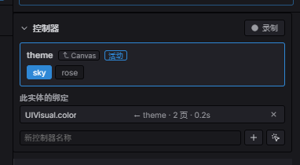

import { Aside } from '@astrojs/starlight/components';

**控制器（controller）** 是挂在 UI 根上的一个具名"页"枚举——`{ up, over, down }`、
`{ home, shop, about }`、`{ closed, open }`。**属性绑定（gear）** 把某个组件字段绑定到
*每一页* 的值：控制器一切换页，所有被绑定的元素就随之重排——颜色、位置、可见性、文本，
或任何可反射的字段，可瞬切也可补间。

一个控制器驱动多个元素,而整套东西就是普通的 ECS 数据(两个组件 `UIController` 和
`UIGear`),会随 [预制体](/docs/zh-cn/world/prefabs/) 一起走、序列化进场景。它是
[按钮](/docs/zh-cn/ui/widgets/#button) 那种"单控件状态"的共享化、多页化推广——
页签、单选组、按钮状态、面板显隐,统一用一套机制。

## 控制器

把 `UIController` 挂在 UI 根上(一个 `Canvas` 或任意节点)。它持有一个或多个具名控制器,
每个有页列表和当前页:

```typescript
import { UIController, controllerState, setControllerPage, getControllerPage } from 'esengine';

world.insert(root, UIController, {
  controllers: [controllerState('tab', ['home', 'shop', 'about'], 'home')],
});

setControllerPage(world, anyDescendant, 'tab', 'shop');   // 切换页
getControllerPage(world, anyDescendant, 'tab');           // → 'shop'
```

`controllerState(name, pages, current?)` 构造一个控制器(current 默认取第一页)。
`setControllerPage` / `getControllerPage` 会沿 **自身 → 祖先** 找到最近的同名控制器,
所以叶子上的绑定能找到根上的控制器。`setControllerPage` 对未知控制器、未知页、或已是当前页
都是空操作(防拼写错,而不是报错)。

| `ControllerState` 字段 | 说明 |
|---|---|
| `name` | 控制器名,供绑定引用(如 `"tab"`、`"$interaction"`)。 |
| `pages` | 有序的页名——枚举的成员。 |
| `current` | 当前选中的页。 |

## 属性绑定

把 `UIGear` 挂在控制器下的任意元素上。每条绑定表达 *"当控制器 C 处于页 P 时,该字段取值 V"*:

```typescript
import { UIGear, gearBinding, EasingType } from 'esengine';

world.insert(card, UIGear, {
  bindings: [
    // 卡片颜色跟随 'tab' 页,0.18 秒缓动。
    gearBinding('tab', 'UIVisual', 'color', {
      home:  { r: 0.16, g: 0.18, b: 0.26, a: 1 },
      shop:  { r: 0.21, g: 0.16, b: 0.26, a: 1 },
      about: { r: 0.15, g: 0.23, b: 0.21, a: 1 },
    }, { easing: EasingType.EaseOutCubic, duration: 0.18 }),

    // 标签文本跟随同一页(字符串直接瞬切,不插值)。
    gearBinding('tab', 'Text', 'content', {
      home: 'Welcome home', shop: 'Buy stuff', about: 'About us',
    }),
  ],
});
```

`gearBinding(controller, component, property, pages, tween?)` 寻址字段的方式和
[时间轴](/docs/zh-cn/animation/timeline/) 属性轨道一致——组件名 + 点路径 `property`
(`"color"`、`"color.a"`、`"scale.x"`)。`pages` 是按页名索引的 **稀疏** 映射:某页没有条目就
不动这个字段。

| `GearBinding` 字段 | 说明 |
|---|---|
| `controller` | 由哪个控制器驱动(沿自身 → 祖先解析)。 |
| `component` | 目标组件名——`"UIVisual"`、`"Transform"`、`"Text"`、`"UINode"`。 |
| `property` | 组件内的点路径(`"color"`、`"color.a"`、`"scale"`)。 |
| `pages` | `页 → 值` 映射;此处缺失的页不动该字段。 |
| `tween?` | `{ easing, duration }` 在切页时插值;省略则瞬切。 |

**取值**——数字、颜色(`{r,g,b,a}`)、向量(`{x,y,z}`)在有 `tween` 时插值;字符串和布尔总是瞬切。
被绑定的元素在该字段上归控制器所有:每次切页,绑定就把该页的值写上去。

<Aside type="note">
  绑定在 **编辑期也生效**——应用它的系统不受 play 门控。所以在编辑器里切换控制器的页,
  视口立即预览,无需运行。
</Aside>

## 无需专用状态的按钮

内建控制器名 **`$interaction`** 由指针状态驱动
(`normal` / `hover` / `pressed` / `disabled`)。给元素配一个 `$interaction` 控制器 +
一个 `Interactable` + 一条绑定,它就通过与其他一切相同的机制获得按钮状态——`createButton`
本身就是这样构成的:

```typescript
import { UIController, UIGear, interactionController, gearBinding, EasingType } from 'esengine';

world.insert(btn, UIController, { controllers: [interactionController()] });
world.insert(btn, Interactable, { enabled: true, blockRaycast: true, raycastTarget: true });
world.insert(btn, UIGear, {
  bindings: [gearBinding('$interaction', 'UIVisual', 'color', {
    normal:   { r: 0.30, g: 0.33, b: 0.42, a: 1 },
    hover:    { r: 0.39, g: 0.43, b: 0.55, a: 1 },
    pressed:  { r: 0.22, g: 0.24, b: 0.32, a: 1 },
    disabled: { r: 0.20, g: 0.20, b: 0.24, a: 0.6 },
  }, { easing: EasingType.EaseOutCubic, duration: 0.1 })],
});
```

`interactionController(pages?)` 默认给出这四个规范页。因为绑定能驱动 *任意* 字段,同一个按钮
还能把缩放、子图标的着色、或标签一并绑上——四态,一套机制。

## 在编辑器里授权



*控制器条:当前激活的控制器(这里是从 Canvas 继承来的 `theme`)、以芯片形式排列的**翻页**(`sky` / `rose`),以及**此实体的绑定**——每个绑定到控制器的字段。*

上面的一切都能可视化授权,无需写码。选中任意 UI 实体,**控制器** 面板(在 UI 模式下弹出)
列出它能看到的所有控制器——自己的加上每个祖先的(继承行标注所有者名字),所以在被绑定的
叶子上工作时,根上的控制器依然可见、可切页:

- **添加控制器**(指针按钮预设一键添加带四页的 `$interaction`),页以 **chip** 管理:
  单击预览、双击重命名、拖拽排序、悬停 × 删除——重命名会级联进所有解析到该控制器的
  绑定,删页会清掉该页已录的值。
- 点击某个控制器使其 **活动**。在 [细节](/docs/zh-cn/editor/overview/) 面板里,每个字段旁便出现一个小的
  **gear 点**——点它把该字段绑定到活动控制器(以当前页 + 字段当前值作种子)。再点已绑定的点,
  打开设置:切页 **过渡**(时长 + 缓动,0 = 瞬切)与解绑。
- 打开 **录制**:此时每次编辑都写入控制器的 **当前页**——还没绑定的字段会当场自动
  绑定(auto-key),录制中已绑定的 gear 点会变红。切页、改、切页、改——每页各自记录
  自己的值。这是快捷路径——"选一页,随便改,自动录制"。
- 面板的 **此实体的绑定** 列表展示所选实体携带的每条绑定——字段、驱动控制器、页数、
  过渡——可一键移除。

控制器和绑定都是组件,所以它们像别的东西一样存进场景 / 预制体,并随之实例化。

## 数据驱动的翻页

两座桥从 *数据* 或 *逻辑* 切页,各自复用一套已有系统。

**从信号** —— `bindControllerPage` 用一个 [响应式信号](/docs/zh-cn/ui/overview/) 驱动控制器的页,
这是数据驱动页签的声明式路径:

```typescript
import { signal, bindControllerPage } from 'esengine';

const activeTab = signal('home');
bindControllerPage(world, root, 'tab', activeTab);  // 控制器跟随信号

activeTab.set('shop');   // 翻页,所有被绑定的元素重排
```

**从按钮，且不写代码** —— 在按钮上挂一根[事件连线](/docs/zh-cn/scripting/events/)，点击时执行
`ui.setPage`，目标指向持有该控制器的实体：

```json
{ "event": "click", "action": "ui.setPage", "params": { "controller": "tab", "page": "shop" } }
```

**从状态机** —— `ui.setPage` 动作让数据驱动的
[FSM / 行为树](/docs/zh-cn/gameplay/ai/)(`.esfsm` / `.esbt`)无需写码就切页。参数是 `"controller:page"`:

```json
{ "onEnter": { "name": "ui.setPage", "arg": "hud:alert" } }
```

这与内建的 `timeline.play` 胶水是同一套分层:逻辑(`.esfsm`)→ 控制器状态 → 绑定表现。

## 最佳实践

- **控制器放根上,绑定放叶子上。** 解析沿树上行,所以 `Canvas` 上的一个控制器能驱动其下任意处的绑定。
- **一个控制器,多条绑定。** 一个页签控制器同时驱动页签高亮、内容面板、*以及* 它的标签——切一次页,全部跟随。
- **瞬切还是补间。** 颜色/位置/缩放过渡加 `tween`;文本和可见性不加(本就瞬切)。
- **用一个控制器做单选按钮**——给每个页签按钮一条绑定:在自己那页是强调色,其余页是暗色。
- **从数据切页**,别到处散着改——`bindControllerPage(signal)` 或 `ui.setPage` 把"我现在在哪一页"这个决定收在一处。

## 参见

- [UI](/docs/zh-cn/ui/overview/) —— 绑定所驱动的 flexbox 组件模型。
- [UI 控件](/docs/zh-cn/ui/widgets/) —— 控件工厂。
- [时间轴](/docs/zh-cn/animation/timeline/) —— 关键帧过渡;绑定用的是同一套字段寻址。
- [游戏 AI](/docs/zh-cn/gameplay/ai/) —— 能调用 `ui.setPage` 的 `.esfsm` / `.esbt`。
- [事件绑定](/docs/zh-cn/scripting/events/) —— 把点击直接接到 `ui.setPage`，不写代码。
