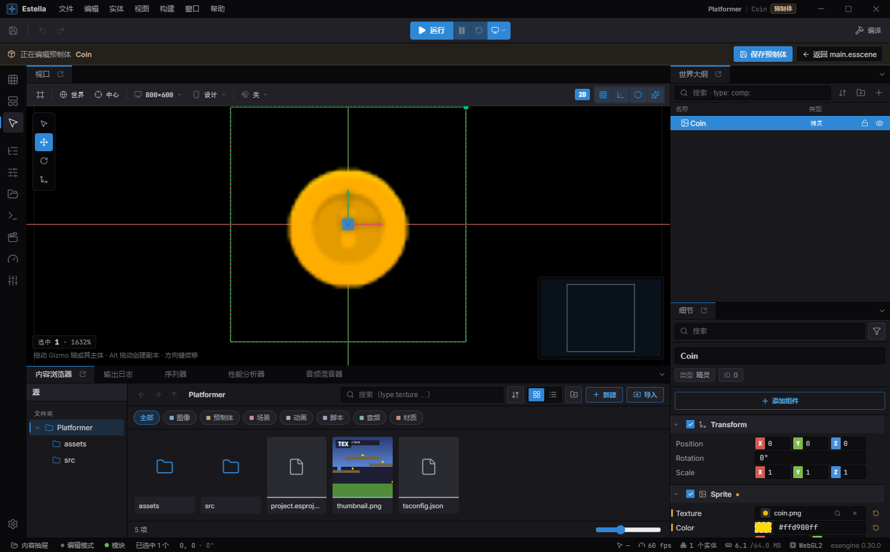

import { Aside } from '@astrojs/starlight/components';

预制体是一棵存好的实体树——你在编辑器里编辑一次、生成很多次的模板(敌人、拾取物、子弹)。
在运行时通过 `Prefabs` 资源实例化。预制体资源始终是单一权威来源;实例可以在其之上叠加
自己的值。

## 在编辑器里创作

你先在编辑器里可视化地搭出预制体,再从代码生成它。本节都发生在编辑器中;运行时 API 在下文。

### 创建预制体

在 **World Outliner** 里右键一个实体 → **Create Prefab**。编辑器会把该实体及其整棵子树抽取成
`assets/prefabs/<Name>.esprefab`(以实体名命名),并且**不改动**你的场景——原实体原样留在场景里,
不会被替换成实例。要放置实例,把 `.esprefab` 从内容浏览器拖进场景,或从 **Create → Prefabs** 分类生成。

<Aside type="note">
  如果子树引用了选区**之外**的实体,编辑器会先询问(*"Expose external references?"*)。这些引用会在
  预制体里保持**未绑定**,每个实例可在检视器里把它们绑到某个场景实体。
</Aside>

### 编辑预制体——Prefab Mode

双击一个 `.esprefab`(或从实例上点 **Edit Prefab**)进入 **Prefab Mode**:预制体会作为它自己的可编辑
实体树,在同一个视口 / Outliner / Details 里打开,外框带暖色高亮,顶部是 **Editing Prefab** 横幅。
像编辑场景一样增删、改名、重设父级、调组件,然后 **Save Prefab**——每个场景里的每个实例都会拿到这次
改动。**Back to Scene** 把你带回原处。

**UI 预制体**会在一张画布里打开。UI 的盒子是相对父级书写的,单独打开时那些百分比没有东西可解析,
整棵树会塌到原点上。所以 Prefab Mode 会用项目参考分辨率的画布把它托住——布局、选择框、gizmo 都和在
场景里读起来完全一致。这个宿主不属于预制体:它不出现在 Outliner 里,也永远不会进到存下来的资产。

Prefab Mode 暂不支持:就地编辑**嵌套**预制体,或基不是扁平的变体。编辑预制体时 Play 与 *Save As* 被禁用。



*Prefab Mode:**Editing Prefab** 横幅带 **Save Prefab** / **Back to scene**,预制体作为它自己的实体树打开——保存后每个实例都会更新。*

### 实例与覆盖

把实例放进场景,它会与源保持联动。改动实例上的某个字段,它就成为一条**覆盖(override)**——叠在预制体
之上的逐实例值。编辑器会标出覆盖,让你随时知道哪些是本地的:

- 实例的**根名字**在 Outliner 里被染成暖色;
- 被覆盖的字段会显示一个**重置箭头**(↺ *Reset to default*),其组件带一个**琥珀色圆点**;
- 检视器有一个筛选,可把 Details 面板收窄到**只看被覆盖的字段**。

用字段的 ↺ 按钮重置单个字段,值会回落到预制体的值。

### Apply · Revert · Unpack · Variant

在 Outliner 里右键一个实例(或用检视器的 prefab 条)可执行这些身份操作:

| 操作 | 作用 |
|---|---|
| **Edit Prefab** | 在 Prefab Mode 里打开源。 |
| **Select Prefab Source** | 在内容浏览器里定位到该 `.esprefab`。 |
| **Apply to Prefab** | 把这个实例的覆盖**推回源**——更新*每个*实例的基。 |
| **Revert to Prefab** | 丢弃这个实例的覆盖,并重新同步到源。 |
| **Create Variant** | 存出一个新的 `.esprefab`,继承基并把这个实例的覆盖烘进去(预制体的预制体)。 |
| **Unpack Prefab** | 拆开子树——其实体变成普通场景实体,失去一切预制体关联。可撤销。 |

**Apply** 是唯一会改写共享资源的操作,所以它总会先预览一份**逐条 diff**(*"Apply changes to prefab?"*)——
改动为琥珀、新增为绿、删除为红,结构性改动会被标为破坏性。

<Aside type="caution">
  删除一个 `.esprefab` **不会**删除它的实例。编辑器会警告哪些文档引用了它,并把文件移入回收站(可用 Undo
  恢复),但任何残留的实例会变得无法解析,并在其场景下次加载时被丢弃。若想保留这些实体,先用 **Unpack**。
</Aside>

<Aside type="tip">
  如果你改名或删除了某些实例覆盖过的组件,这些覆盖就不再与预制体匹配,会在场景加载时被丢弃(伴随一条
  toast)。检视器会标出受影响的实例并提供 **Repair**——保存场景即把清理后的状态写入文件。
</Aside>

## 生成一个预制体

`instantiate` 加载预制体并生成它。它是异步的,并返回生成的树——`root` 是新的根实体:

```typescript
import { defineSystem, Res, Prefabs } from 'esengine';

const spawnEnemy = defineSystem([Res(Prefabs)], async (prefabs) => {
  const { root } = await prefabs.instantiate('assets/prefabs/enemy.esprefab');
  // `root` is the new entity — move it, tag it, give it a Transform position…
});
```

## 设置父级并访问子项

把实例嵌套到另一个实体下,并用返回的 `entities` map 按预制体局部 id 访问子项:

```typescript
const { root, entities } = await prefabs.instantiate('assets/prefabs/turret.esprefab', {
  parent: mountPointEntity,
});
// root      → the instance root
// entities  → Map<prefab-local id, spawned Entity>, for reaching children
```

## 逐实例覆盖

传 `overrides` 来**仅为这个实例**改值,而不编辑预制体资源——用不同血量或着色生成同一个敌人。
每条覆盖用**字符串** `prefabEntityId`(编辑器创作的预制体里是 UUID)定位一个预制体实体,并指明
组件 + 属性:

```typescript
const { root } = await prefabs.instantiate('assets/prefabs/enemy.esprefab', {
  overrides: [
    { prefabEntityId: '0', type: 'property', componentType: 'Health', propertyName: 'value', value: 250 },
  ],
});
```

除了 `'property'`,`type` 还可以是 `'name'`、`'visibility'`、`'component_added'`、
`'component_replaced'`、`'component_removed'`、`'metadata_set'` 或 `'metadata_removed'`
(metadata 两种用 `metadataKey` 代替 `componentType`/`propertyName`)。

## `instantiate` 参考

| 选项 | 类型 | 说明 |
|---|---|---|
| `parent` | Entity | 把实例嵌套到该实体下。 |
| `overrides` | override[] | 逐实例的组件值改动。 |
| `baseUrl` | string | 解析预制体资源的基 URL。 |

| 结果字段 | 说明 |
|---|---|
| `root` | 实例的根 `Entity`。 |
| `entities` | `Map<prefab-local id, Entity>`,用于访问子项。 |

## 最佳实践

- **一个预制体,多个实例**——共享数据放在预制体里,用 `overrides` 区分实例,这样一次设计
  改动就更新所有实例。
- **通过 `entities` map 访问子项**,而不是按索引遍历层级。
- **在生成时设父级**(`parent`),而非事后重设父级,让变换在第一帧就正确解析。
- 当某个改动应当全局时,在编辑器里用 **apply-to-prefab** 把实例的调整推回源。

<Aside type="tip">
  预制体可嵌套:一个预制体可以包含其它预制体的实例,覆盖会穿过嵌套层层叠加。instantiate 是
  异步的,因为首次使用时它可能加载预制体资源(及其依赖)。
</Aside>

## 参见

- [场景](/docs/zh-cn/world/scenes/) —— 预制体实例存在于场景中。
- [资源](/docs/zh-cn/assets/overview/) —— 预制体是资源,首次 instantiate 时加载。
